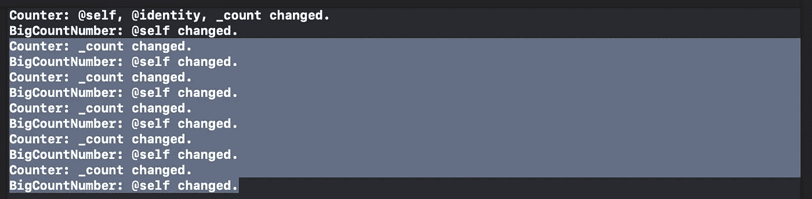

# 探索 SwiftUI 中的渲染

> 原文：<https://betterprogramming.pub/exploring-rendering-in-swiftui-ac7e88a2381d>

## 了解 SwiftUI 何时重新渲染子视图

由 [Viktor Forgacs](https://unsplash.com/@sonance?utm_source=medium&utm_medium=referral) 在 [Unsplash](https://unsplash.com?utm_source=medium&utm_medium=referral) 上拍摄的照片

软件工程职业令人惊奇的一个方面是你永远不会停止学习。你每天都接触到不同的技术:学习它们的基本概念是我个人最喜欢的事情之一。

学习新技术最重要的技能之一是识别模式和相似性的能力。这让你即使不是每天都使用一项新技术，也可以对它进行推理。

一周前，我的一个同事给我发了这篇关于 React 渲染的文章。我并不是每天都使用 React，但是我熟悉它的基本概念，我不知道它和 SwiftUI 有多相似。在阅读这篇文章时，我惊讶地发现，当组件的*状态*改变时，React 会重新渲染，而不是当它的*道具*改变时。

所以，我的好奇心被激起了:SwiftUI 是做什么的？什么时候重新渲染它的组件？我创建了一个小项目来尝试和理解这一点，今天我想分享我的过程和我的发现。

# 重新创建应用程序

我采取的第一步是再现文章中出现的相同情况。我用相同的初始组件创建了一个新的 SwiftUI 项目:

*   `BigCountNumber`
*   `Counter`

为了简单起见，我将它们放在一个文件中:

然后，我将`RenderingApp.swift`改为加载`Counter`视图，而不是`ContentView`，这样我就可以测试它了。

在模拟器中运行应用程序，我可以看到每次我点击按钮时计数器都会增加。

# 可视化渲染

第二步是理解如何可视化组件何时被重绘。我发现了 SwiftUI 的`View`协议的静态`_printDebug()`函数:一个私有方法，可以用来在 SwiftUI `View`被渲染时对其进行调试。

> C **注意:**提交给 Apple 之前记得去掉这个函数调用。否则，你的应用将被自动拒绝:你不能在你的应用中使用私有系统 API。

在我们的`View`的体中引入函数调用的时候，我们还要加回`return`语句:SwiftUI 如果属性的体长于一条语句，就无法推断出你要返回什么。

新代码如下所示:

现在运行应用程序，Xcode 在控制台中打印了一些信息。应用程序启动时，Xcode 会打印:

并且，在点击`increment`按钮几次后，它打印出来:

# 添加装饰

React 和 SwiftUI 目前的行为方式是一样的。在该设置中，更改`State`与更改相关组件的属性相同。

让我们按照参考文章的建议添加`Decoration`组件。

为了跟踪`Decoration`何时被渲染，我将代码添加到了`_printChanges`。让我们用`Counter`组件来组合它，如本文所示:

运行应用程序时，Xcode 会打印以下输出。

我们可以观察到`Decoration`只出现了一次，而`Counter`和`BigCountNumber`在我们每次点击按钮时都会更新。

默认情况下，SwiftUI 的行为方式比 React 更保守:它避免了对那些*道具*没有改变的组件进行不必要的渲染。

# 为什么？

我最好的解释是组件的类型语义。在 SwiftUI 中，我们创建的`View`是`struct`:默认情况下是不可变类型。这使得验证什么时候发生了变化，什么时候没有发生变化变得更加容易。

如果一个`View`的道具改变了，我们必须重新创建它:我们在`View`的`body`中使用的是创建`View`的各种组件的初始化器。我们基本上是在告诉运行时:“看，我正在创建一个新视图。能画出来吗？”。

另一方面，React 使用引用类型:类或函数组件。理解什么时候发生了变化要困难得多(也是昂贵的):组件不会不断地被重新创建。React 必须决定何时再次调用`render`函数(或定义组件本身的函数)。当一个`class`的变量改变时——就像它的一个道具一样——这个类的内存地址不会改变。

React 承诺提供最新版本的用户界面。为了实现这一点，它必须比 SwiftUI 更频繁地呈现其组件:每当状态改变时。

# 结论

在今天的文章中，我们探讨了 React 和 SwiftUI 之间的渲染差异。我们学习了如何使用`_printChanges`私有函数来调试我们的渲染过程，并且我们创建了一个实验项目来测试它。

我们了解到 SwiftUI 在属性改变时重绘组件，而不是像 React 那样在状态改变时重绘。这主要对结构的值语义是可能的。