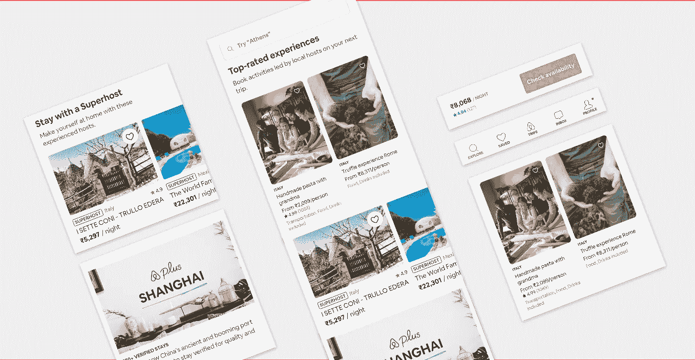
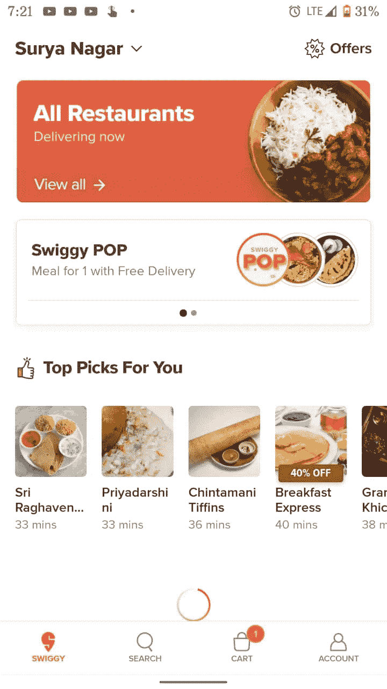
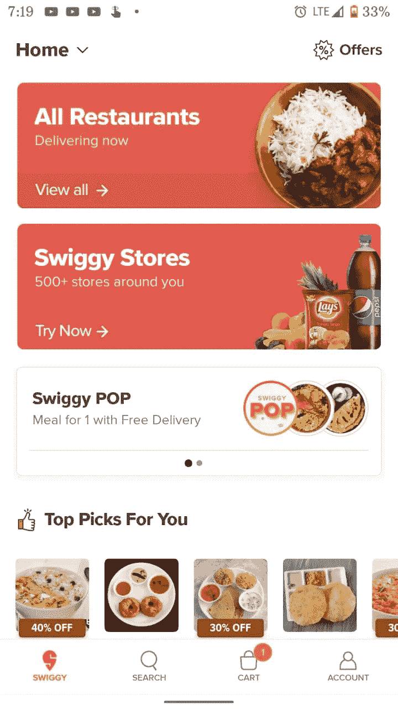
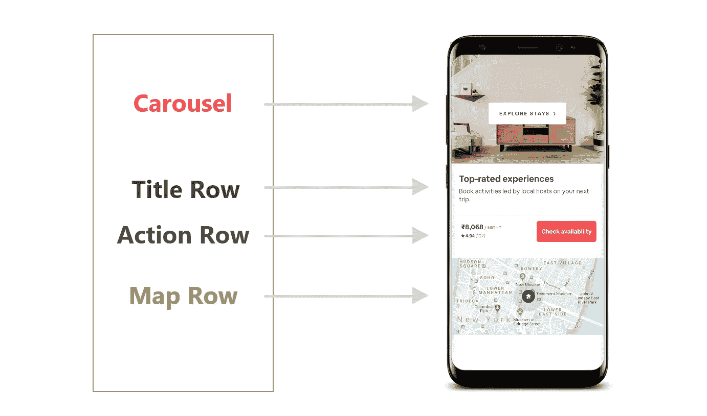
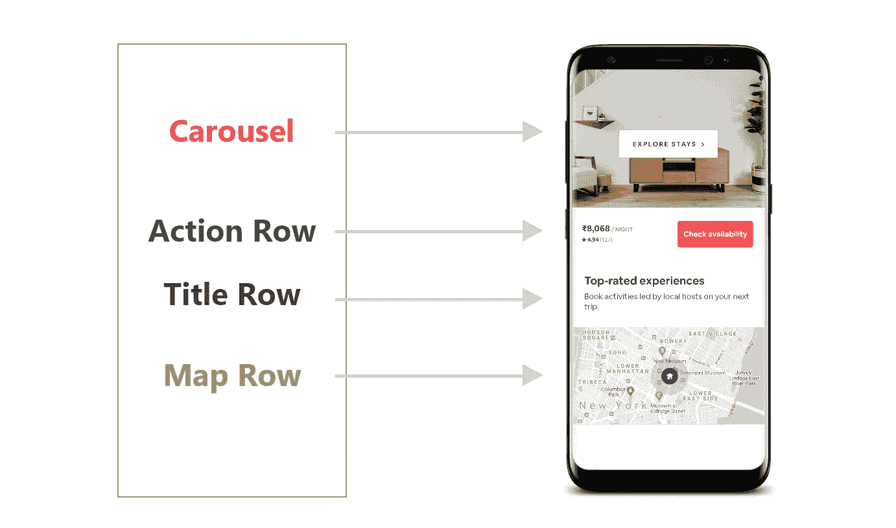
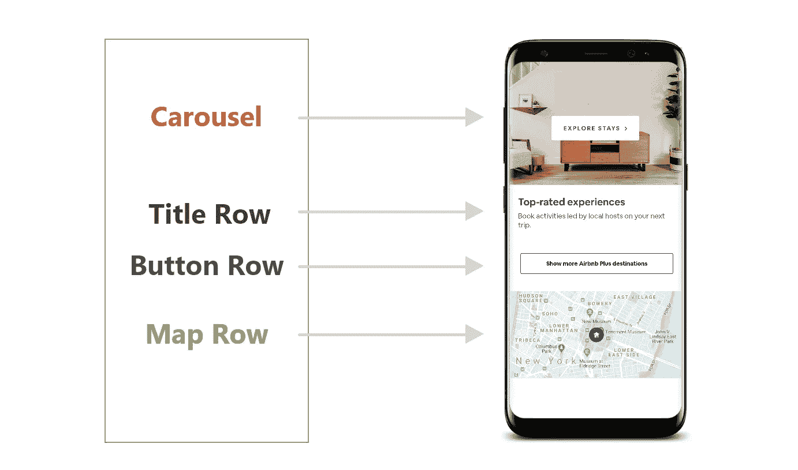
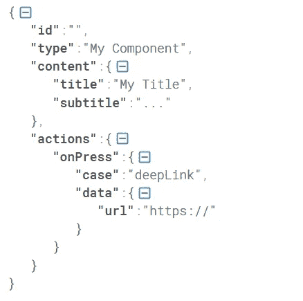
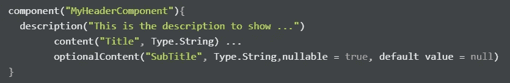
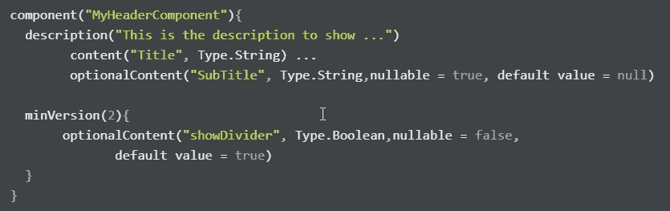

# 探索服务器驱动的用户界面

> 原文：<https://betterprogramming.pub/exploring-server-driven-ui-cf67b3da919>

## 用原生用户界面构建反应式应用的新方法

照片来自 Airbnb 的应用程序。

原生应用仍然是希望扩大规模并基于其用户界面和性能接触数百万用户的企业的首选。这种说法可能会引起很多人的争议，但我们不会讨论哪个平台是最好的。相反，我们将学习如何使用服务器驱动的用户界面来更好地控制你在应用程序中显示的内容。

我总是想知道 Airbnb、Flipkart 和 Swiggy 这样的应用程序是如何动态更新其 UI 的。即使我没有更新应用程序，Flipkart 在节日期间显示不同的 UI，而 Swiggy 总是根据设备位置改变其 UI。你想知道他们是怎么做到的吗？

基于位置的 Swiggy 用户界面的变化。

# 什么是服务器驱动的 UI？

服务器驱动的 UI 是指 API 告诉客户端呈现什么组件和什么内容。这可以在所有三个主要平台上实现:Android、iOS 和 web。在我看来，这种类型的开发使得原生应用更具反应性和可控性。

# 服务器如何控制用户界面？

从理论上讲，这很简单:我们向服务器发出请求，然后我们收到一个 JSON 响应，其中会有在屏幕上膨胀什么的逻辑。基于逻辑，我们必须在视图上呈现本地开发的 UI 组件。这带来了高质量的用户体验，并允许公司对用户可以看到的内容有更多的控制。查看下图，从较高层次了解服务器的响应如何呈现视图:

服务器驱动 UI 的鸟瞰图。

如果我们想改变 UI 中的顺序，比如图像下面的操作行，然后是标题，我们只需要改变响应:

类似地，如果我们想要包含一个完全不同的组件(例如，标题下面的一个全长按钮)并删除 action 行，我们只需再次更改 response:

使用这种方法，我们可以基于用户位置、订阅或任何东西来改变 UI 中的任何东西。

# 优势

1.  企业不再需要依赖用户来更新应用程序以显示特定的 UI 或改变 UI 的顺序(至少在大部分情况下)。
2.  我们可以在运行中对特定功能进行测试。
3.  发布新特性和创建更多可重用的组件很容易。
4.  用户的原生体验和公司的反应。

我觉得这是一个双赢的过程。

# 深入了解 SDUI

个人开发者不可能创建 SDUI 系统，所以我想用 Airbnb 的 [Lona](https://github.com/airbnb/Lona) (一个 SDUI 库)来解释 SDUI。

外面有很多图书馆:

*   Airbnb 的[环氧树脂](https://github.com/airbnb/epoxy)
*   来自脸书的石版画
*   来自 Flipkart 的 Proteus
*   Tumblr 的 gray water

回到正题，Airbnb 使用基于组件的 UI，像 [Jetpack Compose](https://developer.android.com/jetpack/compose) 。当从服务器接收到 JSON 格式时，应用程序开发人员根据 JSON 中的行类型扩展组件。

## JSON 格式

让我们考虑一个非常基本的 JSON 来简化事情。看一看:

简单的 JSON 格式，使用 Lona 扩展视图。

节点`type`定义了哪种类型的组件应该在视图上展开，比如标题行、动作行等等(正如我们上面看到的)。`Content`节点提供要在展开视图中显示的内容。例如，如果我的组件是标题行，那么标题和副标题包含要在`title`和`subtitle`字段中显示的内容。`Action`节点用于膨胀可操作的组件，如点击和内容导航应该基于`onPress`节点发生。

# SDUI 的版本挑战

假设你最近发布了一款带有 SDUI 的应用，几天后，你向 Play Store 推送了一个更新，并启用了包含新组件的新 API 更改，以在视图中展开。这里的问题是，不是所有的用户都更新到最新版本，有些人甚至可能停留在非常旧的版本。

当旧版本的应用程序访问新的 API 响应时，后果将是直接的，因此我们应该非常小心，以确保 API 响应和客户端代码应该是向后兼容的。

再来看 Airbnb 针对版本问题提供的解决方案。下面是已经发布的版本 1 中 header 组件的 JSON 格式。

由于我们已经发布了应用程序，我们需要一个新的版本来进行任何更改。为了集成新的更改，我们需要在版本号中包含新的变量`minVersion`。在这个变量下，我们可以包含任意数量的组件和样式。看一看:

由于我们在之前版本的 app 中不访问`minVersion`，所以不会有问题。

# 用 SDUI 编写的 Jetpack(未来)

Jetpack Compose 是 Android 团队的一个新库，目前处于非常早期的阶段。它最终将改变我们在 Android 中设计 UI 的方式。

JetPack Compose 使用 Kotlin 编程语言将反应式编程模型与简洁和简单的编码结合起来。此外，它是完全声明性的，这意味着您通过调用一系列将数据转换为 UI 层次结构的函数来描述您的 UI，这比使用传统的 XML 格式更便于使用 SDUI 构建布局。

虽然我们有先进的库，如 Litho、Epoxy 和来自大型科技公司的更多库，但拥有一个本地解决方案更方便。这就是 Jetpack Compose 将在不久的将来大放异彩的原因。

要了解有关 JetPack Compose 的更多信息，请阅读以下文章:

*   [Jetpack Compose——一种在 Android 中创建材质 UI 的简单新方法](https://medium.com/better-programming/jetpack-compose-a-new-and-simple-way-to-create-material-ui-in-android-f49c6fcb448b)
*   [来自 Jetpack Compose 的有趣更新](https://medium.com/better-programming/interesting-updates-from-jetpack-compose-48b79e7d2d8a)

# 结论

在我们结束之前，我想感谢劳拉·凯利和纳杉尼尔·西尔弗曼。我从他们在 KotlinConfig 2019 上的演讲中学到了我在这里提到的许多概念。如果你感兴趣，可以看看:

感谢您的阅读。