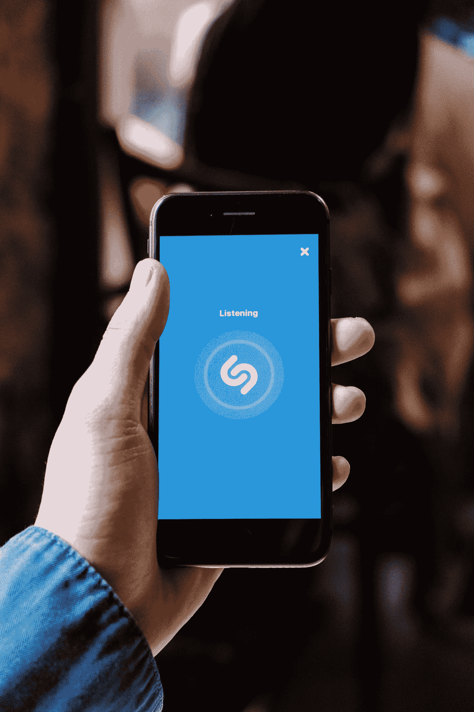
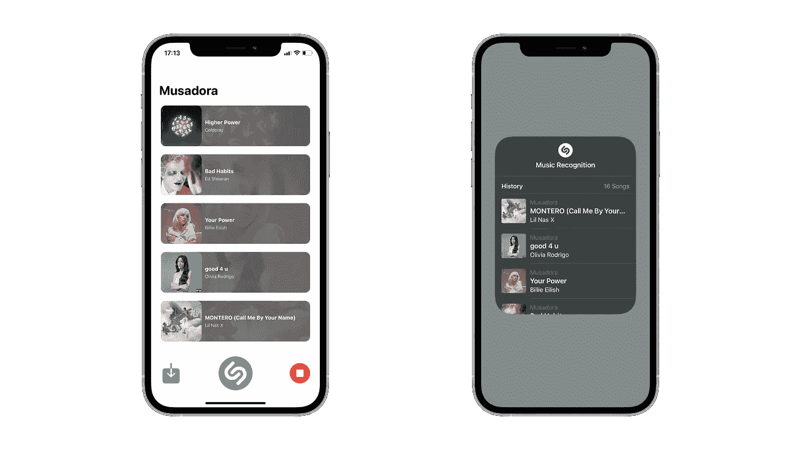
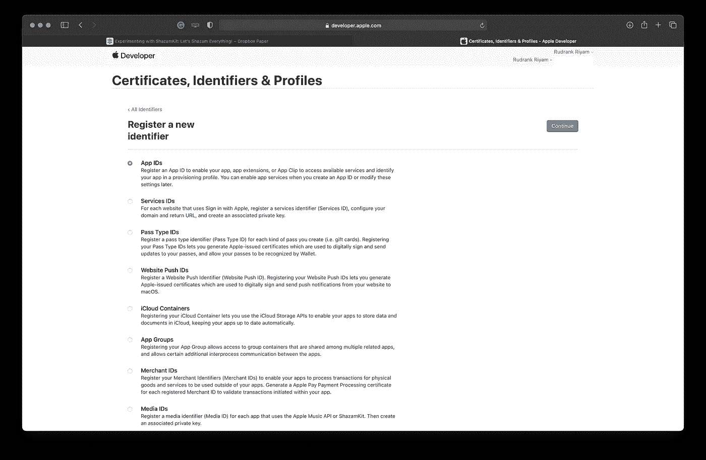
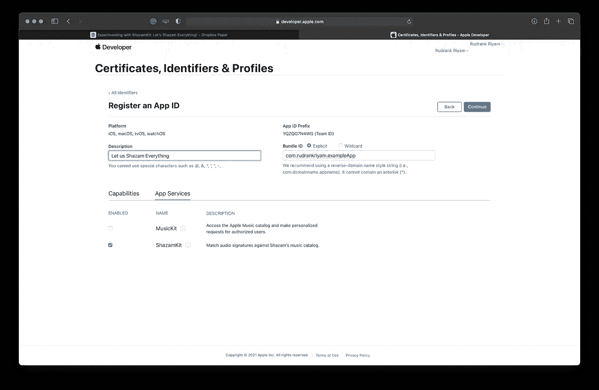
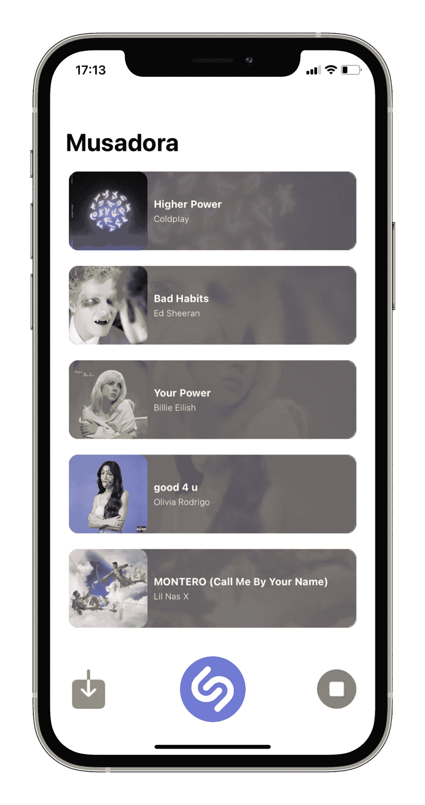
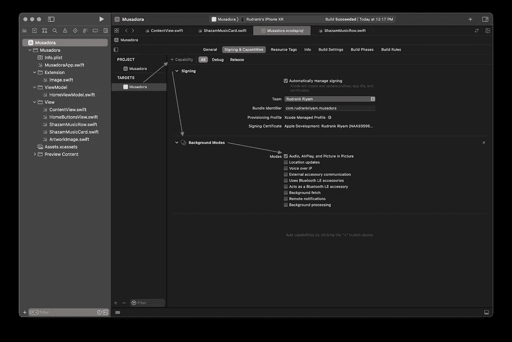

# 在 iOS 15 中使用 SwiftUI 探索 ShazamKit

> 原文：<https://betterprogramming.pub/exploring-shazamkit-with-swiftui-in-ios-15-577a7ce1dc51>

## 让我们尽情享受吧

来自 [Pexels](https://www.pexels.com/photo/person-holding-an-iphone-and-using-shazam-5053986/?utm_content=attributionCopyText&utm_medium=referral&utm_source=pexels) 的 [cottonbro](https://www.pexels.com/@cottonbro?utm_content=attributionCopyText&utm_medium=referral&utm_source=pexels) 摄影

WWDC 总是有最好的音乐收藏可供欣赏。在 WWDC 19 年期间，我的朋友用他的 Android 手机识别播放的歌曲，并制作了一个播放列表。

我的 iPhone 当时没有这种功能(或者说我没有意识到)。现在有了`ShazamKit`的帮助，让我们为此创建一个应用程序吧！

> 注意—这是测试版软件，将来可能会随时更改。按照教程，你需要 Xcode 13.0 和 iOS 15.0。写这篇帖子的时候，我用的是 Xcode 13.0 Beta 5，iOS 15.0 Beta 8。

# 什么是 ShazamKit？

ShazamKit 是 Apple 开发的一个框架，可以帮助您作为开发者将音乐识别集成到您的应用程序中。它可能是识别 Shazam 目录中的歌曲，甚至是您自己定制的音频。

您可以将已识别的歌曲添加到 Shazam 的音乐识别历史记录中。令人惊讶的是，苹果也将它应用于安卓系统。

# 它是如何工作的

我早些时候假设 Shazam 实际上将歌曲的实际音频与其庞大的库相匹配。但是根据[文档](https://developer.apple.com/documentation/shazamkit)，

> ShazamKit 使用音频记录的独特声学特征来寻找匹配。该签名捕获了音频信号能量的时间-频率分布，并且比原始音频小得多。这也是一种单向转换，因此不可能将签名转换回录音。

更简单地说，Shazam 为目录中的每个音频创建了一个基于时间的频率图，称为 Spectrogram。然后，它会根据图表创建一个签名。*参考签名*是具有歌曲信息的唯一签名和元数据。

Shazam 的音乐目录收集了这些独特的参考签名。`ShazamKit`创建我们提供的录音的音频表示，使其与《家居指南》相匹配。如果有足够的部分匹配，它会返回信息，如歌曲的标题和艺术家。他们的算法足够强大，即使在嘈杂的背景下也能识别音乐。

音频表示不能转换回原始录音，因此内容保持安全和私密。

如果你想知道更多，有一整篇关于他们算法的研究论文。

## 我们的最终目的地

作者图片

# 入门指南

要开始使用`ShazamKit`并与他们的服务通信，我们需要启用我们的应用程序标识符。前往开发者门户网站。在`Certificates, Identifiers, and Profiles`下，从侧边栏中选择`Identifiers` 标签，点击`Add`图标创建一个新的应用 ID。

点按“继续”,根据您的偏好命名捆绑包 ID。在`App Services`下，勾选`ShazamKit`为其增加能力。

# ShazamKit

它分为三个部分-

*   Shazam 目录识别
*   自定义目录识别
*   图书馆管理

我们将使用 Shazam 目录识别来识别应用中的歌曲。然后，我们将它们添加到 Shazam 的库中。

# 音乐识别

打开 Xcode，创建一个名为`Musadora`的新 SwiftUI iOS 项目。创建一个名为`HomeViewModel.swift`的新 Swift 文件，并向其中添加以下类:

下面是这段代码的分解:

1.  一个`[SHMediaItem](https://developer.apple.com/documentation/shazamkit/shmediaitem)`的数组。它表示引用签名的元数据。每次 Shazam 找到一个匹配项，我们都会将该项目添加到这个数组中。
2.  一个`@Published`变量`isRecognizingSong`，帮助我们管理歌曲识别的*状态*。
3.  `[session](https://developer.apple.com/documentation/shazamkit/shsession)`对象用于管理录音匹配。
4.  使用`[AVAudioEngine](https://developer.apple.com/documentation/avfaudio/avaudioengine)`的原因是在录音的同时将音频转换为签名。
5.  `SHSession`的结果通过其代表传达。通过将会话的委托设置为，我们可以访问它的所有方法。

首先，我们从记录音频的代码开始。在`HomeViewModel.swift`中增加以下内容:

这种认可构成了该应用的核心，所以下面是详细的解释:

1.  从一个共享实例`AVAudioSession`开始，将其配置为从麦克风录制音频。然后，我们激活音频会话。
2.  创建一个变量`inputNode`来存储当前的音频输入路径。我们用标准格式创建一个`audioFormat`。我们为支持的音频格式配置麦克风输入。然后，我们在公共汽车上安装一个音频窃听装置。在模块中，我们将缓冲区中的音频转换为签名，并在会话目录中搜索参考签名。
3.  我们启动音频引擎并将`isRecognizingSong`设置为真。

为了简化音频识别过程，我们创建了两个公共方法来调用我们的视图-

检查代码:

1.  如果音频引擎已经在运行，请停止它，并从输入节点移除点击。
2.  准备录音，生成签名并开始录音。

`SHSessionDelegate`为我们提供了两种方法，一种是找到匹配时，另一种是没有匹配时。当我们找到一个匹配时，它返回一个代表目录媒体项的对象。我们访问条目中的第一个条目。如果`mediaItems`已经包含歌曲，我们忽略它。如果识别出的歌曲是新的，我们将它添加到数组中。

# 将音乐添加到 Shazam 资料库

您还可以将应用程序中已识别的音乐添加到 Shazam 的曲库中。为此，在`HomeViewModel`中添加以下代码-

我们访问用户的默认 Shazam 库，并将列表`mediaItems`添加到其中。

> 注意—从 beta 5 开始，添加到 SHMediaLibrary 默认实例的媒体项目不会出现在 Shazam 中。(77785557)
> 
> **解决方法:**按住音乐识别控制中心模块查看 SHMediaLibrary 内容。

据此，我们编写了使用 ShazamKit 识别音乐所需的功能。让我们设计一个 UI 来使用它吧！

# 使用 SwiftUI 设计用户界面

你可以根据自己的喜好设计屏幕。我使用了专辑插图，并在旁边显示了歌曲和艺术家的名字。

用一个模糊的背景图片，我把卡片放在上面-

`ArtworkImage`是一个使用 SwiftUI 版中最新`AsyncImage`的便捷视图，以及一些处理不同阶段的默认视图-

创建另一个名为 **HomeButtonsView.swift** 的 SwiftUI 文件，并添加:

下面是这段代码的作用:

1.  将媒体项目列表添加到 Shazam 的媒体库中。如果您打开控制中心并长按 Shazam 的图标，您会发现列表中有提到的应用程序名称。
2.  单击 Shazam 按钮启动音频识别。
3.  单击停止按钮停止音频识别。
4.  当按钮识别歌曲时，用渐入渐出的动画来激活按钮。

总结设计过程，我们将`ShazamMusicRow`添加到一个列表中，并将`HomeButtonsView`添加到它下面

我们循环播放媒体项目，轻触各个行在 Apple Music 中打开特定的歌曲。

有了这个，我们就可以做任何事情了！运行应用程序，享受您自己的 Shazam 播放列表应用程序！

# 背景识别

该应用程序目前可以识别前景中的音乐。假设你在一个聚会上，想要创建一个播放好歌曲的播放列表。为了提高我们的识别应用程序的效率，我们将启用后台模式，这样您就可以将手机放在口袋里，尽情享受派对！

选择`Musadora`目标**，**选择`Signing & Capabilities`点击`Capability`按钮。搜索`Background Modes`并添加。在`Background Modes`下，勾选标记`Audio` **、** `Airplay` **、**和`Picture in Picture`。这有助于我们记录和识别背景中的音频。

运行应用程序，点击 Shazam 按钮并锁定 iPhone。播放一些音乐，并重新检查应用程序。你会在列表中找到被认可的歌曲！

# 结论

你可以在这个 [GitHub 资源库](https://github.com/rudrankriyam/Sample-Projects/tree/main/Musadora)中找到完整的源代码。

Shazam 是一个引人注目的应用程序，几乎可以立即识别音乐。有了苹果给我们的这种试验能力，我们就可以用它来制作有创意的应用程序，或者将它们集成到现有的应用程序中！

我希望你喜欢这篇文章。让我们尽情享受吧！

## 想联系作者？

这个故事最初发表在 Rudrank 的个人博客上。