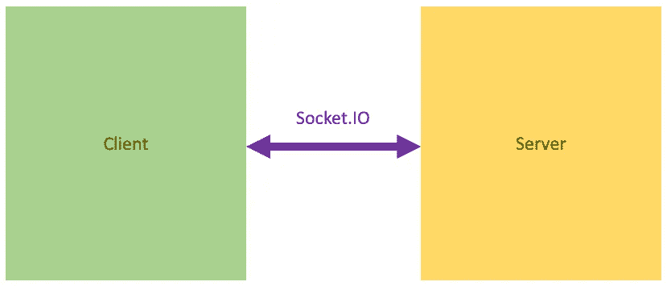
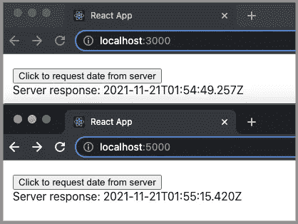
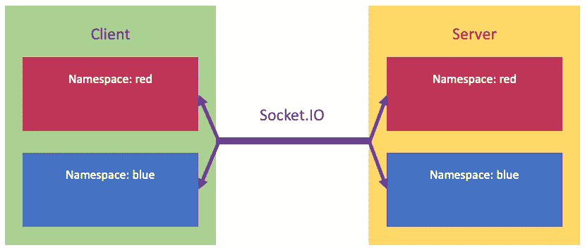
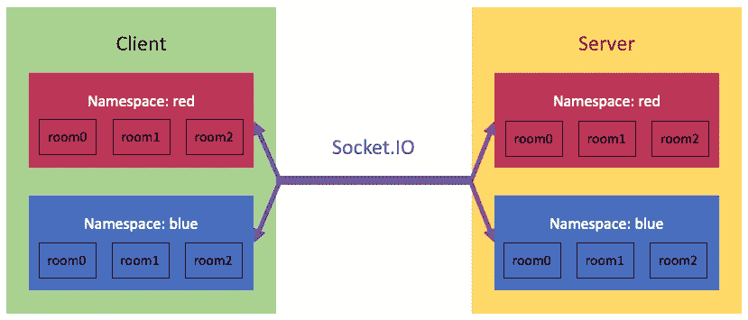
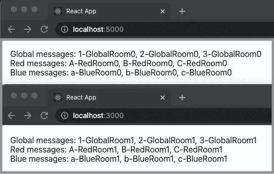

# 探索插座。反应式工作环境中的 IO

> 原文：<https://betterprogramming.pub/exploring-socket-io-in-react-working-environment-e505bf1c857c>

## 插座。IO 提供企业级 WebSocket



作者图片

WebSocket 协议在 2011 年 12 月被 IETF 标准化为 [RFC 6455](https://datatracker.ietf.org/doc/html/rfc6455) ，而 [WebSocket API](https://www.w3.org/TR/2009/WD-websockets-20091222/) 由 W3C 在 2009 年 12 月指定。截至目前，所有主流浏览器都支持 WebSocket API。

[插座。IO](https://github.com/socketio/socket.io) 是一个支持客户端和服务器之间实时、双向和基于事件的通信的库。它是 WebSocket API 的一个“微小”包装器。但是插座。IO 不是 WebSocket 实现。而是依靠[发动机。IO](https://github.com/socketio/engine.io) ，其默认行为是首先建立一个长轮询连接，然后升级到更好支持的传输，比如 WebSocket。

虽然插座。IO 非常像 WebSocket，是一个套接字。IO 服务器/客户端无法与 WebSocket 客户端/服务器通信。

为什么我们需要插座。IO 因为我们已经有了 WebSocket API？

是因为 WebSocket 是最起码的标准，而 Socket。IO 提供企业级 WebSocket。

*   一个插座。IO 客户端在创建时会自动连接到服务器。当连接丢失或出错时，它会按照预先配置的尝试次数重新连接到服务器。默认设置是重试次数不限。
*   插座。IO 连接可以是 SSL，可以设置认证令牌。
*   插座。IO 支持命名空间和房间来分段通信。
*   插座。IO 提供日志记录和调试支持。
*   插座。除了 CJS，IO 还支持 ES 模块。
*   插座。IO 是一个有社区支持的库，而 WebSocket 只是一个协议。

在本文中，我们将探讨其中的一些特性。

# 设置套接字。React 环境中的 IO

让我们设置套接字。在 [Create React App](/10-fun-facts-about-create-react-app-eb7124aa3785) 环境中的 IO。

```
npx create-react-app react-socket
cd react-socket
```

我们需要一个客户端和一个服务器来相互通信。为了简化任务，我们将客户机和服务器设置在同一个存储库中。

安装服务器包:`npm i socket.io`。

安装客户端包:`npm i socket.io-client`。

然后，`package.json`在`[dependencies](/package-jsons-dependencies-in-depth-a1f0637a3129)`中包含了两个额外的包:

# 设置客户端套接字。超正析象管(Image Orthicon)

我们创建了一个只有一个按钮`Click to request date from server`的用户界面。点击按钮发送一个套接字。对服务器的 IO 请求。收到请求后，服务器会用当前日期进行响应。客户端接收服务器日期并将其显示在屏幕上。


作者图片

我们修改`src/App.js`作为一个客户端。

2 号线从`'socket.io-client'`进口`io`。

通过调用`io('http://localhost:5000')`(第 9 行)来初始化一个套接字，这里我们假设服务器正在运行。如果客户端和服务器位于同一原点，则不需要指定 URL。

有 3 个特殊事件需要收听:`'connect'`、`'disconnect'`、`'connect_error'`，分别在 11 号线、13 号线、17 号线收听。

第 21 行监听自定义事件`'responseDate'`。

我们调用`useRef`(第 6 行)来生成一个引用以保持套接字的持久性(第 23 行)。客户端请求由按钮的`onClick`方法调用(第 30 行)。

服务器响应被保存到第 21 行的状态`serverData`。然后，由第 34 行呈现。

`socket.on(eventName, listener)`是套接字中的一个方法。IO 库。套接字连接侦听指定的事件，并调用回调侦听器。还有其他套接字方法，`socket.once(eventName, listener)`、`socket.off(eventName, listener)`、`socket.removeAllListeners([eventName])`、`socket.onAny(listener)`、`socket.prependAny(listener)`、`socket.offAny([listener])`。

运行应用程序，`npm start`。用户界面可从`http://localhost:3000`处的浏览器访问。


作者图片

控制台上有一个错误:`Client connect_error: Error: server error`。这个错误是由上面代码中第 18 行的`connect_error`监听器捕获的。

因为没有服务器运行，所以没有`connect`发生，并且点击按钮在用户界面上没有响应。

# 在生产模式下运行客户端和服务器

我们需要建立一个双向通信的服务器。Create React 应用程序有一个内置的 [Express](http://expressjs.com/) 服务器，我们将使用它作为服务器。

默认情况下，禁止对不同来源(域、方案或端口)的请求。为了简化设置，我们在生产模式下运行客户机，由同一个 Express 服务器托管。

按照[生产就绪反应应用](https://javascript.plainenglish.io/a-hands-on-guide-for-creating-a-production-ready-react-app-864ad98e7497)中描述的步骤，我们执行命令`npm run build`。生成的`build`目录包含要部署的代码。

将以下`server/index.js`放入 Create React 应用程序存储库中:

第 3 行创建了一个 Express 服务器。

第 4 行从环境变量中读取端口。如果未设置，默认值为 5000。

第 6–7 行服务于产品网页。

第 9 行在指定的端口启动 Express 服务器。

运行`node server`，在`http://localhost:5000`可以进入用户界面。

它仍然没有任何服务器响应，因为运行的服务器还没有配置 Socket.IO。


作者图片

# 运行套接字。客户端和服务器之间的 IO

服务器端套接字。IO 可以作为独立服务器运行，也可以与以下服务器一起运行:

*   HTTP 服务器
*   HTTPS 服务器
*   HTTP/2 服务器
*   表达
*   [Koa](https://koajs.com/)
*   [窝](https://nestjs.com/)
*   [加速](https://www.fastify.io/)

我们配置插座。IO 服务器在`server/index.js`，连同 Express 服务器。还需要一个 HTTP 包装器，因为当调用`app.listen`时，pure Express 服务器会创建一个新的 HTTP 服务器。

第 3 行创建了一个 Express 服务器。

第 4 行用 HTTP 包装了服务器。

第 5 行用 HTTP 包装器初始化`io`。

第 6 行从环境变量中读取端口。如果未设置，默认值为 5000。

第 8–9 行服务于生产网页。

第 11 行监听内置事件`'connection'`，并设置其他监听器。

第 14–20 行监听自定义事件，`'requestDate'`。收到事件后，它调用服务器日期(第 15 行)。它发出事件的日期`'responseDate'`。没有必要对要发送的内容运行`JSON.stringify()`，因为它会自动完成。对于不可序列化的对象，如 Map 和 Set，必须手动序列化。

第 22 行监听内置事件`'disconnect'`，并打印出消息。

第 25 行在指定的端口启动 HTTP 服务器。

对于服务器实现，单击用户界面上的按钮会显示服务器日期。


作者图片

下面是多次点击 UI 按钮时的服务器端消息。

以下是来自客户端的连接消息:

```
Client connected: 3lonJaSII81adDqdAAAB
```

刷新客户端 UI 时，服务器端会显示以下信息:

```
Server disconnect: 3lonJaSII81adDqdAAAB
Server connected: vgc7rEKVV-XSfzSlAAAD
```

当服务器停止时，客户端会显示以下信息:

```
Client disconnected: transport close
Client connect_error: Error: xhr poll error
```

服务器停止后，通信会退回到长轮询，轮询会遇到错误。

# 为 WebSockt 启用 CORS。超正析象管(Image Orthicon)

我们在同一个 Express 服务器上托管了客户端和服务器。如果不是呢？

在运行`node server`的同时，执行`npm start`在`http://localhost:3000`托管另一个客户端。

我们遇到以下错误:

```
Access to XMLHttpRequest at 'http://localhost:5000/socket.io/?EIO=4&transport=polling&t=Nr0ASQf' from origin 'http://localhost:3000' has been blocked by CORS policy: No 'Access-Control-Allow-Origin' header is present on the requested resource.
```

跨来源资源共享(CORS)是一种基于 HTTP 头的机制，它允许服务器指示除其自身以外的任何来源(域、方案或端口),浏览器应该允许从这些来源加载资源。

在`server/index.js`中，我们配置`io`来启用 CORS:

然后我们可以在两个 URL 上运行应用程序:



作者图片

# 广播事件的各种方式

在前面有两个客户端的例子中，我们发现了一些有趣的东西。单击每个应用程序的按钮只会更新它自己的日期。这是因为`socket.emit`只向自己的套接字实例发送事件。

```
socket.emit('responseDate', date);
```

我们可以将其更改为向除发送者之外的所有连接的客户端广播事件。下面的代码通过单击每个应用程序的按钮来更新另一个应用程序的`date`。

```
socket.broadcast.emit('responseDate', date);
```

我们可以将事件发送给所有客户端吗？

是，`io.emit`向所有连接的客户端发送事件。下面的代码通过单击每个应用程序的按钮来更新两个应用程序的`date`。

```
io.emit('responseDate', date);
```

我们可以使用一个 [Redis 适配器](https://redis.io/)或另一个兼容的适配器来设置多个插座。IO 服务器。在这种情况下，`io.emit`将广播到所有服务器，然后广播到它们的所有客户端。下面的代码可以将广播限制到仅连接到当前服务器的那些客户端。

```
io.local.emit('responseDate', date);
```

# 按名称空间和房间细分通信

名称空间是一个通信通道，它将应用程序的逻辑拆分到一个共享连接上(也称为“多路复用”)。名称空间允许为套接字创建不同的上下文。IO 一起工作。



作者图片

房间是插座可以`join`和`leave`的任意通道。它可用于向客户端子集广播事件。可以在名称空间内创建文件室。例如，`red`名称空间中的`room0`只与`red`名称空间中的`room0`通信。如果创建的文件室没有名称空间，则它存在于“全局名称空间”中。



作者图片

我们创建一个套接字。带有名称空间和房间的 IO 示例。下面是`src/App.js`中的客户端代码:

第 10–16 行定义了一个没有任何名称空间的套接字。它监听所有事件(第 12 行)并将其附加到当前全局消息(第 13 行)。第 16 行在断开连接时关闭监听器。

第 18–24 行定义了一个名称空间为`red`的套接字。它监听所有事件(第 20 行)并将其附加到当前红色消息(第 21 行)。第 24 行在断开连接时关闭监听器。

第 26–32 行定义了一个名称空间为`blue`的套接字。它监听所有事件(第 28 行)并将其附加到当前蓝色消息(第 29 行)。第 32 行在断开连接时关闭监听器。

下面是`server/index.js`中的服务器代码:

第 16–24 行定义了一个没有任何名称空间的套接字。一旦连接，它就加入一个全局`roomN`(第 19 行)，其中 N 是一个递增的数(第 23 行)，从 0 开始(第 16 行)。然后，它向房间发送 3 个事件。

第 26–35 行定义了一个名称空间为`red`的套接字。连接后，它加入一个红色的`roomN`(第 30 行)，其中 N 是一个递增的数字(第 34 行)，从 0 开始(第 26 行)。然后，它向房间发送 3 个事件。

第 37–46 行定义了一个名称空间为`blue`的套接字。连接后，它加入一个蓝色的`roomN`(第 41 行)，其中 N 是一个递增的数字(第 45 行)，从 0 开始(第 37 行)。然后，它向房间发送 3 个事件。

第一个客户端是在`http://localhost:5000`的生产构建。执行`npm start`在`http://localhost:3000`托管另一个客户端。我们可以看到消息是如何在特定的名称空间和房间中分段的。



作者图片

`http://localhost:5000`处的第一个连接有`GlobalRoom0`、`RedRoom0`和`BlueRoom0`。`http://localhost:3000`处的第二个连接有`GlobalRoom1`、`RedRoom1`和`BlueRoom1`。如果刷新其中一个客户端，我们可以看到房间指数增加。

每个房间接收发送给它的 3 个事件。所有这 3 个事件可能都是分段的，在名称空间之间，也在房间之间。

# 日志记录和调试功能

插座。IO 提供了出色的日志记录和调试功能。我们可以打开调试标志来运行服务器:

```
DEBUG=* node server
```

以下文件显示了第一个客户端连接之前的所有消息。

这是不是太过分了？

大概吧。

调试消息可以按范围过滤。这可以通过在`*`前面加上一个选定的范围来实现。如果有多个作用域，可以用逗号分隔。

以下示例显示了`socket.io:client`消息:

这不是干净有用多了吗？

以下示例显示了`socket.io:client`消息以及`engine`消息:

# 插座。IO 支持 ES 模块

到目前为止，服务器示例都是以 [CommonJS (CJS)格式](/what-are-cjs-amd-umd-esm-system-and-iife-3633a112db62)编写的。ES 模块(ESM)从 ES2015 开始成为 JavaScript 使用的官方标准。它广泛应用于 JavaScript 客户端开发。它还被作为附加类型的超集的 TypeScript 所采用。插座。IO 也支持 ES 模块。

名称空间和房间的服务器代码的最后一个例子可以由 ESM 代码编写，用`server/index.mjs`命名:

`Server`可以通过`'socket.io'`(第 6 行)导入，不使用`require`。

参照[ES 模块](/what-might-be-coming-in-npm-9-6985cf2678a6)的说明，可以用`node server/index.mjs`执行。

# 结论

我们已经检查了一些插座。木卫一的特点。给出的例子显示了如何在客户机和服务器之间建立 WebSocket 连接。这些通信是实时的、双向的和基于事件的。它们可以用名称空间和房间来划分。插座。IO 支持 ES 模块，并提供日志和调试支持。

如果您不想自己构建一个企业级 WebSocket，那么 Socket。IO 是专注于应用开发的好选择。

Domino Data Lab 使用 Socket.IO，它非常适合客户端和服务器通信。

感谢阅读。我希望这有所帮助。如果你有兴趣，可以看看[我的其他媒体文章](https://jenniferfubook.medium.com/jennifer-fus-web-development-publications-1a887e4454af)。