# 使用 Create React 应用程序探索 SonarQube

> 原文：<https://betterprogramming.pub/exploring-sonarqube-with-create-react-app-e0b7e0e5658c>

## 关于如何在 React 项目中使用 SonarQube 的入门指南


照片由 [Ravi Palwe](https://unsplash.com/@ravipalwe?utm_source=medium&utm_medium=referral) 在 [Unsplash](https://unsplash.com?utm_source=medium&utm_medium=referral) 上拍摄

# SonarQube 是什么？

[静态代码分析](https://en.wikipedia.org/wiki/Static_program_analysis)是在不执行应用程序的情况下对其进行的分析，而动态分析是在应用程序执行期间对其进行的。

[sonar cube](https://docs.sonarqube.org/)是由 [SonarSource](https://www.sonarsource.com/) 开发的开源平台。它通过对代码进行静态分析来执行自动审查，从而持续检查代码质量。它检测错误、代码气味、安全热点和漏洞。

*   Bug:表示代码中有错误的问题。这需要在昨天解决。
*   代码味道:代码中与可维护性相关的问题。这使得进一步的更改更加困难，并且可能会在将来的更改中引入额外的错误。
*   安全热点:需要手动审查的安全敏感的代码片段。
*   漏洞:一个与安全相关的问题，是攻击者的后门。

其中，bug、代码气味和漏洞被定义为问题。每个问题都有五种严重程度:`BLOCKER`、`CRITICAL`、`MAJOR`、`MINOR`或`INFO`。

SonarQube 版可以分析 29 种不同的语言，包括 Java、C#、C、C++、JavaScript、TypeScript、Python、Go、Swift、COBOL、Apex、PHP、Kotlin、Ruby、Scala、HTML、CSS、ABAP、Flex、Obj-C、Objective-C、PL/I、PL/SQL、RPG、Swift、T-SQL、VB.NET、VB6 和 XML。

SonarQube 通过 SonarLint 插件与 Eclipse、Visual Studio、Visual Studio 代码和 IntelliJ IDEA 开发环境集成。它还集成了外部工具，如 LDAP、Active Directory 和 GitHub。

# 为什么是 SonarQube？

SonarQube 有 600 万开发者。它有助于快速、系统地构建高质量的代码。

*   它有助于编写干净的代码，并将维护时间和成本保持在最低水平。
*   干净的代码使工作环境令人愉快和满意。
*   干净的代码使开发人员能够专注于解决业务问题。
*   它通过在正确的时间和地点进行正确的检查来确保软件的健壮性和安全性。它将风险最小化，并将产品的声誉最大化。

# React 中的必备测试工具

SonarQube 建立在 React 中现有的测试工具之上，比如 Jest 和伊斯坦布尔/纽约。

[Jest](/testing-your-components-in-react-967abda02396) 是一个确保代码库正确性的 JavaScript/TypeScript 测试框架。Jest 已经内置到 [Create React App](/an-in-depth-guide-for-create-react-app-5-cra-5-b94b03c233f2) 中。

伊斯坦布尔是 JavaScript/TypeScript 代码覆盖工具，在运行测试时计算语句、行、函数和分支覆盖。伊斯坦布尔已被弃用。现在的版本叫做 [nyc](https://github.com/istanbuljs/nyc) ，代表纽约市。这个名字是一个笑话，来自歌曲《他们也许是伟人》的歌词:

*   伊斯坦布尔就是君士坦丁堡。现在是伊斯坦布尔，不是君士坦丁堡。
*   甚至旧纽约也曾是新阿姆斯特丹。我不能说他们为什么改了它。

另外，作者, [Kushal V. Mahajan](https://github.com/kushalmahajan) 希望它简短。

有时，伊斯坦布尔和纽约市可以互换使用。伊斯坦布尔/纽约已被纳入 Jest，并由 Jest 直接处理。创建 React 应用程序，包括 Jest 和伊斯坦布尔/纽约。

创建基于类型脚本的 Create React 应用程序环境:

```
% npx create-react-app react-sonarqube --template typescript
% cd react-sonarqube
```

Create React App 附带一个测试文件，`src/App.test.tsx`。运行[测试覆盖命令](/how-to-achieve-100-test-coverage-for-react-functional-components-fbde1e40631c):

```
% npm run test -- --coverage . --watchAll=false
```

该命令创建一个名为`coverage`的文件夹，其中包含文件夹`lcov-report`和文件`lcov.info`。 [Lcov](https://en.wikipedia.org/wiki/Gcov) (Linux 测试项目 gcov)是 gcov (GNU 覆盖率)的图形化前端，是一个源代码覆盖率分析和逐语句剖析工具。它收集多个源文件的 gcov 数据，并创建包含源代码的 HTML 页面，这些代码用覆盖率信息进行了注释。Lcov 支持语句、函数和分支覆盖度量。

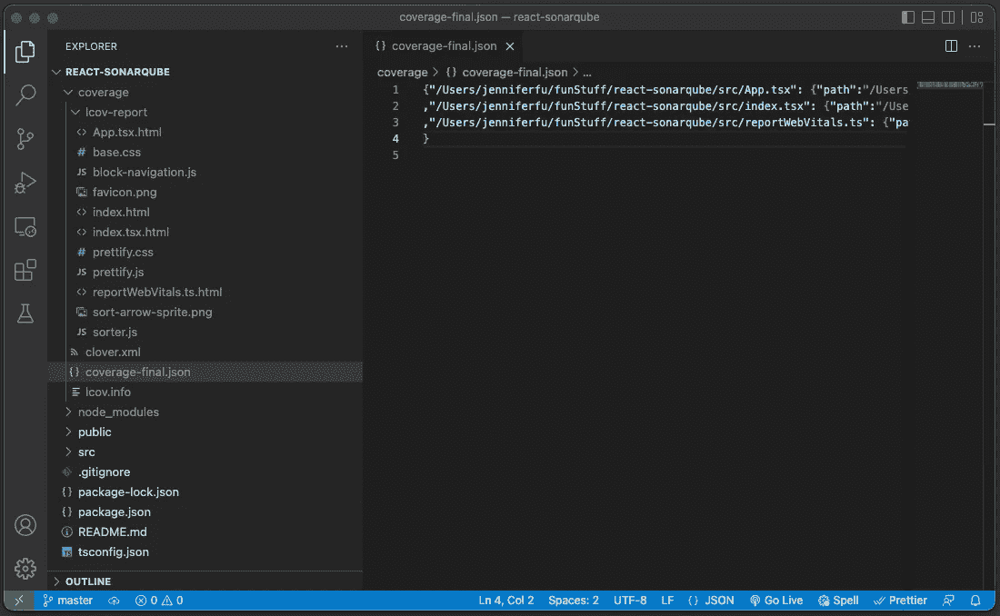

作者图片

上图中的`coverage-final.json`是测试覆盖结果的 [JSON](/exploring-json-json5-and-circular-references-2b5b0c5de532) 文件，转换成如下的“图形化”输出:

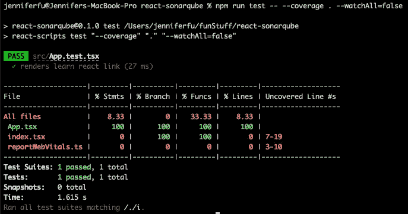

作者图片

该报告包括大量测试信息:

*   `App.tsx`100%承保。
*   `index.tsx`被部分覆盖。
*   `reportWebVitals.ts`不是盖的。

更具体地说，`index.tsx`中的语句覆盖了 0%,未覆盖的行是第 7-19 行。

很好。

但是，我们需要打开`index.tsx`来查看第 7–19 行代码。

这不够好。

这就是 SonarQube 可以提供帮助的方式。

# SonarQube 怎么用？

为 React 项目设置 SonarQube 需要几个步骤。

1.  安装一个 sonar cube 的本地实例。
2.  [在 SonarQube 中创建一个项目进行分析](#82ac)。
3.  [配置创建用于分析的 React App 项目](#887e)。

## 安装 SonarQube 的本地实例

安装 SonarQube 的本地实例是一次性任务。一旦设置好，实例就可以在不同的项目中重用。以下是安装过程:

*   [下载](https://adoptium.net/releases.html?variant=openjdk11&jvmVariant=hotspot)安装 Java 11。

```
% java --version
openjdk 11.0.11 2021-04-20
```

*   [下载](https://www.sonarqube.org/downloads/)sonar cube 社区版 zip 文件。

```
% ls -l sonarqube-9.6.1.59531.zip
-rw-r--r--@ 1 jenniferfu  staff  290033351 Sep  8 20:38 sonarqube-9.6.1.59531.zip
```

*   拉开`sonarqube-9.6.1.59531.zip`，移动到`/sonarqube`或`/opt/sonarqube`。

```
% sudo mv sonarqube-9.6.1.59531 /opt/sonarqube
```

*   启动 SonarQube 服务器:

```
% /opt/sonarqube/bin/macosx-universal-64/sonar.sh console
```

*   在浏览器上访问`http://localhost:9000/`。

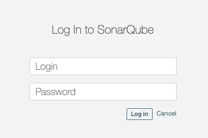

作者图片

以`admin`身份登录，密码为`admin`。

当它提示输入新密码时，将其更改为新密码，如`MyAdmin`。

SonarQube 的本地实例已经启动，可以使用了。

## 在 SonarQube 中创建一个要分析的项目

这一步是每个项目特有的。SonarQube 提供了几个选项来创建项目，`From Azure DevOps`、`From Bitbucket`、`From GitHub`、`From GitLab`和`Manually`。

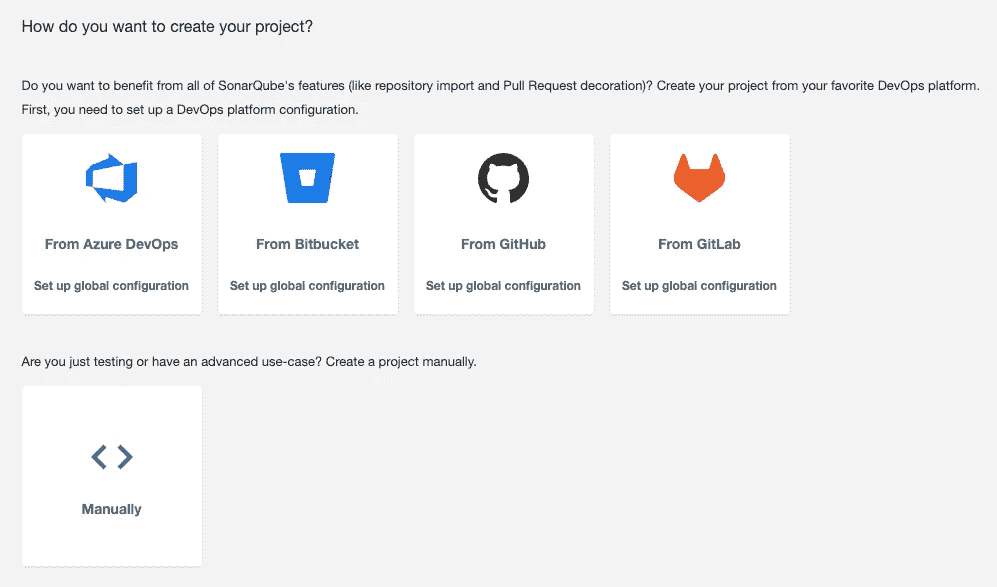

作者图片

我们选择选择，`Manually`。弹出`Project display name`和`Project key`窗口。

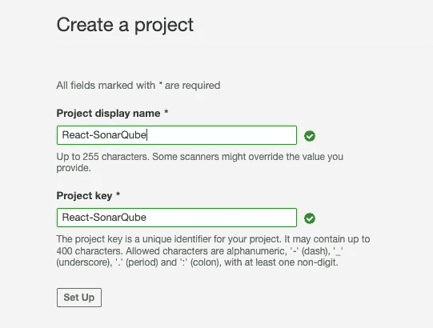

作者图片

填写字段，并点击`Set Up`按钮。以下屏幕询问如何分析储存库、`With Jenkins`、`With GitHub Actions`、`With Bitbucket Pipelines`、`With Azure Pipelines`、`Other CI`或`Locally`:

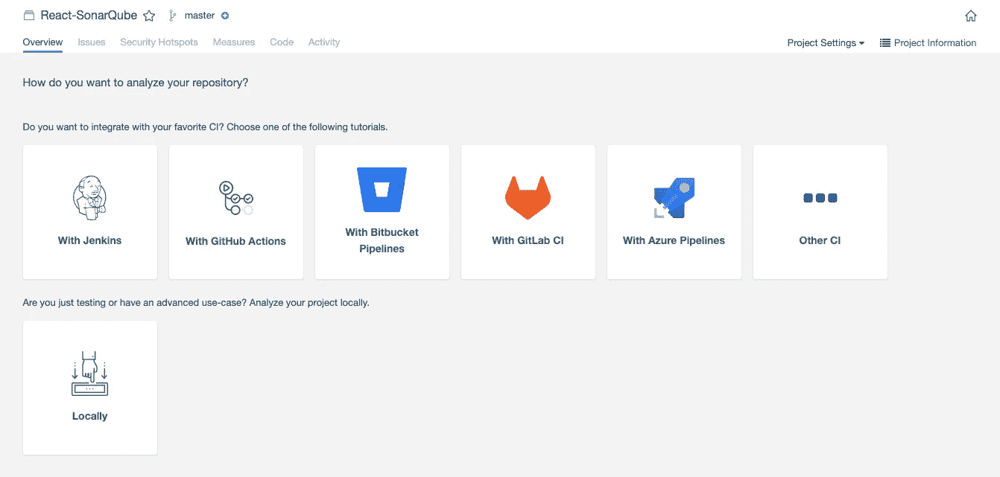

作者图片

我们选择选择，`Locally`。然后，它要求一个项目令牌。

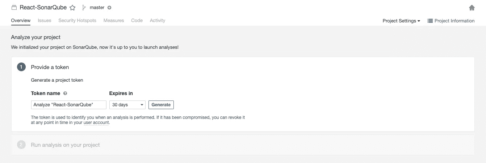

作者图片

点击`Generate`，创建一个令牌`sqp_f0a4edb0fbb43c80d52d47d739b5633d6d6da4dd`。

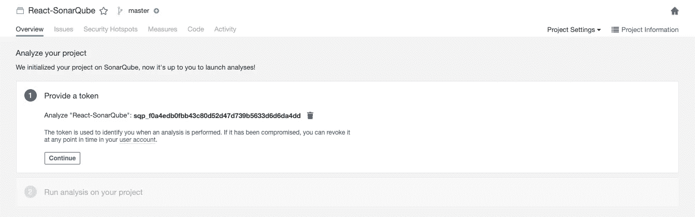

作者图片

点击`Continue`按钮。下一个屏幕在`Maven`、`Gradle`、`.NET`和`Other (for JS, TS, Go, Python, PHP, …)`选项中询问构建类型。

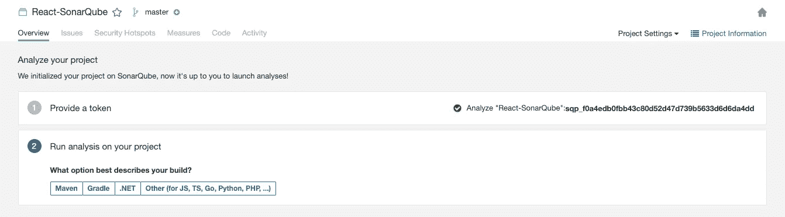

作者图片

我们选择`Other`，它会弹出操作系统的选项。在`Linux`、`Windows`、`macOS`中，我们选择`macOS`。

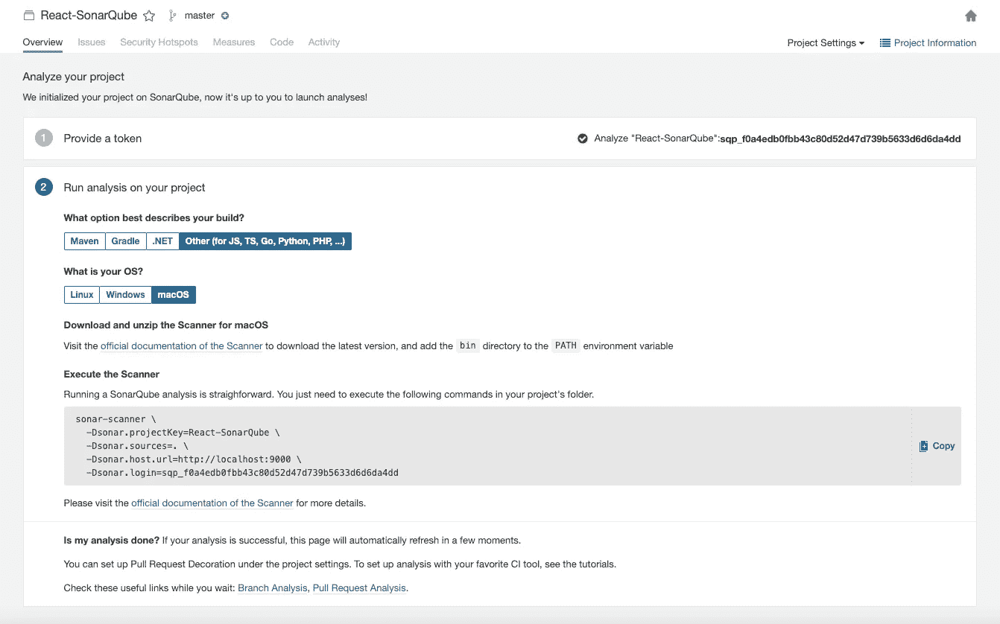

作者图片

项目已经建立，并准备进行分析。

在上面的屏幕截图中，它显示了执行扫描仪的命令。

我们选择不下载 Java 运行时，`sonar-scanner`。相反，我们将运行等效的 NPM 模块来执行分析。

## 配置创建 React 应用程序项目以进行分析

在 Create React App 工作环境中，我们应用了两个包:

*   这是 Jest 的定制结果处理器。处理器将 Jest 的覆盖范围输出转换成声纳的通用测试数据格式。
*   `sonarqube-scanner`:这是一个运行 SonarQube 分析的 NPM 模块。

安装两个软件包:

```
npm install -D jest-sonar-reporter sonarqube-scanner
```

它们成为`package.json`中`[devDependencies](/package-jsons-dependencies-in-depth-a1f0637a3129)`的一部分:

执行以下命令:

*   第 1 行执行 NPM 模块`sonar-scanner`。
*   第 2 行指定了项目密钥。
*   第 3 行指定了为这个项目生成的项目令牌。
*   第 4 行指定源文件的位置为当前文件夹——该设置可移至`sonar-project.properties`。
*   第 5 行指定 SonarQube 服务器运行的 URL 这个设置可以移到`sonar-project.properties`。

分析成功运行并结束。

转到`http://localhost:9000/dashboard?id=React-SonarQube`。状态显示`Passed`，页面上有两个选项卡:

*   `New Code`:根据上一版本、具体分析、参考分支或天数定义，增加或更新的代码。先前版本是默认设置。
*   `Overall Code`:都是代码，新旧都有。

`New Code`中显示的数据已经整合到`Overall Code`中。对于拉取请求，检查`New Code`中的 PR 变化更有意义。

这里，我们看一下`Overall Code`，因为它对于写作来说更稳定。

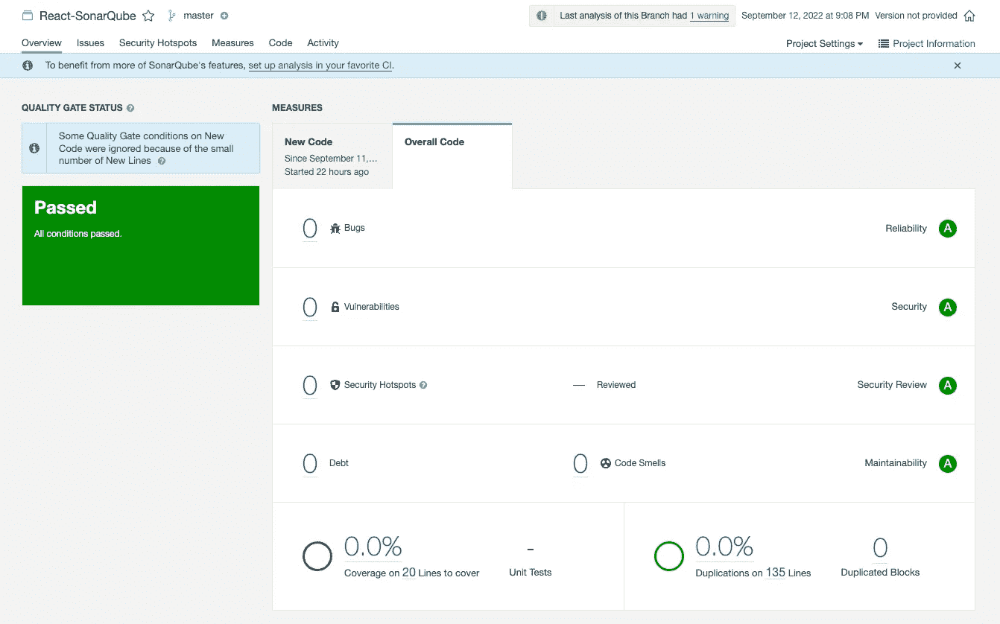

作者图片

它显示 20 行的覆盖率为`0.0%`。单击百分比链接，它会显示详细信息:

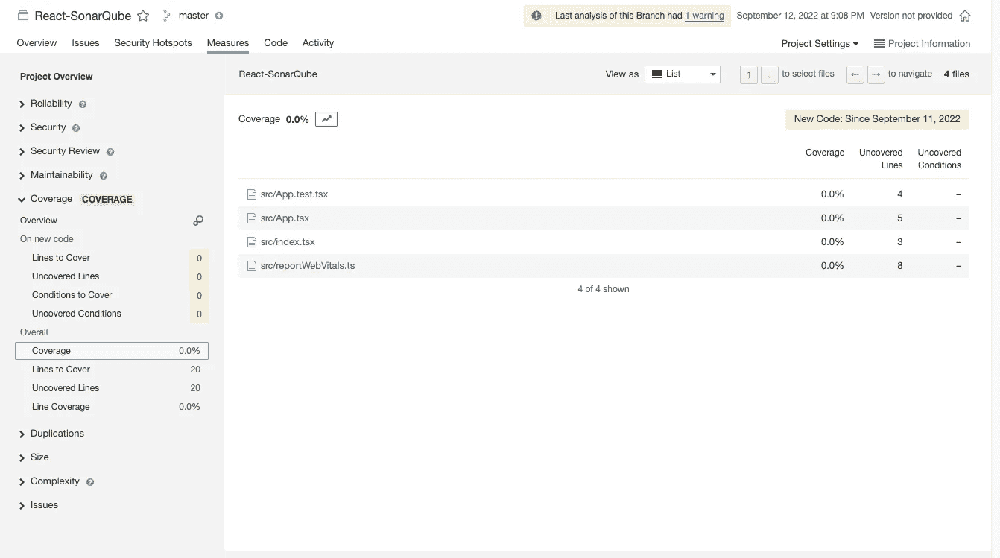

作者图片

这里有两个问题:

1.  Create React App 附带一个测试，`src/App.test.tsx`。为什么测试覆盖面是`0.0%`？
2.  `src/App.test.tsx`被列为待测试代码。

对于#1，由于 SonarQube 是一个静态代码分析工具，它不运行测试。我们需要配置它来读取 Jest 的覆盖率输出。

对于#2，我们需要排除要测试的测试文件。为了适应更常见的实践，我们将`src/App.test.tsx`移至`src/__tests__/App.test.tsx`。

此外，我们在项目的根目录中创建一个配置文件`sonar-project.properties`，以避免将所有参数传递到命令行中。根据[属性定义](https://docs.sonarqube.org/latest/analysis/analysis-parameters/)，我们对`sonar-project.properties`配置如下:

*   第 1 行指定了项目密钥。
*   第 2 行指定源文件位置为当前文件夹。
*   第 3 行指定 SonarQube 服务器运行的 URL。
*   第 4 行指定了测试文件的路径。
*   第 5 行指定了测试文件的命名约定。
*   第 6 行指定了要忽略的文件。
*   第 7 行指定了在哪里阅读 Jest 测试报告。

事实上，所有设置都可以在`Administration > Configuration`中进行全局设置:

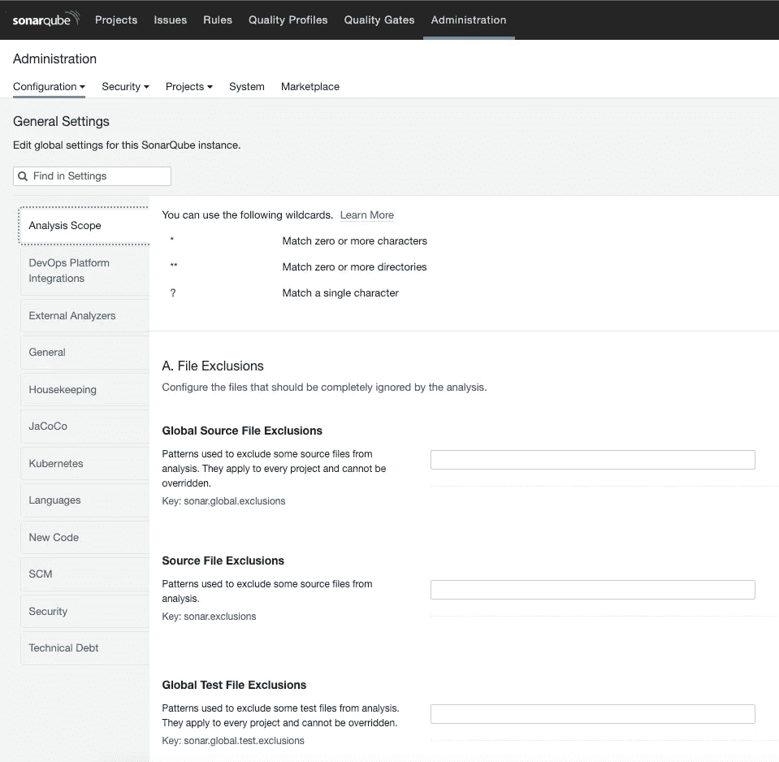

作者图片

我们准备跑了。

步骤 1:重新生成测试覆盖报告。

```
% npm run test -- --coverage . --watchAll=false
```

第二步:执行 NPM 模块`sonar-scanner`。

第三步:转到`http://localhost:9000/dashboard?id=React-SonarQube`查看结果。

状态为`Passed`，转到`Overall Code`选项卡:

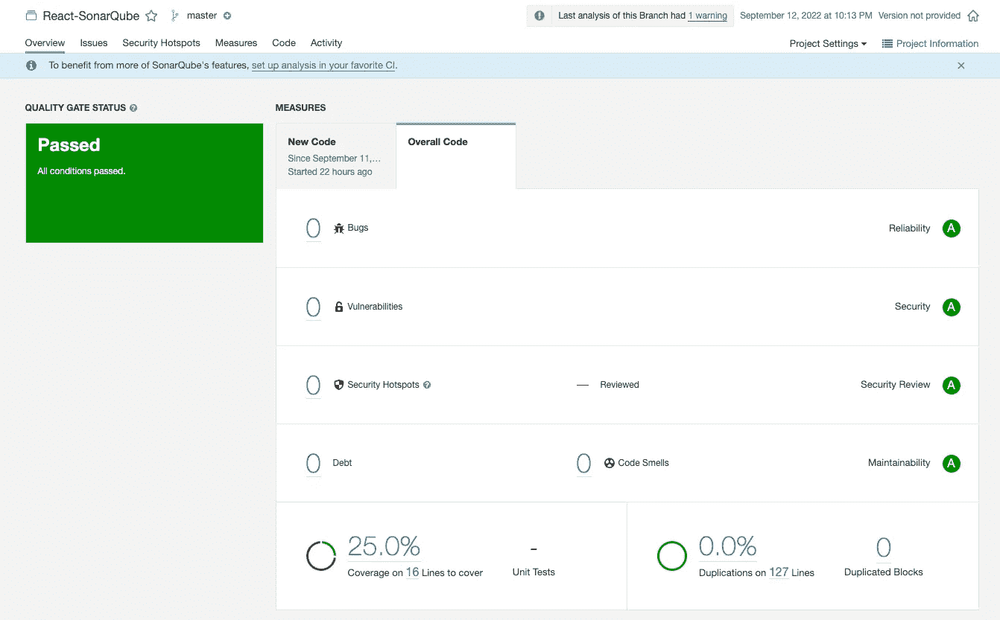

作者图片

测试覆盖率为`25.0%`，行数为 16 ( `src/__tests__/App.test.tsx` 被忽略)。结果令人鼓舞。

点击百分比链接，确认`src/__tests__/App.test.tsx` 未列出:

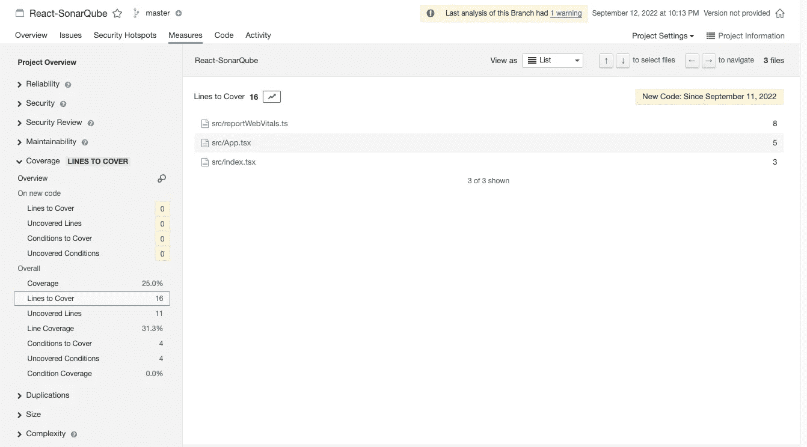

作者图片

让我们查看每个文件的更改。

`**src/App.tsx**`:显示第 6-10 行被覆盖(绿色——我们添加了第 6-9 行，以显示更多可以删除的行)。

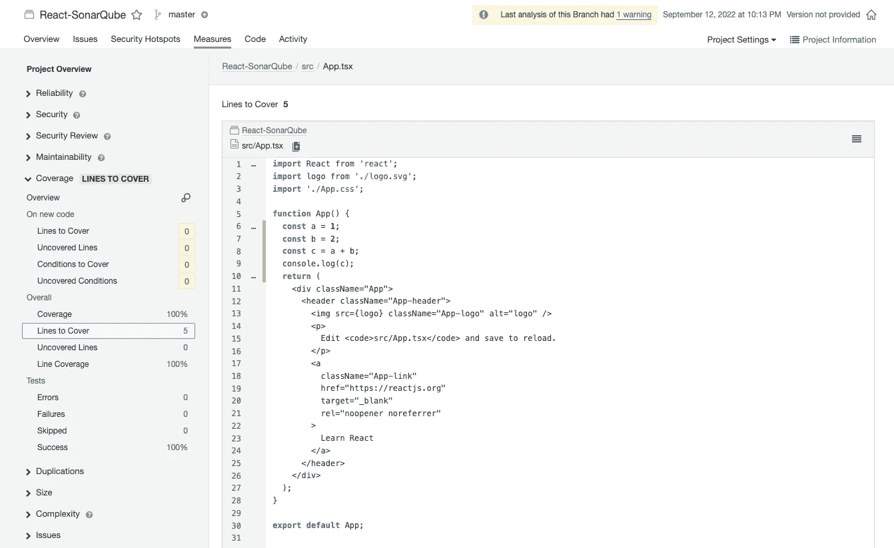

作者图片

`**src/reportWebVitals.ts**`:显示 3-10 行未覆盖(红色)。

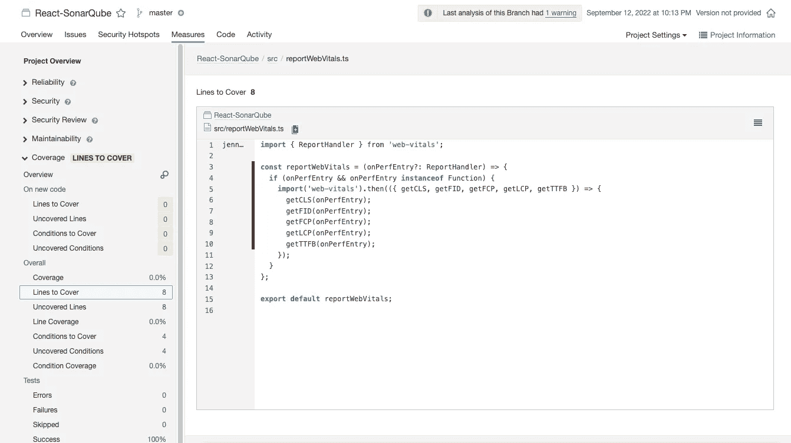

作者图片

`**src/index.tsx**`:显示 7、10 号线未覆盖(红色)。

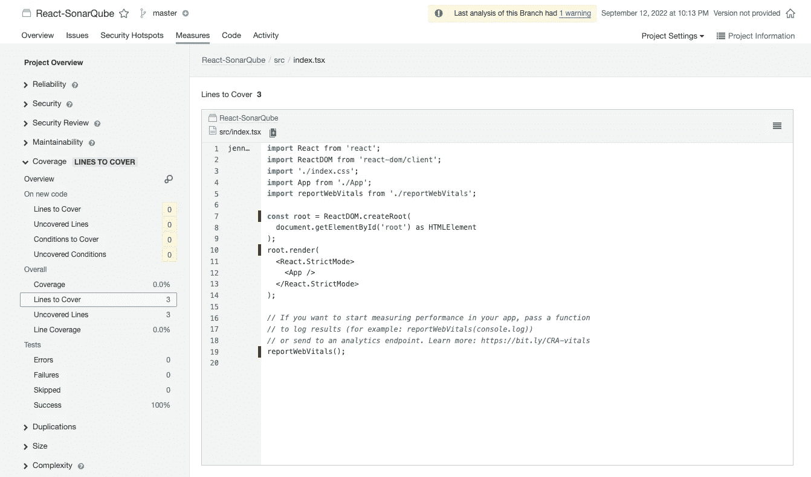

作者图片

SonarQube 的 UI 难道不比 Jest 的命令行覆盖报告好看吗？

移除`src/App.tsx`中的多余线路。承保范围数量减少:

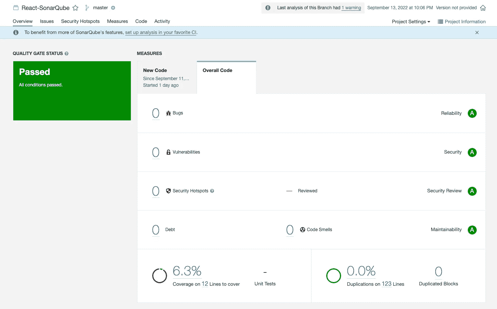

作者图片

它显示了 Create React 应用程序的开箱即用覆盖范围:

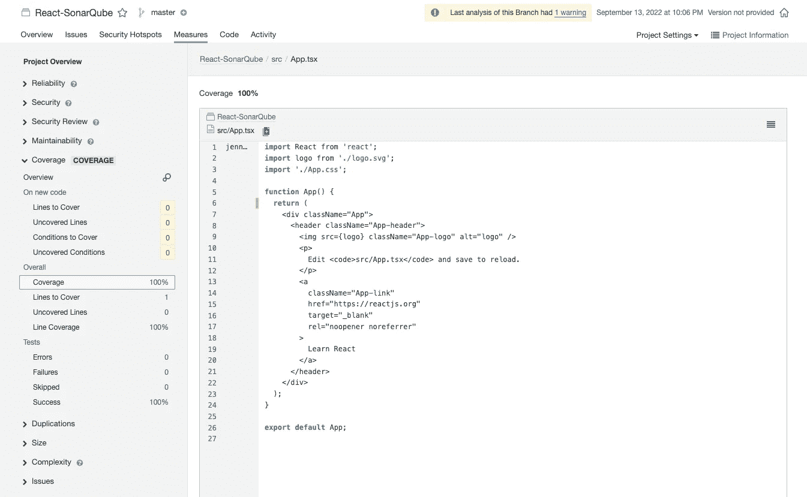

作者图片

# 结论

本文是关于如何在 React 项目中使用 SonarQube 的入门指南。SonarQube 拥有漂亮的用户界面，比 Jest 的命令行覆盖报告更加人性化。SonarQube 中有更多高级设置，如指标、质量门和规则。更多高级用法，请查看[官方文档](https://docs.sonarqube.org/latest/)。

感谢阅读。

```
**Want to Connect?** If you are interested, check out [my directory of web development articles](https://jenniferfubook.medium.com/jennifer-fus-web-development-publications-1a887e4454af).
```

*感谢 Daria Mehra 向我展示了 SonarQube，这是一款强大的静态代码分析工具。*