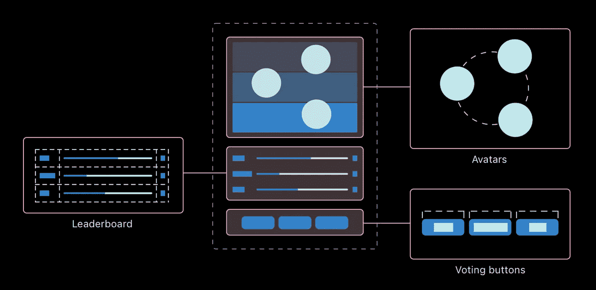
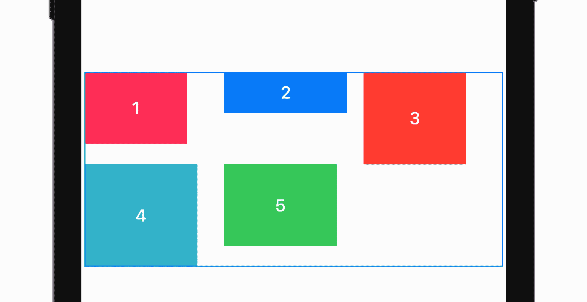
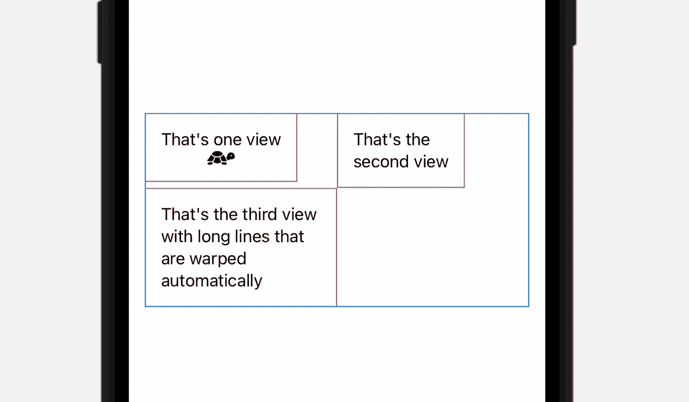
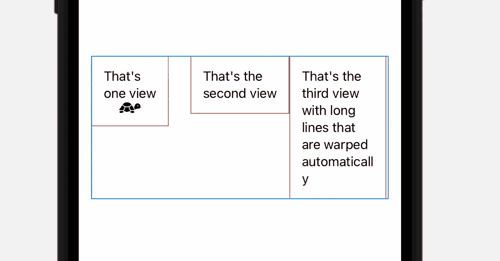
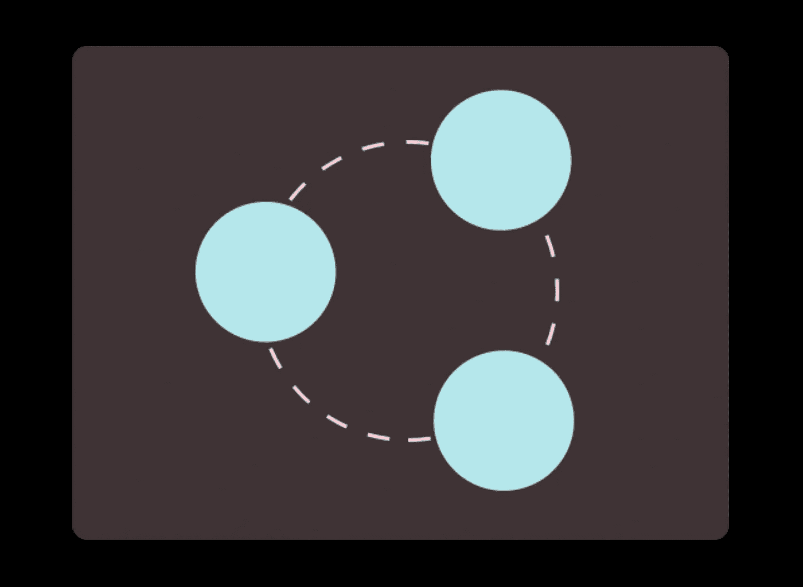

# 探索 SwiftUI 布局协议—创建自定义布局

> 原文：<https://betterprogramming.pub/exploring-swiftui-layout-protocol-creating-custom-layout-7562be989a60>

## 苹果随着 iOS 16 的发布引入了新 SwiftUI 的布局协议。在这篇文章中，我将讨论该协议并实现一个自定义视图



从[用 SwiftUI 编写自定义布局](https://developer.apple.com/documentation/swiftui/composing_custom_layouts_with_swiftui)

苹果随着 iOS 16 的发布引入了新的 SwiftUI `Layout`协议。它是一个强大的工具，用于构造 SwiftUI 优雅的定制视图。在这篇文章中，我将介绍什么是`Layout`以及如何使用它。

最后，我们将构建一个定制的表格视图，自动排列其子视图。提供了完整的代码！



我们的自定义布局

# 符合布局

讨论的`Layout`是一个新的协议，允许你选择一种方式来排列你的视图。

通过它，你真的可以说出你想在哪个坐标上放置子视图。比如现在的`HStack`、`VStack`、`ZStack`都可以在 iOS 16 中通过它轻松实现。

```
protocol Layout : Animatable
```

为了符合协议，您需要定义两个方法

```
func sizeThatFits(
    proposal: ProposedViewSize,
    subviews: Self.Subviews,
    cache: inout Self.Cache
) -> CGSize

func placeSubviews(
    in bounds: CGRect,
    proposal: ProposedViewSize,
    subviews: Self.Subviews,
    cache: inout Self.Cache
)
```

如果你的布局有一些计算不依赖于建议而只依赖于子视图，你也可以定义`makeCache(subviews:)`。然后，您可以在`makeCache(subviews:)`中进行计算，然后使用这些值。

# 方法`sizeThatFits`

```
func sizeThatFits(
    proposal: ProposedViewSize,
    subviews: Self.Subviews,
    cache: inout Self.Cache
) -> CGSize
```

返回一个大小，指示容器需要多少空间来排列其子视图。SwiftUI 可以多次调用这个方法，探测您的视图并最终决定最佳选项

> 💥只能返回有限的大小。使用无限坐标**返回大小会导致没有合理的调用堆栈**的崩溃，所以请注意您返回的大小

要计算它，您可以使用传递的参数:

## 建议

基本上，这是 SwiftUI 对您的视图大小的建议。我喜欢把它想成谈判。

> 我可以给你这么大的空间。你的尺码是多少？你穿得下吗？
> 
> ——swift ui 谈判代表

`ProposedViewSize`就像`CGSize`一样，也可以有一些特定的值。

*   `zero`提案；视图以其最小尺寸响应。
*   `infinity`提案；视图以其最大尺寸响应。
*   `unspecified`提案；视图以理想的大小响应。

如果不是上述值，您也可以访问建议书的`width`和`height`。

建议可以有一个固定的维度，第二个维度为`nil`。例如，`HStack`可能测量它的子视图宽度的灵活性，同时使用一个固定的高度值。

## 子视图

它只是一个子视图代理`LayoutSubview`的容器。通过它，你可以询问子视图的大小，并给他们你的建议

> 亲爱的子视图，我给你这么多空间。你的尺码是多少？
> 
> —自定义布局协商器

您可以通过以下方式询问子视图尺寸

```
func sizeThatFits(ProposedViewSize) -> CGSize
```

和

```
func dimensions(in: ProposedViewSize) -> ViewDimensions
```

## 隐藏物

是你的`makeCache(subviews:)`函数提供的缓存。也可以是`Void`(无缓存)。

# 方法`placeSubviews`

```
func placeSubviews(
    in bounds: CGRect,
    proposal: ProposedViewSize,
    subviews: Self.Subviews,
    cache: inout Self.Cache
)
```

这是奇迹发生的地方。在这种方法中(也只有这种方法),给你视图和子视图的界限，供你使用。

要放置子视图，您需要在`subviews`元素上调用`place`方法。

```
func place(
    at position: CGPoint,
    anchor: UnitPoint = .topLeading,
    proposal: ProposedViewSize
)
```

这个定义非常简单明了。对于每个子视图，你需要指定一个点来放置它，这个点的锚点，以及**你对所选子视图的**建议。

## 界限

这是您的视图使用的界限。它是你的`sizeThatFits`输出之一。

> 💡虽然名为`bounds`，但实际上是`frame`。因此，原点也被指定**并且你需要相对于那个**排列子视图

## 建议

容器根据其生成父容器用来创建`bounds`参数的大小的大小建议。

# 关于缓存

您可能不使用它，但是通常，一些与子视图相关的计算可以被缓存，这是一个很好的实践，对性能有很大帮助。

当子视图改变时，调用`func updateCache(inout Self.Cache, subviews: Self.Subviews)`。它的默认实现只是调用`makeCache(subviews:)`。

# 创建自动填充的表格

SwiftUI 有一个`Grid`来构造类似表格的结构，但是如果有未知数量的子视图呢？然后，您需要以某种方式正确地构造`GridRow`。

让我们更好地使用新的`Layout`协议特性！

## 计算大小

决定结果视图的大小相对简单。

它使用了几个辅助函数:

## 放置子视图

最后，我们只需要小心翼翼地将视图放置在它们的位置上。只是迭代子视图并计算它们的`x`和`y`位置。

# 例子

现在，我们可以像普通视图一样简单地构造一个包含所需列数的表。



在将列数改为三列后，它会神奇地重新组装。



# 最终注释

我相信你看到了这个工具有多强大。例如， [Apple 使用`Layout`协议在他们的示例](https://developer.apple.com/documentation/swiftui/composing_custom_layouts_with_swiftui)中创建了一个径向视图。



来自[用 SwiftUI 编写自定义布局](https://developer.apple.com/documentation/swiftui/composing_custom_layouts_with_swiftui)

因此，如何在容器中放置视图取决于你，这最终是 iOS 16 中 SwiftUI 所需要的灵活性空间。

你可以从[这里](https://alexdremov.me/content/files/2022/08/ColumnsLayout.swift)下载完整的代码。

```
**Want to Connect?**This post was originally published on [www.alexdremov.me](https://alexdremov.me/exploring-swiftui-layout-protocol-creating-custom-layout/).
```