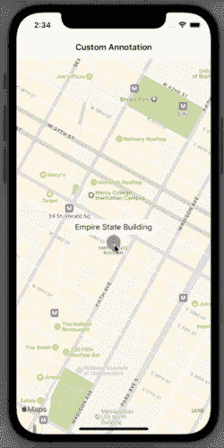

# 探索 SwiftUI 地图自定义注释

> 原文：<https://betterprogramming.pub/exploring-swiftui-map-custom-annotations-fbe1af3d2297>

## 切换注释、设置导航等


照片由 [Waldemar Brandt](https://unsplash.com/@waldemarbrandt67w) 在 [Unsplash](https://unsplash.com/?utm_source=medium&utm_medium=referral) 上拍摄。

不久前，我们在 SwiftUI 中探索了 Mapview。这一次，我们将研究如何创建自定义地图注释、限制以及如何克服其中的一些限制。

在地图上放置注释，就像标记一个特定的地方，是在我们的 iOS 应用程序中显示地图时最关键的任务之一。

# 地图注释协议

在 SwiftUI 中使用自定义地图注释时，我们需要查看`[MapAnnotation](https://developer.apple.com/documentation/mapkit/mapannotation)`。我们可以完全按照我们想要的方式定制它，然后把它放在地图上。

提醒一下，要在地图上显示注释，我们需要一个符合`Identifiable`协议的地点列表，然后在数组中初始化`Map`视图时使用它。

```
struct Place: Identifiable {
  let id = UUID()
  var name: String
  var coordinate: CLLocationCoordinate2D
}struct ContentView: View {
  @State private var region = MKCoordinateRegion(center: CLLocationCoordinate2D(latitude: 40.748433, longitude: -73.985656), span: MKCoordinateSpan(latitudeDelta: 0.01, longitudeDelta: 0.01))

  var empireStateBuilding =
  Place(name: "Empire State Building", coordinate: CLLocationCoordinate2D(latitude: 40.748433, longitude: -73.985656))

  var body: some View {
    Map(coordinateRegion: $region,
        annotationItems: [empireStateBuilding]
    ) { place in
      // ... create a custom MapAnnotation
    }
  }
}
```

现在是创建自定义地图注记的时候了。让我们创建一个自定义视图，以便我们可以重用它。我们可以使用 SFSymbols 填充的地图圆，并在底部放置一个大头针来精确显示确切位置。

```
struct PlaceAnnotationView: View {
  var body: some View {
    VStack(spacing: 0) {
      Image(systemName: "mappin.circle.fill")
        .font(.title)
        .foregroundColor(.red)

      Image(systemName: "arrowtriangle.down.fill")
        .font(.caption)
        .foregroundColor(.red)
        .offset(x: 0, y: -5)
    }
  }
}
```


我们现在可以在‘Map’闭包块中使用它了。

```
Map(coordinateRegion: $region,
        annotationItems: [empireStateBuilding]
    ) { place in
      MapAnnotation(coordinate: place.coordinate) {
        PlaceAnnotationView()
      }
    }
```


当放大或缩小时，我们看到注释被精确地放置在帝国大厦所在的位置。

在地图上有了注释之后，我们希望以某种方式与它进行交互。让我们在接下来的章节中探索如何显示注释标题以及点击它时的导航。

# 显示和隐藏注释标题

为了显示(和隐藏)注释标题，我们需要将它包含在自定义注释视图中，因为我们是手动构造的。

我们可以在`PlaceAnnotationView` `VStack`中添加标题，并在用户点击时显示或隐藏它。

```
struct PlaceAnnotationView: View {
  @State private var showTitle = true

  let title: String

  var body: some View {
    VStack(spacing: 0) {
      Text(title)
        .font(.callout)
        .padding(5)
        .background(Color(.white))
        .cornerRadius(10)
        .opacity(showTitle ? 0 : 1)

      Image(systemName: "mappin.circle.fill")
        .font(.title)
        .foregroundColor(.red)

      Image(systemName: "arrowtriangle.down.fill")
        .font(.caption)
        .foregroundColor(.red)
        .offset(x: 0, y: -5)
    }
    .onTapGesture {
      withAnimation(.easeInOut) {
        showTitle.toggle()
      }
    }
  }
}
```

我们可以使用视图状态变量并相应地更改不透明度，使其以动画形式出现和消失。这会给人一种额外的感觉。


另一个选项是始终显示注释标题。在这种情况下，我们的应用程序用户不用点击就能明白这是什么地方。

```
struct PlaceAnnotationView: View {
  let title: String

  var body: some View {
    VStack(spacing: 0) {
      Text(title)
        .font(.callout)
        .padding(5)
        .background(Color(.white))
        .cornerRadius(10)

      Image(systemName: "mappin.circle.fill")
        .font(.title)
        .foregroundColor(.red)

      Image(systemName: "arrowtriangle.down.fill")
        .font(.caption)
        .foregroundColor(.red)
        .offset(x: 0, y: -5)
    }
  }
}
```

# 从地图注记导航

当用户点击注释时，我们希望导航到不同的视图，并在地图上显示关于这个地方的额外信息。为此，我们可以将定制注释视图放在`NavigationLink`中，然后导航到位置细节视图。

```
MapAnnotation(coordinate: place.coordinate) {
  NavigationLink {
    LocationDetailsView(place: place)
  } label: {
    PlaceAnnotationView(title: place.name)
  }
}
```

点击注释后，用户将被带到详细信息屏幕。就是这样！



# 结论

在 iOS 应用程序中使用地图视图时，使用注释在地图上标记一个地方是一项重要功能。在许多情况下，我们希望使用定制的注释视图来实现。

使用 SwiftUI，我们可以创建自定义注释，并以直观的方式在地图上显示它们。使用这种方法非常好，因为我们拥有所有 SwiftUI 特性，比如堆栈、导航等等。

# 链接

*   [样本代码](https://github.com/fassko/SwiftUIMapCustomAnnotations)
*   [地图标注文档](https://developer.apple.com/documentation/mapkit/mapannotation)
*   [地图标注协议文档](https://developer.apple.com/documentation/mapkit/mapannotationprotocol)
*   [在 SwiftUI 中为地图添加注释](https://www.youtube.com/watch?v=vfWxwDfX30I)
*   [swift ui 中带注释的地图](https://swiftuirecipes.com/blog/map-with-annotations-in-swiftui)
*   [如何在地图视图中显示注释](https://www.hackingwithswift.com/quick-start/swiftui/how-to-show-annotations-in-a-map-view)
*   [如何使用 SwiftUI 地图和注释](https://www.appcoda.com/swiftui-map/)