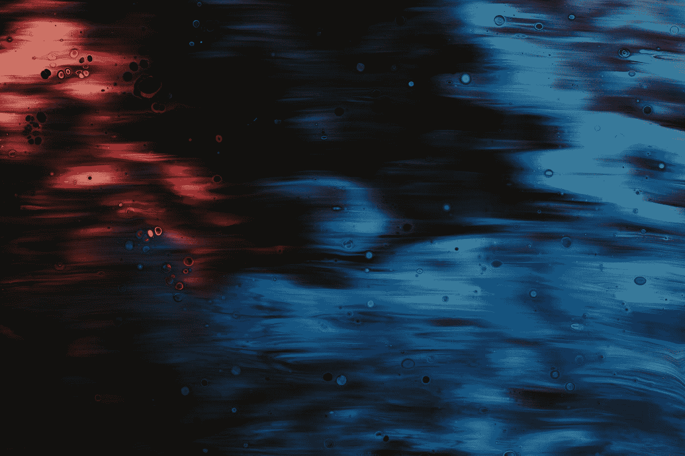
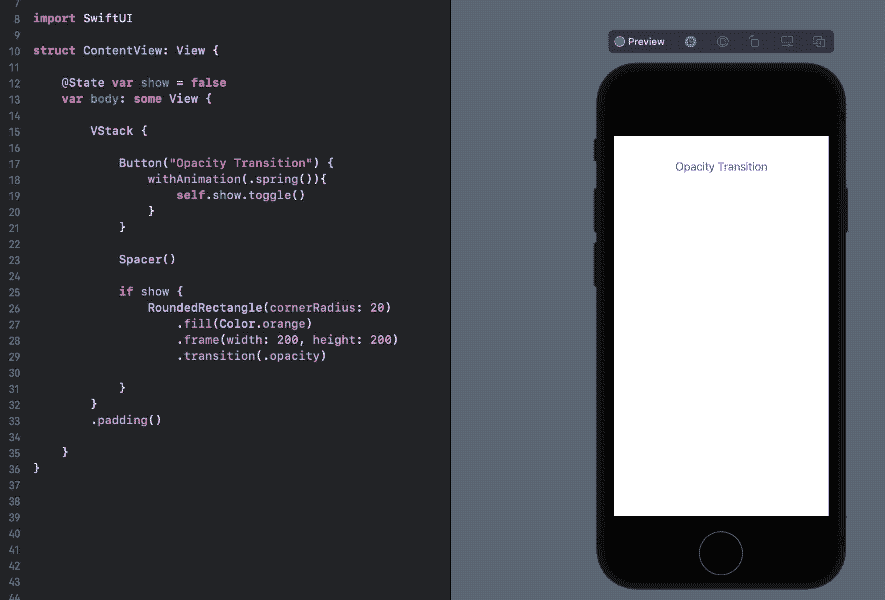
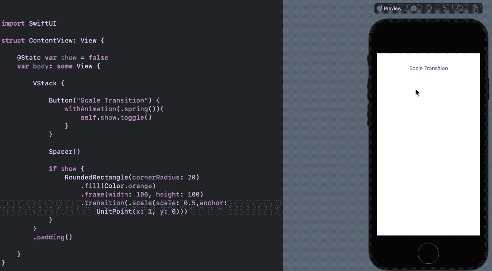
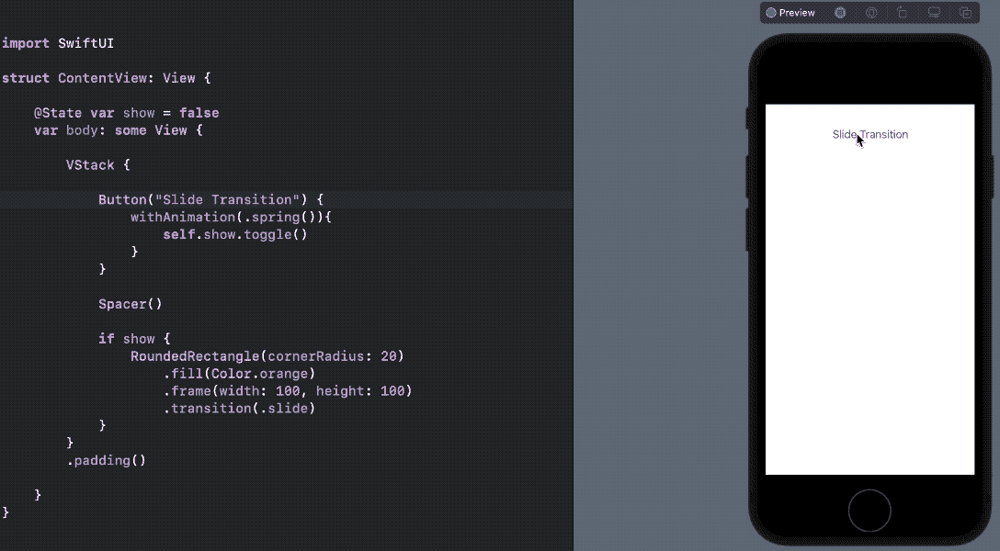
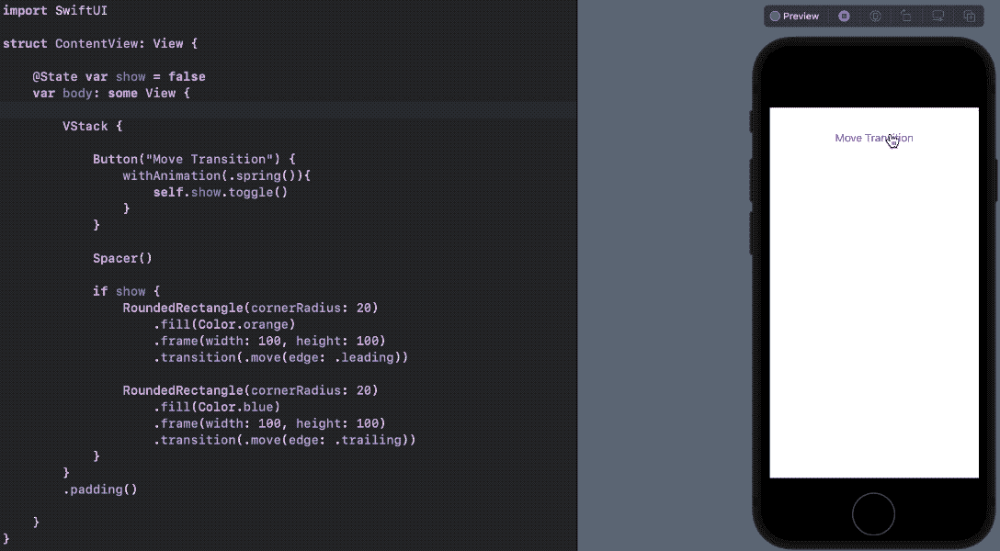
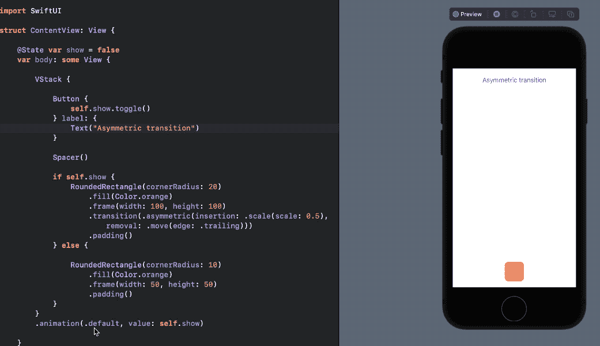
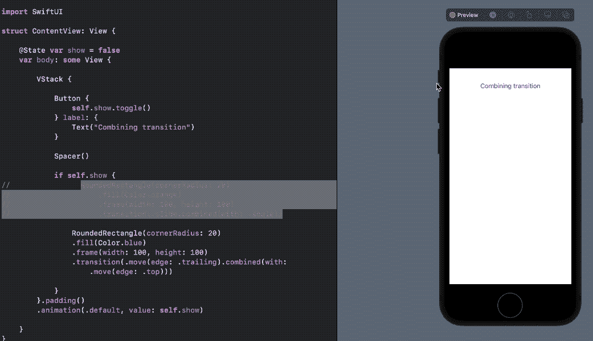
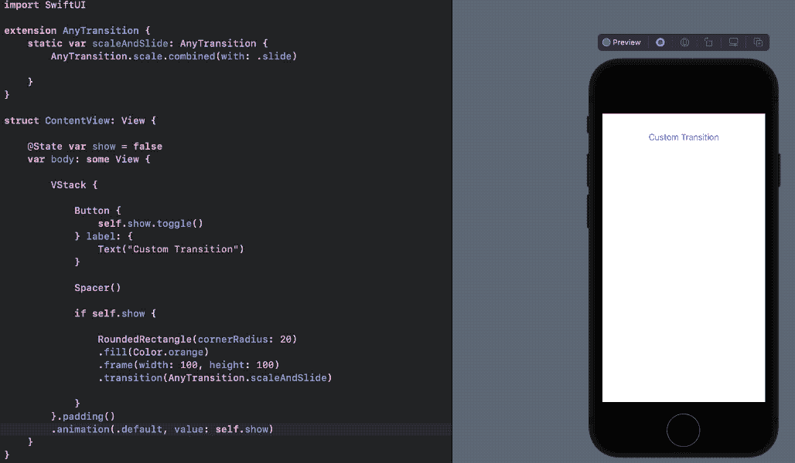

# 探索 SwiftUI 转换

> 原文：<https://betterprogramming.pub/exploring-swiftui-transitions-85d933d3fa3c>

## 不透明度、缩放、滑动、移动、不对称、组合和自定义过渡



Pawel Czerwinski 在 [Unsplash](https://unsplash.com?utm_source=medium&utm_medium=referral) 上拍摄的照片

在 SwiftUI 中，您可以在视图插入或从层次结构中移除时添加效果。这就是所谓的过渡。

在接下来的部分中，我们将看到一些基本类型的转换。让我们开始吧。

# 不透明过渡

SwiftUI 已经提供了一个现成的`opacity`修改器。但是你知道你也可以使用过渡修改器淡入淡出视图吗？以下是如何使用不透明度在两种状态之间转换视图:

```
.transition(.opacity)
```



基于`Button`点击，SwiftUI 插入和移除`RoundedRectangle`，从而给出一个过渡效果。

# 规模过渡

像`scaleEffect`动画一样，`scale`过渡让我们放大和缩小视图尺寸:

```
.transition(.scale)
```

下面是如何使用上述转换的方法:

```
RoundedRectangle(cornerRadius: 20)
.fill(Color.orange)
.frame(width: 100, height: 100)
.transition(.scale)
```

如果没有比例值，视图会缩小并消失。但是，您可以通过以下方式自定义比例参数:

```
.transition(.scale(scale: 0.5))
```

此外，您还可以使用`anchorPoint`参数自定义过渡开始的位置:

```
.transition(.scale(anchor: UnitPoint(x: 1, y: 0)))
```

下面是一个实际的缩放转换输出示例:



从上述转变中我们可以得出几个推论:

```
UnitPoint(x: 1, y: 0) -- transitions towards top right
UnitPoint(x: -1, y: 0) -- transitions towards top leftUnitPoint(x: 0, y: 1) -- transitions towards bottom left
UnitPoint(x: 0, y: -1) -- transitions towards bottom right
```

# 幻灯片过渡

幻灯片切换用于将视图从左向右移动:

```
.transition(.slide)
```



# 移动过渡

虽然幻灯片过渡只能在一个方向上工作，但您也可以使用`move`过渡使其在其他方向上工作:

```
.transition(.move(edge: .leading)).transition(.move(edge: .trailing)).transition(.move(edge: .top)).transition(.move(edge: .bottom))
```



为了更具体地控制视图的位置，您可以使用如下所示的`offset`转换:

```
.transition(.offset(x: 10, y: 10))
```

# 不对称转变

`asymmetric`转换允许您为视图的插入和删除指定不同的转换。比如添加视图的移动过渡和删除视图的不透明过渡。

下面是一个示例`asymmetric`过渡，它在插入时缩放，在移除时将视图向右移动:



# 组合过渡

您甚至可以组合多个过渡来创建独特的效果。这里有几个例子:

```
.transition(.slide.combined(with: .scale)).transition(.move(edge: .trailing).combined(with: .move(edge: .top)))
```

以下转场结合了两个移动转场:尾部和顶部，以产生对角线转场效果:



```
RoundedRectangle(cornerRadius: 20)
.fill(Color.blue)
.frame(width: 100, height: 100)
.transition(.move(edge: .trailing).combined(with: .move(edge: .top)))
```

# 创建定制的过渡

我们也可以通过扩展`AnyTransition`来构建定制的过渡修改器。

例如，这里有一个创建`slideAndScale`转换的例子:

```
extension AnyTransition {static var scaleAndSlide: AnyTransition {
     AnyTransition.scale.combined(with: .slide)
  }
}
```



您可以使用`MatchedGeometryEffect`构建许多更强大的过渡。我们将在另一个教程中探讨它。

目前就这些。感谢阅读。