# 探索人工智能编程语言:R

> 原文：<https://betterprogramming.pub/exploring-the-ai-programming-language-r-102d25af9646>

## 了解它的数据类型、结构、内置数据集等等


帕特里克·托马索在 [Unsplash](https://unsplash.com?utm_source=medium&utm_medium=referral) 上的照片。

R 是一种用于统计计算、图形表示和报告的编程语言和免费软件环境，由 R 统计计算基金会支持。r 是从编程语言 S 演变而来的，S 是一种统计编程语言，主要由贝尔实验室的约翰·钱伯斯、里克·贝克尔和艾伦·威尔克斯开发。

r 最初是由新西兰奥克兰大学统计系的 Ross Ihaka 和 Robert Gentleman 编写的。r 在 1993 年首次出现，2000 年 2 月 29 日发布了 1.0 版本。

r 在数据分析、数据可视化、数据科学和机器学习领域的人工智能世界中被广泛使用。r 拥有大量的社区支持。

正如 Ranvir Kumar 所指出的:

> R 是一种开发良好、简单而有效的编程语言，它包括条件、循环、用户定义的递归函数以及输入和输出工具

r 提供了一套用于计算向量、列表、矩阵、数组、列表、数据框和因子的操作符。r 为数据分析和图形显示提供了一个大的、一致的、集成的工具集合。

在本文中，我们将从 JavaScript、Java 和 C/C++程序员的角度来探索 R。

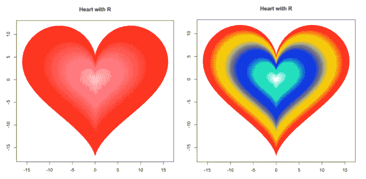

从 R 生成的图像

# 安装 R

我下载了最新的 Mac 版软件包 [R-4.0.3.pkg](https://cran.r-project.org/bin/macosx/R-4.0.3.pkg) 。您可以访问[综合 R 存档网络(CRAN)](http://cran.us.r-project.org) 获取针对您特定平台的最新版本 R。

安装 R 后，可以使用 CLI 命令`Rscript <fileName>.r`运行 R 程序。R 程序保存为`<fileName>.r`或`<fileName>.R`——扩展名大小写无关紧要。

在 Mac 上，R 安装在“应用程序”文件夹中。当调用 R 应用程序时，R 控制台被启动，供我们交互式地运行 R 代码。

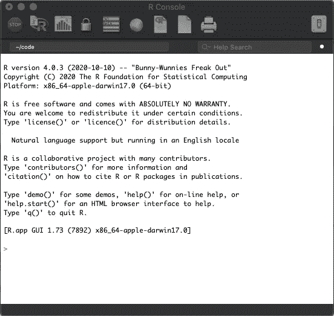

# r 基础知识

在 R 控制台上，我们可以打印一个“你好，世界！”字符串和执行表达式。

第 19 行大约是`0`，这与其他编程语言一致，因为浮点数不是精确的值。

## 数据类型

R 中有五种基本的数据类型:`numeric`、`integer,`、`complex`、`character`和`logical`。R 中的一切都是对象。`class()`功能显示对象类型。

## 变量

r 不声明变量。当一个变量被赋值时，它就被创建了。`<-`和`=`都可以用来赋值，但首选`<-`。作业也可以反方向写(`->`)。

变量也可以被赋予一个函数。在函数内部，如果值用双箭头(`<<-`或`->>`)赋值，这些赋值是针对全局变量的。

## 数字运算

除了`+`、`-`、`*`、`/`之外，R 还支持`^`求指数、`%%`求模、`%/%`求整数除法。在 R 中，数字运算符可以应用于`numeric`、`integer`和`logical`。另外，`TRUE`的值为`1`，而`FALSE`的值为`0`。

你可能想知道`complex`物体是用来做什么的。它们可以应用于横轴为实部，纵轴为虚部的绘图。以下是 R 手册中的一个示例:

这里是标有`complex`数字的地块:

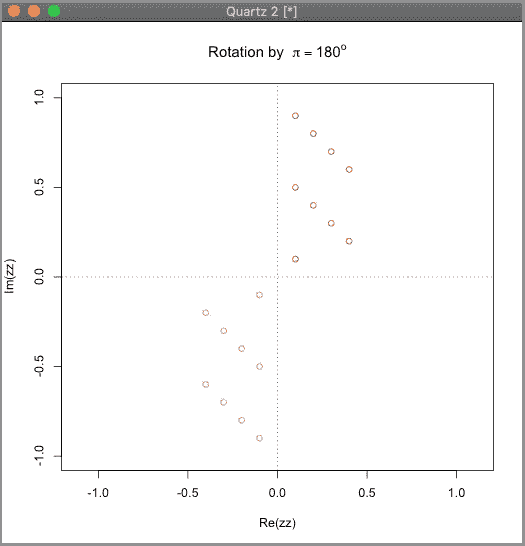

## 字符串操作

在 R 中，字符串被称为字符，字符串操作的命名不同于其他编程语言。

# r 数据结构

r 以数据操作、计算和图形显示为中心。它为对象提供了高级的数据结构，如数组、列表、向量和矩阵。有趣的是，这些数据结构从元素 *1* 开始，这与其他基于 *0* 的编程语言不同。

## 向量

vector 是同一类型项目的列表。通常情况下，`c()`函数用于组合其参数以形成一个向量。然而，R 中的一个基本数据类型也是一个向量。它是一个长度为`1`的单元素向量。

## 列表

列表是不同类型项目的集合。通常，`list()`函数被用来组合它的参数以形成一个列表。列表是多维对象，而向量是一维对象。

## 矩阵

矩阵是包含列和行的二维数据集。典型地，一个`matrix()`函数被用来组合它的参数以形成一个矩阵。参数`data`是一个向量或列表，默认情况下按列填充矩阵。行数`nrow`和列数`ncol`指定矩阵维数。

虽然矩阵可以包含字符或逻辑值，但它通常用于数值计算。

在本文的[中，我们使用 JavaScript 来操作矩阵(二维数组)。为了简单起见，您可能希望使用 R 来应对编码挑战。](https://medium.com/better-programming/the-technical-interview-guide-to-array-transformations-91e23839d19c)

## 数组

数组可以存储二维以上的数据。通常，使用一个`array()`函数来组合它的参数，形成一个多维矩阵。参数`data`是一个向量或列表。数组维数由`dim`指定。每个维度都可以用`dimnames`来命名。如果我们创建一个维度为 *(2，3，4)* 的数组，它会生成四个矩形矩阵，每个矩阵有两行三列。

数组只能有一种数据类型。

## 数据帧

数据框是用于存储表格数据的通用数据对象。通常，`data.frame()`函数用于组合其参数以形成数据框。

## 因素

因素是用于对数据进行分类并将它们存储为级别(类别)的数据对象。通常，`factor()`函数用于处理输入值，以形成具有唯一值的级别。`gl()`函数可以通过指定标签的模式来生成因子。

# r 手册和信息

R 控制台上的问号调用特定主题的 R 帮助。例如，`? factor`将为因子调用 R 帮助:

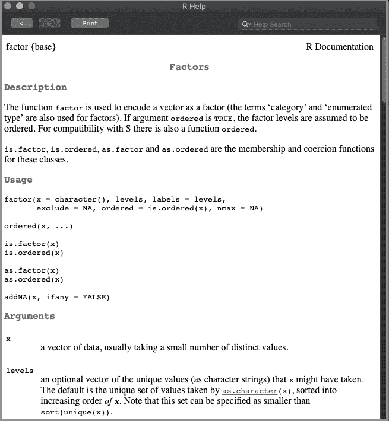

此外，在 R 控制台上键入函数名称会列出实际的函数。

以下是`factor`功能的一个例子:

# r 内置数据集

r 附带了几个内置数据集，通常用作 r 的演示数据。Iris 数据集是广泛使用的数据集之一。在 R 控制台上键入`? mtcars`，它将调用`mtcars (Motor Trend Car Road Tests)`数据集的 R 帮助。

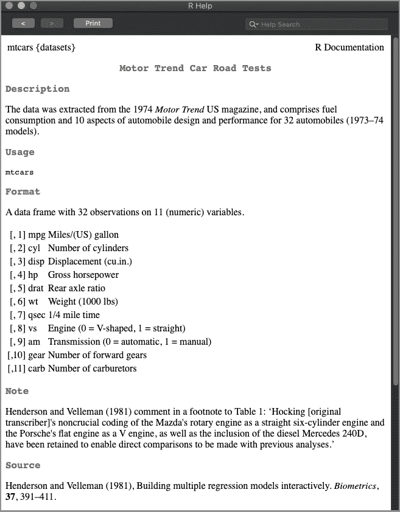

统计学是分析、回顾和总结数据的科学。r 提供了许多执行统计分析的内置函数。

# r 包

r 包是函数、编译代码和样本数据的集合。r 有大量的包来完成各种任务。需要时可以安装特定的软件包。

[ggvis](https://ggvis.rstudio.com/) 是一个数据可视化包，它以声明方式描述数据图形，以便在 Rstudio 或浏览器中创建丰富的交互式图形。可以用`install.packages(“ggvis”)`命令安装。使用前需要加载包:`library(ggvis)`。

这是来自`? ggvis`的手册:

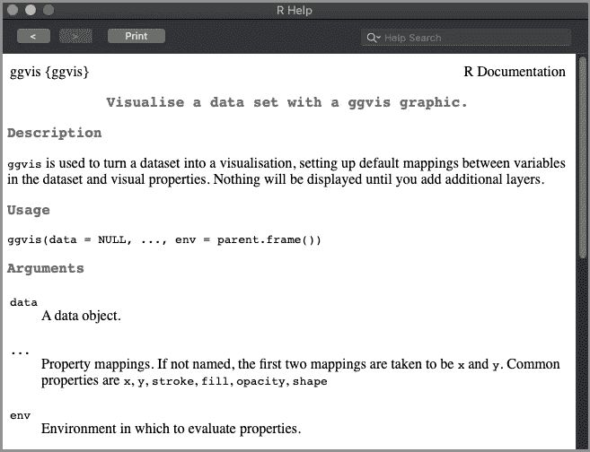

运行以下命令来绘制`wt`和`mpg`值，其中点由`cyl`值着色:

```
mtcars %>% ggvis(~wt, ~mpg, fill = ~factor(cyl)) %>% layer_points()
```

这是浏览器上的图:

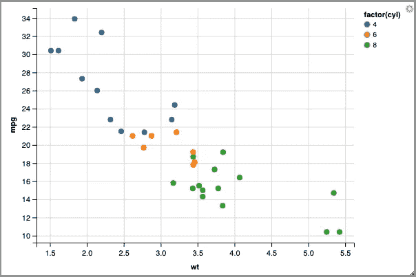

# r 图形

r 提供了丰富的图形显示功能，并且使用简单。当在 R 控制台上键入绘图命令时，图形会显示在 R Quartz 上，这是一个用于 Mac 的图形设备。

在 R 控制台上执行以下命令:

它生成显示在 R Quartz 上的图:

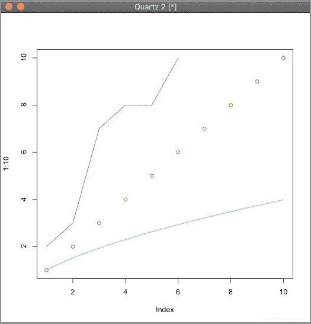

以下等式定义了数学心脏曲线:

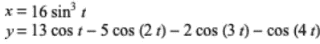

我们用 R 画一条从 0 到 2π的曲线，增量为 0.03。

这是红心:

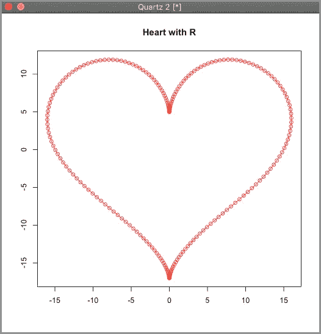

# RStudio 和 Domino

RStudio 是一个众所周知的 R 集成开发环境(IDE ),可用于 R 编程。

[Domino 数据实验室](https://www.dominodatalab.com/)为数据科学工作提供了一个开放的平台。运行 R 程序很方便。代码与修订历史一起存储在云中。可以方便地再现该执行。

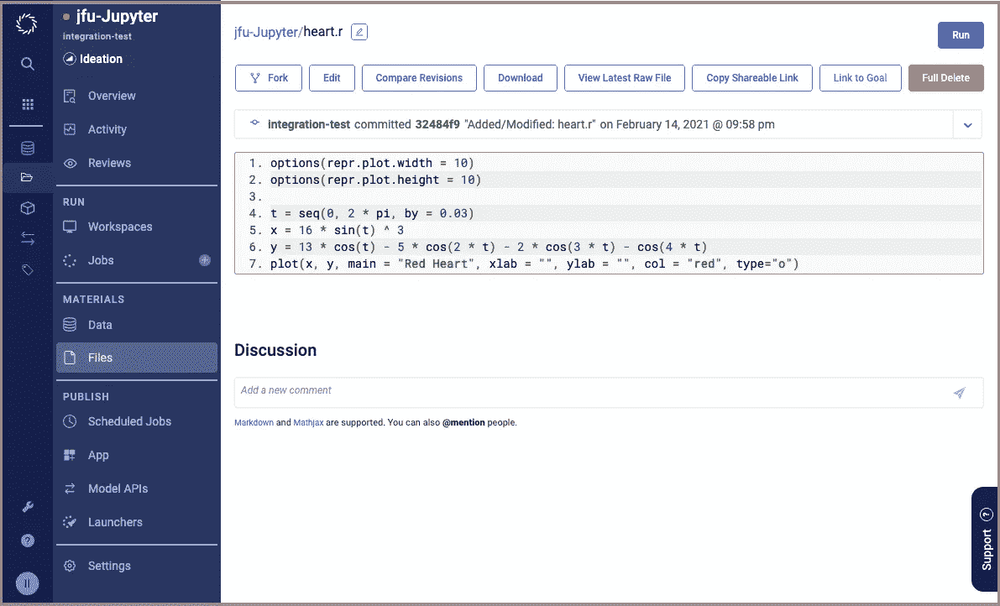

点击上面截图右上角的运行按钮。它弹出一个对话框来选择硬件和软件的工作环境。

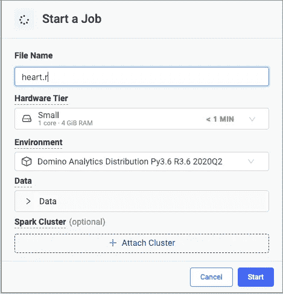

它以运行状态启动作业。

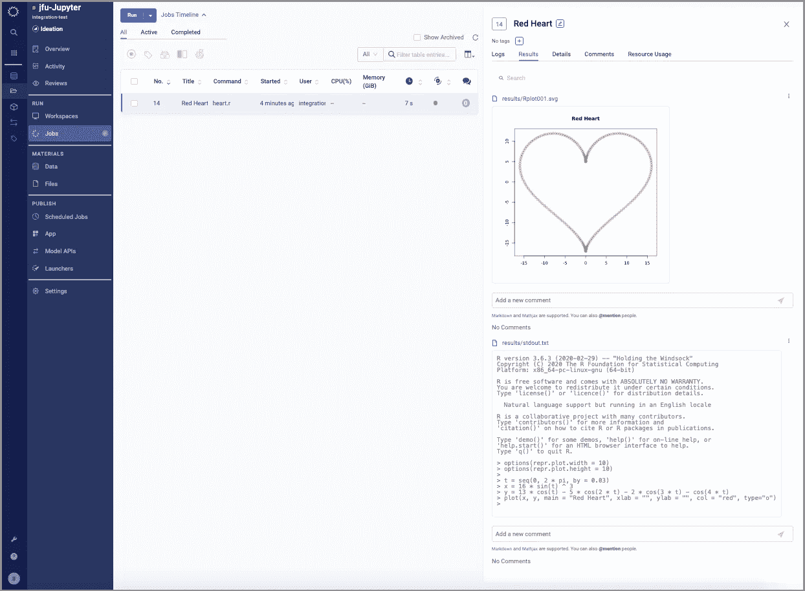

执行后，它会显示信息，如执行时间、CPU 和内存使用情况。日志和结果总是可访问的。是不是很神奇？

# 结论

在本文中，我们介绍了 R 编程语言，它是数据科学家的首选。随着计算机能力、大数据和理论理解的进步，人工智能技术出现了复兴。学习 R 帮助我们解决计算机科学、软件工程和运筹学中的许多挑战性问题。

感谢阅读。我希望这有所帮助。你可以在这里看到我的其他媒体出版物。