# 探索 API 优先的设计模式

> 原文：<https://betterprogramming.pub/exploring-the-api-first-design-pattern-ce0fcb2ed485>

## 了解 API 优先的设计模式是如何复制 John Vester 已经利用了几年的成功写作方法的


从职业角度来说，我最欣赏的两件事是通过技术解决问题和创作技术出版物。前者常常驱动后者:基于灵感的出版物中呈现的结果来自于我最近成功解决的一个问题。

在我三十年的旅程中，我还发现我喜欢列清单。在我职业生涯的早期，我用四格笔记本来建立每天的工作清单。

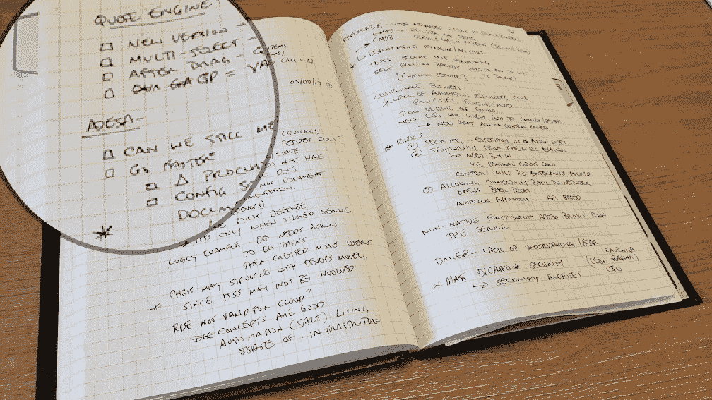

当然，那些图形化的必需品已经被搁置一边，转而使用在[特雷罗](https://trello.com/en-US)或 [JIRA](https://www.atlassian.com/software/jira) 板上维护的衍生列表。对于较小的项目，我倾向于使用 [Sublime](https://www.sublimetext.com/) 和 [Atom](https://atom.io/) 文本编辑器。没有改变的是我喜欢用列表的方式工作。

# 从列表移动到大纲

对于更大的计划，仅仅从一个列表开始工作并不能提供足够的细节。我对新出版物的想法经常如此。

在这些情况下，我会在每个核心列表项中引入子项。虽然有可能在子项级别包含子项，但我经常发现自己陷入了困境，而没有关注更广泛的前景。

一旦清单上的每一项都有了很好的覆盖面，我就会想出如何最好地订购每一项。在这个步骤中，这个列表实际上变成了一个大纲，在这个大纲中，我的思想或想法集合有一个确定的顺序。

由此产生的产品是我自 2015 年以来提交的每一份出版物最终使用的产品。但是，大纲概念并没有局限于我的技术写作。在构建 API 时，我也采用了这种完全相同的方法。

# API 优先的设计模式

[Janet Wagner](https://blog.stoplight.io/api-first-vs.-api-design-first-a-comprehensive-guide) 指出，API 优先的方法“重视 API，将其视为客户端应用程序消费的可重用且易于访问的产品。API 优先意味着从头开始围绕一个 API 设计产品，而不是先构建一个产品，然后再添加一个 API。”

建立 API 标准后，API 优先设计模式在流程开始时分配时间，以产生可靠的 API 设计，重点关注高级特征，包括:

*   资源路径(URI)
*   操作/请求类型(获取、上传、发布、修补、删除)
*   入站参数/有效负载
*   出站响应代码(1xx、2xx、3xx、4xx、5xx)
*   出站响应负载(类型和数据模型)
*   附加元数据(描述、联系方式、使用条款)

在开发这些规范时，我推荐以下生命周期:

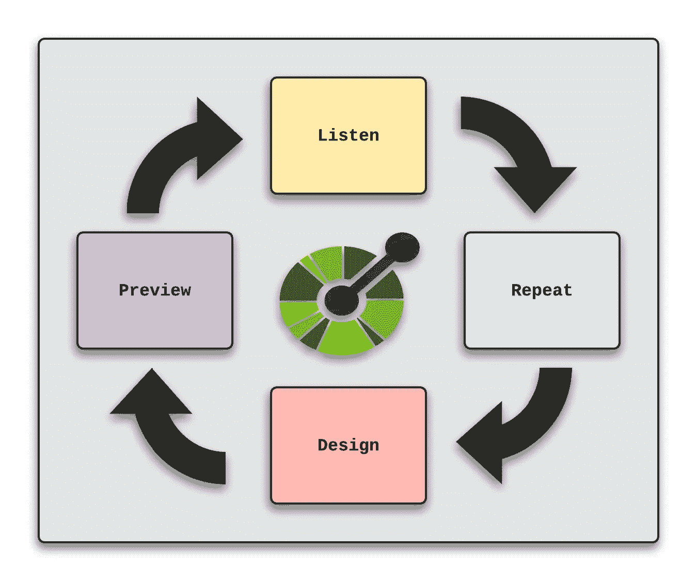

在上图中，第一步是**倾听**API 的需求，并**将任何需求反馈给驱动底层业务规则的产品所有者。理解之后，通过利用基于标准的规范(比如 OpenAPI)开始**设计**阶段。最后，API 的消费者可以**预览**它。**

通常，循环不会就此结束，因为预览阶段会出现问题和挑战。此时，需要更多时间与产品负责人分享这些问题，产品负责人将提供更多信息。在这一点上，周期开始于提供一个更加精炼的 API 规范的目标。

通过采用 API 优先的设计模式，在编写一行代码之前记录单一来源的事实工件。API 的规范将存在于产生实际 API 的源系统之外，这种方式很容易被未来的客户和服务工程师编目和消费。

现在，让我们开始学习一个简单的用例。

# Box Finders API:一个用例示例

在最近搬进我们的新家之后，我想到了一个用例来说明 API 优先的设计模式。我的想法集中在用于搬运个人物品的纸箱上。

在你开始打包搬进新家之前，箱子是必要的。如果你和我一样，理想的情况是找到仍然完好无损、价格低廉或没有价格的盒子。然后，在搬家完成后，找人帮你拿那些不常用的箱子也同样重要，这样可以避免车库角落里不那么吸引人的纸板展示。

进入 Box Finders API，客户在其中执行以下操作:

*   `GET /boxes` —返回可用框集合的列表
*   `GET /boxes/{id}` —检索单个盒子集合
*   `POST /boxes` —添加新的盒子系列
*   `PUT /boxes/{id}` —更新现有的框集合
*   `DELETE /boxes/{id}` —移除现有的框集合

为简单起见，我们假设盒子查找器 API 需要以下属性:

*   id-盒子集合的唯一数字标识符
*   姓名—联系人的姓名
*   电话—联系人的电话号码
*   可用——可用盒子的数量

# 用 API 优先的设计使用孔失眠

因为我以前没有使用过 Kong 失眠症应用程序，所以我想我应该尝试一下 API 优先的设计模式。

一旦[安装了](https://insomnia.rest/download)，使用孔失眠左侧的**创建**菜单，开始一个 API 优先的设计:

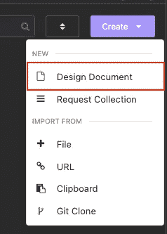

选择设计文档选项后，下一步是提供名称。对于这个例子，我输入了 **box-finders-spec.yaml** 。

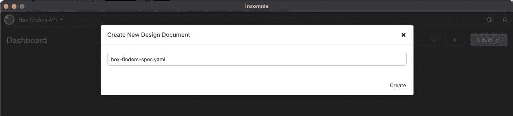

此时，一份空白的设计文件在孔的失眠中打开了:

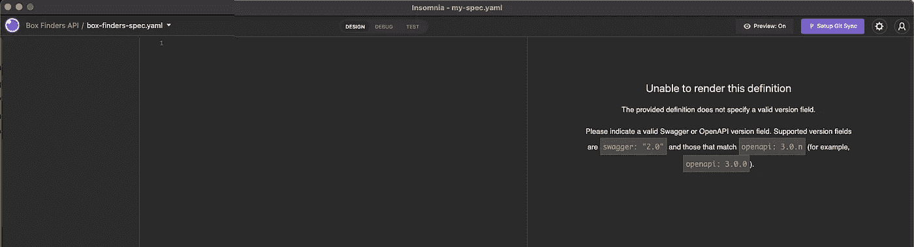

现在，我们准备开始设计盒子查找器 API。

## 添加一般信息

在文件的顶部，您可以添加一些关于规范的一般信息。我用的是 open API 3 . 0 . 0 版:

```
**openapi**: 3.0.0

info:
  version: "0.0.1"
  title: "Box Finders API"
```

## 添加架构信息

基于当前对 Box Finders API 的理解，我将数据模型(也称为模式组件)添加到文件的底部:

```
components:
  schemas:
    Boxes:
      type: array
      items: 
        $ref: "#/components/schemas/Box"
    Box:
      type: object
      properties:
        id:
          type: number
          description: Unique identifier
        name:
          type: string
          description: Person with boxes to give away
        phone:
          type: string
          description: Phone number of person with boxes to give away
        available:
          type: number
          description: Number of available boxes      
    Error:
      type: object
      required:
        - code
        - message
      properties:
        code:
          type: integer
          format: int32
        message:
          type: string
```

采用这种方法将使契约的数据端定义在 API 规范的一个中心位置。

## 添加/框 URIs

有了一般信息和模式部分，我们可以添加/框 URIs 作为遵循 OpenAPI 标准的**路径**项:

```
paths:
  /boxes:        
    get:
      summary: "Lists all available box collections"
      responses:
        "200":
          description: "200 OK, all box collections"
          content:
            application/json:
              schema:
                $ref: "#/components/schemas/Boxes"
    post:
      summary: "Adds a new box collection"
      requestBody:
        content:
          application/json:
            schema:
              $ref: "#/components/schemas/Box"
        required: true
      responses:
        "201":
          description: "201 Created, a new box collection was added"
          content:
            application/json:
              schema:
                $ref: "#/components/schemas/Box"
```

在这个例子中，我添加了 URIs 来检索所有的盒子集合，并在**路径**部分下创建一个新的盒子集合。

## 添加/box/{ id } URIs

接下来，我添加了检索、编辑或删除单个盒子集合的功能作为附加路径，仍然遵循 OpenAPI 标准:

```
**/boxes/**{id}:
    parameters:
        - in: path
          name: id
          schema:
            type: number
          required: true
          description: "id of the box collection"
    get:
      summary: "Retrieves a box collection by identifier"
      responses:
        "200":
          description: "200 OK, box collection by identifier"
          content:
            application/json:
              schema:
                $ref: "#/components/schemas/Box"
        "404":
          description: "404 Not Found, box collection does not exist"
          content:
            application/json:
              schema:
                $ref: "#/components/schemas/Error"
    put:
      summary: "Updates a box collection by identifier"
      requestBody:
        content:
            application/json:
              schema:
                $ref: "#/components/schemas/Box"
      responses:
        "202":
          description: "202 Accepted, updated box collection"
          content:
            application/json:
              schema:
                $ref: "#/components/schemas/Box"
        "404":
          description: "404 Not Found, box collection does not exist"
          content:
            application/json:
              schema:
                $ref: "#/components/schemas/Error"
    delete:
      summary: "Deletes a box collection by identifier"
      responses:
        "204":
          description: "204 No Content, deleted box collection"
        "404":
          description: "404 Not Found, box collection does not exist"
          content:
            application/json:
              schema:
                $ref: "#/components/schemas/Error"
```

至此，Box Finders API 的 0.0.1 版本已经完成。然而，在继续之前，我觉得是时候将这些信息存储在基于 git 的存储库中了。这样，设计就不局限于存在于我的本地机器上。

## 连接到 GitHub

Kong 失眠症客户端允许与现有的基于 git 的存储库集成。我在以下 URL 创建了一个新的存储库:

[https://github.com/johnjvester/box-finders-api](https://github.com/johnjvester/box-finders-api)

接下来，我创建了一个[个人访问令牌](https://docs.github.com/en/authentication/keeping-your-account-and-data-secure/creating-a-personal-access-token)来创建对 GitHub 存储库的读/写访问。然后，我使用生成的令牌在 Kong 失眠症患者中设置对 Box Finders API 规范的访问:

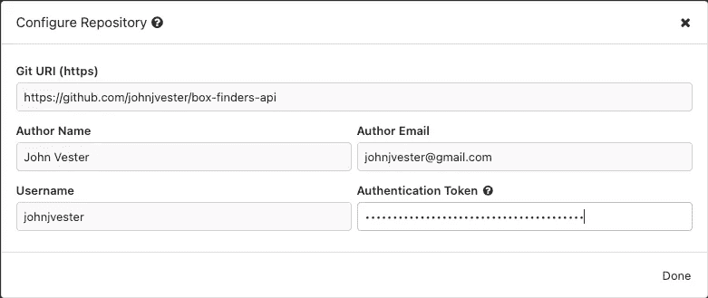

此时，我提交了我的更改，并将它们推送到 GitHub。一旦完成，孔失眠的变化现在可供其他人拉进他们自己的客户端:

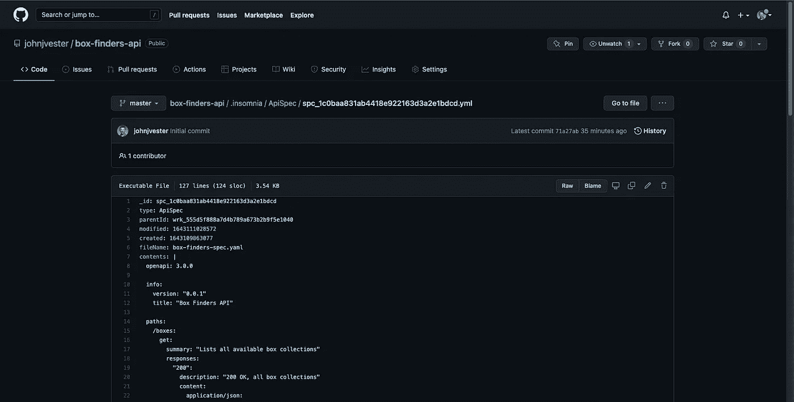

其他希望审查或参与规范的人可以使用**创建**菜单中的 **Git 克隆**选项。

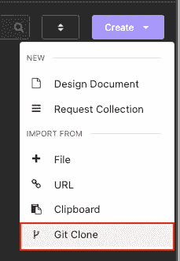

## 孔失眠显示完整的 API

有了上面的改动，孔失眠显示了宣传片的内容:

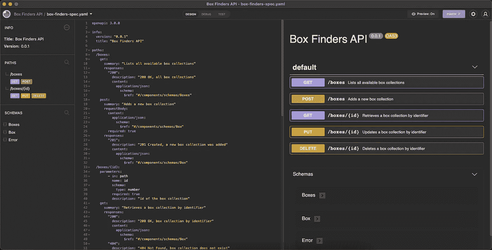

此时，服务和消费者开发人员无需编写一行代码就可以使用 Box Finders API 规范。

## 使用箱子查找器 API

如果 Box Finders API 的消费者希望在功能团队开发 Box Finders RESTful 服务的同时开发他们的应用程序，Kong 失眠症患者提供了完整的合同供新客户使用:

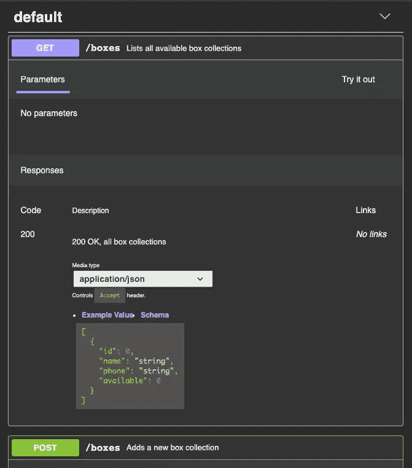

当向`/boxes` URI 发出 GET 请求时，服务将返回一个盒子对象列表:

```
[
  {
    "id": 0,
    "name": "string",
    "phone": "string",
    "available": 0
  }
]
```

使用 API 优先的设计模式，绑定到 Box Finders API 的每个客户端或服务都可以在为 Box Finders 服务编写一行代码之前开始开发。

## 部署到 Kong 开发门户

如果您已经[在 Kong Konnect](https://konnect.konghq.com/register/?utm_source=guest&utm_medium=devspotlight&utm_campaign=community) 设置了一个帐户来使用 Kong Dev Portal，您可以使用 Box Finders specification 菜单上的 **Deploy to Dev Portal** 菜单选项:

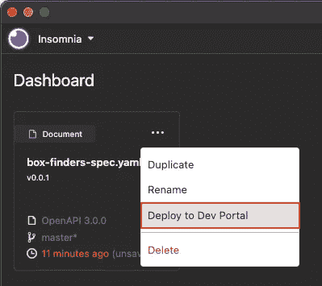

孔失眠然后会在第一次尝试部署之前询问连接属性:

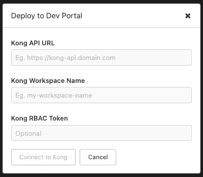

# 结论

从去年开始，我一直努力按照下面的使命宣言生活，我觉得它可以适用于任何 IT 专业人士:

> *“将您的时间集中在提供扩展您知识产权价值的特性/功能上。将框架、产品和服务用于其他一切。”*
> 
> *-j·维斯特*

在本文中，我使用 Kong 失眠症患者创建了一个标准化的 API 规范，可以在编写任何源代码之前对其进行完整的文档化、审查和交流。这允许团队协作进行设计和更改，而不需要任何昂贵的服务层更新。显然，这包含了我个人的使命宣言。

孔失眠是一个产品，使功能团队继续专注于扩大知识产权的价值，有助于底线积极。更进一步，您可以轻松地将 Kong 失眠症的结果部署到 [Kong Konnect](https://konghq.com/kong-konnect/?utm_source=guest&utm_medium=devspotlight&utm_campaign=community) ，它集中了 API 规范，供其他消费者在他们的应用程序中查找和使用。

在我的个人旅程中，我创建列表来帮助我的日常任务。在大多数情况下，这些列表成为大纲，然后导致设计和规格。API 优先的设计模式对我来说是一个自然的发展，当然也是我欣赏和接受的一个概念。

如果您对本出版物的原始源代码感兴趣，可以在以下链接中找到上述所有内容:

[](https://github.com/johnjvester/box-finders-api) [## GitHub-johnj vester/box-finders-API

### 此时您不能执行该操作。您已使用另一个标签页或窗口登录。您已在另一个选项卡中注销，或者…

github.com](https://github.com/johnjvester/box-finders-api) 

祝你今天过得愉快！