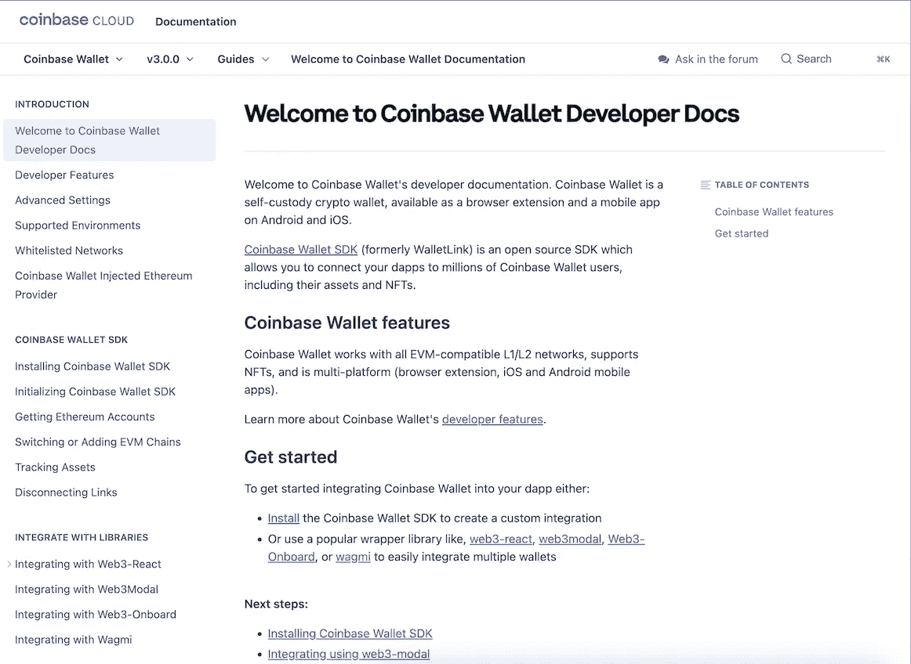
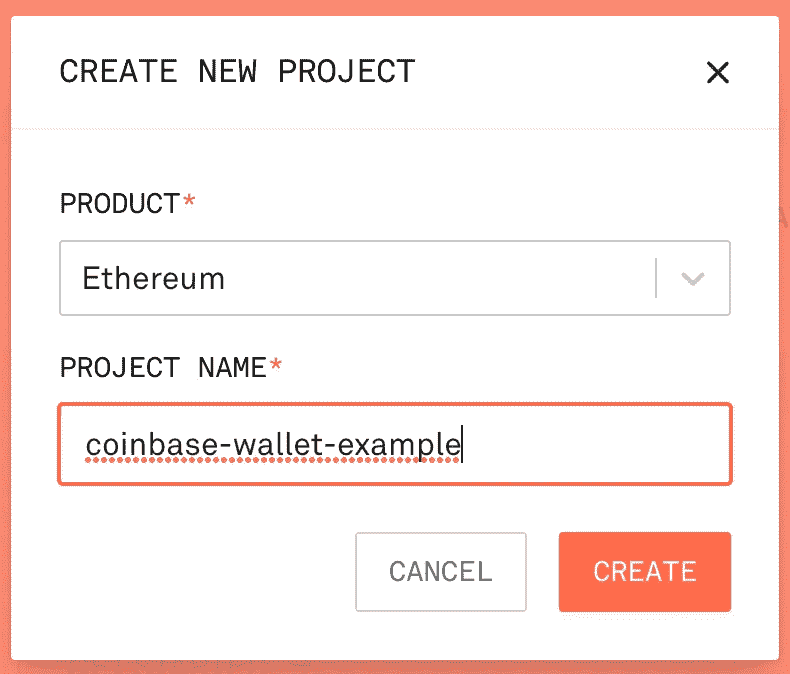
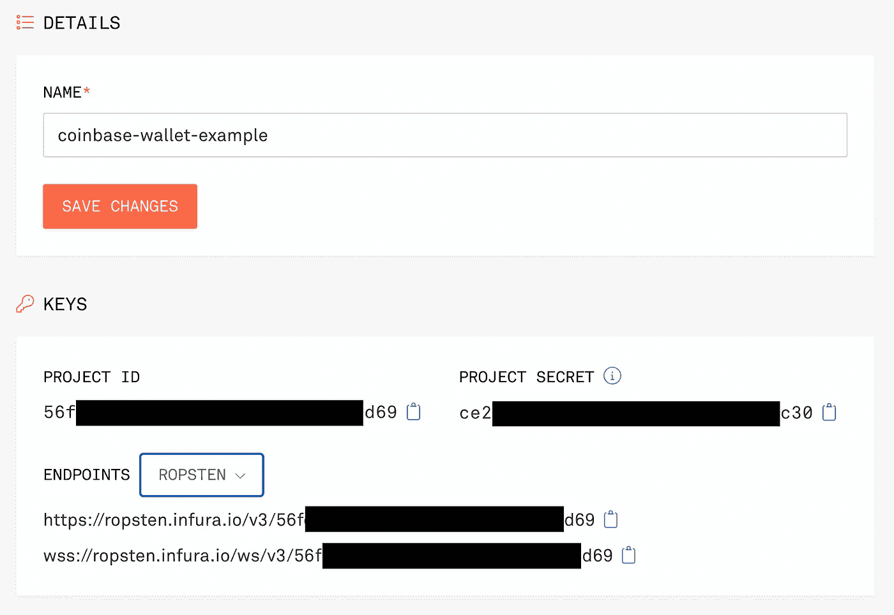

# 从 Web2 的起点探索比特币基地 API

> 原文：<https://betterprogramming.pub/exploring-the-coinbase-api-from-a-web2-starting-point-f1232e84777c>

## 不知道从哪里开始使用 Web3？开始使用比特币基地开发者工具


图片来自 [Pixabay](https://pixabay.com/illustrations/loveourplanet-earth-peaceful-4851331/)

1977 年，在看过电影《星球大战》后，我心中那个有抱负的音乐家想学钢琴。我的目标是学习如何演奏大家都在谈论的电影的主旋律，所以我买了乐谱。我们家有一架钢琴，是我祖父母送的礼物。

当我看到页面上所有的注释时，10 岁版本的我很快变得不知所措:


我想我可能会从更容易的东西开始，所以我开始在钢琴凳上筛选文件。然后我发现了这个很酷的音符图表模板，它非常适合放在钢琴的琴键后面。我找不到完全匹配的，但这里的就是一个例子:


这对我来说是一个游戏规则的改变。我把所有其他音乐扔回到钢琴凳上，开始工作，学习如何演奏《星球大战》。在很短的时间内，我学会了演奏那首歌(和钢琴),没有一节课。

这让我想知道，为什么这样的“模板”并不存在于生活的方方面面。

# 新技术的第 22 条军规

新的语言、平台、框架和设计模式都有一个共同的需求——开发人员接受和采用。大多数人通常都面临另一个共同的挑战:比预期更陡峭的学习曲线。

对我来说，Web3 目前正处于这种状态，尽管在我的“[从全栈开发者转向 Web3 先锋](/moving-from-full-stack-developer-to-web3-pioneer-13bf8b415dc9)”出版物中已经讨论过一个 Web3 的例子。

最前沿的开发者已经用 Web3 做了很多伟大的事情。但是下一个一百万像我一样的开发者呢？他们希望开始时不会感到不知所措和沮丧。我们怎样才能找到一种方法让他们使用 Web3 呢？

我想为 Web3 开发找到一个助手模板，这是我在开始探索[比特币基地 SDK](https://www.coinbase.com/products)时找到的。

# 比特币基地 SDK/API

根据维基百科，[比特币基地](https://en.wikipedia.org/wiki/Coinbase)是一家美国上市公司，自 2012 年 6 月以来一直运营加密货币交易平台。与我用 Marqeta 写的文章类似，比特币基地提供了一系列应用程序编程接口(API)和软件开发工具包(SDK)，供有兴趣构建数字货币应用程序的开发人员使用。

一个这样的例子是比特币基地钱包 SDK。



对于本出版物，我希望完成以下任务:

*   使用 React 创建一个简单的 Web3 应用程序
*   将我的钱包浏览器扩展与 Dapp 集成
*   允许用户使用比特币基地钱包 SDK 进行捐赠

# 使用比特币基地钱包 SDK 创建 Web3 应用程序

首先，我们可以使用 React CLI 创建一个名为 coinbase-wallet-example 的 React 应用程序:

`npx create-react-app coinbase-wallet-example`

创建 React 应用程序后，我使用以下命令切换到 coinbase-wallet-example 目录:

`cd coinbase-wallet-example`

由于较新版本的 create-react-app 不再包括 polyfills 支持(正确使用`web3.js`的必要条件),这需要较旧版本的 react-scripts:

`npm install --save-exact react-scripts@4.0.3`

因为我们将构建一个 Web3 示例，所以 web3 框架是使用 npm 安装的(其他选项可以在这里找到):

`npm install web3`

接下来，使用 npm 安装比特币基地钱包 SDK(其他选项可在此处找到):

`npm install @coinbase/wallet-sdk`

使用 [Infura](https://infura.io/) 区块链开发套件，我创建了一个名为`coinbase-wallet-example`的新项目:



接下来，我切换到 Ropsten 测试网络，并记下了该项目的键和 URL:



现在，我们只需要包含以下代码来初始化比特币基地钱包 SDK 和一个 Web3 对象:

```
import CoinbaseWalletSDK from '[@coinbase/wallet-sdk](http://twitter.com/coinbase/wallet-sdk)'
import Web3 from 'web3';const APP_NAME = 'coinbase-wallet-example';
const APP_LOGO_URL = './coinbase-logo.png';
const DEFAULT_ETH_JSONRPC_URL = '[https://ropsten.infura.io/v3/56f](https://ropsten.infura.io/v3/56f) … d69';
const DEFAULT_CHAIN_ID = 3; // 1=Ethereum (mainnet), 3=Ropsten, 5=Gorli
```

在我的应用程序的`useEffect()`方法中，我包含了初始化比特币基地钱包和 Web3:

```
const coinbaseWallet = new CoinbaseWalletSDK({
      appName: APP_NAME,
      appLogoUrl: APP_LOGO_URL,
    });const walletSDKProvider = coinbaseWallet.makeWeb3Provider(
        DEFAULT_ETH_JSONRPC_URL,
        DEFAULT_CHAIN_ID
    );const web3 = new Web3(walletSDKProvider);
```

对于这个非常简单的示例，我们不会利用智能合同，而是提供一个发送捐款的目标地址:

```
const DONATION_ADDRESS = '0x7 ... c94';
```

为了降低风险，将更新代码，将`DONATION_ADDRESS`设置为正在使用的钱包的连接地址。

`DONATION_ADDRESS = account;`

这意味着代码将向发送者发送资金，只留下从用户钱包中取走的油费。React Dapp 将允许用户连接他们的钱包，然后提供一个捐赠金额(使用 WEI 单位)，然后按下捐赠按钮将资金发送到`DONATION_ADDRESS`。

这个简单的 Dapp 的完整源代码如下所示:

运行基于 React 的 Dapp 就像使用以下命令一样简单:

`npm start`

# 结论

自 2021 年以来，我一直试图按照以下使命宣言生活，我觉得这可以适用于任何 IT 专业人士:

> “将您的时间集中在提供扩展您知识产权价值的特性/功能上。将框架、产品和服务用于其他一切。”
> 
> *—j·维斯特*

我在介绍中提到的笔记图表模板成为了我人生中的一个关键点。藏在我们钢琴凳里的这块隐藏的宝石不仅让我有能力弹奏《星球大战》主题曲，也让我有能力弹奏音乐。那个简单的模板和对学习的渴望最终为我进入伯克利音乐学院铺平了道路，并有能力参与几部音乐作品。

比特币基地 API 和 SDK——或开发者工具——为渴望进入新兴的 Web3 世界的开发者提供了类似的目的。开发人员可以将这些模块包含到他们的应用程序中，并快速开始，而不会陷入细节中。

在这两种情况下，音符图表模板和比特币基地开发者工具都坚持我的使命宣言，允许个人专注于他们的主要目标——无论是第一次学习弹钢琴还是用 Web3 做一些很酷的事情。

如果您对本出版物的源代码感兴趣，可以在 GitLab 上找到，地址如下:

[](https://gitlab.com/johnjvester/coinbase-wallet-example) [## John Vester/coin base-wallet-git lab 示例

### coinbase-wallet-example 存储库是一个简单的 web3 Dapp 示例，构建于 React 和 web3 之上，用于说明它有多简单…

gitlab.com](https://gitlab.com/johnjvester/coinbase-wallet-example) 

祝你今天过得愉快！