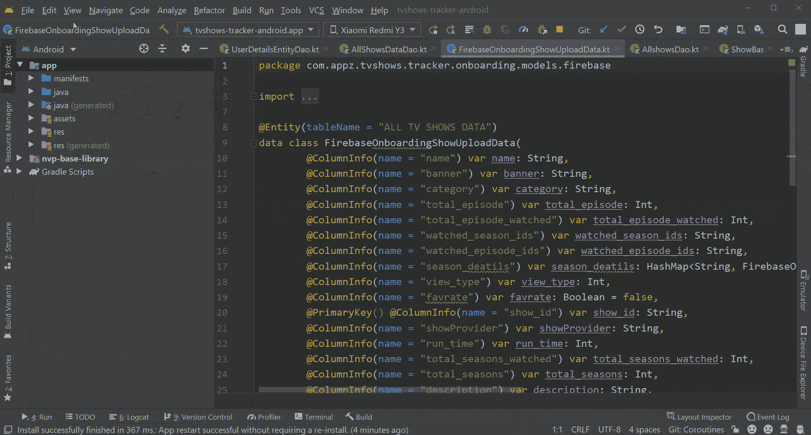
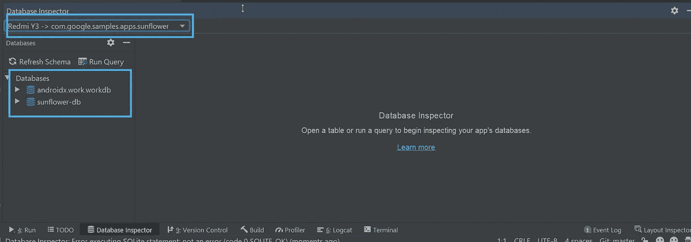
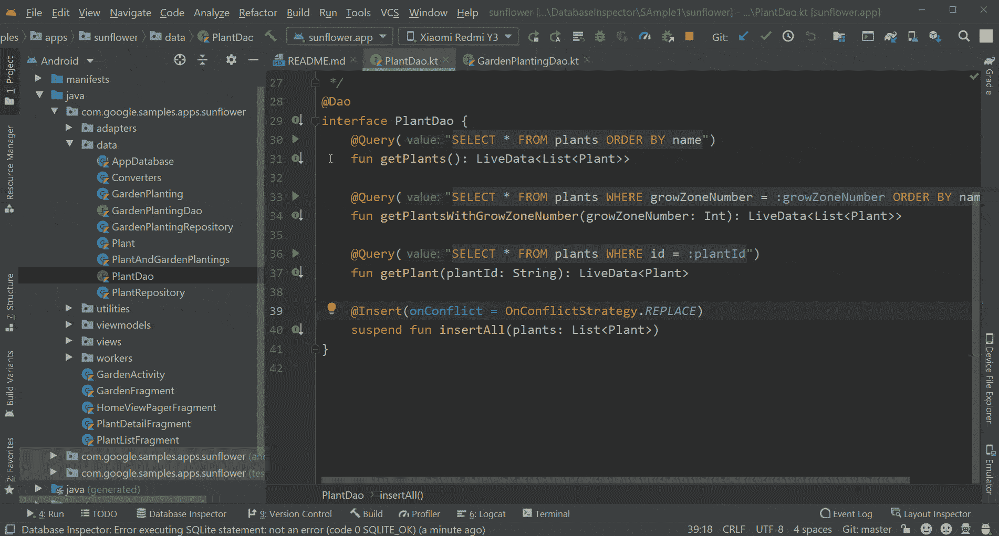
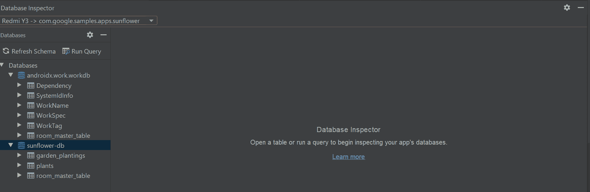
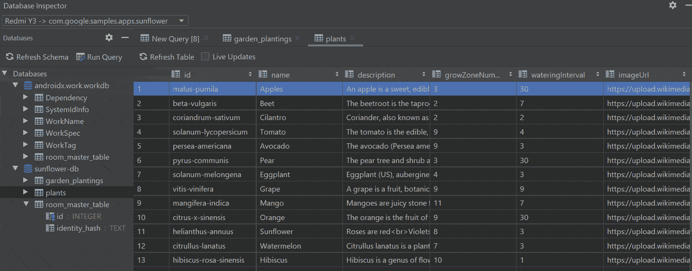
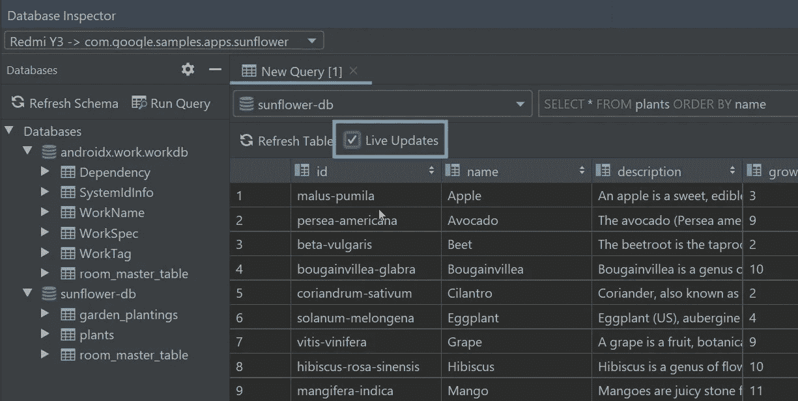

# 探索 Android Studio 中的数据库检查器

> 原文：<https://betterprogramming.pub/exploring-the-database-inspector-in-android-studio-de0026024895>

## Android 开发者期待已久的工具来了

丹尼斯·库默在 [Unsplash](https://unsplash.com?utm_source=medium&utm_medium=referral) 上拍摄的照片。

无论你使用的是 [SQLite](https://www.sqlite.org/index.html) 还是 [Room](https://developer.android.com/topic/libraries/architecture/room) 数据库，每个开发人员都需要一个工具来调试它。最近，Android Studio 的团队发布了一个新版本(Canary 4.1)，具有数据库检查器功能。请记住，它只是在 Canary 4.1 中引入的，因此仍处于早期阶段。

你可以从[这个链接](https://developer.android.com/studio/preview)安装金丝雀 4.1。此外，请记住，您可以在笔记本电脑上同时运行多个版本的 Android Studio(例如，用于专业开发的 Android Studio 稳定版本和探索数据库和布局检查器等即将推出的功能的金丝雀版本)。

# 调用数据库检查器

完成 IDE 设置后，下一步是打开一个具有本地数据库功能的项目。如果你没有任何带有本地 DB 的项目，那么使用[向日葵](https://github.com/android/sunflower) app。

打开项目后，在模拟器或设备中运行应用程序。然后打开数据库检查器，如下所示导航:

视图->工具窗口->数据库检查器

# 选择要调试的设备和数据库

单击数据库检查器后，studio 中会打开一个新窗口。首先，如果您将多个设备连接到系统，您必须选择设备。如果您的应用程序有多个数据库，那么您需要选择要调试的数据库。看一看:

数据库检查器

# 在数据库检查器中执行查询

这是令人兴奋的部分，通过执行查询，您可以在 database inspector 上看到本地 DB 中的数据。可以用两种方式执行它们——Dao 查询和使用 Run Query 选项的自定义查询。

## Dao 查询

我们实际上可以使用数据库检查器运行 Dao 函数并查看数据。当您调试时，这个特性很方便。当我们在调用数据库检查器后打开任何 Dao 类时，您将看到每个函数旁边的 Run 符号，以执行数据库检查器中的查询。看一看:

执行 Dao 查询

## 自定义查询

Android Studio 的团队非常注意在数据库检查器中涵盖基本需求。其中之一是运行定制查询的能力。这有助于以多种方式调试数据库，而无需在 Dao 中实际编写任何东西。看一看:

执行自定义查询

# 更新数据

如果你不能从检查器中更新数据，上面所有的功能都没有多大用处。因此，Android Studio 团队还包括了一种从 inspector 本身向数据库更改或添加数据的方法。如果使用 Room 并通过 livedata/flow 观察数据，您可以在几秒钟内看到设备中的变化。

该功能在调试时的许多情况下都很有用。假设我们有一个 10 个字符的植物名称，您想将长度增加到 40 个字符来检查 UI。在这个用例中，您可以直接从检查器中更新名称并检查 UI。

要更新数据，您只需双击字段并添加/删除数据。之后，按 Enter 键在数据库中更新它。看一看:

从检查器更新数据

# 实时更新

这是数据库和最近发布的布局检查器中我最喜欢的功能之一。有了这个功能，如果数据库中有任何更改，我们可以立即在检查器中看到它们。

要首先启用此功能，我们需要在数据库检查器中选择“实时更新”复选框。选中“实时更新”时，“数据库检查器”会自动显示您的应用程序对其数据库所做的任何更改。这个特性为数据库检查器带来了健壮的行为。

在数据库检查器中启用实时更新

# 结论

目前就这些。感谢阅读！希望你学到了有用的东西。