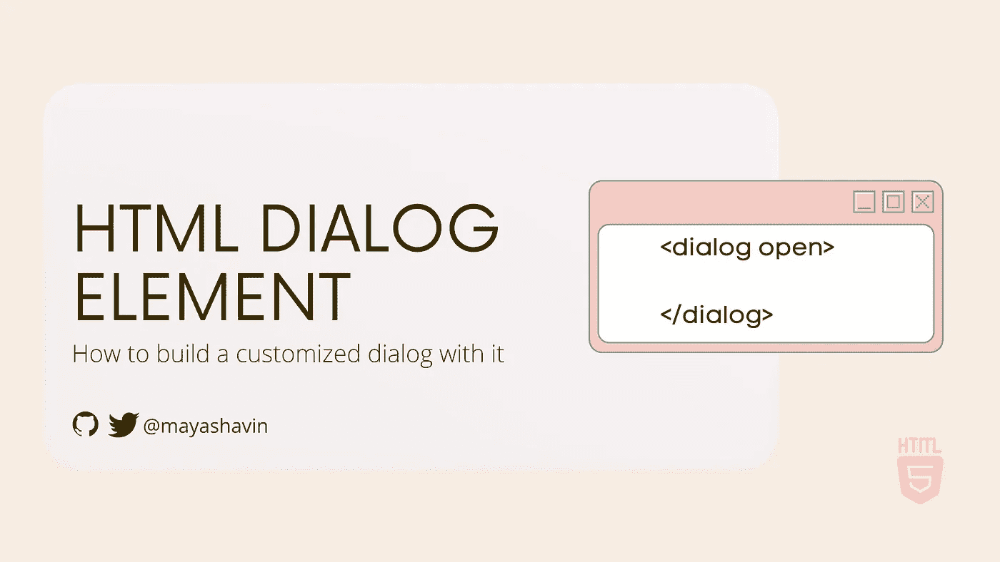
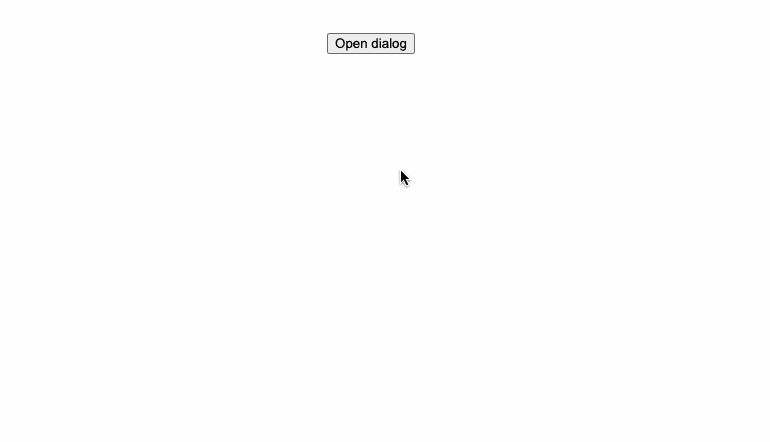
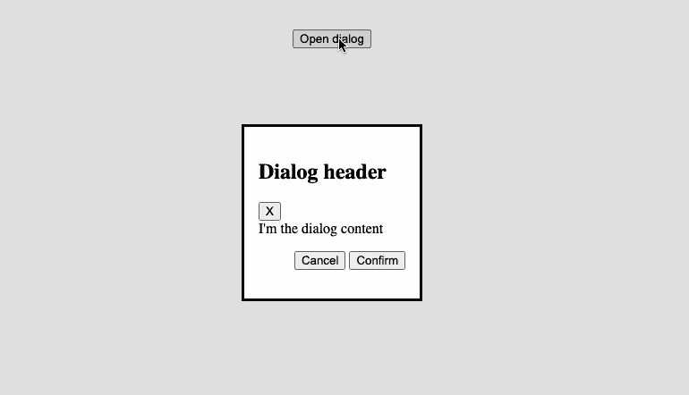
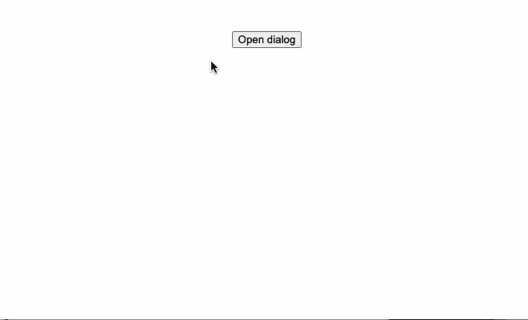
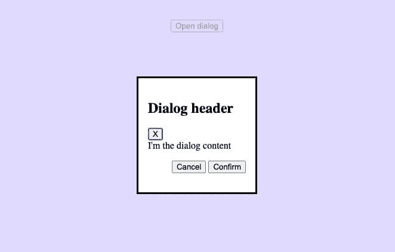
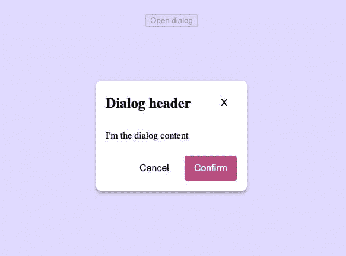

# Google I/O 2022 的新功能:探索 HTML 对话框元素

> 原文：<https://betterprogramming.pub/exploring-the-html-dialog-element-ee945503efe>

## 看看 web 平台的新更新



对话框和模态是任何 web 应用程序的基本组件。

尽管如此，使用现有的`div`元素为它创建和定义默认的行为逻辑仍然需要我们付出相当大的努力。

因此，我们通常以第三方对话框组件来结束这一天。

但是现在，我们有了`dialog`元素，根据[最新的 Google I/O 2022 对 Web 平台的更新](https://io.google/2022/program/3c60e411-5340-4c54-a037-3aceb2825b16/)，它现在被所有主流浏览器完全支持。

让我们来看看对话框元素，好吗？

# 介绍`dialog`元素

对话框元素`dialog`是一个非常新的 HTML5 元素，可以和`<dialog>`标记一起使用，如下例所示:

```
<dialog>
  <div>
    I’m a dialog!
  </div>
</dialog>
```

与其他 HTML5 元素不同，`dialog`元素带有内置的 API 和一些基本的 CSS 样式。根据设计，`dialog`元素有两种状态- *可见*(打开)或*隐藏*(关闭)，由单个属性`open`表示:

```
<dialog *open*>
  <div>
    This dialog is opened and visible!
  </div>
</dialog><dialog>
  <div>
    This dialog is hidden!
  </div>
</dialog>
```

`dialog`的初始状态为“*隐藏*”。`dialog`元素公开了以下 API 方法来控制其条件:

*   `showModal()` -通过将属性`open`设置为元素来打开对话框。它还添加了一个`::backdrop`伪元素来覆盖元素外部的内容，作为一种叠加效果。
*   `show()` -类似于`showModal`，但没有添加背景。该方法对于使用`dialog`作为 toast 通知非常有用。
*   `close(newReturnValue)` -通过删除`open`属性关闭对话框，如果有任何`newReturnValue`被传递，则更新`dialog`元素的`returnValue`。

有了上面给定的 API，接下来让我们实现一个简单的对话框。

# 创建简单的对话框

我们将创建一个包含三个部分的简单对话框:

*   `header`，它有一个对话框标题和一个取消按钮(带有一个 X 指示器)
*   `main`显示对话框所有内容的部分。在我们的例子中，它只是一个简单的字符串。
*   `footer`包含一个`menu`的动作按钮，如取消和确认按钮。

我们的对话框的草图如下:


对话框组件的示例草图

现在让我们将一个包含上述部分的`dialog`标记元素添加到一个`HTML`文件的`body`部分。`dialog`有一个值为`main-dialog`的`id`属性，如下所示:

```
<html>
  <body>
    <dialog *id*=”main-dialog”>
       <header>
         <h2>Dialog header</h2>
         <button>X</button>
       </header>
       <main>
         Dialog content
       </main>
       <footer>
         <menu>
           <button>Cancel</button>
           <button>Confirm</button>
         </menu>
       </footer>
     </dialog>
   </body>
</html>
```

接下来，我们向`body`添加一个`main`元素，该元素包含一个用于打开对话框的`button`:

```
<body> <main *id*=”app”> <button *id*=”open-dialog-btn”>Open dialog</button> </main> <dialog *id*=”main-dialog”> <!-dialog content--> </dialog></body>
```

在浏览器上运行 about 代码时，您将看不到对话框，因为默认情况下它是不可见的。我们需要使用`addEventListener`方法将`button`的`onclick`事件与`id`*open-dialog-BTN*绑定，如下所示:

```
//*1\. Query for open dialog button*const *openBtn* = *document.getElementById*(‘open-dialog-btn’);//*2\. Query for dialog element*const *dialog* = *document.getElementById*(‘main-dialog’);//*3\. Add event listener to open dialog on click**openBtn.addEventListener*(‘click’, () => { *dialog.showModal*();})
```

刷新浏览器，现在您可以看到无论何时单击*打开对话框*按钮，对话框都会打开:



一旦对话框打开，我们必须将其他菜单按钮和标题按钮绑定到适当的事件处理程序，并相应地关闭对话框。为此，我们将相关的`id`添加到`button`控件中:

```
<header> <h2>Dialog header</h2> <button *id*=”dialog-header--cancel-btn”>X</button></header><main> Dialog content</main><footer> <menu> <button *id*=”dialog-footer--cancel-btn”>Cancel</button> <button *id*=”dialog-footer--confirm-btn”>Confirm</button> </menu></footer>
```

然后查询并绑定这些按钮上的`click`事件来触发`dialog.close()`，如下所示:

```
//*1\. Query for the buttons*const *cancelBtn* = *document.getElementById*(‘dialog-footer--cancel-btn’);const *confirmBtn* = *document.getElementById*(‘dialog-footer--confirm-btn’);const *headerCancelBtn* = *document.getElementById*(‘dialog-header--cancel-btn’);//*2\. Bind to onclick event**cancelBtn.addEventListener*(‘click’, () => *dialog.close*());*confirmBtn.addEventListener*(‘click’, () => *dialog.close*());*headerCancelBtn.addEventListener*(‘click’, () => *dialog.close*())
```

我们现在拥有了完全可用的组件，如下例所示:



你猜怎么着，它内置了导航辅助功能！

# 使用`dialog`的可访问性

一旦对话框打开，浏览器将聚焦于第一个按钮(在这种情况下，是对话框标题上的关闭按钮)或对话框中任何具有`autofocus`属性的按钮。当您关闭对话框时，浏览器将焦点恢复到我们用来打开它的按钮上。

下面演示了导航键盘和焦点在对话框元素中的外观:



此外，对话框元素自动处理 ESC ( *escape* )键事件，从而减少了用户在使用对话框时为用户提供轻松体验所需的负担和工作量。

然而，如果你想在关闭和打开对话框时添加动画效果，注意你将会失去这个内置的特性支持，并且不得不自己实现标签导航焦点。

到目前为止，一切顺利吗？接下来，我们将看看如何使用对话框中的表单？

# 在对话框中使用表单

表单和对话框是用来协同工作的。对话框的一个普遍用例是接收用户输入的信息。例如订阅表单、提交表单等。

因此，`dialog`元素为`form`提供了内置支持。为了启用对话框和表单之间的连接，您将`form`元素的`method`属性设置为`dialog`，如下所示:

```
<dialog> <form *method*=’dialog’> </form></dialog>
```

通过这样做，触发任何表单的按钮元素(除了带有`type='reset"`的按钮)也会自动关闭对话框，而不是手动在每个按钮上绑定`close()`功能。

我们现在可以重构之前的示例对话框，用`method='dialog"`将所有部分包装在一个`form`下，并移除对话框按钮的所有点击事件监听器。最终代码应类似于以下内容:

```
<body> <main *id*=”app”> <button *id*=”open-dialog-btn”>Open dialog</button> </main> <dialog *id*=”main-dialog”> <form *method*=”dialog”> <header> <h2>Dialog header</h2> <button *id*=”dialog-header--cancel-btn”>X</button> </header> <main> Dialog content </main> <footer> <menu> <button *id*=”dialog-footer--cancel-btn”>Cancel</button> <button *id*=”dialog-footer--confirm-btn”>Confirm</button> </menu> </footer> </form> </dialog> <script> const *openBtn* = *document.getElementById*(‘open-dialog-btn’); //*Query for dialog element* const *dialog* = *document.getElementById*(‘main-dialog’); //*Add event listener to open dialog on click* *openBtn.addEventListener*(‘click’, () => { *dialog.showModal*(); }) </script></body>
```

该对话框的功能应该和以前一样。

很酷，对吧？如果您希望每当从对话框外部关闭对话框时触发额外的逻辑，该怎么办？为此，我们使用了一个`close`事件监听器。

# 监听对话的`close`事件

`dialog`有一个`close`事件，我们可以使用以下语法将事件处理程序附加到该事件:

```
*dialog.addEventListener*(‘close’, () => { //*your handler logic*})
```

每当对话框关闭时，都会触发该功能，您可以使用`data.returnValue`来决定用户是点击取消按钮还是提交按钮。为此，您需要向提到的按钮添加`value`属性，如下所示:

```
<menu> <button *value*=”cancel”>Cancel</button> <button *value*=”confirm”>Confirm</button></menu>
```

在`close`事件监听器逻辑中，您可以执行一个简单的检查:

```
*dialog.addEventListener*(‘close’, () => { if (*dialog.*returnValue === ‘cancel’) { //*do something* } else if (*dialog.*returnValue === ‘confirm) { //*do something* }})
```

**注意:**这里如果用户点击 ESC 键，`returnValue`不会有任何值。

至此，您已经熟悉了如何使用`dialog`及其 API。这个对话框带有基本的 CSS 样式，但是公平地说，它并没有我们想要的那么漂亮。

接下来，我们将对对话框外观进行一些必要的定制。

# 设置对话框样式

当使用`showModal()`方法打开对话框时，对话框会自动生成一个带有默认背景颜色的`::backdrop`元素。

我们可以使用选择器`::backdrop`来定制背景或者改变它的不透明度。例如，让我们将背景颜色更改为柔和的紫色(`#d2cbff`)，透明度为 70%:

```
#*main-dialog*::*backdrop* { background-color: #d2cbff; opacity: 0.7;}
```

对话框打开时的输出如下:



接下来，让我们改变对话框的边界，添加一些阴影，并使角落有点圆:

```
#*main-dialog* { box-shadow: 0 4px 5px rgb(0 0 0 / 30%); border-radius: 8px; border: 1px solid #fff;}
```

然后，我们使用 CSS Flexbox 将标题内容对齐到一行:

```
#*main-dialog* header { display: flex; gap: 2rem; justify-content: space-between; align-items: center;}#*main-dialog* headerh2 { margin-block: 0px;}
```

并为按钮添加一些 CSS 样式:

```
#*main-dialog* footermenu { display: flex; justify-content: flex-end; gap: 0.5rem; margin: 0;}#*main-dialog* button { padding: 0.75rem 1rem; background: none; font-size: 1rem; cursor: pointer; font-size: 1rem; border-radius: 5px; border: 1px solid white;}footer#*dialog-footer — confirm-btn* { background: #be4b80; color: white;}footer#*dialog-footer — cancel-btn*:*hover* { background: #f7f3f3;}#*dialog-header — cancel-btn* { height: fit-content;}
```

最后，对主`form`应用 CSS 网格以保持`header-content-footer`部分的布局:

```
#*main-dialog* form { display: grid; grid-template-rows: auto 1fr auto; grid-gap: 1.5rem;}
```

最终输出将如下所示:



就是这样！我们已经使用`dialog`元素创建了对话框，并使用 CSS Flexbox 和 Gridbox 对其进行了定制！

# 演示

演示代码可供尝试。

# 浏览器支持

好消息是谷歌最近宣布在除了 ie 浏览器之外的所有主流浏览器中全面支持 T5 及其 API。我们现在可以享受内置对话框元素的好处，并开始根据我们的需要定制它。太棒了，不是吗？

# 摘要

在这篇文章中，我们已经介绍了使用 HTML 和 DOM APIs 构建对话框组件的基础知识。我们还使用 CSS Flexbox 和 Gridbox 对对话框组件进行了一些定制。

有了`dialog`元素，在前端框架中构建一个可重用的对话框组件变得更加简单，开销也更小，尤其是在可访问性支持方面。您也可以使用相同的方法来创建一个模态或 Toast 通知组件。接下来，尝试使用`dialog`元素在你最喜欢的框架中制作一个对话框组件怎么样，比如 Vue 或者 React？应该很好玩吧！

```
**Want to Connect?**If you’d like to catch up with me sometimes, follow me on [Twitter](https://twitter.com/MayaShavin) | [Facebook](https://www.facebook.com/mayashavin/).Originally published at [https://mayashavin.com](https://mayashavin.com/articles/build-a-dialog-with-dialog-element).
```