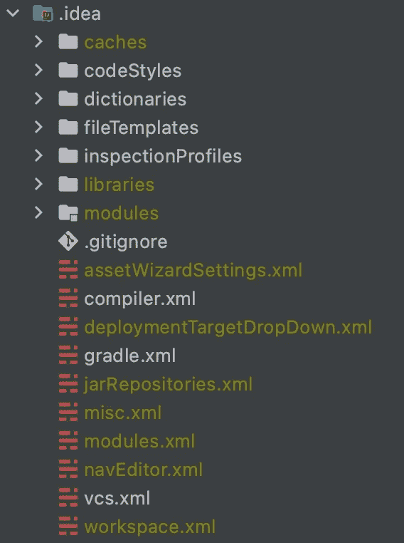

# 探索。Android 中的 idea 文件夹

> 原文：<https://betterprogramming.pub/exploring-the-idea-folder-790931c19191>

## 解开神秘的文件夹

什么时候忽略你一无所知的事情是好的？也许在某些特定的情况下，这种行为是可以接受的，比如在不了解发动机的情况下使用汽车。然而，当涉及到与你日常工作密切相关的工作方面时，一个更好的答案可能是“从不”

每当我开始一个新的 Android 或另一个基于 IntelliJ 的项目时，我通常会做的第一件事是将整个`.idea`文件夹放入我的`.gitignore`文件中，然后按照我的规范设置我的 IDE 和项目。我再也没想过我忽略了什么，因为我不知道那个文件夹里有什么。

我不知道如果我能更好地理解这个文件夹，并与我的队友分享，我可以节省多少时间，我可以为我的项目带来什么质量。从我的研究和现实世界的合作经历中，我对这个神秘的文件夹有了相当多的了解。在这篇文章的结尾，你会明白其中的哪些部分你可以分享，哪些部分你应该保密。

# 文件夹解剖学

确定一个`.idea`文件夹的确切结构有点困难，因为这通常是你的 IDE、插件和项目存储非代码相关信息的垃圾场。它的内容会因项目类型和 IDE 版本的不同而有很大差异。但是，其中有一组非常标准的核心文件和文件夹。这些项目将是本文的重点。

这是我的既定项目中的`.idea`文件夹的截图:

用于 [MyUPMC Android](https://go.oliverspryn.com/myupmc-android) 的`.idea`文件夹

在本文的其余部分，我们将探索这些文件和文件夹，以及它们是否应该进入您的存储库。即使你 100%不同意我的建议，你也会有必要的知识来为自己做出判断。

 [## Android 开发人员的 8 个提高生产力的 IntelliJ 捷径

### 太有用而不能忘记的捷径

better 编程. pub](/8-productivity-boosting-intellij-shortcuts-for-android-developers-e980c62ef9fa) 

# 要排除的文件

从 Git 存储库的角度来看，我建议忽略文件和文件夹的集合。请记住，这个列表是基于 Android Studio 项目的。如果您使用另一个 JetBrains IDE 或者构建一个非 JVM 项目，您的收获可能会有所不同。

## 🗂缓存

这个名字泄露了秘密。该文件夹的内容只与您的设置相关。根据这篇文章中的[，这个文件夹中的`build_file_checksums.ser`用于跟踪你的`.gradle`文件何时发生变化并需要 ide 同步。](https://go.oliverspryn.com/android-studio-idea-deep-dive)

出于任何原因，您都不能共享此文件夹及其内容。

## 🗂图书馆

这个文件夹保存了一堆 XML 文件，这些文件指向 Gradle 存储项目的`.jar`、`.aar`和每个依赖库的相关资源的位置。这些文件特定于您的`$USER_HOME`目录，并且通常在每个文件的文件夹路径中包含散列。

由于这些文件可以快速重建，依赖于您的机器，非常容易更改，并且可以从您的`build.gradle`文件中自动推断出来，因此没有理由将其同步到 Git。

## 🗂模块

像`libraries`文件夹一样，`modules`的内容也基于您的`build.gradle`文件。您可以将这里的文件看作是您的`.gradle`文件的 XML 表示。它包含了关于你当前构建风格、Gradle 版本、项目目录结构和依赖库的信息。

同样，由于这些文件可以根据现有信息快速构建，因此忽略它们是最佳选择。

## 💾assetWizardSettings.xml

根据这篇文章中的[，这个文件保存了您导入到 Android Studio 项目中的最后一个 vector 资产的信息。非常迷人。你的团队会迫不及待地想看到这一幕。](https://go.oliverspryn.com/android-studio-idea-deep-dive)

因为该文件引用了项目外部特定于您的计算机的路径，所以忽略它。

## 💾deploymentTargetDropDown.xml

Android Studio 使用这个文件来记住您在上次构建时选择了哪个 Android 虚拟设备(AVD)。

这些 AVD 名称和路径特定于您的设置，不可移植。

## 💾jarRepositories.xml

每当您向 Gradle 脚本添加新的存储库时，比如 Maven Central、JitPack 或 Google Maven，IntelliJ 都会在这里跟踪这些工件存储库。

此列表会在每次 Gradle 同步时为您更新，因此无需单独发布版本。

## 💾misc.xml

啊，我们遇到了 IntelliJ 的转储文件。将此发送给 Git 将是一场即将发生的灾难。也许最具破坏性的部分是您在项目中使用的所有特定于文件的缩放级别。

你的团队中没有其他人关心这些信息，不管怎样，这些信息只针对你自己。

## 💾modules.xml

这个文件有效地保存了一个列表，其中包含了`modules`目录中的所有相关文件。所以，既然那个目录被排除了，这个文件也应该被排除。

## 💾navEditor.xml

如果您使用 [Android 导航组件](https://go.oliverspryn.com/android-navigation-component)，这个文件将保存导航图文件的视觉外观，例如 X 和 Y 节点位置、节点类型和动作。

由于除自定义 XY 节点放置之外的所有内容都是从图形 XML 文件中生成的，因此没有必要对此进行同步。

## 💾workspace.xml

也许这个文件是所有需要*而不是*提交到您的存储库中的事物的典型代表。如果你这样做了，做好 WWIII 紧随其后的准备。它包含了与您的 IDE 安装和运行时相关的一切，比如面板的位置、打开的标签、单元测试覆盖图，以及关于您的 Git 存储库的信息。

说真的，不要包括这个。

 [## 如何使用 RxJava 设计复杂的 Android 应用程序启动

### 这种久经考验的方法比您想象的要简单

better 编程. pub](/how-to-design-complex-android-app-start-ups-using-rxjava-8e24aff27e93) 

# 要包含的文件

另一方面，有一些重要的文件要包含在您的存储库中。这不仅会使整个团队的项目设置更加一致，而且还有助于提高代码的质量。

## 🗂代码风格

在您的 Git 存储库中包含这个文件夹有很大的潜力来保持您的项目的编码标准的整洁和统一。如果您使用自定义代码样式或以任何方式配置您的 IDE 来以不同的方式格式化您的代码，这些规则将存储在此处。像是否在 Java 中使用`.*`导入这样精细的设置都保留在这些 XML 文件中。

如果你不把这个文件夹放在你的库中，你将会要求新成员总是配置他们的 IDE，或者如果有人忽略了，你的代码将会有不均衡的标准。如果您将它包含在您的存储库中，每个人的 IDE 都将根据您的标准自动配置，并随时更新。

## 🗂词典

每当您训练拼写检查器理解一个新单词时，这些值都存储在该文件夹下的一个 XML 文件中。这些文件基于您的用户名。所以，对于我的个人字典来说，应该是`oliverspryn.xml`。

这一条由你自己决定，但它无疑有助于保存项目中每个开发人员的字典。

## 🗂文件模板

如果您使用自定义文件模板，那么这些脚本存储在这里。例如， [MyUPMC Android](https://go.oliverspryn.com/myupmc-android) 有一个用于单元测试的样板模板，因为我们每个测试的开始是相同的。

包含此文件夹可确保每个人都可以访问您的模板文件。

## 🗂检查概况

该文件夹中的设置配置 IDE 如何检测和报告警告、潜在错误和信息性警报。如果您的项目有自定义警报规则，这里是它们的存储位置。例如，我们的项目将 Kotlin 中分号的警告级别提高到错误。

我建议包含这个文件夹，以便统一应用规则。

## 🗂运行配置和💾runConfigurations.xml

根据您使用的 IntelliJ 版本，自定义运行配置可能存储为文件夹中的几个文件，也可能完全存储在一个文件中。这种配置通常对 Android 没有价值，因为 IDE 会自动从`build.gradle`文件中推断出您的构建类型。但是，如果您有自定义的构建类型或者正在构建另一种需要您定义如何构建的项目，请保留这些类型。

保留这些文件将大大减少宝贵的安装时间。

## 💾compiler.xml

您的项目中发现的所有模块都存储在这里，以及构建它所需的 JDK。该文件对 Gradle 项目很有帮助，尤其是当您的机器上安装了多个版本的 JDK 时。例如，我们至少需要使用 JDK 11 来构建我们的项目，尽管我们大多数人都安装了 JDK 8。

保存这个文件有助于减少与构建依赖项的混淆，并为新开发人员在设置 IDE 时节省一些额外的步骤。

## 💾gradle.xml

该文件的用途与`compiler.xml`非常相似。出于同样的原因，我倾向于保留它们。

## 💾vcs.xml

这个文件告诉 IDE 您正在使用哪个版本控制系统。最有可能的是，如果您使用 Git，这些信息可以自动确定。保留这个文件完全取决于你。

 [## 5 个面向专业人士的 IntelliJ 插件

### 日常增强，使 IntelliJ 更容易、更友好、更快捷地使用

medium.com](https://medium.com/geekculture/5-intellij-plugins-for-pros-68388ca364b4) 

# 实践中的想法

将上面的列表提取到一个`.gitignore`文件后，看起来是这样的:

注意这个脚本是如何从焦土方法开始的。实际上一切都被排除了，包括`.iml` ( [模块级设置的存储](https://go.oliverspryn.com/iml))和`.xml`文件。然后，单独的文件和文件夹被慢慢添加回白名单。唯一不同于标准做法的是`fileTemplates`文件夹，它允许包含所有文件类型。

IntelliJ 使用 Apache Velocity 和 FreeMaker 作为模板语言。这些文件可能有多种文件扩展名，所以我选择包含这个文件夹中的所有文件，以避免遗漏任何文件。

 [## 编写完全单元可测试的 Android 应用程序

### 旅程始于项目的开始。

proandroiddev.com](https://proandroiddev.com/writing-a-fully-unit-testable-android-app-90cd0310f18f) 

# 结论

了解 IDE 如何存储其配置对我和我的团队在各种项目中都有极大的好处。我已经能够减少新员工所需的文档数量，实现编码标准的更大一致性，并在我们的项目中强制执行一组精心选择的自定义规则。

我要感谢 [Gahfy 的文章](https://go.oliverspryn.com/android-studio-idea-deep-dive)，它帮助我理解了这些文件背后的含义，我还要感谢 [GitHub 和 JetBrains 团队提供的样本。gitignore 文件](https://go.oliverspryn.com/jetbrains-ignore)。我将这些资源作为我的项目和这篇文章的跳板。

希望现在，你有更多的信心去解决你的问题。轻松实现创意文件夹。在成千上万的开发人员的生活中，他们经常扮演一个不被重视和误解的角色。现在你有了这个基本的理解，你可以利用它来成功。

# 喜欢你读的东西吗？

媒体上还有成千上万篇类似的文章。我是这个网站的付费会员，我完全认为这项投资是值得的。[点击这里加入](https://go.oliverspryn.com/medium-membership)，你将会用你的一部分会员资格来支持我的工作。

本文最初发表于[https://oliverspryn.com/](https://go.oliverspryn.com/exploring-the-idea-folder)。加入我的邮件列表。