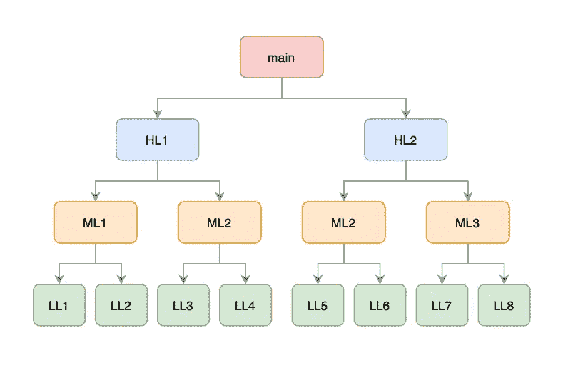
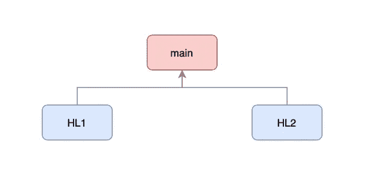
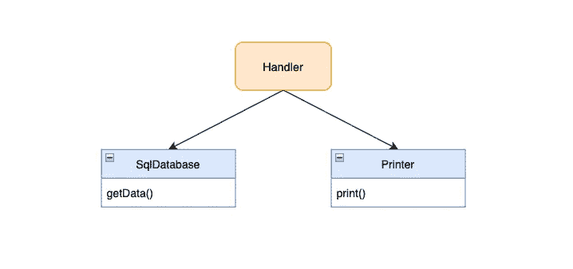
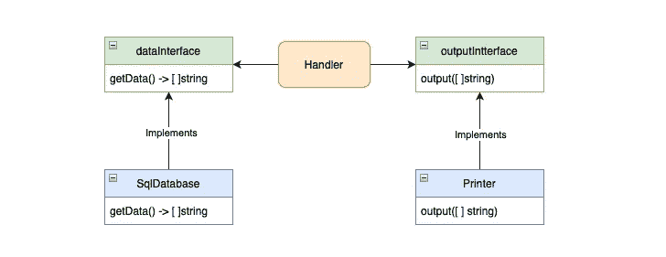
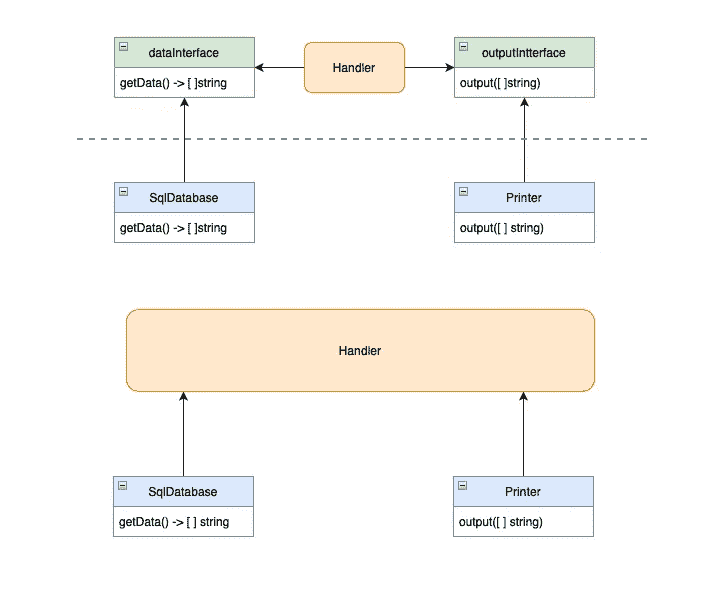

# 理解依赖倒置原则

> 原文：<https://betterprogramming.pub/exploring-the-most-commonly-used-design-principle-dependency-inversion-principle-f9a8401ab6fb>

## 细节并不重要


照片由[麦克·穆林斯](https://www.pexels.com/@mac-mullins-1319876/)在[像素](https://www.pexels.com/photo/close-up-photo-of-person-holding-lensball-2534487/)上拍摄

> 让一个程序运行起来并不需要大量的知识和技能——罗伯特·c·马丁

每个软件系统都提供两种价值，行为和结构。

开发人员的责任是确保软件不仅是可操作的，而且是干净的，可读的，容易修改的。

这就是坚实的原则派上用场的地方。它们是指导开发人员创造更好的设计和避免代码糟糕的灯塔。

*   单一责任原则
*   o:开闭原则
*   李:里斯科夫替代原理
*   I:界面分离原理
*   **D:依存倒置原则**

在本文中，我将带您了解最重要和最常用的原则之一——依赖倒置原则(DIP)。

# 什么是依赖？


由 [Tatiana Syrikova](https://www.pexels.com/@tatianasyrikova/) 在[像素](https://www.pexels.com/photo/anonymous-baby-holding-skirt-of-crop-woman-near-river-in-winter-countryside-3932883/)上拍摄的照片

在我们讨论下降之前，首先澄清一下什么是依赖是有好处的。

```
def funcA():
   funcB()
```

简单来说，如果`function A`调用`function B`，那么`function A`依赖`function B`。

每当`function B`变异的时候，`function A`就会容易发生变化，被迫重新编译。



一个典型的程序看起来如上。它从调用一些高级函数的`main`函数开始，然后是中级和低级函数。



简单来说，依赖反转就是**反转依赖方向**。

在我们深入研究如何做之前，让我们先讨论一下为什么要做这件事。

# 为什么蘸？

假设有一个应用程序查询 SQL 数据库并将数据输出到打印机。



处理程序查询数据，并通过调用 printer 函数输出数据。

这个程序乍一看似乎很好，但是如果我们想

*   从 SQL 数据库转换到 NoSQL 数据库？
*   将数据输出为 WhatsApp 消息而不是打印出来？

我们将不可避免地需要编辑处理程序中的函数调用，并改变部分逻辑以确保数据兼容性。

更糟糕的是，如果我们有很多调用这些函数的处理程序，我们将需要编辑它们！一个简单的需求给代码库带来了巨大的变化。

这就是 DIP 出手相救的地方。

处理程序应该只关心从某处的**检索数据，并将其输出到某处**的**。它应该对细节一无所知。**

细节不重要，就这样。

> *高层功能不应依赖于低层模块；两者都应该依赖于抽象。*

# 什么是 DIP？

如前所述，DIP 意味着颠倒依赖的方向。通过在调用者和被调用者之间增加一个**稳定抽象接口**来实现。



处理程序调用一个接口，而不是直接调用数据库或打印机。接口是一个策略，它定义了**方法签名**——参数和输出。

处理程序在不知道细节的情况下调用接口。它只关心**输入**和**输出**，而低级功能则负责细节和实现接口。



注意，反转不仅仅是关于依赖关系，它也是关于接口所有权的。高级功能定义了接口。

低级功能**的实现取决于**高级功能如何定义接口。因此，依赖性是颠倒的！

# 例子


由[卢卡斯](https://www.pexels.com/@goumbik/)在[像素](https://www.pexels.com/photo/blue-retractable-pen-574070/)上拍摄的照片

让我们深入一些代码片段，以便更好地理解什么是 DIP。

```
class SqlDb:
    def get(self):
        print("Getting data from sql db")def main():
    sqlDb = SqlDb() data = sqlDb.get()
```

如果没有 DIP，我们定义一个`SqlDb`类并在`main`中直接调用它。在这种情况下，`main`依赖于`SqlDb`。`SqlDb`的任何变化都可能要求`main`的变化。

在上面的例子中，我们定义了一个指定策略的抽象类— `DataInterface`。这意味着，类必须实现`get`函数才能成为`DataInterface`。

`SqlDb`和`NoSqlDb`都通过具有`get`功能来实现`DataInterface`。

`main`函数调用`getDataHandler`来获得一个`DataInterface`。它并不关心一只`dataHandler`是什么。它所关心的是，`dataHandler` 必须实现一个`get`函数并返回一组数据。

如果我们要切换到一个新的 DB，比如说`firebase`，我们只需要创建一个新的`Firebase`类，实现`get`函数，并在`getDataHandler`中替换它。`main`功能完全不受影响！

这通常也被称为**开闭原理**。

# 优势


由 [Rodnae Productions](https://www.pexels.com/@rodnae-prod/) 在[像素上拍摄的照片](https://www.pexels.com/photo/a-man-driving-a-camper-van-8230948/)

现在，蘸酱的好处对你来说应该是显而易见的。在结束这篇文章之前，让我们先来看看一些流行的观点。

# 细节上的变化不会影响业务逻辑

细节易变。我们可能会随时改变我们的数据库或输出的实施。

**接口比实现更不稳定**。

实现的改变不一定需要接口的改变。

因此，我们可以在实现中添加更多的功能，而不会影响调用它们的业务逻辑。

# 推迟关于细节的决定

DIP 允许业务逻辑对细节一无所知。因此，它为我们以后实现细节提供了更多的时间。

我们等待做出这些决定的时间越长，我们就有越多的信息来做出正确的决定！

> *一个好的建筑师会最大化没有做出的决定的数量——罗伯特·c·马丁*

通过一个接口，我们可以通过暂时使用本地存储来推迟我们的数据库选择。将来可以在不影响业务逻辑的情况下更改实现。

好的架构师设计政策，以便关于细节的决策可以尽可能长时间地推迟和延期。

# 结论

关于依赖倒置原则就是这样！在我看来，这是 5 个坚实原则中最重要和最基本的概念之一。

我希望这篇文章对你有所帮助，我们下次再见，再见！

> 干净的代码总是看起来像是由关心它的人写的——罗伯特·c·马丁