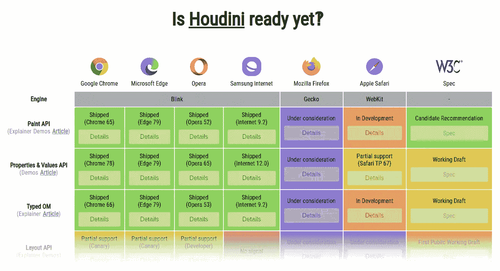
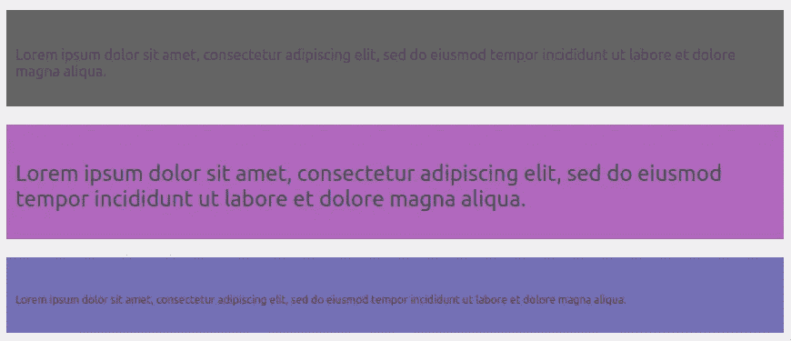
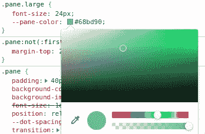
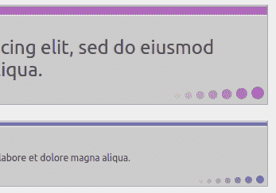

# 探索新的 CSS 胡迪尼绘画 API

> 原文：<https://betterprogramming.pub/exploring-the-new-css-houdini-painting-api-3f641bfce614>

## 与浏览器渲染引擎的样式和布局流程挂钩的低级 API



来源:ishoudinireadyyet.com

*注:本文后半部分讨论的演示的源代码可以在* [*GitLab*](https://gitlab.com/gvanderput/css-houdini-drawing-api) *上找到。*

# 介绍

正如我在最近一篇关于 React 组件内 [canvas 动画的文章中提到的，我*喜欢* HTML canvas。因此，当我读到一篇由 Stephen Fulghum 撰写的关于 css-tricks.com 的短文时，我对新的 CSS Houdini APIs 感到无比兴奋。](https://gerardvanderput.medium.com/canvas-animation-inside-react-components-with-requestanimationframe-c5d594afc1b)

我感到兴奋的主要原因是，绘画 API 使得通过在 PaintRenderingContext2D 上绘画来创建*自定义 CSS 图像*成为可能(这几乎是我们使用常规 Canvas API 时在其上绘画的 2D 上下文的精确副本——除了一小部分功能)。

通过使用绘画 API，我们可以以编程方式绘制图像，并在 CSS 中使用这些图像。在绘图时，我们可以接收来自 DOM 和应用样式表的参数信息。

MDN 网络文档[这样描述](https://developer.mozilla.org/en-US/docs/Web/Houdini):

> Houdini 是一组低级 API，公开 CSS 引擎的部分内容，使开发人员能够通过挂钩浏览器渲染引擎的样式和布局过程来扩展 CSS。

我觉得这非常令人兴奋，尤其是因为我们看到所有主流浏览器都在实现这一点:

[](https://ishoudinireadyyet.com) [## 胡迪尼准备好了吗？

### 版本 Opera 52。发布日期:2018 . 3 . 22 Notes 调试(即断点)不起作用。不支持“paint()”…

ishoudinireadyyet.com](https://ishoudinireadyyet.com) 

我们将在本文中了解一下 [CSS 绘画 API](https://developer.mozilla.org/en-US/docs/Web/API/CSS_Painting_API) (以及[小工具](https://developer.mozilla.org/en-US/docs/Web/API/Worklet))。

**重要提示** : *CSS Houdini 总体来说还是一个实验性的技术。但是如前所述，大多数浏览器* [*正在实现它*](https://ishoudinireadyyet.com/) *或者正在强烈考虑实现它。谷歌 Chrome 是一个早期的适配器，从 65 版开始支持绘画 API，所以这是我们今天将使用的浏览器。*

# *CSS Painti* ng API

通过使用这个 API，我们可以以编程方式绘制图像，并在我们的 CSS 中使用这些图像。这就是我们将要创造的:


令人印象深刻的是，这是三个 DIV 元素，而*三个 DIV 元素只有*。

我们在 index.html 的档案就是证据:

三个窗格背景的“样式化”(绘图…)是通过绘画 API 以编程方式完成的。所有三个窗格都是由同一个函数绘制的。

让我们看看样式表中的 CSS 类`pane`:

我们*在第 2 行给*涂上叫做*窗格*的东西。这需要解释，我们很快就会看到。

值得注意的是，paint 函数并不是只执行一次。每当浏览器的渲染引擎发出指令时，它就会执行并重新绘制图像。例如，当用户调整浏览器窗口大小时，或者当 DIV 元素的其他 CSS 属性发生变化时，DIV 元素会获得另一个维度。

由于我们的功能将“挂钩”到渲染引擎，这是一个非常高性能和低成本的操作。

除此之外，值得一提的是，我们所有的窗格都有不同的字体大小(记住这一点，我们稍后将再次引用它)。我们看到使用了两个自定义 CSS 变量:

*   `‑‑dot‑spacing`
*   `‑‑pane‑color`

CSS 变量并不新鲜。它们自 2014/2016 年以来一直存在(分别为。火狐/谷歌 Chrome)。但是一个新的 CSS 胡迪尼 API 叫做 [CSS 属性和值 API](https://developer.mozilla.org/en-US/docs/Web/API/CSS_Properties_and_Values_API) 允许我们*注册*这些自定义变量，这样浏览器*将会知道更多关于它们的信息，*这将会派上用场。

在样式表中，我们可以这样注册它们:

*注意，我们也可以在 JavaScript* *中完成这个* [*。结果会是一样的。*](https://developer.mozilla.org/en-US/docs/Web/API/CSS_Properties_and_Values_API)

那么我们为什么要这样做呢？现在我们的浏览器和它的渲染引擎知道了这些属性的细节。它知道`‑‑pane‑color`包含一个*颜色值*，默认值是“#646464”。并且`‑‑dot‑spacing`包含一个*长度值*，默认为“5px”

我们的两个新变量现在被称为*注册定制变量*。

回到这行:

```
background-image: paint(pane);
```

绘画 API 允许我们绘制图像。`paint`函数接收一个参数。这个参数是一个 *JavaScript 类*，它在一个名为`worklet.js`的文件中注册为 *Paint* :

但是！这段代码不能在我们常规的 JavaScript 执行环境中执行。它需要在一个所谓的——因此文件名为——[*的工作小程序*](https://developer.mozilla.org/en-US/docs/Web/API/Worklet) *:* 中执行

> “Worklet 接口是 Web Workers 的一个轻量级版本，允许开发人员访问渲染管道的低级部分。借助 Worklets，您可以运行 JavaScript 和 WebAssembly 代码，在需要高性能的地方进行图形渲染或音频处理。”

我们可以通过向我们的常规 JavaScript 文件(`main.js`)中添加下面一行来确保工作小程序将被执行，该文件是在 index.html 内部加载的，如下所示:

```
// main.js
CSS.paintWorklet.addModule("worklet.js");
```

如果该调用返回错误，则您的浏览器不支持绘画 API。

现在，我们的 Paint 类“pane”以“Pane”的名称注册，我们可以在 CSS 中使用它，正如我们前面看到的:

```
background-image: paint**(pane)**;
```

## “绘制类别”窗格的详细信息

让我们看看 worklet.js 中的 Paint 类的细节:

静态函数`inputProperties`应该返回我们在绘制图像时感兴趣的 CSS 属性列表。这是任意的，你可以添加任何你想要的 CSS 属性。

由`contextOptions`返回的值表明我们希望能够在画布中使用透明度。

最后，在第 10 行，是`paint`函数。在该函数中，我们将进行实际的绘制。在我们的例子中，它接收三个参数:

1.  `ctx`:我们画布上的 2D 背景。如果您熟悉常规的 HTML Canvas 元素，这应该会让您想起什么。
2.  `size`:一个 *PaintSize* 实例，有两个属性:`.width`和`.height`。这些是我们为其绘制图像的 HTML 元素的计算尺寸。包括填充，如果设置的话。
3.  `styleMap`:*CSS 声明块* ( [源](https://developer.mozilla.org/en-US/docs/Web/API/StylePropertyMapReadOnly))的只读表示。它是一个`StylePropertyMapReadOnly`的实例，只包含我们在静态函数`inputProperties`中定义的属性值。

有关最后一个参数的更多细节，您可以阅读关于 [CSS 类型化对象模型 API](https://developer.mozilla.org/en-US/docs/Web/API/CSS_Typed_OM_API/Guide) 和/或关于[StylePropertyMapReadOnly](https://developer.mozilla.org/en-US/docs/Web/API/StylePropertyMapReadOnly)接口的内容。

***提示:*** *在支持的浏览器中，通过调用 computedStyleMap，可以获得 DOM 中任何 HTML 元素的完整 StylePropertyMapReadOnly(包含所有计算的 CSS 样式):*

```
const styleMap =
  document.getElementById('myElement').computedStyleMap();
```

为了阐明我们如何从这样的实例中检索值，我创建了一个带有一些行内注释的代码片段:

# 画出真实的图像

回到我们的小演示的逻辑。唯一剩下的就是我们的 paint 函数体的内容了。

我们可以从简单地绘制一个填充的矩形作为背景图像开始(您应该认识到在常规 HTML 画布上绘制的命令):

…看起来像这样:



绘制背景图片！

注意我们如何使用自定义 CSS 属性`‑‑pane‑color`来动态设置填充样式。

通过使用我们浏览器的开发工具，我们甚至可以更新颜色值，背景图像将立即重新绘制！



谷歌浏览器开发工具，颜色选择器。

如果我们用一些更奇特的逻辑更新我们的 paint 函数(你可以在库的 [worklet.js 文件中查看细节)，我们的背景图像将看起来像这样:](https://gitlab.com/gvanderput/css-houdini-drawing-api/-/blob/master/worklet.js)


# CSS 过渡

注意右下角的*点序列*。这些点之间的间距由自定义 CSS 属性`‑‑dot‑spacing`的值决定，默认值为“5px”

让我们通过给这个属性添加一个过渡来增加一点乐趣。当我们将鼠标悬停在`.pane`元素上时，我们还会增加点间距的值:

…悬停元素时会产生平滑的动画效果:



它展示了我们定制的*绘制函数*的性能，它每秒钟可以运行 60 多次。

我们能够向自定义 CSS 变量添加过渡的原因是我们之前已经注册了该属性(参见要点中的第 1–5 行)。

***提示:*** *我们还可以为我们的自定义 CSS 属性添加一个无限的 CSS 动画，这将导致我们有一个自定义绘制的动画背景！*

# 结论

我发现胡迪尼绘画 API 不仅有趣，而且易于理解和强大(表演)。我满脑子都是使用这一新功能的想法，但我必须耐心等待，直到所有主流浏览器都支持它，然后我们才能考虑在生产中使用它。

感谢您的宝贵时间！