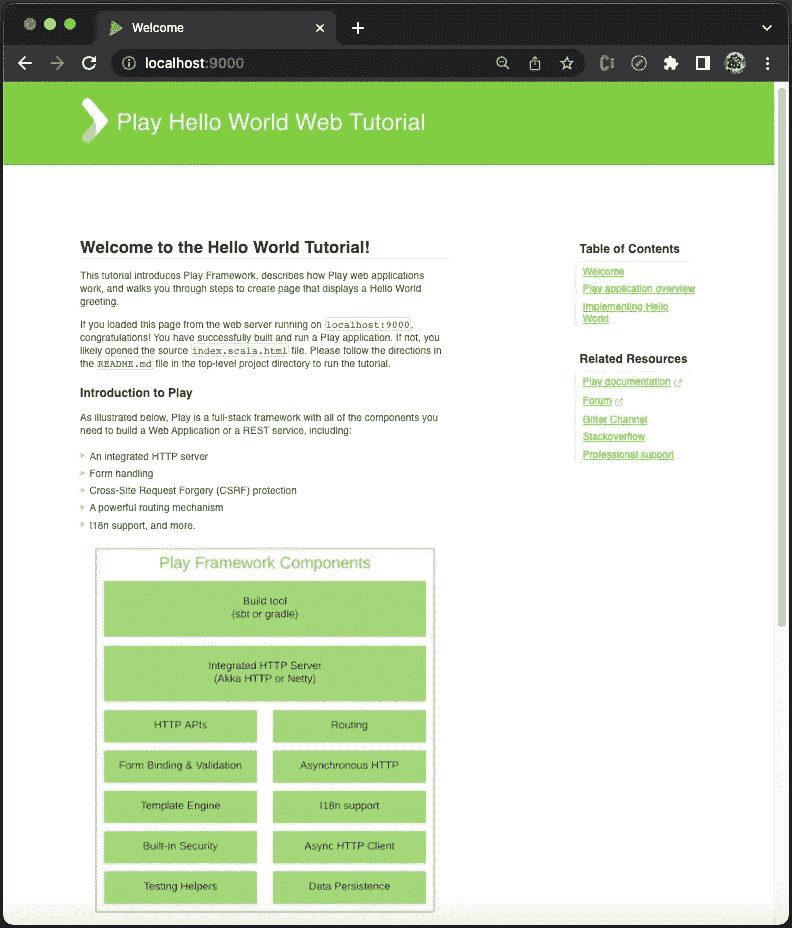
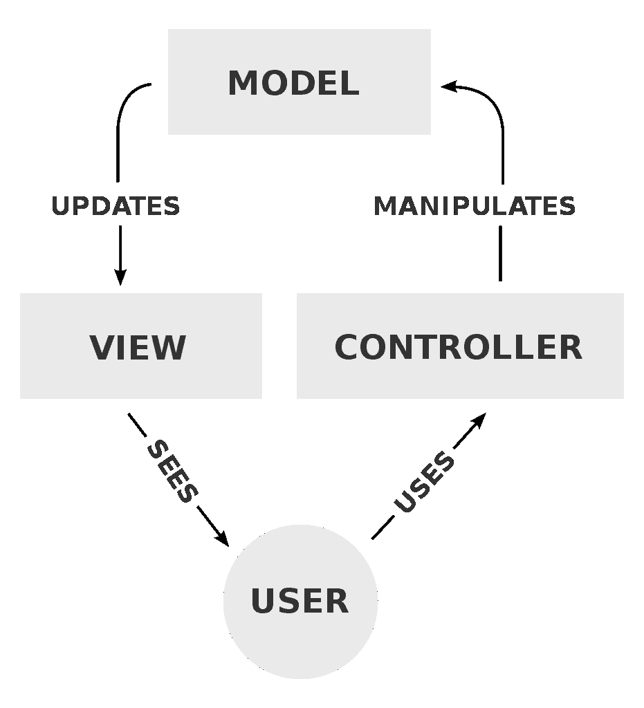
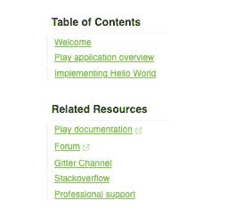
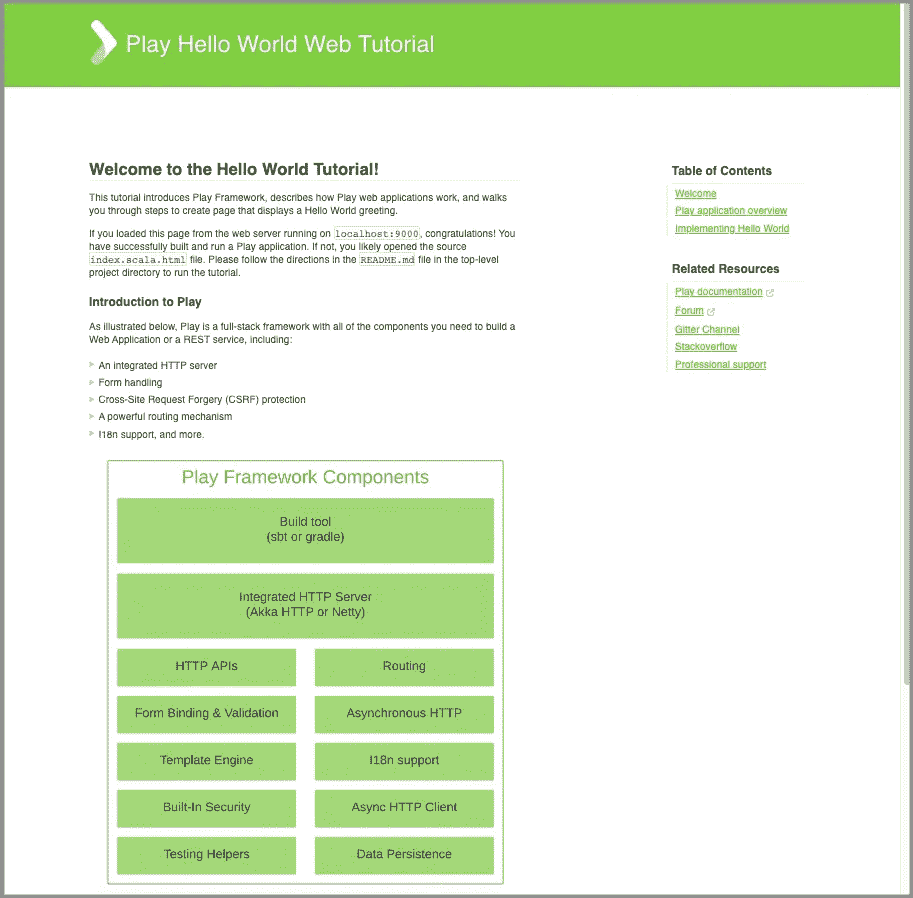
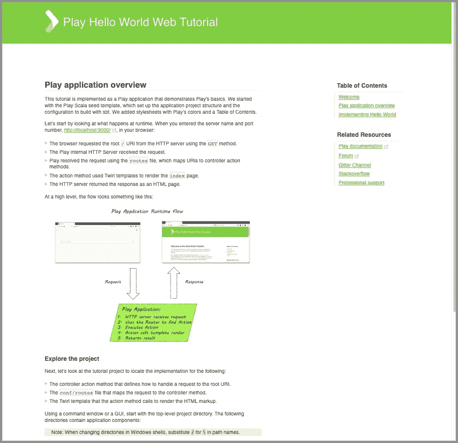
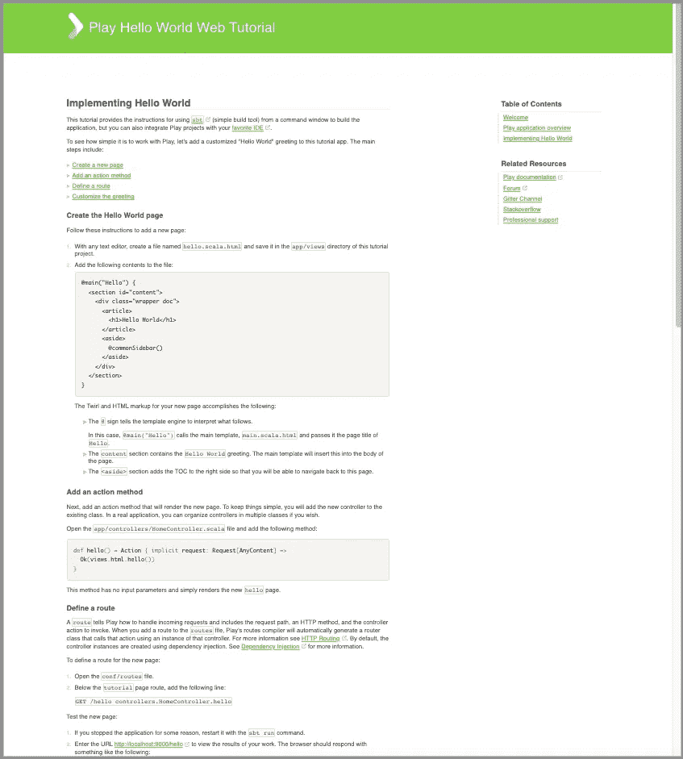
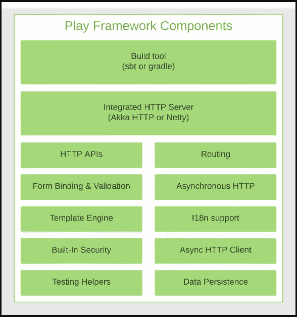
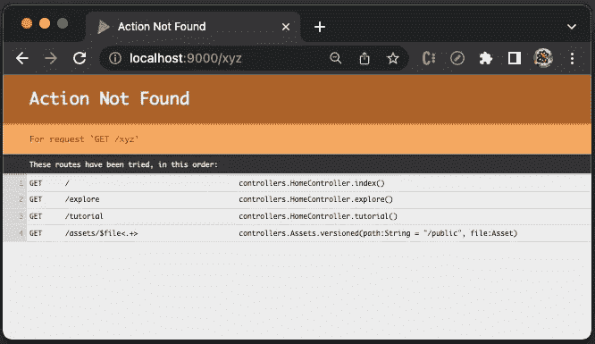

# 使用 Twirl 模板探索 Play Web 框架

> 原文：<https://betterprogramming.pub/exploring-the-play-web-framework-with-twirl-templates-5b4eaec2f622>

## 非 JavaScript web 框架初探


照片由[蒙蒂·廷帕诺斯](https://unsplash.com/@monti_0325?utm_source=medium&utm_medium=referral)在 [Unsplash](https://unsplash.com?utm_source=medium&utm_medium=referral) 拍摄

Scala 是一种强大的静态类型通用编程语言，支持面向对象和函数式编程。 [Play](https://www.playframework.com/) 是一个用 Scala 和 Java 构建 web 应用的 web 框架。Play 附带了 [Twirl](https://github.com/playframework/twirl) ，这是一个基于 Scala 的模板引擎，它有以下优点:

*   紧凑、富于表现力、流畅:它最大限度地减少了文件中所需的字符数和击键数，实现了快速、流畅的编码工作流程。
*   简单易学:除了 Scala 结构和 HTML 知识之外，它只需要学习最少的概念。
*   不是新语言:它只是 Scala + HTML。
*   可在任何文本编辑器中编辑:一个简单的编辑器应该足以提高编码效率。

Play 是非 JavaScript web 框架，是[服务器端渲染](https://medium.com/javascript-in-plain-english/a-hands-on-guide-for-a-server-side-rendering-react-18-app-4e630aae274c)。我们将探索 Play web 应用程序是如何工作的。

# 设置游戏环境

[Lightbend Tech Hub](https://developer.lightbend.com/start/?group=play) 提供可下载的 Java 和 Scala 游戏示例。通过实例学习是让环境立即准备就绪的有效方法。

这是下载示例`Play Scala Hello World`的[链接](https://example.lightbend.com/v1/download/play-samples-play-scala-hello-world-tutorial)。将下载的文件`play-samples-play-scala-hello-world-tutorial.zip`解压到本地目录。

玩需要 Java 和`sbt`，有一些版本要求:

*   Java 软件开发工具包(SE) 1.8 或更高版本，可以在这里[下载。](http://www.oracle.com/technetwork/java/javase/downloads/index.html)
*   `sbt` 1.3.4 或更高版本，包含在 zip 文件中。或者，也可以在这里下载[。](http://www.scala-sbt.org/download.html)

`sbt`是一个面向 Scala、Java 等的交互式构建工具。它运行在 JVM 上。

检查版本，确保合格的 Java 和`sbt`。

```
% pwd
/Users/jenniferfu/play-samples-play-scala-hello-world-tutorial
```

```
% java --version 
openjdk 11.0.11 2021-04-20
OpenJDK Runtime Environment AdoptOpenJDK-11.0.11+9 (build 11.0.11+9)
OpenJDK 64-Bit Server VM AdoptOpenJDK-11.0.11+9 (build 11.0.11+9, mixed mode)% sbt --version
sbt version in this project: 1.7.2
sbt script version: 1.6.2
```

执行`sbt run`:

```
% sbt run
[info] welcome to sbt 1.7.2 (AdoptOpenJDK Java 11.0.11)
[info] loading project definition from /Users/jenniferfu/play-samples-play-scala-hello-world-tutorial/project/project
[info] loading settings for project play-samples-play-scala-hello-world-tutorial-build from plugins.sbt,scaffold.sbt ...
[info] loading project definition from /Users/jenniferfu/play-samples-play-scala-hello-world-tutorial/project
[info] loading settings for project root from build.sbt ...
[info]   __              __
[info]   \ \     ____   / /____ _ __  __
[info]    \ \   / __ \ / // __ `// / / /
[info]    / /  / /_/ // // /_/ // /_/ /
[info]   /_/  / .___//_/ \__,_/ \__, /
[info]       /_/               /____/
[info] 
[info] Version 2.8.18 running Java 11.0.11
[info] 
[info] Play is run entirely by the community. Please consider contributing and/or donating:
[info] https://www.playframework.com/sponsors
[info] 
```

```
--- (Running the application, auto-reloading is enabled) ---[info] p.c.s.AkkaHttpServer - Listening for HTTP on /0:0:0:0:0:0:0:0:9000(Server started, use Enter to stop and go back to the console...)
```

该示例可在`[http://localhost:9000](http://localhost:9000.)` [通过浏览器访问。](http://localhost:9000.)



作者图片

工作流程如下:

1.  浏览器使用`GET`方法从 HTTP 服务器请求根`/` URI。
2.  播放内部 HTTP 服务器接收请求。
3.  Play 使用`routes`文件解析请求，该文件将 URIs 映射到控制器动作方法。
4.  action 方法呈现`index`页面，这是一个 Twirl 模板。
5.  HTTP 服务器以 HTML 页面的形式返回响应。

# 模型-视图-控制器架构

一个 Play 应用采用[模型-视图-控制器(MVC)](https://en.wikipedia.org/wiki/Model%E2%80%93view%E2%80%93controller) ，这是一种开发用户界面(ui)常用的软件架构模式。



图片来自[https://commons.wikimedia.org/wiki/File:MVC-Process.svg](https://commons.wikimedia.org/wiki/File:MVC-Process.svg)

*   模型是模式的中心部分。它是应用程序的动态数据仓库，独立于 UI。
*   视图是由页眉、页脚、侧栏、内容视图和/或其他组件组成的信息的任何表示。
*   控制器接受输入并将其转换为模型或视图的命令。

# 播放应用程序源代码树

解压缩后的`play-samples-play-scala-hello-world-tutorial`看起来是这样的:

```
play-samples-play-scala-hello-world-tutorial
├── README.md
├── .g8
├── app
│   ├── controllers
│   └── views
├── conf
├── logs
│   └── application.log
├── project
├── public
│   ├── images
│   ├── javascripts
│   └── stylesheets
├── sbt-dist
├── scripts
│   └── test-sbt
├── target
├── build.sbt
├── sbt
└── sbt.bat
```

*   `play-samples-play-scala-hello-world-tutorial`:播放应用的项目目录。
*   `README.md`:描述项目需求和执行步骤的自述文件。
*   `.g8`:是 Scala 中生成播放项目种子的模板`[play-scala-seed.g8](https://github.com/playframework/play-scala-seed.g8)`生成的目录。这个模板已经被用来制作这个项目。
*   `app`:它是包含 MVC 代码的目录，所有可执行工件都驻留在这里，包括 Java 和 Scala 源代码、模板和编译资产的源代码。对于这个例子，它包含两个包，`controllers`和`views`。如果有外部数据仓库，可以添加`models`包。此外，还可以添加`service`包和`utils`。
*   `conf`:包含应用配置的目录，包括`routes`。
*   `logs`:包含日志的目录，其中`application.log`是默认的日志文件。
*   `project`:包含`sbt`配置文件的目录。
*   `public`:web 服务器直接服务的静态资产目录。有三个子目录:`images`、`javascripts`和`stylesheets`。
*   `sbt-dist`:包含分布式`sbt`的目录。
*   `scripts`:包含`sbt`脚本的目录，其中`test-sbt`脚本使用`sbt`执行测试。
*   `target`:包含生成代码和 API 文档的目录。
*   `build.sbt`:它是一个构建脚本，使用指定的插件(第 2 行)和设置(第 3–17 行)执行当前目录中的项目(下面的第 1 行)。通常的做法是声明项目的惰性加载(第 1 行)。

*   `sbt`:调用分布式`sbt`脚本的可执行文件，600+行代码。

```
#!/usr/bin/env bash
```

```
./sbt-dist/bin/sbt "$@"
```

以下是`sbt`的用法:

```
Usage: `basename "$0"` [options]
```

```
 -h | --help         print this message
  -v | --verbose      this runner is chattier
  -V | --version      print sbt version information
  --numeric-version   print the numeric sbt version (sbt sbtVersion)
  --script-version    print the version of sbt script
  -d | --debug        set sbt log level to debug
  -debug-inc | --debug-inc
                      enable extra debugging for the incremental debugger
  --no-colors         disable ANSI color codes
  --color=auto|always|true|false|never
                      enable or disable ANSI color codes      (sbt 1.3 and above)
  --supershell=auto|always|true|false|never
                      enable or disable supershell            (sbt 1.3 and above)
  --traces            generate Trace Event report on shutdown (sbt 1.3 and above)
  --timings           display task timings report on shutdown
  --sbt-create        start sbt even if current directory contains no sbt project
  --sbt-dir   <path>  path to global settings/plugins directory (default: ~/.sbt)
  --sbt-boot  <path>  path to shared boot directory (default: ~/.sbt/boot in 0.11 series)
  --ivy       <path>  path to local Ivy repository (default: ~/.ivy2)
  --mem    <integer>  set memory options (default: $sbt_default_mem)
  --no-share          use all local caches; no sharing
  --no-global         uses global caches, but does not use global ~/.sbt directory.
  --jvm-debug <port>  Turn on JVM debugging, open at the given port.
  --batch             disable interactive mode # sbt version (default: from project/build.properties if present, else latest release)
  --sbt-version  <version>   use the specified version of sbt
  --sbt-jar      <path>      use the specified jar as the sbt launcher # java version (default: java from PATH, currently $(java -version 2>&1 | grep version))
  --java-home <path>         alternate JAVA_HOME # jvm options and output control
  JAVA_OPTS           environment variable, if unset uses "$default_java_opts"
  .jvmopts            if this file exists in the current directory, its contents
                      are appended to JAVA_OPTS
  SBT_OPTS            environment variable, if unset uses "$default_sbt_opts"
  .sbtopts            if this file exists in the current directory, its contents
                      are prepended to the runner args
  /etc/sbt/sbtopts    if this file exists, it is prepended to the runner args
  -Dkey=val           pass -Dkey=val directly to the java runtime
  -J-X                pass option -X directly to the java runtime
                      (-J is stripped)
  -S-X                add -X to sbt's scalacOptions (-S is stripped)In the case of duplicated or conflicting options, the order above
shows precedence: JAVA_OPTS lowest, command line options highest.
@JenniferFuBook

Add heading textAdd bold text, <Cmd+b>Add italic text, <Cmd+i>
Add a quote, <Cmd+Shift+.>Add code, <Cmd+e>Add a link, <Cmd+k>
Add a bulleted list, <Cmd+Shift+8>Add a numbered list, <Cmd+Shift+7>Add a task list, <Cmd+Shift+l>
Directly mention a user or team
Reference an issue or pull request
Leave a comment
```

*   `sbt.bat`:它是一个可执行文件，调用分布式`sbt`的启动器脚本，有 900 多行代码。

```
@REM SBT launcher script
```

```
.\sbt-dist\bin\sbt.bat %*
```

# 播放应用程序控制器

控制器基于工作流管理 MVC 应用程序。它接受输入并将其转换为模型或视图的命令。游戏中的控制器只不过是一个生成`Action`值的对象。播放控制器通常被定义为类，以利用依赖注入。

`app/controllers`是控制器的推荐目录。开箱即用，控制器一个，`HomeController.scala`。

```
controllers
└── HomeController.scala
```

这里是`app/controllers/HomeController.scala`:

*   在第 1 行，通过在 Scala 文件的顶部声明来创建包`controllers`。将包命名为包含 Scala 文件的目录会很方便。然而，Scala 与文件布局无关。
*   在第 3 行，它导入包中的所有东西，`javax.inject`。`javax`是 JRE 扩展的命名约定。上面的代码是 Scala 2 语法:`import javax.inject._`。在 Scala 3 中，它会被写成`import javax.inject.*`。
*   在第 4 行，它导入包中的所有内容，`play.api`。
*   在第 5 行，它导入包中的所有内容，`play.api.mvc`。
*   在第 11–33 行，它创建了一个带有单例符号的类(第 11 行)。它通过扩展`AbstractController`(第 12 行)为`Action`调用惯用的 Play API。该控制器为三条路线定义了三个动作，`index` ( `/`)、`explore` ( `/explore`)和`tutorial` ( `/tutorial`)。
*   在第 21–23 行，它定义了一个返回`Ok(views.html.index())`的`Action`方法。它生成一个由`views`中的 Twirl 模板`index.scala.html`定义的 HTML 页面。
*   在第 25–27 行，它定义了一个`Action`返回`Ok(views.html.explore())`的`explore`方法。它生成一个由`views`中的 Twirl 模板`explore.scala.html`定义的 HTML 页面。
*   在第 29–31 行，它定义了一个返回`Ok(views.html.tutorial())`的`tutorial`方法。它生成一个由`tutorial.scala.html`定义的 HTML 页面，一个`views`中的 Twirl 模板。

# 播放应用程序视图

视图为浏览器产生一个响应。它从模型中接收数据，并将其呈现给浏览器进行显示。它可以是路线的整体视图，也可以是组成整体视图的子视图。

`app/views`是视图的推荐目录。开箱即用，有几个视图文件被写成带有`.scala.html`扩展名的 Twirl 模板。

```
views
├── main.scala.html
├── commonSidebar.scala.html
├── index.scala.html
├── explore.scala.html
└── tutorial.scala.html
```

`main.scala.html`渲染了`head`和`body`。它需要两个参数，一个用于页面标题的`String`和一个用于插入页面主体的`Html`对象。其他 Twirl 模板使用它来编写 HTML 页面。

这里是`app/views/main.scala.html`:

*   在第 7 行，它定义了一个带有两个参数的构造函数:`title`和`content`。
*   在第 9–32 行，它是一个 HTML 模板，定义了`head`(第 12–20 行)和`body`(第 22–30 行)。
*   在第 13 行，`@title`是一个动态值，由参数`title`计算得出。
*   在第 23–28 行，定义了页眉。
*   在第 29 行，`@content`是一个动态值，由参数`content`计算得出。

包括此模板在内，一个页面将显示以下标题:


作者图片

`commonSidebar.scala.html`定义了一个`main.scala.html`，它没有参数。

这里是`app/views/commonSidebar.scala.html`:

*   在第 1 行，它定义了一个没有参数的构造函数。
*   在第 2 行，它将`version`设置为`play.core.PlayVersion.current`的值。
*   在第 3–8 行，它定义了一个目录列表，其中`@routes.HomeController.index()`(第 5 行)、`@routes.HomeController.explore()`(第 6 行)和`@routes.HomeController.tutorial()`(第 7 行)是路由功能。
*   在第 9–16 行，它定义了相关资源的列表，其中`@version`(第 11 行)是一个动态值。

这是用户界面显示:



作者图片

`index.scala.html`是一个由`index` ( `/`)路线调用的旋转模板。

这里是`app/views/index.scala.html`:

*   在第 1 行，它定义了一个没有参数的构造函数。
*   在第 3–71 行，`main`指令(第 3 行)用两个参数调用`main`模板`main.scala.html`。
    -标题:`"Welcome"` -内容:第 4-71 行，其中`@commonSidebar()`(第 66 行)是`commonSidebar.scala.html`中定义的常用工具条。

这是用户界面显示:



作者图片

`**explore.scala.html**`是一个由`explore` ( `/explore`)路线调用的 Twirl 模板。

下面是`app/views/explore.scala.html`:

*   在第 1 行，它定义了一个没有参数的构造函数。
*   在第 3–90 行，`main`指令(第 3 行)调用`main`模板`main.scala.html`，用两个参数生成页面。
    -标题:`"Hello World"` -内容:第 4-90 行，其中`@commonSidebar()`(第 84 行)是`commonSidebar.scala.html`中定义的公共侧边栏。

这是用户界面显示:



作者图片

`tutorial.scala.html`是一个由`tutorial` ( `/tutorial`)路线调用的旋转模板。

这里是`app/views/tutorial.scala.html`:

*   在第 1 行，它定义了一个没有参数的构造函数。
*   在第 3–162 行，`main`指令(第 3 行)调用`main`模板，`main.scala.html`，用两个参数生成页面。
    -标题:`"Hello World"` -内容:第 4-162 行，其中`@commonSidebar()`(第 157 行)是`commonSidebar.scala.html`中定义的公共侧边栏。

这是用户界面显示:



作者图片

> 因为模板是在服务器上呈现的，所以不需要为端点使用 REST APIs。Twirl 模板可以通过 Scala 代码访问模型。

# 播放应用程序配置

`conf`是包含`classpath`上的应用配置(已编译)和其他未编译资源的目录。开箱后，有这些文件。

```
conf
├── routes
├── application.conf
├── logback.xml
└── messages
```

路由器是负责将每个传入的 HTTP 请求转换成控制器动作的组件。MVC 框架将 HTTP 请求视为一个事件。该事件包含两条主要信息:

*   请求路径，包括查询字符串
*   HTTP 方法(GET、POST、PUT、DELETE 等。)

`routes`是路由器使用的配置文件。它通过找到合适的 URI 来解析传入的 HTTP 请求，然后映射到控制器操作方法。许多路由可以匹配同一请求。

这里是`app/conf/routes`:

*   在第 7 行，对于`index`路线的 GET 方法，`/`，`HomeController`的`index`方法被调用。
*   在第 8 行，对于`explore`路径的 GET 方法，`/explore`，`HomeController`的`explore`方法被调用。
*   在第 9 行，对于`tutorial`路径的 GET 方法，`/tutorial`，`HomeController`的`tutorial`方法被调用。
*   在第 13 行，对于资产路径`/assets/*file`的 GET 方法，调用内置控制器`Assets`的`versioned`方法，使用路径(`/public`)和`file`名称。`*file`是匹配`.*`正则表达式的动态部分。

转到网址`http://localhost:9000/assets/images/play-stack.png`，显示如下图片:



作者图片

`routes`有冲突怎么办？

将使用申报单中的第一条路线。

`routes`有错误怎么办？

因为这个文件已经被编译，所以路由错误将直接显示在浏览器中。

下面是一个不匹配路由的例子，`/xyz`:



作者图片

> 如果需要，可以在 routes 中配置 REST APIs。这篇[文章](https://www.baeldung.com/scala/play-rest-api)解释了如何在路由中实现 REST APIs。

除了`routes`，还有其他配置文件`application.conf`、`logback.xml`、`messages`。

*   `application.conf`:是[主配置文件](https://www.playframework.com/documentation/latest/Configuration)定义了特性、令牌、cookies、连接池、线程池、日志、缓存等。
*   `logback.xml`:是[回退配置文件](https://www.playframework.com/documentation/latest/SettingsLogger)。Play 使用由`Logback`支持的`SLF4J`作为默认的日志引擎。
*   `messages`:I18N 的[消息目录。](https://www.playframework.com/documentation/2.8.x/ScalaI18N)

# 结论

Play 是一个用 Scala 和 Java 构建 web 应用的 web 框架。网页是服务器端呈现的，用 Twirl 模板编写。

为了改变，我们探索了一个非 JavaScript 的 web 框架。它们都操纵 HTML，但是语法和术语各不相同。

条条大路通 web 应用。

感谢阅读。

> 感谢 S . Sreeram、Noah Jackson 和 Siddhartha Chinthapally 与我一起开发 Play web 应用程序。

```
**Want to Connect?**

If you are interested, check out [my directory of web development articles](https://jenniferfubook.medium.com/jennifer-fus-web-development-publications-1a887e4454af).
```