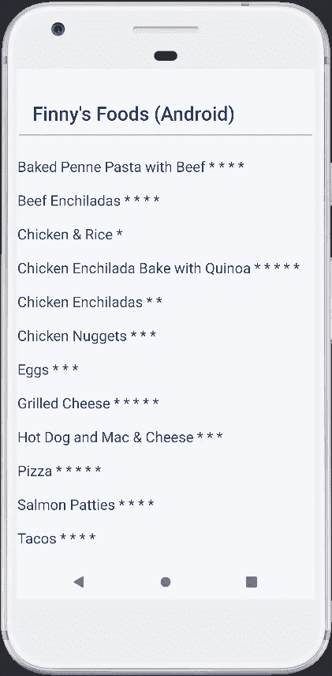

# 使用 Android Studio 探索 Salesforce Mobile SDK

> 原文：<https://betterprogramming.pub/exploring-the-salesforce-mobile-sdk-using-android-studio-c1ece60d3171>

## 在本系列的第二篇文章中，让我们创建一个利用 Salesforce 平台和 Salesforce Mobile SDK 的原生 Android 应用程序


去年 7 月，我开始撰写一个系列文章，重点介绍如何在没有传统 Salesforce 客户端的情况下使用 Salesforce 平台。以下是该系列其他文章的链接:

*   [利用 Spring Boot 的销售力量](https://medium.com/nerd-for-tech/leveraging-salesforce-without-using-salesforce-8ed8c2556926)
*   [利用 Salesforce 使用一个用简洁语言编写的客户端](https://medium.com/nerd-for-tech/leveraging-salesforce-using-a-client-written-in-svelte-93b431a15bf4)
*   [使用 Vue.js 编写的客户端利用 Salesforce】](https://medium.com/nerd-for-tech/leveraging-salesforce-using-a-client-written-in-vue-js-e94dc0e19057)
*   [利用使用 React Native 编写(一次)的移动应用程序利用 Salesforce】](https://medium.com/nerd-for-tech/leveraging-salesforce-using-mobile-applications-written-once-in-react-native-8f646a82774)
*   [使用 Angular 编写的客户端利用 Salesforce】](https://medium.com/nerd-for-tech/leveraging-salesforce-using-a-client-written-in-angular-36fe949ef69b)

该系列的图示如下所示:


上图显示了各种客户端框架如何访问 Salesforce 数据，而无需实际利用 Salesforce 生态系统提供的客户端。

最近，我开始了一个新的系列来演示 [Salesforce Mobile SDK](https://developer.salesforce.com/docs/atlas.en-us.mobile_sdk.meta/mobile_sdk/intro.htm) ，它在独立的移动应用程序中利用了 Salesforce 平台的强大功能。

这一新系列的图示如下:


"[使用 React Native 探索 sales force Mobile SDK](/exploring-the-salesforce-mobile-sdk-using-react-native-34f05217c1d4)"是该移动 SDK 系列的第一篇文章。在本文中，我将重点介绍如何使用 Android Studio 来生成相同的应用程序。

# Salesforce Mobile SDK 的优势

Salesforce Mobile SDK 为软件工程师提供了多种优势:

*   允许自定义移动设备应用程序利用 Salesforce 特性和功能
*   完全访问 Salesforce 功能(无需另起炉灶)
*   可以使用本地设备的应用商店来分发应用
*   处理来自 Salesforce 的推送通知
*   在离线模式下使用 Salesforce 数据的能力

如果您的应用程序环境在业务可操作性的关键方面利用 Salesforce，则考虑利用 Salesforce Mobile SDK。通过这样做，您可以将由 Salesforce 维护的数据集成到关键组件位置，从而做出强有力的业务决策。

# 使用 Android Studio 的好处

如果您的客户群需要支持 Android 设备，并且您希望使用 Android Studio 进行应用程序开发，那么您会发现`forcedroid` CLI 有助于快速开始使用 Salesforce 功能。

使用 Android Studio 的团队的主要功能包括:

*   使用 Java 或 Kotlin 作为基本编程语言
*   为 Android 设备上的特性和功能提供 100%的原生支持
*   允许有经验的 Android 开发人员快速利用 Salesforce Mobile SDK 功能
*   特性/功能的长期路线图——以及持续支持的质量——倾向于支持 Android Studio 而不是 React Native

现在我们已经准备好深入研究了，让我们简单回顾一下我们的用例。

# 芬尼食品:一个用例示例

有一个生来就有特殊需求的儿子(芬尼)引发了一种个人愿望，那就是理解和欣赏我们日常生活中使用的产品。芬尼出生前几年，我和妻子(妮可)过着健康的生活。然而，当妮可开始深入研究构成我们日常饮食的食物成分时，我们接到了一个急需的叫醒电话。

快进到今天:我们的饮食包括很少的加工食品，没有面筋，低糖，和很少的乳制品。我们的蛋白质尽可能来源于草食来源，我们总是偏爱有机食品。不要让我开始谈论转基因。

对于这个系列，我们的 Finny's Foods 应用程序提供了一个简单的列表，列出了我们可以接受并且 Finny 喜欢的食物。现在，我们将为每顿饭包含两个简单的属性:

*   饭菜的名称
*   评分(1 到 5，评分 5 是芬尼最喜欢的评分)

随着时间的推移，我打算引入其他属性(如摘要、成分、方向，甚至一张照片)，但我们先走后跑吧。

# Android Studio 入门

除了在我的 MacBook Pro 上安装`git`和`npm`之外，我还确保我的 Android Studio 版本是最新的。接下来，我访问了以下 URL，以确保一切都按照预期进行了设置和配置:

[设置您的 Android 开发环境](https://trailhead.salesforce.com/en/content/learn/projects/mobilesdk_setup_dev_tools/mobilesdk_setup_android)

这些步骤包括安装 Android Studio、Android SDKs 以及至少一个 Android 模拟器(AVD)和`forcedroid` CLI。

接下来，我在终端会话中使用以下选项执行了`forcedroid`:

```
forcedroid createEnter your application type (native_kotlin or native, leave empty for native_kotlin): native
Enter your application name: finnys-foods-android
Enter your package name: com.gitlab.johnjvester.finnysfoods.android
Enter your organization name (Acme, Inc.): JVC
Enter output directory for your app (leave empty for the current directory):
```

完成后，我启动 Android Studio 并导入新的`finnys-foods-android`项目，如下 URL 所示:

 [## 使用 Forcedroid 创建 Android 项目

### 要创建应用程序，请在终端窗口或 Windows 命令提示符下使用 forcedroid。forcedroid 实用程序为您提供了…

developer.salesforce.com](https://developer.salesforce.com/docs/atlas.en-us.noversion.mobile_sdk.meta/mobile_sdk/android_new_project.htm) 

# 在 Salesforce 中创建膳食对象

在我开始在 Android 中创建新应用程序之前，我需要在 Salesforce 中建立`Meal`对象。

我已经有了一个可以使用的开发者组织。(你可以在这里新建一个[。所以，我只是用我的电子邮件地址和密码登录了这个组织。接下来，我导航到 Salesforce 中的应用程序|应用程序管理器和设置透视图。](https://developer.salesforce.com/docs/atlas.en-us.externalidentityImplGuide.meta/externalidentityImplGuide/external_identity_create_developer_org.htm)

我创建了一个名为`Meal`的新闪电应用程序:


在其余设置屏幕上，我选择了所有默认设置并授予对所有 Salesforce 用户简档的访问权限。

接下来，我访问了 Salesforce 设置中的对象和字段|对象管理器菜单选项。找到新创建的餐饮项目后，我使用 dropdown 组件编辑该对象。

我从细节子菜单切换到字段和关系选项。我很快意识到我不需要为我的`Meal`对象创建一个名称属性，因为 Salesforce 已经替我处理了。我只需要添加评级字段。

使用“新建”按钮，我选择了“数字”字段类型，并填充了第二步，如下所示:


我使用默认值并保存了新字段。现在，我可以在我的 Android 应用程序中使用名称和评级字段。


使用 Salesforce 客户端，我填充了一些源数据以在 Android Studio 中开发应用程序。以下是提交值的汇总:


根据样本数据，Finny 总是更喜欢“比萨饼”而不是“鸡肉和米饭”

# 在 Android Studio 中添加用餐功能

配置好源对象和数据后，我使用 IntelliJ IDEA 应用程序第一次打开了`./finnys-foods-android`项目。

为了简单起见，我的 Android 应用程序的源代码将存在于`./android/MainActivity.java`文件中。构建业务应用程序的特性开发人员应该考虑为他们的 Android 应用程序采用设计原则。由 [CodePath](https://guides.codepath.com/android) 团队撰写的“[组织您的源文件](https://guides.codepath.com/android/Organizing-your-Source-Files)”一文提供了一些关于这个主题的优秀信息。

`MainActivity.java`文件已经填充了足够的信息，可以连接到 Salesforce 并使事情变得非常容易。我首先引入了一个 SOQL 静态字符串来存放访问`Meal__c object`的简单查询:

```
private static final String SOQL = "SELECT Name, Rating__c FROM Meal__c ORDER BY Name ASC";
```

我没有按下按钮来查看应用程序中的数据，而是更新了`onResume(RestClient client)`方法来调用`sendRequest()`方法从 Salesforce 请求数据:

我更新了`sendRequest()`方法，不仅从 Salesforce 检索数据，还提供了每个项目评分的可视化表示:

为了简单起见，我决定使用星号符号显示一个五星评级项目。所以会出现一个五星的物品，如下图所示:

披萨* * * * *

我在我的 GitLab 存储库中添加了一个问题，将星号替换为基于星的图标，就像 Font Awesome 提供的那些图标一样，这样当评级低于 5 时，就会显示空星。

# 介绍自定义文本视图

我没有依赖于`ListView`组件的默认设计，而是决定创建自己的文本视图，在包含 Salesforce 中的用餐列表的实时视图中显示数据。

在 `./app/res/layout`文件夹中，我创建了一个名为`custom_text_vew.xml` 的新 XML 文件，其中包含以下信息:

```
<?xml version="1.0" encoding="utf-8"?>
<TextView xmlns:android="[http://schemas.android.com/apk/res/android](http://schemas.android.com/apk/res/android)"
    android:id="[@android](http://twitter.com/android):id/text1"
    android:fontFamily="sans-serif"
    android:paddingTop="10dip"
    android:paddingBottom="10dip"
    android:paddingLeft="1dip"
    android:layout_width="fill_parent"
    android:layout_height="wrap_content"
    android:textSize="9pt" ></TextView>
```

我能够设置字体和位置信息来满足我的期望。

有了 XML，我需要做的就是用下面的更新引用自定义文本视图:

```
listAdapter = new ArrayAdapter<>(this, R.layout.custom_text_view, new ArrayList<>());
```

# 一些最后的清理和造型

因为我想匹配我的应用程序的 React 本地版本，所以我对`./app/res/layout/header.xml`文件做了如下更新:

最后，我检查了`./finnysfoods/android/MainActivity.java`文件，并删除了更新 header.xml 文件后所有未使用的方法。Android Studio 和 IntelliJ IDEA 一样，非常擅长改变未使用的方法名的颜色，可以在不影响应用程序运行时功能的情况下将其删除。

# 芬尼食品在行动

在 Android Studio 上，我使用了“运行”菜单选项，并选择了“运行应用程序”选项，这也可以映射到 Shift-F10 快捷键。

首次使用将自动重定向到 Salesforce 登录屏幕，在此我使用相同的电子邮件地址和密码访问我的开发人员组织。登录后，出现了 Finny's Foods 应用程序，包括每个项目的五星评分值。



在几分钟内，我们能够使用 Android Studio 和 Salesforce Mobile SDK 创建一个 Android 应用程序。

# 结论

在本文中，我介绍了一个定制的移动应用程序，它从 Android store 进行本地部署，并使用用 Java 和基本 XML 编写的源代码。在这个过程中，我们对基于 Android 的应用程序的结构有了基本的了解。

从 2021 年开始，我一直努力按照以下使命宣言生活，我觉得这可以适用于任何 IT 专业人士:

> “将您的时间集中在提供扩展您知识产权价值的特性/功能上。将框架、产品和服务用于其他一切。”
> 
> *—j·维斯特*

Salesforce Mobile SDK 当然坚持我的个人使命声明，这将有利于任何需要 Salesforce 功能作为在 Android 设备上运行的自定义移动应用程序的一部分的功能团队。这一开发领域的软件工程师当然应该考虑将 Salesforce Mobile SDK 添加为项目依赖项。

如果您希望查看本文的完整源代码，请导航到 GitLab 上的以下项目:

https://gitlab.com/johnjvester/finnys-foods-android

在本系列的最后一篇文章中，我计划使用带有 Xcode 的 Salesforce Mobile SDK 为 iOS 设备创建一个本机应用程序。

祝你今天过得愉快！