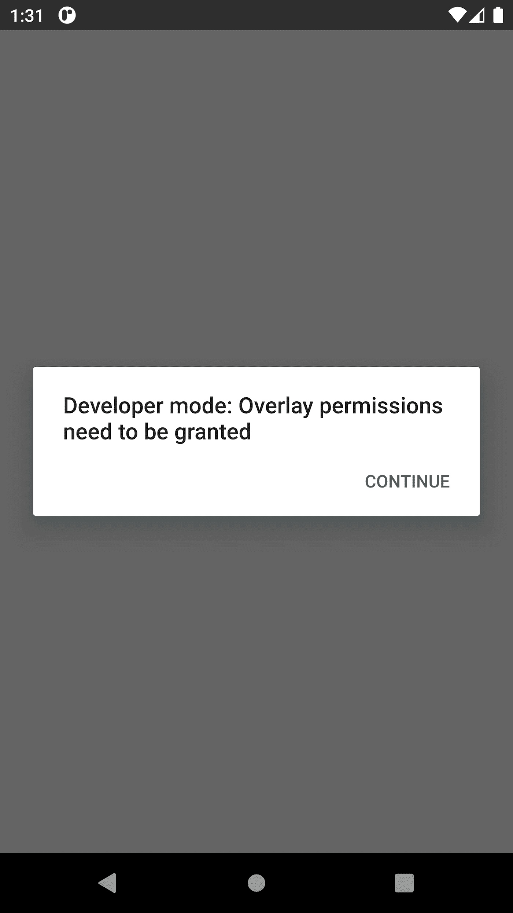
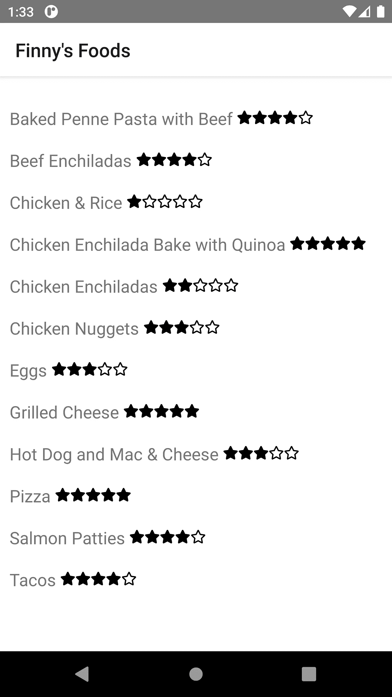

# 使用 React Native 探索 Salesforce Mobile SDK

> 原文：<https://betterprogramming.pub/exploring-the-salesforce-mobile-sdk-using-react-native-34f05217c1d4>

## 快速轻松地创建 Android 和 iOS 应用程序


去年 7 月，我开始撰写一个系列文章，重点介绍如何在没有传统 Salesforce 客户端的情况下使用 Salesforce 平台。以下是该系列其他文章的链接:

*   [利用 Spring Boot 的销售力量](https://medium.com/nerd-for-tech/leveraging-salesforce-without-using-salesforce-8ed8c2556926)
*   [利用 Salesforce 使用一个用简洁语言编写的客户端](https://medium.com/nerd-for-tech/leveraging-salesforce-using-a-client-written-in-svelte-93b431a15bf4)
*   [使用 Vue.js 编写的客户端利用 Salesforce】](https://medium.com/nerd-for-tech/leveraging-salesforce-using-a-client-written-in-vue-js-e94dc0e19057)
*   [利用使用 React Native 编写(一次)的移动应用程序利用 Salesforce】](https://medium.com/nerd-for-tech/leveraging-salesforce-using-mobile-applications-written-once-in-react-native-8f646a82774)
*   [使用 Angular 编写的客户端利用 Salesforce】](https://medium.com/nerd-for-tech/leveraging-salesforce-using-a-client-written-in-angular-36fe949ef69b)

该系列的图示可总结如下:


上图展示了各种客户端框架如何访问 Salesforce 数据，而无需实际利用 Salesforce 生态系统提供的客户端。

功能团队开发人员可能不知道 [Salesforce Mobile SDK](https://developer.salesforce.com/docs/atlas.en-us.mobile_sdk.meta/mobile_sdk/intro.htm) ，它允许您在独立的移动应用程序中利用 Salesforce 平台的强大功能。

在这个简短的系列中，我将演示如何将 Salesforce Mobile SDK 用于用 React Native、Android Studio 和 Xcode 编写的自定义移动应用程序。

这一新系列的图示可总结如下:


# Salesforce Mobile SDK 的优势

Salesforce Mobile SDK 提供了软件工程师可以利用的多种优势:

*   允许自定义移动设备应用程序利用 Salesforce 特性和功能
*   完全访问 Salesforce 功能(无需另起炉灶)
*   可以使用本地设备的应用程序商店来分发应用程序
*   可以处理来自 Salesforce 的推送通知
*   在离线模式下使用 Salesforce 数据的能力

如果您的应用程序环境在业务可操作性的关键方面利用 Salesforce，那么您应该考虑利用 Salesforce Mobile SDK，以便将由 Salesforce 维护的数据引入关键组件位置，从而促进强有力的业务决策。

# 使用 React Native 的好处

如果您仍在阅读这篇文章，那么您一定对使用 Salesforce 生态系统开发应用程序感兴趣。如果您当前的客户群需要同时支持 Android 和 iOS 设备，那么 React 原生框架应该是您的首选。

使用 React Native 的特性团队的一些关键特性如下:

*   对 Android 和 iOS 设备使用一个代码库
*   利用 JavaScript(如果需要，还有类型脚本)来避免学习新语言
*   为在移动设备上运行原生客户端提供快速周转时间

# 为什么不用 HTML5 呢？

那些有 Angular、React、Vue.js(和其他客户端框架)经验的人可能会问“为什么不创建一个响应式 HTML5 应用程序？”

虽然 HTML5 方法是可行的，但当试图访问移动设备上的核心组件(如相机)时，确实存在限制。此外，会话管理和缺乏对安全存储的访问可能会在您的产品负责人心目中成为交易破坏者。此外，移动用户倾向于在他们的设备上使用本地应用程序，而不是基于浏览器的应用程序。

有关更多信息和横向分析，请查看 Salesforce 提供的以下细分:

[关于原生、HTML5 和混合开发](https://developer.salesforce.com/docs/atlas.en-us.mobile_sdk.meta/mobile_sdk/intro_choose_scenario.htm)

# 芬尼食品:一个用例示例

有一个生来就有特殊需求的儿子(芬尼)引发了一种个人愿望，那就是理解和欣赏我们在日常生活中使用的产品。芬尼出生前几年，我和妻子(妮可)过着健康的生活。然而，当妮可开始深入研究我们日常饮食中的食物成分时，我们接到了一个急需的叫醒电话。

快进到今天。我们的饮食包含很少的加工食品，没有面筋，低糖，和很少的乳制品。我们的蛋白质尽可能来源于草食来源，我们总是偏爱有机食品。不要让我开始谈论转基因。

对于这个系列，我们的 Finny's Foods 应用程序提供了一个简单的列表，列出了我们可以接受并且 Finny 喜欢的食物。现在，我们将为每顿饭包含两个简单的属性:

*   饭菜的名称
*   评分(1 到 5，评分 5 是芬尼最喜欢的评分)

随着时间的推移，我打算引入其他属性(如摘要、成分、方向，甚至一张照片)，但我们先走后跑吧。

# React Native 入门

除了确保我的 MacBook Pro 上安装了 git 和`npm`之外，我意识到我需要一个最新版本的 Node。我还需要安装 TypeScript 和`forcereact`包，这是我用`npm`完成的:

```
npm install -g typescript forcereact
```

在本地机器上的`./projects/jvc/salesforce-mobile-sdk`文件夹中，我使用`forcereact`命令在 React Native 中创建了 Finny's Foods 应用程序:

```
forcereact create --platform=ios,android 
  --appname=FinnysFoods --packagename=com.gitlab.johnjvester.finnysfoods 
  --organization="johnjvester" --outputdir=FinnysFoods
```

安装程序提供了以下摘要消息:

```
********************************************************************************
*
*   Creating ios and android react_native application using Salesforce Mobile SDK
*     with app name:        FinnysFoods
*          package name:    com.gitlab.johnjvester.finnysfoods
*          organization:    johnjvester
*
*     in:                   FinnysFoods
*
*     from template repo:   [https://github.com/forcedotcom/SalesforceMobileSDK-Templates#v9.1.1](https://github.com/forcedotcom/SalesforceMobileSDK-Templates#v9.1.1)
*          template path:   ReactNativeTypeScriptTemplate
*
********************************************************************************
```

安装完必要的依赖项后，React 本地应用程序库就准备好了。如果我想查看应用程序的 Hello World 版本，我只需执行以下操作:

1.  发出`npm`开始命令
2.  启动 Android Studio 或 Xcode
3.  配置仿真器(如果尚未配置)
4.  从 Android Studio 或 Xcode 运行应用程序

在此之前，我想开始构建实际的应用程序。您可以在以前系列的“[利用使用 React Native](https://dzone.com/articles/leveraging-salesforce-using-mobile-applications-wr) (一次)编写的移动应用程序的 Salesforce”文章中看到一个 Hello World 示例。

此时，我决定将`/projects/jvc/salesforce-mobile-sdk/FinnysFoods`文件夹重命名为`/projects/jvc/salesforce-mobile-sdk/finnys-foods`，以匹配我当前的 GitLab 命名格式。

对于本文的其余部分，我将从`./finnys-foods`文件夹开始工作，除非另有说明。

# 为星级评定系统添加依赖关系

为了提供更好的用户体验，我想在应用程序的标题旁边包含一个评级值。我认为利用 [Font Awesome](https://fontawesome.com/) 库来显示一个填充的星来匹配五星量表上的评级会更好，而不仅仅是列出数字值。因此，四颗星的评级如下所示:


为此，我发出了下面的命令来利用来自`fortawesome`的库:

```
npm i --save react-native-svg 
  [@fortawesome/fontawesome-svg-core](http://twitter.com/fortawesome/fontawesome-svg-core) [@fortawesome/free-solid-svg-icons](http://twitter.com/fortawesome/free-solid-svg-icons) 
  [@fortawesome/react-native-fontawesome](http://twitter.com/fortawesome/react-native-fontawesome) [@fortawesome/free-regular-svg-icons](http://twitter.com/fortawesome/free-regular-svg-icons)
```

此时，字体 Awesome 依赖项可供使用。

# 在 Salesforce 中创建膳食对象

在开始在 React Native 中创建新应用程序之前，我需要在 Salesforce 中建立 Meal 对象。

我已经有了一个可以使用的开发者组织。(您可以在这里创建一个新的[。所以，我只是用我的电子邮件地址和密码登录了这个组织。接下来，我导航到 Salesforce 中的应用程序|应用程序管理器和设置透视图。](https://developer.salesforce.com/docs/atlas.en-us.externalidentityImplGuide.meta/externalidentityImplGuide/external_identity_create_developer_org.htm)

我创建了一个名为“用餐”的新闪电应用程序:


在设置的其余屏幕上，我使用所有默认设置并授予对所有 Salesforce 用户简档的访问权限。

接下来，我访问了 Salesforce 设置中的对象和字段|对象管理器菜单选项。找到新创建的餐饮项目后，我使用下拉组件编辑该对象。

我从细节子菜单切换到字段和关系选项。我很快意识到我不需要为我的 Meal 对象创建 Name 属性，因为 Salesforce 已经为我处理好了。我只需要添加评级字段。

使用“新建”按钮，我选择了“数字”字段类型，并填充了第二步，如下所示:


我使用默认值并保存了新字段。现在，我可以在我的 React 本机应用程序中使用 name 和 rating 字段，这都是因为 Salesforce 自动将所有这些模式更改呈现给这个 Salesforce 组织的 RESTful API。


使用 Salesforce 客户端，我填充了一些源数据，用于 React 本机应用程序的开发。以下是提交值的汇总:


根据样本数据，芬尼总是更喜欢“比萨饼”而不是“鸡肉和米饭”

# 在 React Native 中构建膳食组件

配置好源对象和数据后，我使用 IntelliJ IDEA 应用程序第一次打开了`./finnys-foods`项目。

***重要提示*** *:记住，我们在这里要指向根文件夹(* `*./finnys-foods*` *)，因为这是我们将要进行源代码开发的地方。稍后，您将看到 Android Studio 在打开同一个项目时如何使用 Android 子文件夹。正如你所料，Xcode 会使用* `*ios*` *子文件夹。*

为了简单起见，我的 React 本地应用程序将存在于`app.tsx`文件中。构建业务应用程序的特性开发人员应该考虑为他们的 React 本机应用程序采用设计原则。由 [Saurabh Shah](https://saurabhshah23.medium.com/about) 撰写的“[用设计模式反应本地应用架构——企业标准](https://saurabhshah23.medium.com/react-native-application-architecture-folder-structure-with-design-pattern-corporate-standards-efad5b230f07)”文章提供了一些关于这个主题的优秀信息。

`app.tsx`文件已经填充了足够的信息，可以连接到 Salesforce 并使事情变得非常容易。

我把`Record`界面换成了如下图所示的`Meal`界面:

```
interface Meal {
    Id: String,
    Name: String,
    Rating__c: number
}
```

因此，我相应地更新了`Response`和`State`接口:

```
interface Response {
    records: Meal[]
}interface State {
    data : Meal[]
}
```

我将 React 组件重命名为`MealListScreen`，如下所示:

```
class MealListScreen extends React.Component<Props, State> {
```

我更新了`fetchData()`方法来调用在 Salesforce 中创建的`Meal`自定义对象:

```
fetchData() {
        var that = this;
        net.query('SELECT Id, Name, Rating__c FROM Meal__c ORDER BY Name ASC LIMIT 100',
                  (response:Response) => {
                that.setState({data: response.records});
            },
                  (error) => console.log('Failed to query:' + error)
                 );
    }
```

我更新了`render()`方法来显示食物的名称和相应的星级:

最后，我更新了应用程序，以反映应用程序的正确标题:

```
export const App = function() {
    return (
        <NavigationContainer>
          <Stack.Navigator>
            <Stack.Screen name="Finny's Foods" component={MealListScreen} ></Stack>
          </Stack.Navigator>
        </NavigationContainer>
    );
}
```

随着这些变化的到位，我们准备使用 Android Studio 尝试 Finny 的美食应用程序。

# 芬尼食品在行动

从命令行，我执行了`./finnys-foods`文件夹中的`npm start` 命令。显示了以下信息:

```
> FinnysFoods@0.0.1 start /Users/john.vester/projects/jvc/salesforce-mobile-sdk/finnys-foods
> node node_modules/react-native/local-cli/cli.js start######                ######               
             ###     ####        ####     ###             
            ##          ###    ###          ##            
            ##             ####             ##            
            ##             ####             ##            
            ##           ##    ##           ##            
            ##         ###      ###         ##            
             ##  ########################  ##             
          ######    ###            ###    ######          
      ###     ##    ##              ##    ##     ###      
   ###         ## ###      ####      ### ##         ###   
  ##           ####      ########      ####           ##  
 ##             ###     ##########     ###             ## 
  ##           ####      ########      ####           ##  
   ###         ## ###      ####      ### ##         ###   
      ###     ##    ##              ##    ##     ###      
          ######    ###            ###    ######          
             ##  ########################  ##             
            ##         ###      ###         ##            
            ##           ##    ##           ##            
            ##             ####             ##            
            ##             ####             ##            
            ##          ###    ###          ##            
             ###     ####        ####     ###             
               ######                ######               

                 Welcome to React Native!
                Learn once, write anywhereTo reload the app press "r"
To open developer menu press "d"
```

接下来我打开 Android Studio，从`./finnys-foods/android`文件夹导入项目，是一个 Gradle 项目。准备好后，我使用了“运行”菜单选项，并选择了“运行应用程序”选项，这也可以映射到 Shift-F10 快捷键。

请记住，我已经配置了一个 Android 设备，以便在以前系列的“[使用 React Native](https://dzone.com/articles/leveraging-salesforce-using-mobile-applications-wr) 中编写的移动应用程序利用 Salesforce”文章中进行模拟。

移动设备显示在我的显示器上，我需要按继续选项来授予适当的权限。



首次使用将自动重定向到 Salesforce 登录屏幕，在此我使用相同的电子邮件地址和密码访问我的开发人员组织。这是一个非常棒的特性，auth 工作所需的一切都已经包含在内了。

同时，如果我们要在 Salesforce 中添加的自定义对象上分配安全性，它们也会被自动处理。

登录后，显示了 Finny's Foods 应用程序，包括每个项目的五星评分值。



在几分钟内，我们能够使用 React Native 和 Salesforce Mobile SDK 为 Android 或 iOS 设备创建本机应用程序。

# 结论

从 2021 年开始，我一直努力按照以下我认为适用于任何 IT 专业人士的使命宣言来生活:

> “将您的时间集中在提供扩展您知识产权价值的特性/功能上。将框架、产品和服务用于其他一切。”
> 
> —j·维斯特

在本文中，我能够介绍一个定制的移动应用程序，使用一个源代码集合从 Android 和 iOS 应用程序商店进行本地部署。除了了解 Javascript 和 React 原生框架的架构之外，不需要任何专有技能。

Salesforce Mobile SDK 当然坚持我的个人使命声明，这将有利于任何需要 Salesforce 功能作为在 Android 和 iOS 设备上运行的自定义移动应用程序的一部分的功能团队。这个开发领域的软件工程师当然应该考虑这种方法。

如果您希望查看本文的完整源代码，只需导航到 GitLab 上的以下项目:

[](https://gitlab.com/johnjvester/finnys-foods) [## 约翰·维斯特/芬兰食品公司

### 15.0 主要版本即将发布！该版本为 GitLab 带来了许多令人兴奋的改进，但也删除了一些…

gitlab.com](https://gitlab.com/johnjvester/finnys-foods) 

在本系列的下一篇文章中，我计划使用带有 Android Studio 的 Salesforce Mobile SDK 来创建一个原生 Android 应用程序。一旦完成，我将使用 iOS 设备的 Xcode 执行相同的练习。

祝你今天过得愉快！