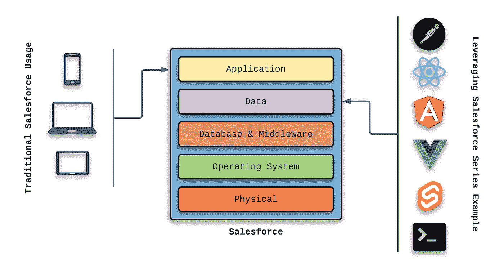
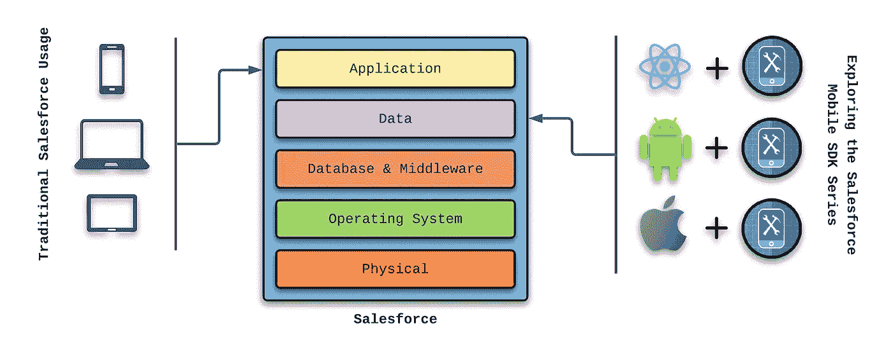
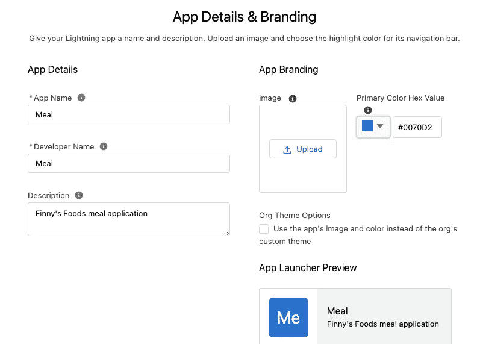
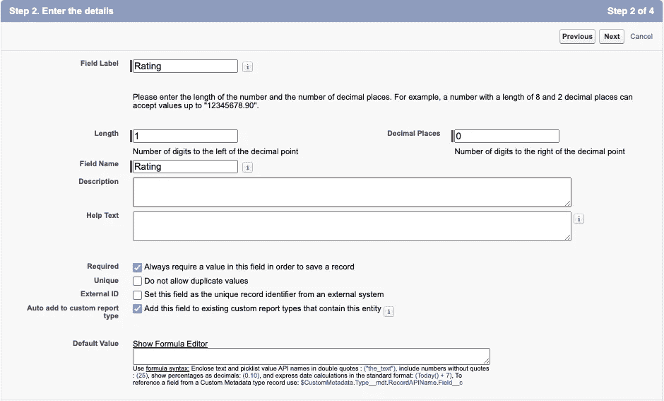
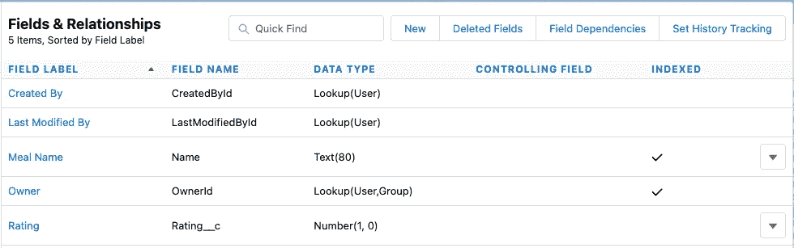
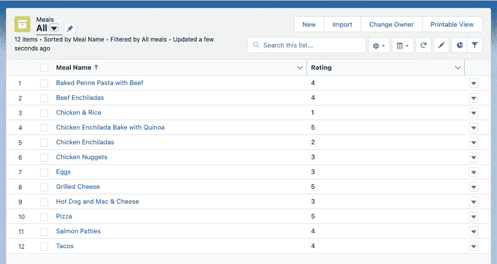
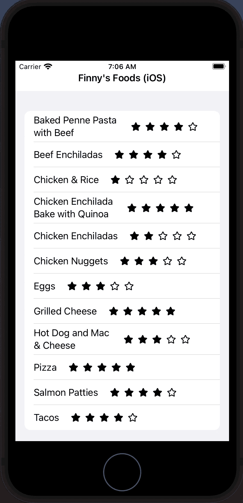

# 使用 Xcode 探索 Salesforce Mobile SDK

> 原文：<https://betterprogramming.pub/exploring-the-salesforce-mobile-sdk-using-xcode-18bb0926f051>

## 创建一个显示膳食列表的 iOS 应用程序


阿姆扎·安德烈在 [Unsplash](https://unsplash.com?utm_source=medium&utm_medium=referral) 上拍摄的照片

去年 7 月，我开始撰写一个系列文章，重点介绍如何在没有传统 Salesforce 客户端的情况下使用 Salesforce 平台。以下是该系列其他文章的链接:

*   [利用 Spring Boot 的销售力量](https://medium.com/nerd-for-tech/leveraging-salesforce-without-using-salesforce-8ed8c2556926)
*   [使用以简洁语言编写的客户端利用 Salesforce】](https://medium.com/nerd-for-tech/leveraging-salesforce-using-a-client-written-in-svelte-93b431a15bf4)
*   [使用 Vue.js 编写的客户端利用 Salesforce】](https://medium.com/nerd-for-tech/leveraging-salesforce-using-a-client-written-in-vue-js-e94dc0e19057)
*   [利用使用 React Native 编写(一次)的移动应用程序利用 sales force](https://medium.com/nerd-for-tech/leveraging-salesforce-using-mobile-applications-written-once-in-react-native-8f646a82774)
*   [使用 Angular 编写的客户端利用 sales force](https://medium.com/nerd-for-tech/leveraging-salesforce-using-a-client-written-in-angular-36fe949ef69b)

该系列的图示如下所示:



上图显示了各种客户端框架如何访问 Salesforce 数据，而无需实际利用 Salesforce 生态系统提供的客户端。

2021 年 11 月，我开始了一个新系列来演示 [Salesforce Mobile SDK](https://developer.salesforce.com/docs/atlas.en-us.mobile_sdk.meta/mobile_sdk/intro.htm) ，它在独立的移动应用程序中利用 Salesforce 平台的力量。

这一新系列的图示如下:



"[使用 React Native 探索 sales force Mobile SDK](/exploring-the-salesforce-mobile-sdk-using-react-native-34f05217c1d4)"是该移动 SDK 系列的第一篇文章。然后，我转而阅读“[使用 Android Studio 探索 sales force Mobile SDK](/exploring-the-salesforce-mobile-sdk-using-android-studio-c1ece60d3171)”文章，以利用 Android Studio。在本文中，我将重点介绍如何使用 Xcode 生成相同的应用程序。

# Salesforce Mobile SDK 的优势

Salesforce Mobile SDK 为软件工程师提供了多种优势:

*   允许自定义移动设备应用程序利用 Salesforce 特性和功能
*   完全访问 Salesforce 功能(无需另起炉灶)
*   可以使用本地设备的应用商店来分发应用
*   处理来自 Salesforce 的推送通知
*   在离线模式下使用 Salesforce 数据的能力

如果您的应用程序环境在业务可操作性的关键方面利用 Salesforce，则考虑利用 Salesforce Mobile SDK。通过这样做，您可以将由 Salesforce 维护的数据集成到关键组件位置，从而做出强有力的业务决策。

# 使用 Xcode 的好处

如果您的客户群需要支持 iOS 设备，并且您希望使用 Xcode 进行应用程序开发，那么您会发现`forceios` CLI 有助于快速开始使用 Salesforce 功能。

使用 Xcode 的团队的主要功能包括:

*   允许使用 Swift 或 Objective-C 作为基本编程语言
*   为 iOS 设备上的特性和功能提供 100%的原生支持
*   允许有经验的 iOS 开发人员快速利用 Salesforce Mobile SDK 功能
*   错误处理方面的改进，因为 Swift 和 Objective-C 都保持了强大的类型和错误处理设计
*   更容易识别和修复构建问题

这可能是显而易见的，但你必须有一台苹果电脑才能使用 Xcode。对于这篇文章，我将从 2020 年 3 月开始使用我的 16 英寸 MacBook Pro。

现在我们已经准备好深入研究了，让我们简单回顾一下我们的用例。

# 芬尼食品:一个用例示例

有一个生来就有特殊需求的儿子(芬尼)引发了一种个人愿望，那就是理解和欣赏我们日常生活中使用的产品。芬尼出生前几年，我和妻子(妮可)过着健康的生活。然而，当妮可开始深入研究构成我们日常饮食的食物成分时，我们接到了一个急需的叫醒电话。

快进到今天:我们的饮食包括很少的加工食品，没有面筋，低糖，和很少的乳制品。我们的蛋白质尽可能来源于草食来源，我们总是偏爱有机食品。不要让我开始谈论转基因。

对于这个系列，我们的 Finny's Foods 应用程序提供了一个简单的列表，列出了我们可以接受并且 Finny 喜欢的食物。现在，我们将为每顿饭包含两个简单的属性:

*   饭菜的名称
*   评分(1 到 5，评分 5 是芬尼最喜欢的评分)

随着时间的推移，我打算引入其他属性(如摘要、成分、方向，甚至一张照片)，但我们先走后跑吧。

# Xcode 入门

除了在我的 MacBook Pro 上安装`git`和`npm`之外，我还确保我的 Xcode 版本是最新的。接下来，我访问了以下 URL，以确保一切都按照预期进行了设置和配置:

[设置您的 iOS 开发环境](https://developer.salesforce.com/docs/atlas.en-us.mobile_sdk.meta/mobile_sdk/ios_quickstart.htm)

这些步骤包括确保 Xcode、CocoaPods、node.js、npm 和`forceios` CLI 都已安装。

接下来，我使用以下选项从终端会话执行了`forceios`:

```
forceios create
Enter your application type (native_swift or native, leave empty for native_swift): native_swift
Enter your application name: FinnysFoodsIOS
Enter your package name: com.gitlab.johnjvester.finnysfoods.ios
Enter your organization name (Acme, Inc.): JVC
Enter output directory for your app (leave empty for the current directory):Once completed, I followed the steps provided by the forceios CLI:******************************************************************************
*
*   Next steps:
*
*   Your application project is ready in FinnysFoodsIOS.
*   To use your new application in XCode, do the following:
*      - open FinnysFoodsIOS/FinnysFoodsIOS.xcworkspace in XCode
*      - build and run
*   Before you ship, make sure to plug your OAuth Client ID and Callback URI,
*   and OAuth Scopes into FinnysFoodsIOS/FinnysFoodsIOS/bootconfig.plist
*
******************************************************************************
```

# 在 Salesforce 中创建膳食对象

在开始在 Xcode 中创建新应用程序之前，我需要在 Salesforce 中建立 Meal 对象。

我已经有了一个可以使用的开发者组织。(您可以在这里创建一个新的[。所以，我只是用我的电子邮件地址和密码登录了这个组织。接下来，我导航到 Salesforce 中的应用程序|应用程序管理器和设置透视图。](https://developer.salesforce.com/docs/atlas.en-us.externalidentityImplGuide.meta/externalidentityImplGuide/external_identity_create_developer_org.htm)

我创建了一个新的闪电应用程序，名为 Meal:



在其余设置屏幕上，我选择了所有默认设置并授予对所有 Salesforce 用户简档的访问权限。

接下来，我访问了 Salesforce 设置中的对象和字段|对象管理器菜单选项。找到新创建的餐饮项目后，我使用下拉组件编辑该对象。

我从细节子菜单切换到字段和关系选项。我很快意识到我不需要为我的 Meal 对象创建 Name 属性，因为 Salesforce 已经为我处理好了。我只需要添加评级字段。

使用“新建”按钮，我选择了“数字”字段类型，并填充了第二步，如下所示:



我使用默认值并保存了新字段。现在，我可以在我的 iOS 应用程序中使用名称和评级字段。



使用 Salesforce 客户端，我填充了一些源数据来开发 Xcode 中的应用程序。以下是提交值的汇总:



根据样本数据，芬尼总是更喜欢“比萨饼”而不是“鸡肉和米饭”

# 在 Xcode 中添加用餐功能

配置好源对象和数据后，我使用 Xcode 应用程序第一次打开了`finnys-foods-ios`项目。

默认情况下，`forceios` CLI 会创建一个工作应用程序，在首次运行时显示与用户帐户关联的 Salesforce 组织的帐户和联系信息。为了使事情变得简单，我决定从项目中删除以下文件:

*   `AccountsListModel.swift`
*   `AccountsListView.swift`
*   `ContactDetailModel.swift`
*   `ContactDetailsView.swift`
*   `ContactsForAccountListView.swift`
*   `ContactsForAccountModel.swift`

因为我计划在以后的文章中讨论离线功能，所以我将`userstore.json`中的配置数据更新为:

```
{
  "soups": [
  ]
}
```

`usersyncs.json`文件也被清除，如下所示:

```
{
  "syncs": [ ]
}
```

接下来，我为 Salesforce 中的`Meal__c`对象创建了一个基本的列表视图，名为`MealsListView.swift`。

为了在应用程序启动时使用膳食列表视图，我更新了`SceneDelegate.swift`文件中的`setupRootViewController()`方法，如下所示:

```
func setupRootViewController() {
       // Setup store based on config userstore.json
       MobileSyncSDKManager.shared.setupUserStoreFromDefaultConfig()
       // Setup syncs based on config usersyncs.json
       MobileSyncSDKManager.shared.setupUserSyncsFromDefaultConfig()

       self.window?.rootViewController = UIHostingController(
           rootView: MealsListView()
       )
   }
```

在这一点上，我们有了一个功能性的 iOS 应用程序，它仅仅使用粗体文本显示“Finny's Foods (iOS)”。

# 在 Xcode 中使用字体 Awesome

在我构建应用程序的其余部分之前，我想看看在用 Xcode 创建的 Swift 应用程序中添加字体很棒的图标有多容易。您可能还记得，这个任务在 React Native 中非常简单，而在 Android studio 中就不那么简单了。

我能够使用以下网址提供的步骤在大约 15 分钟内完成工作。我完全希望那些有 Xcode 经验的人能够在很短的时间内完成这些步骤:

[swift ui 中的简易字体牛逼](https://iosexample.com/easy-font-awesome-in-swiftui/)

作为这些步骤的结果，以下支持文件现在是我的项目的一部分:

*   `fa-brands-400.ttf`
*   `fa-regular-400.ttf`
*   `fa-solid-900.ttf`
*   `icons.json`

# 创建膳食列表模型

Xcode 应用程序需要理解驱动 Finny's Foods 应用程序的`Meal__c`对象。我创建了一个包含以下信息的`MealsListModel.swift`文件:

该文件引入了一个包含存储在 Salesforce 中的每个`Meal__c`对象的元数据的 Meal 对象。还有一个`MealResponse`对象，代表 Salesforce 在请求`Meal__c`数据时提供的有效负载。

定义了这两个关键结构后，`fetchMeals()`方法对 Salesforce 进行 RESTful API 调用，然后将任何响应数据映射到一个膳食对象列表。之前创建的`MealsListView.swift`文件会处理这些数据。

# 更新膳食列表视图

膳食列表模型准备就绪后，膳食列表视图现在可以扩展为与 Salesforce 集成，并在 iOS 设备上显示数据。我必须做的第一件事是在`MealsListView.swift`文件中为膳食列表模型建立一个变量:

```
struct MealsListView: View {
  [@ObservedObject](http://twitter.com/ObservedObject) var viewModel = MealsListModel()
```

接下来，我更新了`MealsListView.swift`文件中的 body 变量，如下所示:

此时，iOS 应用程序会在新的一行显示每顿饭的名称。`fetchMeals()`方法调用从 Salesforce 检索数据，将每个`Meal__c`项目作为 dataItem 处理。

然而，我真的想添加 React 原生项目中使用的星级系统。为此，我更新了最里面的`HStack`对象，如下所示:

完成这些更改后，iOS 应用程序就可以使用了。

# 芬尼食品在行动

使用 Xcode，我使用了产品菜单选项，选择了运行选项。

首次使用将自动重定向到 Salesforce 登录屏幕，在此我使用相同的电子邮件地址和密码访问我的开发人员组织。登录后，出现了 Finny's Foods 应用程序，包括每个项目的五星评分值。



在几分钟内，我们能够使用 Xcode 和 Salesforce Mobile SDK 创建一个 iOS 应用程序。

# 结论

在本文中，我介绍了一个定制的移动应用程序，它原生部署在 Apple store 上，并使用用 Swift 编写的源代码。在这个过程中，我们对基于 iOS 的应用程序的结构有了基本的了解。

从 2021 年开始，我一直努力按照以下使命宣言生活，我觉得这可以适用于任何 IT 专业人士:

> “将您的时间集中在提供扩展您知识产权价值的特性/功能上。将框架、产品和服务用于其他一切。”
> 
> —j·维斯特

Salesforce Mobile SDK 当然坚持我的个人使命声明，这将有利于任何需要 Salesforce 功能作为在 iOS 设备上运行的自定义移动应用程序的一部分的功能团队。这一开发领域的软件工程师当然应该考虑将 Salesforce Mobile SDK 添加为项目依赖项。

如果您希望看到本文的完整源代码，请访问我在 GitLab 上的项目:

[](https://gitlab.com/johnjvester/finnys-foods-ios) [## 约翰·维斯特/芬兰食品公司 ios

### 15.0 主要版本即将发布！该版本为 GitLab 带来了许多令人兴奋的改进，但也删除了一些…

gitlab.com](https://gitlab.com/johnjvester/finnys-foods-ios) 

祝你今天过得愉快！