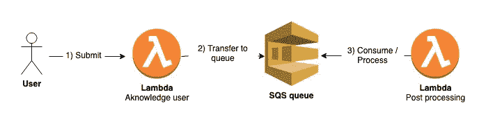
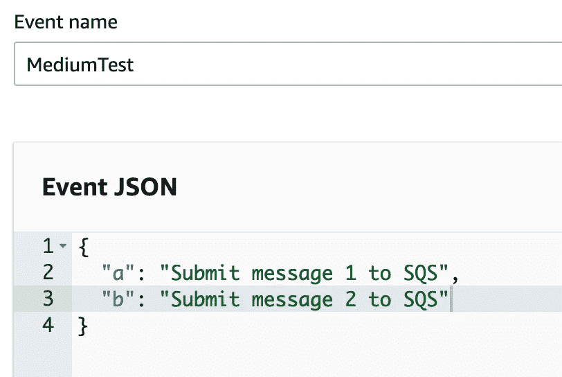
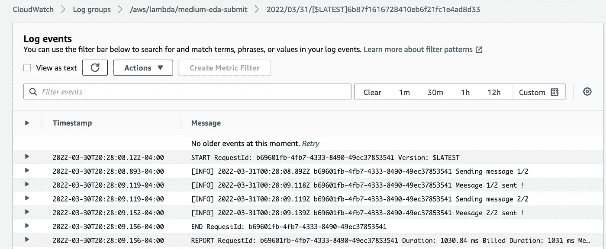
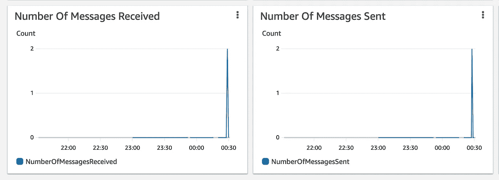
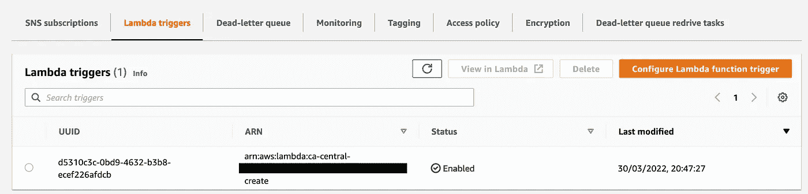
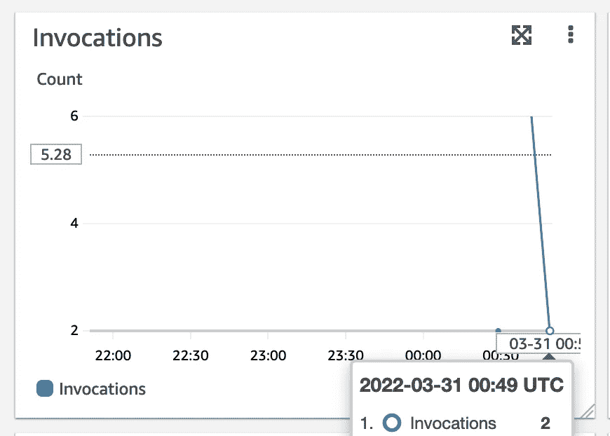
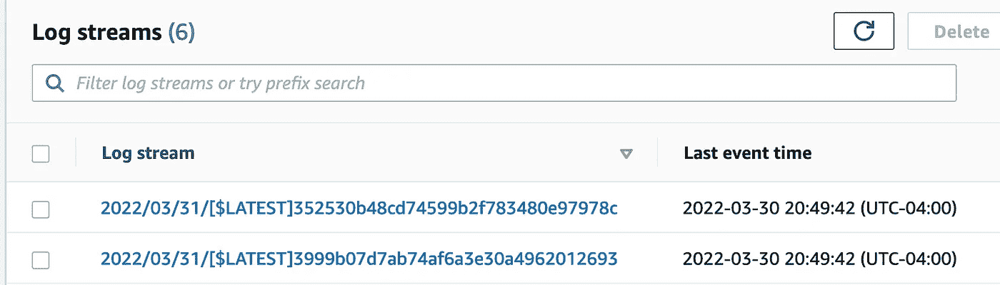
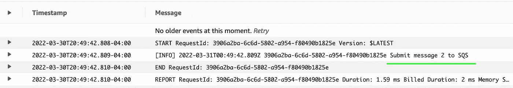

# 探索无服务器事件驱动架构

> 原文：<https://betterprogramming.pub/exploring-the-serverless-event-driven-architecture-8d6bda93e823>

## 认识一下你的老朋友 Terraform、Lambda、SQS 和 Python

照片由[郭佳欣·阿维蒂西安](https://unsplash.com/@kar111?utm_source=medium&utm_medium=referral)在 [Unsplash](https://unsplash.com?utm_source=medium&utm_medium=referral) 上拍摄

作为开发人员，您不希望您的最终用户在后处理事件上等待后端确认。
作为一名运营人员，您不希望让超级强大的基础设施加快后端处理时间。

接下来，让我们深入探讨一种事件驱动的架构，它将满足您的所有需求:

1.  对最终用户的快速响应时间—例如，在一秒钟内确认提交
2.  易于管理的后端，只需维护少量代码(在后台拆分您的后处理任务)
3.  低成本基础架构—您只需为消费的内容付费

我们将通过本文发现的基本事件驱动架构

正如您在上面的模式中看到的，我们将在这里部署一个包含三个组件的超级简单的架构(我在这里不会提到 Cloudwatch，我假设它是嵌入式的)。

为了部署这个架构，我将使用一个平台，我不会详细解释，但仍然可以通过这个链接获得:[https://github.com/gmariette/medium-eda](https://github.com/gmariette/medium-eda)。

请注意，除了上面提到的资源之外，该项目还创建了 lambda 函数使用的 IAM 角色(请查看 IAM 模块以清楚地了解将要部署的内容)—请注意，我们使用单独的角色来推送队列和读取，这是最佳实践，但是这些角色需要更加严格。

首先要考虑的是从最终用户接收流量的 lambda。在这个例子中，我将直接从控制台调用 lambda 端点，但是你也可以想象配置一个 API 网关作为前端端点来基于 URL、参数…分派你的请求，这将在下一篇文章中讨论。

> 这里的代码非常简单，获取一个事件消息，并将其发送到 SQS 队列。

上面的代码可以通过直接在 Lambda 控制台上的 test 选项卡中创建一个非常基本的 JSON 来测试。

创建一个基本事件来测试函数

> **代码会做什么？接收事件，对于 json 中包含的每一行，消息都将被发送到 SQS。**

代码还生成日志，让您能够检查在执行过程中是否没有发生任何错误。

Cloudwatch 控制台上显示的日志输出

现在让我们来看看 SQS 队列度量——这是查看队列已收到消息的一个好方法，尽管您的代码似乎工作正常，但您最好想确保您的消息通过它。

我们的测试用例中的一个关键指标是收到的消息的大约数量*。在我的例子中，我在 Lambda 控制台上做了一个测试，结果有两条消息被发送到队列。
保持相同的逻辑，我们希望我们的两个消息都被发送到我们的 lambda 目标函数。从 SQS 的角度来看，这可以通过检查发送的 ***消息数量*** 度量来检查，该度量应该与第一个度量相匹配。*

**

*这两个指标都匹配*

*您还可以直接从 SQS 控制台检查 lambda 是否被配置为触发器:*

**

*Lambda 触发器已配置*

*最后，当 SQS 接收到消息时，后处理 lambda 被自动触发。
基本上，这个函数只是证明消息已经被我们的第二个 lambda 函数接收到了。*

*对最近的调用进行快速检查将显示我们的第二个 lambda 已经被自动触发:*

**

*我进行的最后两次调用将与下面的 cloudwatch 日志相匹配*

*云监控日志中也会发生同样的事情，会创建两个日志流:*

**

*每个调用一个日志流*

*最后一个日志细节，我们概念的最终证明:*

**

*这是我们的 lambda 分析的第二条消息*

*我希望你喜欢这篇文章，它给了你基于你的特定用例创建你自己的架构的想法。
需要记住的几件事是，这类应用程序可以节省大量资金，非常容易监控，并且在方法上也非常灵活！*

*下一篇文章可能会专门讨论 API 网关，我们可以用它作为访问我们服务的大门。*