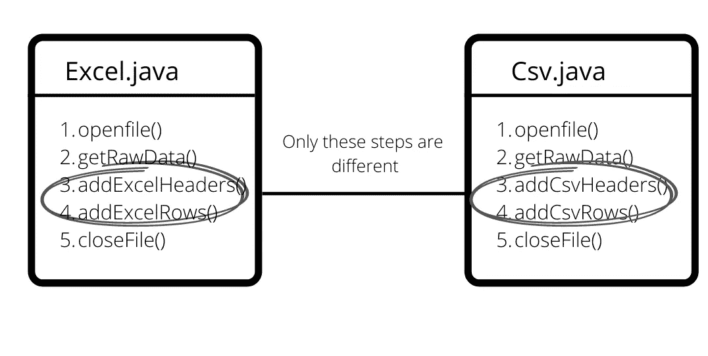
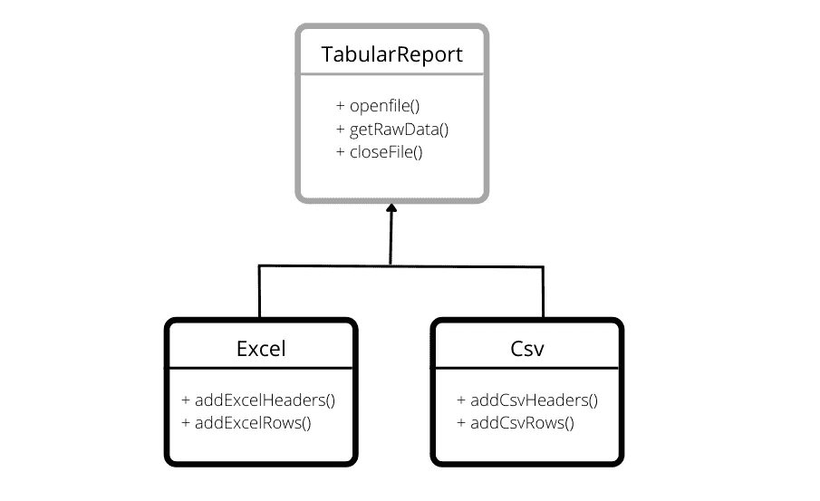

# 通过 JdbcTemplate 探索模板方法设计模式

> 原文：<https://betterprogramming.pub/exploring-the-template-method-pattern-through-jdbctemplate-4ee02ec9fcad>

## 模板方法模式的基础以及 JdbcTemplate 如何实现该模式


[良治](https://unsplash.com/@ryoji__iwata)在 [Unsplash](https://unsplash.com/photos/5siQcvSxCP8) 上的照片

最近我看到了这个关于设计模式的精彩视频。

关于如何学习设计模式的观点对我来说很有意义。

> 只有当你看到一个模式是如何在框架和库中实际使用的，你才会对这个模式有一个透彻的理解。

我看了很多设计模式的书和网上的资源，但是对于如何在一个真实的项目中使用每个模式，我仍然感到缺乏深入的了解。

仅仅阅读设计模式是很难应用的。除非你见过它们适用的真实情况，否则几乎不可能理解它们的真正价值。

这就像通过阅读一本书来学习骑自行车或游泳。你可以记住这些步骤——用你的左腿旋转方向盘，然后用右腿，一遍又一遍地重复这个动作——在你需要停下自行车的时候使用刹车。但是，如果你认为你已经准备好骑自行车，而没有练习使用辅助轮，你很可能会撞到树上。

将这些建议付诸实践，我决定养成一种习惯，研究 java 中流行的框架和库的内部结构，以理解不同的模式是如何被用来产生优秀的代码的。我会在一系列博客中记录我的学习成果。

让我们从模板方法模式及其在 JdbcTemplate 中的用法开始。我们还会看到设计模式在现实生活中的用法可能不完全像教科书上的模式。所以，你需要有敏锐的眼光。

但是首先，让我们回顾一下模板方法模式的基础知识。

# 什么是模板方法模式？

模板方法定义了算法的结构，并通过允许子类提供不同的实现，允许对一个或多个步骤进行细微的修改。

让我们看一个例子。

假设您正在创建各种表格文件格式的报告，如 excel、CSV 等。

下面是 excel 的代码:

现在是 CSV…

大部分代码看起来与我们刚刚在 Excel 中实现的代码非常相似。有很多重复的地方。



让我们将公共代码移到一个名为`TabularReport`的公共类中。

`TabularReport`中的`prepareReport()`是这里的模板方法，我们在这里定义了算法的框架来准备一个报表。它被声明为 final，因为我们不希望子类覆盖它，因为我们希望控制算法。

我们将第 3 步和第 4 步概括为`addHeaders()`和`addRows()`。因为 excel 和 CSV 将以不同的方式实现这些步骤，所以它们被声明为抽象的。

最后，我们需要创建 CSV 和 Excel 类。他们现在依靠`TabularReport`类来创建报告，只需要担心添加标题和行。



你可以看到我们是如何最大化代码重用的。

模板方法模式就是为算法创建一个模板。更具体地说，这是一种将算法定义为一组步骤的方法。这些步骤中的一个或多个被定义为抽象的，并由子类实现，从而确保算法的结构不变。

# 核心 Java 中的模板方法模式

这种模式在 Java 的很多库中都有使用。一个这样的地方是`AbstractList/AbstractSet`。这个类为 Java 中的各种列表集合提供了一些基本的列表行为实现，比如`ArrayList`和`LinkedList`。

`AbstractList`中模板方法的一个例子是`addAll()`方法，它用于将元素集合添加到列表中。它依赖于一个抽象方法`add()`。

子类只需要提供抽象的`add()`、`get()`和`set()`方法的实现。

如果你想创建自己的定制列表，你可以通过扩展`AbstractList`来实现，并通过使用它的模板免费获得基本的列表行为。

```
int [] array = { 2, 4, 6 };
EvenNumberList mylist = new EvenNumberList(array);
mylist.addAll(Arrays.*asList*(8, 10, 12));
mylist.subList(2, 4);
```

# JdbcTemplate 中的模板模式

现在是时候来一次短暂的春游了。对于那些没有使用过`JdbcTemplate`的人来说，它是一个 spring 库，简化了 java 中 Jdbc 的使用。它执行核心的 Jdbc 工作流，让应用程序代码只提供 SQL 查询和提取结果。您是否想到了最适合这个用例的模式？是的，你猜对了！模板方法模式。

这里我们感兴趣的示例模板方法是`execute`方法。

如您所见，模板方法控制算法:

1.  首先，它获得一个数据库连接。
2.  创建一个语句对象。
3.  将语句设置应用于语句对象。
4.  然后它调用使用`StatementCallback`接口提供的`action.doInStatement`。
5.  关闭语句对象
6.  释放数据库连接。

该方法的用户不必担心处理 Jdbc 连接的复杂性，仍然可以通过简单地实现`StatementCallback`接口来执行 SQL 查询。

这确保了算法的结构不变，也防止了错误。用户可以执行查询，而不会遇到无法关闭连接的麻烦。

```
jdbcTemplate.update("UPDATE Customers SET ContactName='James' where id=7")
```

## 但是这看起来和模板方法模式有什么不同吗？

你是对的！模板模式要求实现一个算法结构，并让子类改变它的某些部分。但是这里我们并没有子类化`JdbcTemplate`。我们将具体方法作为参数传递。

这看起来也像是一种策略模式。这是因为策略模式使用组合来改变行为，而模板方法使用继承。

但是请记住，在策略模式中，您编写的类控制整个算法。但是这里算法的形成仍然是用模板法。`execute()`的算法缺少了`doInStatement()`的一个步骤，你只需要提供一个实现它的类。所以，从那方面来说，它更像是模板方法。

但是这场辩论没有对错之分。这并不重要。我们只需要抓住设计的精神。

# 结论

我们看到了模板方法模式如何为我们提供代码重用的重要技术。我们还看到，设计模式在实际代码库中的实现可能与教科书模式略有不同。

检验您设计技能的下一步是开始使用模式重构您当前的项目。如果你没有经历过他们所解决的问题，你就不会完全理解他们。请记住，它们不是银弹。你的北极星应该是基本的设计原则，比如代码可读性、可重用性和可测试性。