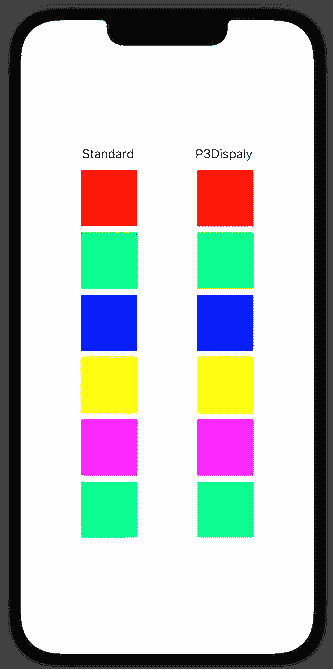
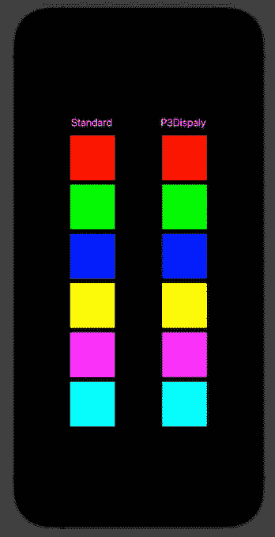
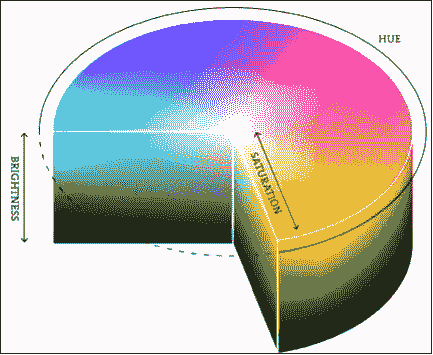
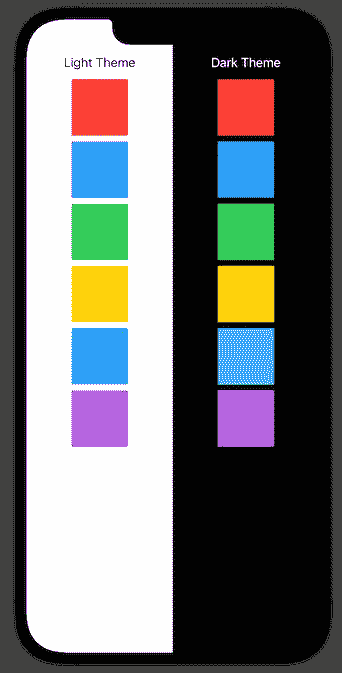
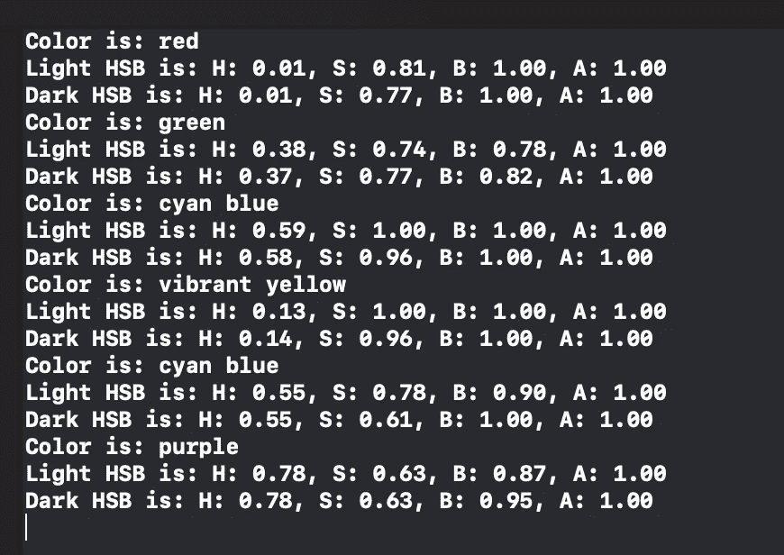

# 探索 iOS 中的 UIColor 和 Color APIs

> 原文：<https://betterprogramming.pub/exploring-the-uicolor-and-color-apis-in-ios-68c9ea7a2162>

## 如何充分利用色彩


罗伯特·卡茨基在 [Unsplash](https://unsplash.com?utm_source=medium&utm_medium=referral) 上的照片

我们都想运送高质量的产品，我们想尽可能快地运送它们。我们喜欢关注复杂的问题，快速处理我们重复编写的代码。

然而，俗话说，魔鬼在细节中。产品的质量恰恰在于这些细节:例如，精心设计的动画，或者正确按钮的正确颜色。

今天，我想深入探讨一下苹果提供的`UIColor`和`Color`API，并分享一些有用的技巧来增强你的应用。

# 显示 P3 支持

苹果在 iPhone 7 上发布了首款支持 P3 显示屏的设备。P3 显示器比标准显示器支持更广泛的颜色:宽 25%。最终结果是，你可以用更明亮的颜色编写更具表现力的应用程序。

下图显示了一组标准 RGB 颜色(左栏)和使用 P3 显示 API 的相同颜色(右栏)之间的差异。左边的模拟器设置的是浅色主题，右边的模拟器使用的是深色主题。



> 你必须有一个支持 P3 显示的显示器才能看出区别！

你可以看到左栏的颜色看起来比右栏暗。这两者之间的区别或多或少是显而易见的，取决于主题。

# 创建显示 P3 颜色

创建显示 P3 的 API 在 iOS 10 中就已经存在，所以您的项目可能支持它。

要在扩展色彩空间(有时也称为广色域)中创建 UIKit 颜色，您可以使用此`UIColor` init:

```
[UIColor.init(displayP3Red:green:blue:alpha:)](https://developer.apple.com/documentation/uikit/uicolor/1648568-init)
```

这四个值必须从 0 到 1，就像标准的`UIColor.init(red:green:blue:alpha:)`初始化器一样。

SwiftUI 的`Color`使用显示 P3 颜色空间创建它的初始化器:

```
[init(_:red:green:blue:opacity:)](https://developer.apple.com/documentation/swiftui/color/init(_:red:green:blue:opacity:))
```

色彩空间由第一个匿名参数标识。其默认值为`sRGB`，代表标准 RGB 色彩空间。然而，`[Color.RGBColorSpace](https://developer.apple.com/documentation/swiftui/color/rgbcolorspace)`枚举也包含了`[displayP3](https://developer.apple.com/documentation/swiftui/color/rgbcolorspace/displayp3)`值，这正是您所需要的。

# 从一个表象到另一个表象

RGB 并不是描述颜色的唯一可用的表示法。颜色也可以用使用色调、饱和度和亮度(HSB)的模型来描述。Apple 也为这种表示提供了一个 init:

```
// UIKit
[init(hue:saturation:brightness:alpha:)](https://developer.apple.com/documentation/uikit/uicolor/1621931-init)// SwiftUI
[init(hue:saturation:brightness:opacity:)](https://developer.apple.com/documentation/swiftui/color/init(hue:saturation:brightness:opacity:))
```

这些初始化器不太强调颜色的色调，但是让你可以更容易地使用它的饱和度和亮度。HSB 模型由以下圆柱体表示:



HSB 气缸。

*   色调参数从 0 到 1，代表色调。这些值映射到圆柱体从 0 到 360 度的角度。
*   饱和度参数从 0 到 1，代表您想要的颜色色调。值 0 表示灰色。
*   亮度参数代表颜色的亮度。值 0 以黑色结束。

针对 iOS 10 或更新版本链接的应用程序，HSB 表示会使用 P3 显示器的扩展颜色范围自动渲染，因此您可以免费获得更亮的颜色。

# 我们如何使用 HSB 模型？

通过观察一些适应当前主题的默认颜色，您可能会发现颜色的色调保持不变，而当从亮主题转到暗主题时，颜色的饱和度和亮度会发生变化。

您可以利用 HSB 模型为浅色和深色主题自动创建良好的颜色，而无需手动指定两种不同的颜色。



# 自动化浅色/深色

作为一个实验，你可以写一个小脚本来检查苹果是如何改变这些值的。脚本可能是这样的:

您可以在注释中看到各种操作:

1.  该脚本为明暗主题定义了一个`UITraitCollection`。
2.  它定义了一组可以探索的颜色。
3.  对于每种颜色，它获得亮值和暗值。
4.  它获取 HSB 值。
5.  它打印这些值。

第 17 行和第 18 行的`hsba`属性是我准备的自定义属性，它返回颜色的`HSBA`表示。该属性的代码如下:

注释中解释了代码，但简而言之，它定义了一个帮助器`HSBAColor`结构来收集值并在控制台中轻松地打印它们。

`hsba`属性只是使用`UIColor`提供的实用工具`[getHue(_:saturation:brightness:alpha:)](https://developer.apple.com/documentation/uikit/uicolor/1621949-gethue)`函数来提取我们需要的值。

执行的结果如下:



您可以观察到:

*   系统颜色的色调几乎保持不变。
*   大多数情况下，饱和度会降低约 5–10%。
*   在大多数情况下，亮度增加约 5-10%。

因此，你可以推断深色可以描述为:

```
hue(dark) = hue(light)
saturation(dark) = saturation(light)-0.07
brightness(dark) = brightness(light)+0.07
```

> 警告如果你和一个为明暗主题都提供值的设计师一起工作，使用它们，不要使用这种启发式。
> 
> 这有利于开发一个支持两种主题的应用程序或原型，而无需投入大量时间来设计完美的调色板。
> 
> UI 设计师有挑选合适颜色的经验，结果会比你自动生成的任何组合好得多。

# 自动创建动态颜色

现在，你必须创造你的动态颜色。苹果颜色是一种特殊的`DynamicSystemColor`类型，不能在客户端代码中实例化。网上有很多描述如何创建动态颜色的文章，它们都决心使用这个构造函数:

```
[init(dynamicProvider:)](https://developer.apple.com/documentation/uikit/uicolor/3238041-init)
```

这个初始化器采用了`([UITraitCollection](https://developer.apple.com/documentation/uikit/uitraitcollection)) -> [UIColor](https://developer.apple.com/documentation/uikit/uicolor)`形式的闭包:你可以返回一个基于`UITraitCollection.userInterfaceStyle`属性的颜色，它告诉你当前的应用程序主题。

您也可以在这个初始化式中应用上一节中的启发法:

这个代码片段声明了一个静态函数来创建一个动态颜色，从一个`UIColor`开始。首先，它提取了`hsba`结构。然后，它使用这个结构来创建初始颜色的深色表示。最后，它用`dynamicProvider`初始化器返回颜色。

你可以这样使用它:

```
UIColor.dynamicColor(UIColor(displayP3Red: 0.75, green:0.25, blue: 0.33, alpha: 1)
```

如果你想要一个更好的 API，类似于苹果的方法，你可以创建一个静态属性作为返回`dynamicColor`的`UIColor`的扩展。如果需要，您也可以将其与另一个属性一起引入 SwiftUI:

```
// Extending UIColor with dynamic properties...
extension UIColor {
  static var myColor = UIColor.dynamicColor(UIColor(displayP3Red: 0.75, green:0.25, blue: 0.33, alpha: 1)}// ...and porting them to SwiftUI
extension Color {
  static var myColor = Color(uiColor: .myColor)
}
```

# 结论

今天我们探讨了 iOS 颜色的几个方面:

*   标准 RGB 和显示 P3 色彩空间之间的差异。
*   RGB 与色调、饱和度和亮度(HSB)表示之间的差异。
*   如何从浅色自动生成深色？
*   如何创造动态色彩来回应明暗主题？

我希望这篇文章能激励你花些时间去探索苹果的 API，甚至是基本的 API:有时，我们可以通过使用合适的 API 获得巨大的成功，并做出更好的产品。

记住，使用你的颜色的 DisplayP3 版本，而不是普通的 RGB 版本！