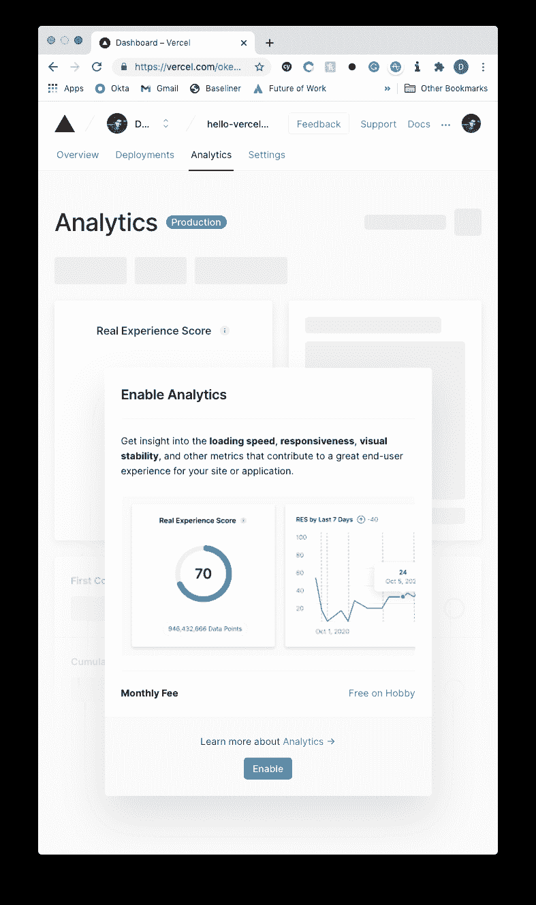
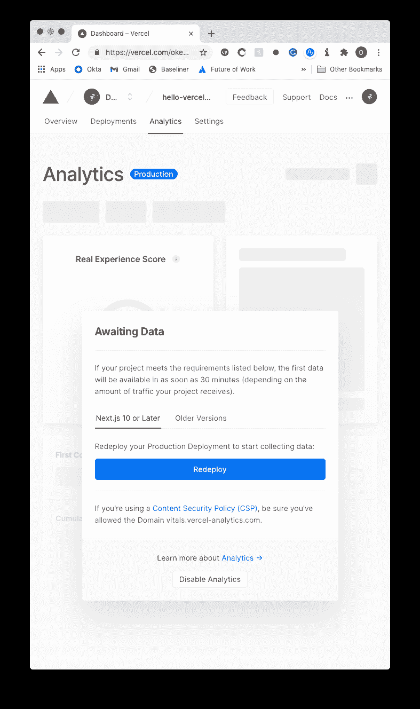
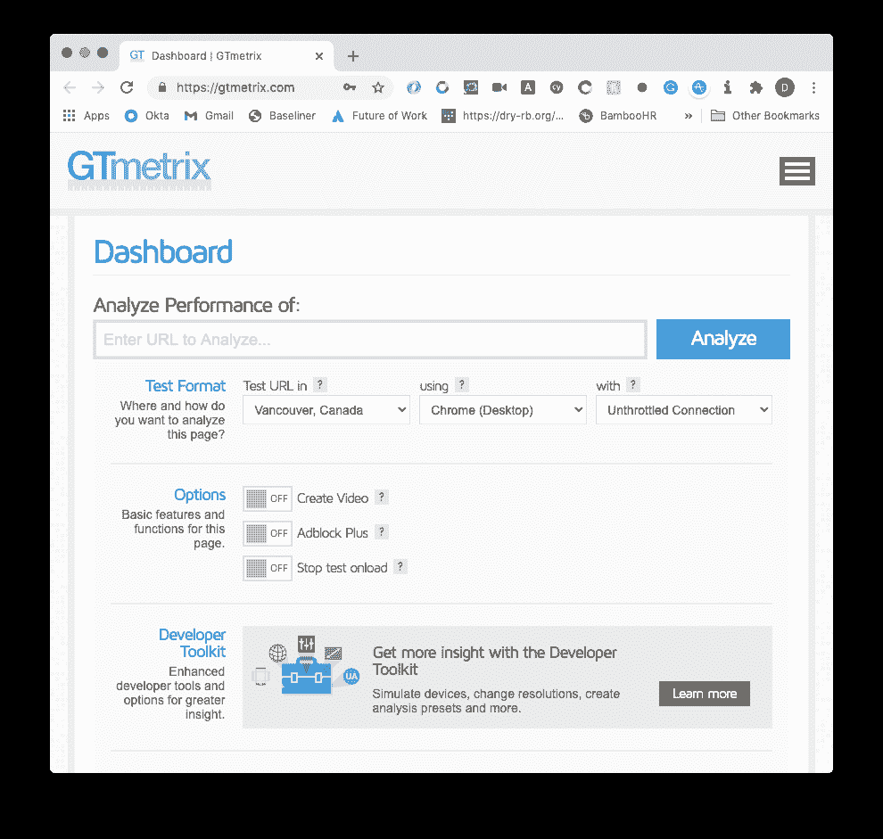
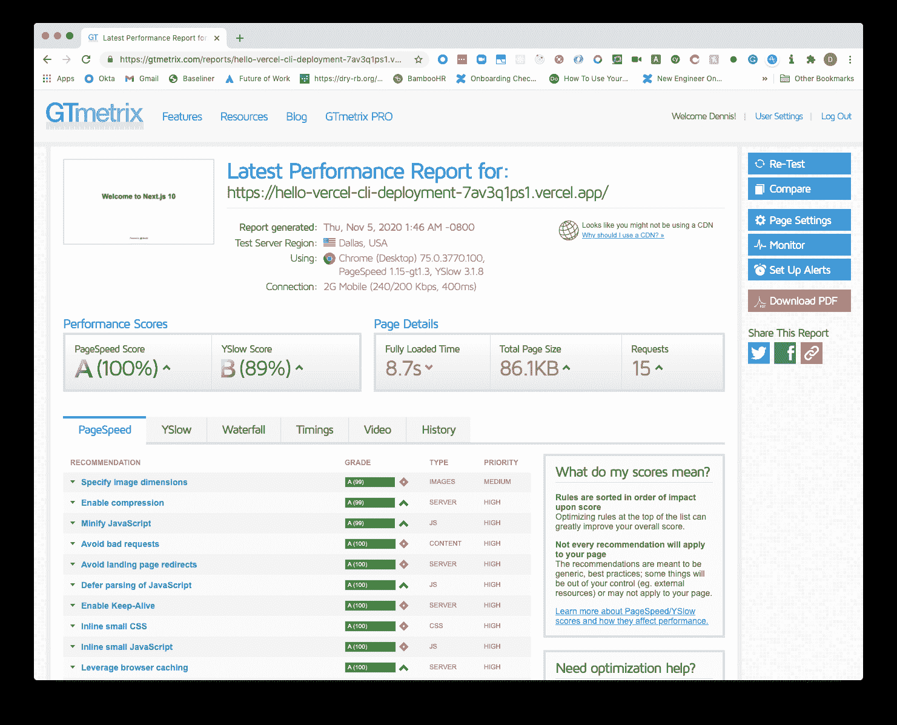
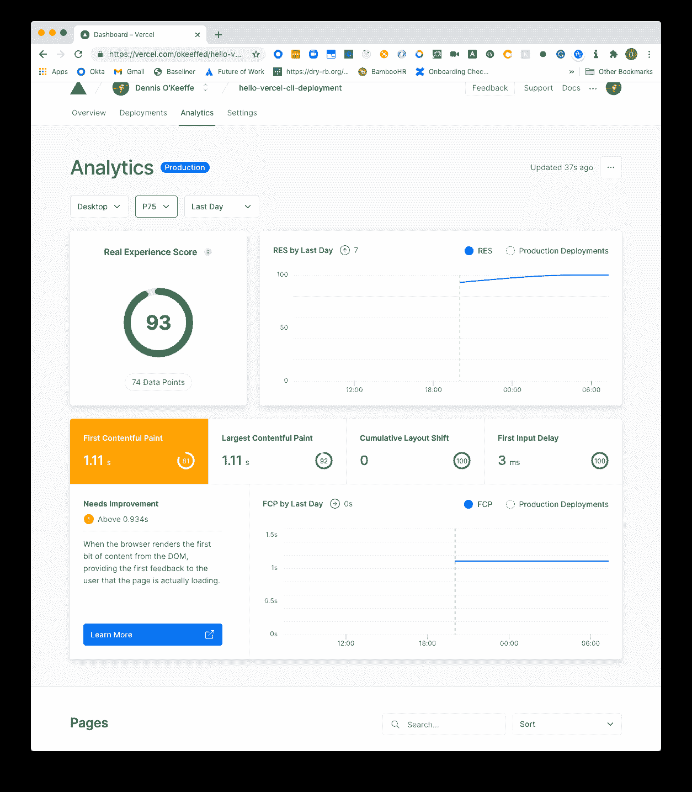
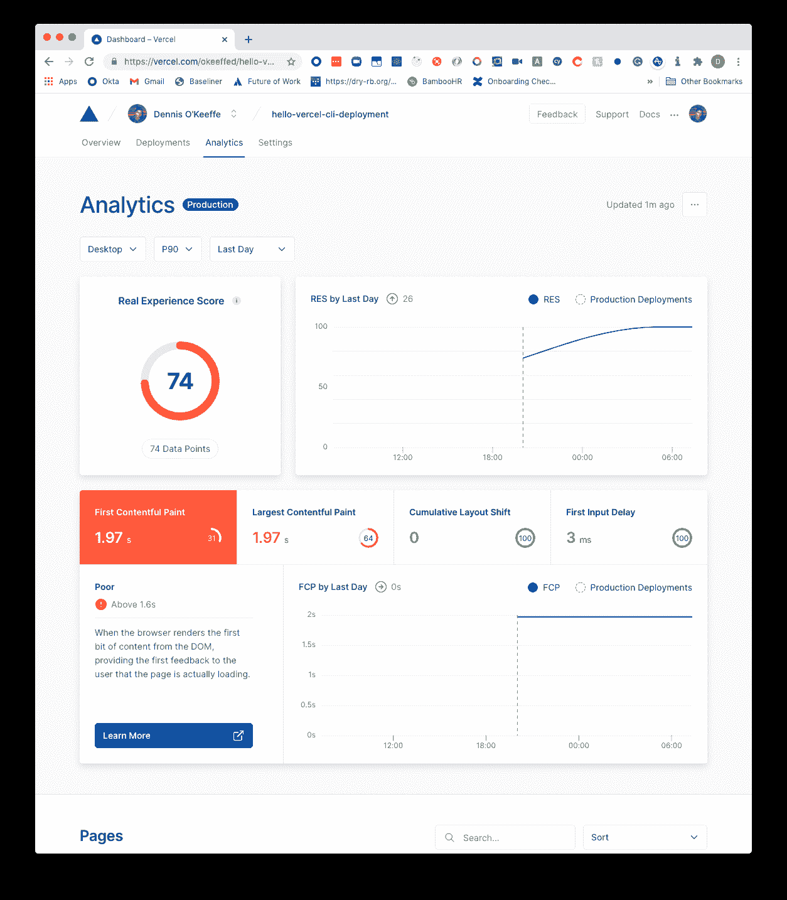
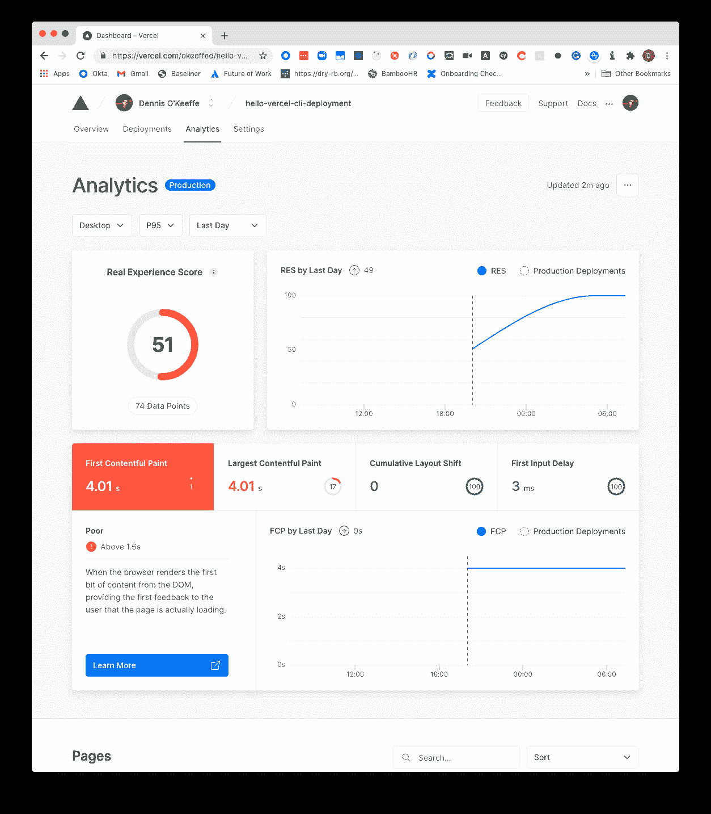
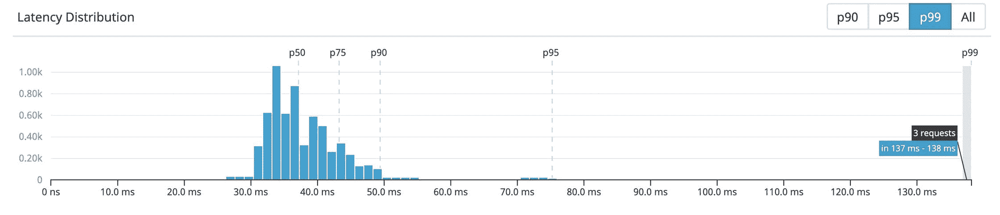

# 使用 Next.js 10 和 GTMetrix 探索 Vercel 分析

> 原文：<https://betterprogramming.pub/exploring-vercel-analytics-using-next-js-10-and-gtmetrix-f70a8e1bb7f7>

## 使用 GTMetrix 向您的新 Vercel Analytics 设置添加一些数据点，并浏览结果概述

*图片来源:* [*国家癌症研究所*](https://unsplash.com/@nci)

Vercel 在他们最近的 Next.js 会议上宣布了他们新的[分析功能](https://nextjs.org/analytics)，好消息是——现在可以现场试用了！

在我最近的[文章](https://blog.dennisokeeffe.com/blog/2020-11-05-deploying-with-vercel-cli/)中，我向 Vercel 部署了一个简单的 Next.js 10 应用程序。现在是时候测试一些新特性了！

在这篇文章中，我们将介绍如何在 Vercel 托管的 Next.js 10 项目上启用 Vercel Analytics，然后使用 [GTMetrix](https://gtmetrix.com/) 来帮助发送来自全球各地的一些请求(针对各种速度使用节流)，我们的分析可以收集这些请求(在任何其他潜在的站点访问之上)。

# Vercel Analytics 的“什么”

了解提供什么的一个好方法是通读 Vercel 的[分析概述](https://vercel.com/docs/analytics/overview#hosted-on-vercel)。

它涵盖了定价、每层能得到什么、支持哪些框架(Next.js 10+，Gatsby 2+)等内容。它还概述了你得到的每一个指标，以及为什么这些指标在现代 web 开发中如此重要。

虽然我不会涵盖上述概述中的内容，但我将探索一些被摄取和计算的数据点。

# 启用 Vercel 分析

这假设您当前在 Vercel 上有一个 Next.js 10 项目。如果你没有，但想要一个，跟随我最近的帖子上传一个基本的网站。

一旦完成，前往您的 [Vercel 仪表板](https://vercel.com/dashboard)并选择您想要启用分析的项目。我直接从我以前的博客文章中选择了这个项目。

一旦进入项目页面，从顶行选择“分析”，你会看到一个“启用分析”按钮。如果您在免费层，请不要担心——概述告诉我们，在爱好层，您有资格保留一天，每天最多 100 个数据点，100%的采样率。

*注意:在爱好计划中，只能对单个 Vercel 项目启用分析。教程结束后，您可以随意禁用它。*

在“分析”选项卡上，您将看到以下模式:

选择“Enable”，Vercel 将提示您使用启用了分析的构建进行重新部署。完成后，Vercel 会友好地告诉您它正在等待数据:

# 玩弄 GTMetrix

[GTMetrix](https://gtmetrix.com) 这样描述自己:

> “GTmetrix 是一款免费工具，可分析您页面的速度性能”

GTMetrix 非常酷的一点是，您可以使用该网站从不同的位置、在不同的浏览器上、以不同的速度模拟(想想高速宽带、2g 等)发出请求。).

这对于对照你自己的网站来测试你自己是很棒的，但是这也是开始为 Vercel 创建一些数据点以向我们报告的好方法！

*注意:从 GTMetrix 和 Vercel Analytics 返回的指标测量不同的东西。查看更多有关 Vercel 概述资源的链接，了解 Vercel 测量的内容及其重要性。*

我在 GTMetrix 上创建了一个帐户。在主页顶部，你可以简单地复制并粘贴你的 Vercel 应用程序网站的 URL，然后开始修改设置。

我修改了设置，用不同的位置和设置对应用程序进行了多次手动调用——你可以在下面看到一些调整后的结果:

在进行了几次这样的拜访后，我决定今晚到此为止，玩等待游戏。

# 查看分析

早上回到我的 Vercel 仪表板，我们有一些数据点可以看到:

太神奇了！我们起飞了！

虽然我会让官方概述解释每个指标指的是什么，但我会通过引用一篇来自 [DataDog 博客帖子](https://www.datadoghq.com/blog/set-and-monitor-slas/)(转而引用[站点可靠性工程](https://landing.google.com/sre/books/))的精彩摘录来解释我上面分享的截图:

> *“使用百分位数作为指标，可以让您考虑分布的形状及其不同的属性:高阶百分位数，如第 99 或 99.9 个百分位数，向您显示可能的最坏情况值，而使用第 50 个百分位数(也称为中位数)则强调典型情况”*

我将从 DataDog 帖子中复制图像地址，因此希望该地址能够经受住时间的考验，让您清楚地了解这意味着什么:

在上图中，你可以看到 p99 处理的是最差的异常值，而 p50 则更好地展示了你的典型用户。

这同样适用于您在我的仪表盘上看到的分析。p75 指标将显示该用户可能的最坏情况，p90 和 p95 也是如此。

过滤掉这些百分位数的能力，即使是在爱好层，对于从真实世界的用户那里获得度量和洞察力也是非常有价值的！这将使你能够根据你的人口统计数据，做出你应该或不应该关注的最佳决定。

本文介绍了如何使用 Next.js 10 项目来设置 Vercel Analytics，然后通过页面速度服务来模拟一些真实世界的指标，最后从较高的层面上了解了返回的数据。

Vercel(前 Zeit)多年来一直在开发 badass 工具和服务，他们的平台是一流的。

在我深入研究 Vercel 和 Next.js 10 在后续文章中提供的一些新选项时，请务必回来查看。

# 资源和进一步阅读

*   [Vercel Analytics](https://nextjs.org/analytics)
*   [Vercel 上托管的分析概述](https://vercel.com/docs/analytics/overview#hosted-on-vercel)
*   [DataDog Post 包括百分位数的定义](https://www.datadoghq.com/blog/set-and-monitor-slas/)
*   [使用 Vercel CLI 部署 Next.js 10 和 Vercel GitHub 集成](https://blog.dennisokeeffe.com/blog/2020-11-05-deploying-with-vercel-cli/) [GTMetrix](https://gtmetrix.com)
*   [现场可靠性工程书](https://landing.google.com/sre/books/)