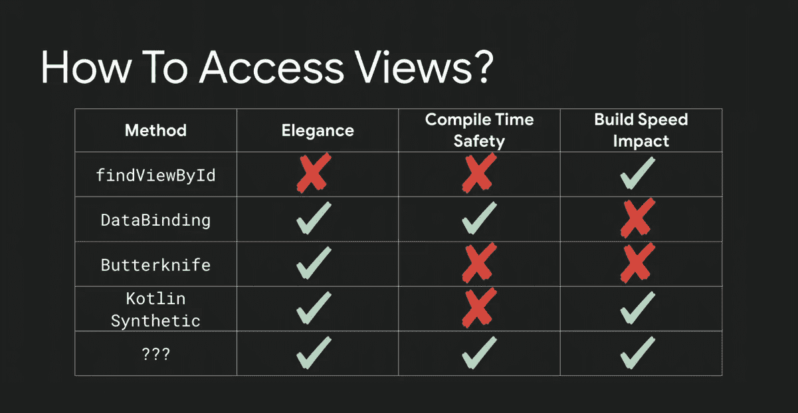

# 深入探索 Android 视图绑定

> 原文：<https://betterprogramming.pub/exploring-viewbinding-in-depth-598925821e41>

## 使用带有<include>、<merge>、适配器、片段和活动的 ViewBinding</merge></include>



来源:[谷歌 I/O 2019](https://youtu.be/Qxj2eBmXLHg?t=506)

谷歌在谷歌 I/O 2019 的[Android 新功能会议](https://youtu.be/td3Kd7fOROw?t=1758)中引入了视图绑定。

在[架构组件的新特性](https://youtu.be/Qxj2eBmXLHg?list=PLWz5rJ2EKKc9FfSQIRXEWyWpHD6TtwxMM&t=447)中有一个关于视图绑定的简短讨论，它比较了视图绑定与现有解决方案，并进一步讨论了为什么视图绑定比数据绑定或 Kotlin synthetics 等现有解决方案更好。

对我来说，Kotlin synthetics 工作得很好，但所有 ID 都驻留在一个全局名称空间中，因此如果您使用同名的 ID，并且如果您从错误的布局中导入 ID，您将会崩溃，因为 ID 不是当前布局的一部分，除非您运行应用程序并转到该布局，否则无法提前知道这一点。

下面这篇文章很好地概述了 Kotlin 合成材料的问题。

[](https://proandroiddev.com/the-argument-over-kotlin-synthetics-735305dd4ed0) [## 关于科特林合成品的争论

### 这一切都始于一条提交消息

proandroiddev.com](https://proandroiddev.com/the-argument-over-kotlin-synthetics-735305dd4ed0) 

视图绑定将在 Android studio 的 3.6 稳定版本中提供，但如果你想尝试它，你需要下载 Android Studio 3.6 RC 3。
编辑:作为 Android Studio 3.6 稳定版的一部分，视图绑定现在对每个人都可用。

视图绑定的主要优点是所有的绑定类都是由 [Gradle](https://gradle.org/) 插件生成的，所以它对构建时间没有影响，并且具有编译时安全性(我们将在示例中看到)。

让我们从启用视图绑定开始。我们需要将以下内容添加到模块的`build.gradle`文件中:

```
// Android Studio 3.6.X
android {
    viewBinding {
        enabled = true
    }
}// Android Studio 4.0+
android {
    buildFeatures {
        viewBinding = true
    }
}
```

注意:视图绑定是在一个模块接一个模块的基础上启用的，所以如果您有一个多模块项目设置，您需要在每个`build.gradle`文件中添加上面的代码。

如果你想禁用视图绑定特定布局，那么你需要添加`tools:viewBindingIgnore=”true”`到布局文件的根视图。

启用它后，我们可以立即开始使用它，当您完成同步您的`build.gradle`文件时，所有的绑定类都会默认生成。

它通过将 XML 布局文件名转换为 camel 大小写并在末尾添加`Binding`来生成一个绑定类。例如，如果你的布局文件被命名为`activity_splash` ，那么它将生成绑定类`ActivitySplashBinding`。

# 我如何使用它？

## 在活动中

我们有一个名为`activity_splash` 的布局文件，其中有一个 ID 为`tvVersionName` 的`TextView`，所以在使用视图绑定时，我们所要做的就是获取绑定类的引用，比如:

```
val binding: ActivitySplashBinding = ActivitySplashBinding.inflate(layoutInflater) 
```

并在返回我们布局的根布局的`setContentView()`方法中使用它的`getRoot()`。可以从我们创建的绑定类对象中访问视图，我们可以在创建对象后立即使用它，如下所示:

```
binding.tvVersionName.text = getString(R.string.version)
```

这里，绑定类知道`tvVersionName` 是一个`TextView`，所以我们不必担心类型转换。

## 成碎片

在片段中使用视图绑定略有不同。我们需要传递`LayoutInflator`、`ViewGroup`和一个通过覆盖`onCreateView()`得到的`attachToRoot`布尔变量。

我们还需要通过调用`binding.root`返回根视图来返回视图。您还注意到我们使用了两个不同的变量，并且在`onDestroyView()`中`_binding`变量被设置为空。

这是因为片段的生命周期不同于活动的生命周期，片段可以比它们的视图活得更久，所以如果我们不将它设置为 null，就可能会出现内存泄漏。

另一个变量是通过使一个变量为空，另一个为非空来避免使用`!!`的空检查。

## 在 RecyclerView 适配器中

`row_payment.xml`是我们的`RecyclerView`行的项目布局文件，这就是为什么会生成`RowPaymentBinding` 类。

现在，我们需要做的就是调用`inflate()`方法，传递`onCreateViewHolder()`中可用的所需参数，传递我们的`PaymentHolder` 类的主构造函数中生成的绑定类对象，并将`itemBinding.root`传递给`RecyclerView.ViewHolder()`构造函数。就是这样。

# 处理 <include>d 布局</include>

视图绑定可与`<include>`布局标签一起使用。布局中通常包含两种`<include>`标签，有或者没有`<merge>` *。*

*   `<include>`不带`<merge>`。

我们需要给`<include>`分配一个 ID，然后使用这个 ID 访问包含的布局中的视图。让我们来看一个例子。

在上面的代码中，我们在布局文件中包含了一个公共工具栏，`<include>`有一个`android:id=“@+id/appbar”` ID，我们将使用它从`app_bar.xml`访问工具栏，并将其设置为我们的支持动作栏。

*   `<include>`同`<merge>`。

有时我们有一个带有`<merge>`标签的布局，当一个布局包含在另一个布局中时，它有助于消除视图层次中的冗余视图组。

这个布局像往常一样包含在我们的布局文件中。

如果我们试图给这个`<include>`一个 ID，视图绑定不会在绑定类中生成 ID，所以我们不能像在普通包含的情况下那样访问视图。

在这种情况下，我们有`PlaceholderBinding` ，它是为`placeholder.xml`(我们的`<merge>`布局文件)自动生成的类。我们必须调用它的`bind()`方法，并传递包含它的布局的根视图。

然后，我们可以像`placeholderBinding.tvPlaceholder.text`一样从我们的类中访问`placeholder.xml`中的视图。

感谢阅读。我很想在评论中听到你的意见。

# 来源:

*   [Android 开发者文档—视图绑定](https://developer.android.com/topic/libraries/view-binding)