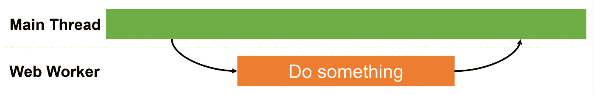
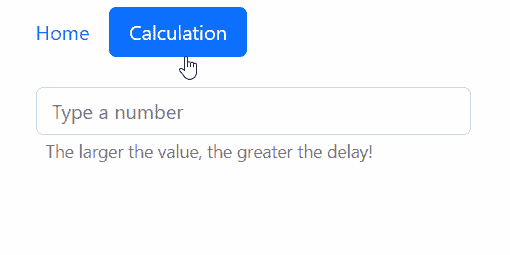
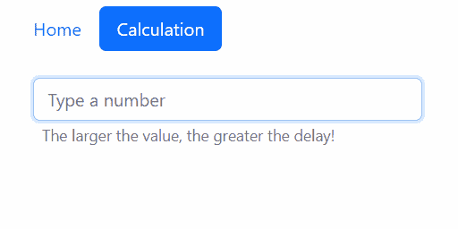

# 在 Angular 中探索网络工作者

> 原文：<https://betterprogramming.pub/exploring-web-workers-in-angular-84b9949a4fab>

## 如何提高 Angular 中 web workers 的应用程序性能和用户体验


Johannes Plenio 的照片:[https://www . pexels . com/photo/selective-focus-photography-of-two-men-builder-figures-1445324/](https://www.pexels.com/photo/selective-focus-photography-of-two-men-builder-figurines-1445324/)

这篇文章是关于——你猜对了 Angular 的网络工作者的。

Web workers 允许我们在主线程之外执行 JavaScript。我们将展示它们如何提高应用程序性能和用户体验。

更多的线程意味着同时完成更多的事情。但是权力越大，责任越大。我们需要管理和同步线程。

看来我们有几个要点要谈。

我们开始吧！

# 行动前的几句话

Angular 是一个基于类型脚本的框架，用于构建单页面 web 应用程序。 [TypeScript](https://www.typescriptlang.org/) 是 JavaScript 的超集。

但是，您可能已经知道，浏览器只能理解 JavaScript。因此，Angular 项目中的一切都必须“移植”到 JavaScript 中。

JavaScript 是单线程语言；因此，任何应用程序都是用。一切都运行在一个线程上，也就是所谓的主线程。

在任何给定的时刻，单线程只能做一件事。当运行计算开销很大的命令时，这可能会有问题。


假设我们的应用程序需要执行繁重的计算或呈现大型图表。在某个时刻，当主线程努力完成所有工作时，应用程序冻结了。

真扫兴。有没有办法避免这种情况，提高用户体验？

输入 web workers！

MDN 文档称，“ [Web workers](https://developer.mozilla.org/en-US/docs/Web/API/Web_Workers_API/Using_web_workers) 是 Web 内容在后台线程中运行脚本的简单方法。”

Web workers 是独立的线程，可以在后台运行脚本，而不会干扰主线程。它们可以独立运行，而不会影响页面的性能。



大多数现代浏览器在其最新版本中支持 Web Workers。

这听起来很有希望。让我们看看他们的行动吧！

# 网络工作者在行动

我们的演示应用程序有一个执行计算的页面，routed `CalculationComponent`。

它有一个接收数字的输入字段。根据用户输入的数字，它执行计算。嗯……算是吧。

下面是模板文件。为了简单起见，我们省略了 CSS 类。您可以在本文末尾的 GitHub 资源库链接中找到完整的代码片段版本。

分别地，我们有类文件。每当用户键入一个数字时，就会调用`modelChange`方法，该方法又用`newValue`调用`calculate`函数(第 13 行)。

我们将在两个地方使用`calculate`函数，所以我们在一个单独的文件中声明它(稍后会详细介绍)。

好吧，你抓到我们了！

对于我们的演示，我们不执行任何真正的计算。相反，我们通过循环 N 秒来创建一个人工延迟，其中 N 是用户键入的数字。

## 问题是

让我们看看这是什么样子。



注意到页面冻结了两秒钟吗？

数字越大，UI 变得无响应的时间越长(对于几个真实的计算都是如此)。在此期间，用户不能与页面进行交互。

另一个你可能没有注意到的问题是,“计算…”标签从来没有显示过。主线程太忙，以至于无法呈现这一变化。

这就是网络工作者发挥作用的地方。

## 创建 web worker

我们通过在终端中运行以下命令来创建一个 web worker:

```
ng g web-worker calculation
```

这为我们做了几件事:

1.  它创建了一个`calculation.worker.ts`，我们将在其中调用`calculate`函数，也就是阻塞主线程的部分。
2.  它创建一个`tsconfig.worker.json`文件，这是工作配置。
3.  它在`angular.json`文件中添加选项`"WebWorkerTsConfig: "tsconfig.worker.json"`。

`calculation.worker.ts`文件最初包含支架代码，如下所示:

延迟的来源是`calculate`功能。因此，我们需要将它的调用转移到 worker。

注意，我们从我们前面谈到的单独的`calculation.ts`文件中导入了`calculate`函数。

你可能想知道，我们需要一个单独的文件吗？我们不能在组件类文件中声明函数并从那里导入它吗？

事实证明，答案是否定的。我们不能。

如果我们这样做了，Angular 就会抛出一堆编译错误，表明 web worker 的编译单元中没有可用的 DOM 类型。

这是因为 web 工作者的一个主要限制是他们不能访问 DOM。

根据[这个评论](https://github.com/angular/angular-cli/issues/20393#issuecomment-808920566)，“如果你从一个库中导入一个单独的函数，那么整个库需要与当前的编译类型兼容，无论是 web worker、浏览器还是 Node.js。”

在我们的例子中，“库”是组件类文件。显然，这并不意味着在没有 DOM 类型的情况下就可以编译，比如说，在 web worker 中，因此会出现错误。

## 使用 web worker

接下来，我们需要修改当前的实现来使用 web worker。

Web workers 和主线程可以通过消息进行通信和发送数据。

Web worker API 提供了一个用于向 Worker 发送消息和从 Worker 接收消息的`postMessage`方法，以及一个用于接收和响应消息的`onmessage`事件处理程序。

*   在第 22–24 行，我们创建了一个新的`Worker`。
*   在第 25 行，我们将`isCalculating`设置为`true`，这样就显示出“正在计算…”标签。
*   在第 26 行，我们使用`postMessage`方法调用 worker 并传递来自主线程的输入值。
*   在第 27–30 行，我们为 web worker 的`onmessage`事件处理程序分配了一个匿名函数。收到结果后，我们将其分配给类变量`result`，然后将`isCalculating`设置为`false`。

## 有备用计划

墨菲定律指出，“如果任何事情都可能出错，它就会出错。”

在我们的例子中，这意味着用户的浏览器(或环境)不支持 web 工作者。这就是为什么我们需要这种情况下的后备解决方案。

在第 12 行，我们检查 web workers 是否受支持。如果不是，我们从主线程调用`calculate`函数。我们还可以显示一条消息来提醒用户。

这远非理想。

另一种选择是将计算分成几个部分，执行一部分计算，然后使用`setTimeout`调度下一部分在以后某个时间运行。这将释放主线程一段时间，防止它阻塞。

我们还没完呢！

# 多线程和同步

网络工作者解决了我们的问题。将工作负载转移到后台线程允许主线程响应用户交互。

可悲的是，拥有多线程会产生另一种问题。

让我们再次回顾一下演示应用程序。



用户键入“3”，然后改变主意，清空字段，并键入“1”

键入“3”创建的线程 A 将在三秒钟内响应。键入“1”会创建线程 B，它将在一秒钟内做出响应。线程 B 将首先响应并显示其结果。到目前为止，一切顺利。

几秒钟后，线程 A 也会响应并替换之前的结果。最终可见的结果是来自线程 A，而不是线程 B！

当使用多线程时，我们可能不得不处理多线程带来的各种问题，比如并发和同步问题。总的来说，这些问题很难解决。

在我们的例子中，解决方案非常简单。在创建一个新线程之前，我们终止了前一个线程(第 16 行)。我们可以这样做，因为我们总是保存当前工人的引用(第 26–28 行)。

你可以在[这个 GitHub 库](https://github.com/kagklis/ng-web-workers-demo)里找到代码。

别忘了 [**订阅我的简讯**](https://vkagklis.medium.com/subscribe) 继续关注更多这样的内容！

# 结论

在本文中，我们讨论了 Angular 中的 web workers。

使用 web workers 在后台执行耗时的计算。但是不要盲目地将它们用于已经很快且不阻塞的东西。要知道多线程不是免费的。它可能会在您的应用程序中引入同步问题。

在我们的下一篇文章中，我们将探索如何使用 web workers 呈现图表，并详细讨论它们的一些主要限制。

感谢阅读。敬请关注更多内容。

打算加入 Medium？会员费为 5 美元/月，可以无限制地阅读媒体上的所有报道。使用我的推荐链接:

[](https://kagklis.medium.com/membership) [## 通过我的推荐链接加入 Medium—kakk lis Vasileios

### 阅读 Kagklis Vasileios(以及媒体上成千上万的其他作家)的每一个故事。您的会员费直接…

kagklis.medium.com](https://kagklis.medium.com/membership)