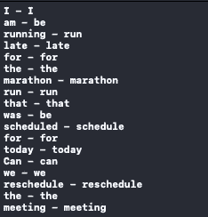
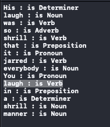
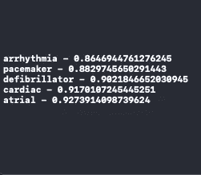
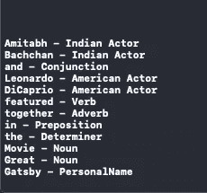

# 在 iOS 中使用苹果的自然语言框架探索单词嵌入和文本目录

> 原文：<https://betterprogramming.pub/exploring-word-embeddings-and-text-catalogs-with-apples-natural-language-framework-in-ios-b4d9164f5a3b>

## 了解 NLGazetteer、NLWordEmbedding 和其他 NLP 功能如何在 Apple 的自然语言框架中工作


照片由[瑞恩·华莱士](https://unsplash.com/@accrualbowtie?utm_source=medium&utm_medium=referral)在 [Unsplash](https://unsplash.com?utm_source=medium&utm_medium=referral) 上拍摄

早在 iOS 5 SDK 时就已推出的,`NSLinguisticTagger`为苹果在 WWDC 18 大会上宣布他们的自然语言框架铺平了道路。从语言识别到词汇化和词性标注，所有这些都出现在`NSLinguisticTagger`中，现在是自然语言框架的一部分，其 API 在 Swift 中进行了彻底的重新设计。

自然语言框架相对于`NSLinguisticTagger`的额外好处是能够使用定制的 NLP 模型。

在 WWDC 2019 期间，苹果宣布了其自然语言框架的几个强大的新工具的到来。引入的三个值得注意的:

*   内置情感分析
*   单词嵌入
*   文本目录

在我们深入研究这些特性之前，让我们快速浏览一下苹果自然语言框架中已经存在的重要 API。

# 探索 Apple 的 NLP APIs

[自然语言处理](https://heartbeat.comet.ml/the-7-nlp-techniques-that-will-change-how-you-communicate-in-the-future-part-i-f0114b2f0497)负责将非结构化文本数据作为输入，并在其上推断出许多可能的观察结果。以下是 iOS 中用于 NLP 以智能方式处理文本的一些关键 API。

# 语言识别

`NLLanguageRecognizer`帮助我们从字符串中确定一段文本的语言，如下所示:

```
import NaturalLanguagevar str = "Hola"let recognizer = NLLanguageRecognizer()recognizer.processString(str)if let languageCode = recognizer.dominantLanguage?.rawValue{let detectedLangauge = Locale.current.localizedString(forIdentifier: languageCode)print(detectedLangauge) //prints Spanish}
```

`NLLanguageRecognizer`类使得从文本的上下文中确定主要的语言代码成为可能。此外，API 还提供了返回所预测语言的可信度的功能。

以下函数返回预测为语言代码字典和概率值的前 5 种语言:

```
recognizer.languageHypotheses(withMaximum: 5))
```

目前，苹果的自然语言识别 API 不如 Firebase 准确。像印地语这样的语言(我在多种文本上进行了测试)目前还不能被`NLLanguageRecognizer`从上下文中识别出来。

# 标记化

标记化是将字符串拆分成单词、句子、字符或段落的过程。然后，根据使用情况，可以一起或单独处理这些分段的文本。为了标记一个字符串，使用了`NLTokenizer`类。

我们需要指定应该对字符串进行标记的`unit`类型。基于分配的单元方案，文本被分类。在下面的代码中，每个问题被分成不同的标记:

```
import NaturalLanguagevar str = "How are you? Where were you?"let tokenizer = NLTokenizer(unit: .sentence)tokenizer.string = strtokenizer.enumerateTokens(in: str.startIndex..<str.endIndex) { tokenRange, _ inprint(str[tokenRange])return true}
```

# 词汇化

词汇化是将一个词转换成它的基本形式的过程。在你的 NLP 应用程序中，你经常会遇到一些用例，在这些用例中，几个单词之间唯一的区别就是它们使用的时态。例如,“假设”和“假设”是“假设”一词的不同用法，但具有相同的核心含义。

词汇化通常用于单词标记和模糊匹配(识别拼写错误的单词，就像你在谷歌搜索中看到的一样)。下面的代码展示了如何用`NLTagger`实现词汇化:

```
var text = "I am running late for the 10 km marathon run that was scheduled for today. Can we reschedule the meeting?"let tagger = NLTagger(tagSchemes: [.lemma])
tagger.string = texttagger.enumerateTags(in: text.startIndex..<text.endIndex, unit: .word, scheme: .lemma) { tag, tokenRange inif let tag = tag {print("\(text[tokenRange]) - \(tag.rawValue)")}
return true
}
```



# 词性和命名实体识别

自然语言框架还具有将语音或句子中的单词分类和识别为名词、代词、动词、形容词、介词、习语等的能力。词性标注是使用`NLTagger`完成的。

这并不像听起来那么简单，因为同一个单词可以根据语义上下文标记为动词或名词。自然语言框架决定了适当的词法类。

在下面的代码中，我们使用了与之前相同的`NLTagger`，但是指定了不同的`scheme`:

```
import NaturalLanguagevar text = "His laugh was so shrill that it jarred everybody. You laugh in a shrill manner."let tagger = NLTagger(tagSchemes: [.lexicalClass])
let options : NLTagger.Options = [.omitWhitespace, .omitPunctuation]tagger.string = texttagger.enumerateTags(in: text.startIndex..<text.endIndex, unit: .word, scheme: .lexicalClass, options: options) { tag, tokenRange inif let tag = tag {print("\(text[tokenRange]) : is \(tag.rawValue)")}return true}
```

在下面的结果中，你可以看到单词“laugh”在文本的不同部分被标记为名词和动词。



命名实体识别是词性标注的一个子集。我们可以通过将标签 scheme 设置为`nameType`并遍历标签，以类似的方式识别人名、地名和组织名。此外，对于我们的特定用例，我们可以在`NLTagger`类上设置我们的定制核心 ML 模型，如下所示:

```
let scheme = NLTagScheme("CoffeeName")let model = try NLModel(contentsOf: modelUrl)
let tagger = NLTagger(tagSchemes: [scheme]) tagger.setModels([model], forTagScheme: scheme)
```

现在我们已经很好地了解了较老的自然语言框架工具，让我们深入研究一下较新的工具。

# 内置情感分析

随着情感分析 API 的加入，文本分类得到了极大的推动。它分析文本中的情感程度，并基于此给出从-1(非常负面)到 1(非常正面)的分数。目前，自然语言框架支持 7 种语言进行情感分析。

要对一段文本使用内置的情感分析，只需将`sentimentScore`标记方案传递给`NLTagger`实例，如下所示:

```
import NaturalLanguagevar text = "I won't be possible to make it today."let tagger = NLTagger(tagSchemes: [.sentimentScore])tagger.string = textlet (sentiment, _) = tagger.tag(at: text.startIndex, unit: .paragraph, scheme: .sentimentScore)print(sentiment?.rawValue) //prints -0.8
```

将`unit`更改为`word`或`sentence`不起作用。为此，我们需要像以前一样列举课文。分配给每个单词或句子的情感分数与整个文本相同；因此，建议指定`paragraph`为单位。

# 单词嵌入

单词标注是自然语言处理的另一个重要方面，单词嵌入是其中的一部分。单词嵌入基本上将字符串映射到它们的向量对应物。这样，向量距离小的字符串被认为是相似的。

下图展示了放置在坐标空间中的几个随机字符串。您可以看到语义相似的群集在一起:


单词嵌入是搜索引擎和索引搜索的重要组成部分，因为搜索不直接出现在搜索索引中的术语是很常见的。对于这种情况，通过使用单词嵌入，我们可以检索最接近的可能匹配。

目前，自然语言框架支持 7 种语言的内置操作系统嵌入:英语、西班牙语、法语、意大利语、德语、葡萄牙语和简体中文。然而，我们也可以创建自己的自定义单词嵌入，我们很快就会看到。

一个`NLEmbedding`类实例被实例化如下:

```
let embedding = NLEmbedding.wordEmbedding(for: .english)
```

目前，操作系统嵌入只要求单词是小写的。不这样做不会返回任何结果。以下方法用于检索单词的矢量表示:

```
embedding?.vector(for: "cat") //returns double array
```

计算出的两个单词之间的距离是一个余弦值，在无法计算的情况下(例如，一个单词在内置 OS 嵌入中不存在)，返回值是 2.0。

```
embedding?.distance(between: "cat", and: "dog") //0.71
```

为了找到前 K 个最相似的单词，我们可以用下面的方式列举这个请求:

```
embedding?.enumerateNeighbors(for: "HeartBeat".lowercased(), maximumCount: 5) { (string, distance) -> Bool inprint("\(string) - \(distance)")return true}
```



对于特定的用例，可以使用 [GloVe](https://heartbeat.comet.ml/coreml-with-glove-word-embedding-and-recursive-neural-network-part-2-d72c1a66b028) 、Word2Vec、BERT 和 FastText 数据集构建自定义单词嵌入。出于演示目的，我们创建一个向量字典，如下所示:

```
let vectors = ["dog": [-0.4, 0.37],"cat": [-0.15, -0.02],"lion": [0.19, -0.4]]let embedding = try MLWordEmbedding(dictionary: vectors)try embedding.write(to: URL(fileURLWithPath: "modelPathHere"))
```

`MLWordEmbedding`使用自动压缩技术，可以将千兆字节的数据压缩到一个非常小的核心 ML 模型中。

为了在`NLEmbedder`中使用核心 ML 模型，我们需要传递编译后模型的 URL，如下所示:

```
let compiledUrl = try MLModel.compileModel(at: URL(fileURLWithPath: "modelPathHere"))let customEmbedding = try NLEmbedding(contentsOf: compiledUrl)customEmbedding.enumerateNeighbors(for: "dog", maximumCount: 2) { (string, distance) -> Bool inprint("\(string) - \(distance)")return true}
```

# 文本目录

文本目录是自然语言框架中新添加的功能，它允许我们定制单词标记模型，而无需创建新的单词标记模型。

相反，我们创建一个标签及其定制标签的字典，并将它们传递给 Create ML 的`NLGazetteer`模型类型。生成的输出模型是输入字典的有效(在空间和速度方面)形式，然后可以与`NLTagger`一起使用:

```
let entities = ["American Actor" : ["Tom Cruise", "Brad Pitt", "Will Smith" , ....],"Indian Actor": ["Amitabh Bachchan", "Aamir Khan", "Sharukh Khan", ....]]let gazetteer = try MLGazetteer(dictionary: entities)try gazetteer.write(to: URL(fileURLWithPath: "modelUrlPath"))
```

最后，我们将编译后的模型 URL 传递给`NLGazetteer`，并在`NLTagger`中设置它:

```
let compiledUrl = try MLModel.compileModel(at: URL(fileURLWithPath: "modelUrlPath"))let gazetteer = try! NLGazetteer(contentsOf: compiledUrl)var text = "Amitabh Bachchan and Leonardo DiCaprio featured together in the Movie Great Gatsby"let tagger = NLTagger(tagSchemes: [.nameTypeOrLexicalClass])let options : NLTagger.Options = [.omitWhitespace, .omitPunctuation]tagger.string = texttagger.setGazetteers([gazetteer], for: .nameTypeOrLexicalClass)tagger.enumerateTags(in: text.startIndex..<text.endIndex, unit: .word, scheme: .nameTypeOrLexicalClass, options: options) { tag, tokenRange inif let tag = tag {print("\(text[tokenRange]) - \(tag.rawValue)")}return true}
```

`NLTagger`用地名录中指定的标签标注地名类型:



# 结论

我们探索了自然语言框架提供的不同功能，并并排查看了它们的用例示例。

自然语言处理是一个复杂而强大的研究和应用领域。从我们处理非结构化数据(人类语言)的意义上来说，它是复杂的，在人类语言中，同一个词可以根据它所在的上下文被不同地标注。

Create ML 允许我们构建自己的文本分类器和单词标记器，并通过使用单词嵌入器和文本目录对它们进行定制。现在我们已经很好地了解了这个框架，您可以继续尝试使用 NLP 来构建智能文本处理应用程序。使用单词嵌入器来确定相似的句子将是一件非常有趣的事情。

这一次到此为止。我希望你喜欢阅读。