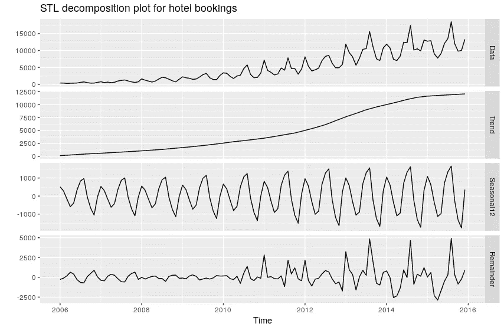
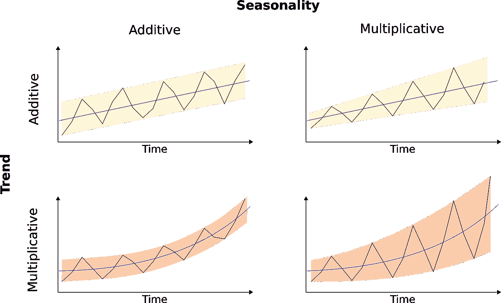
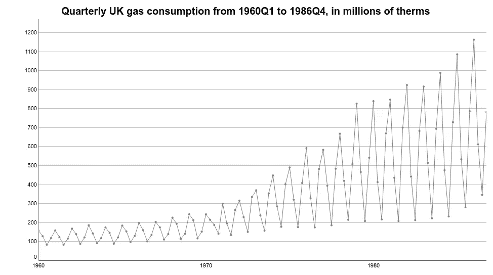
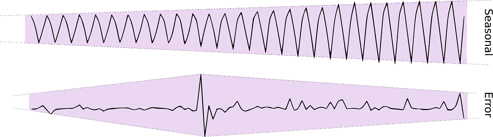
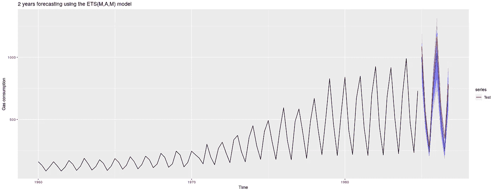
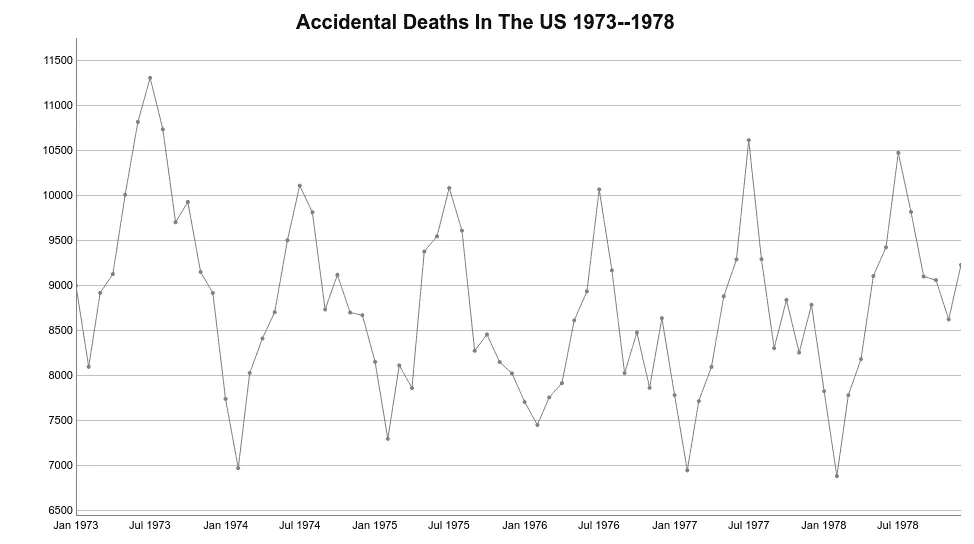
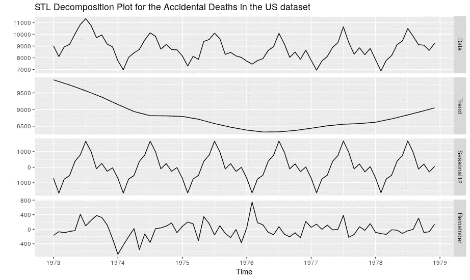
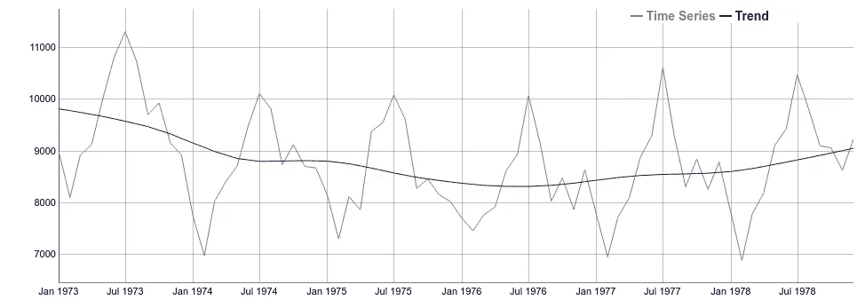
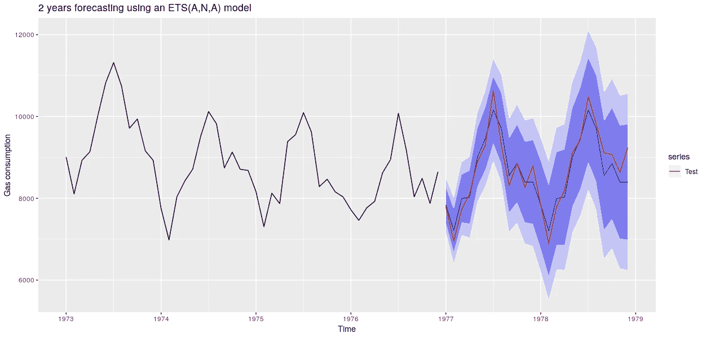

# 时间序列预测的指数平滑方法

> 原文：<https://betterprogramming.pub/exponential-smoothing-methods-for-time-series-forecasting-d571005cdf80>

## 指数平滑方法和 STL 分解在几分钟内

照片由[奎诺·阿尔](https://unsplash.com/@quinoal?utm_source=unsplash&utm_medium=referral&utm_content=creditCopyText)在 [Unsplash](https://unsplash.com/?utm_source=unsplash&utm_medium=referral&utm_content=creditCopyText) 上拍摄

在前两篇文章中，我们介绍了时间序列数据和分解分析的基本概念。我们开始讨论时间序列数据的常见模式，比如[趋势、季节和周期](https://medium.com/better-programming/fundamentals-of-time-series-data-and-forecasting-15e9490b2618?source=friends_link&sk=64d214d3759c331341ff4eeb44bce1b3)。然后，我们描述了如何使用[经典分解方法](https://medium.com/better-programming/a-visual-guide-to-time-series-decomposition-analysis-a1472bb9c930?source=friends_link&sk=882070d86b84db3b9f48a19cedad113e)来探索这些模式。接下来，是时候将这些知识应用到实际的算法中了。在本文中，我们概述了**指数平滑方法。**

# 什么是指数平滑法？

指数平滑法是一种预测模型。**他们使用过去观察值的加权平均值来预测新值**。这里，我们的想法是更加重视系列中的最新值。因此，随着观测数据变得越来越老(在时间上)，这些值的重要性会以指数方式变小。

指数平滑法在平滑计算中结合了**误差、趋势和季节性**成分。每一项都可以**相加、** **相乘的方式进行组合，或者被排除在模型之外。这三个术语(误差、趋势和季节)被称为 **ETS** 。**

因此，指数平滑法可以用 ETS 框架来定义，其中各组成部分以平滑的方式计算。

正如我们所看到的，以至少三种不同的方式组合 **E** rror、 **T** rend 和 **S** eason 给了我们很多组合。让我们考虑一些例子。

使用[预测原则和实践](https://otexts.com/fpp2/taxonomy.html)中描述的分类法，三个主要组成部分可以定义为:

*   错误: **E**
*   趋势: **T**
*   季节:**年代**

此外，每个术语可以有以下几种用法:

*   添加剂: **A**
*   乘法: **M**
*   无: **N** (不含)

因此，一种具有加性误差、无趋势和无季节性的方法将是 **ETS(A，N，N)**—**也称为*具有加性误差的简单指数平滑*。**

**按照同样的推理，我们有:**

*   ****ETS(M，N，N)** : *带乘法误差的简单指数平滑。***
*   ****ETS(A，A，N)** : *带加性误差的霍尔特线性方法。***
*   ****ETS(M，A，N)** : *带乘性误差的霍尔特线性方法。***

**但是我们如何决定如何使用 ETS 框架最好地应用这些组件呢？**

# **时间序列分解图**

**分析时间序列组件是否表现出加法或乘法行为取决于识别趋势、季节和误差等模式的能力。这就是时间序列分解背后的思想。**

**正如我们在[上一篇文章](https://medium.com/better-programming/a-visual-guide-to-time-series-decomposition-analysis-a1472bb9c930?source=friends_link&sk=882070d86b84db3b9f48a19cedad113e)中看到的，时间序列分解的目标是将原始信号分成三种主要模式。**

*   ****趋势****
*   **第**季****
*   ****误差**(也称为残差或余数)**

**趋势表明时间序列的一般行为。它代表了数据的长期模式——趋势。**

**季节性组件显示与日历事件相关的变化。**最后，误差组件解释了季节和趋势组件没有解释的内容**。误差是原始数据与趋势和季节性的组合之间的差异。**因此，如果我们组合所有三个组件，我们将得到原始数据。****

**通常，分解方法在**分解图**中显示所有这些信息。**

****

**分析时间序列分解图是了解如何在 ETS 模型中应用时间序列组件的最佳方法之一。**

# **时间序列分解分析**

**快速回顾一下！使用 ETS 框架，每一个组成部分——趋势、季节和误差——都可以相加或相乘地应用。如果有必要，我们也可以将这些组件中的一个或多个从模型中去掉。**

**现在让我们考虑一些方法来识别时间序列组件中的加法或乘法行为。**

**一般来说，加法项表现出线性或恒定的行为。**

**如果趋势分量线性增加或减少，或接近线性增加或减少，我们说它有一个加法模式。另一方面，如果趋势显示一个**指数变化**，无论是正的还是负的，那么它具有乘法行为。**

**季节组件遵循类似的模式。然而，这里我们更感兴趣的是大小的变化。季节性模式总是定期出现。当季节性波动的幅度保持不变时，它有一个附加的行为。否则，如果幅度随时间变化，它具有乘法行为。**

**这同样适用于误差分量。如果它的大小随时间变化，我们也用乘法来应用它。**

****

**现在让我们跳到一个实际的例子。考虑英国的**天然气消耗的时间序列。该数据集包含从 1960 年到 1986 年的 108 个季度间隔的点值。****

****

**在任何分解之前，我们已经可以从时间序列图中提取一些见解。首先，总的趋势是积极的。它显示了整个数据的总体正梯度。**

**季节性变化也很大。在整个系列中，第一季度和最后一季度的天然气消耗量较高。此外，请注意，气体消耗量会随着时间的推移而增加。后者表示一个乘法季节项。**

**现在，看一下时间序列分解图。**

****

**上面的图显示了一个 [STL 分解](https://otexts.com/fpp2/stl.html)。**

**STL 只执行加法分解。然而，根据我们目前的知识，我们也可以找到可能表示乘法项的模式。分解图在顶部显示原始数据，后面是趋势、季节和误差(余数)部分。**

**正如我们所料，这种趋势表现出相加的行为——它在某种程度上呈线性增长。**

**请注意，季节变化是*而不是*不变的。我们可以看到，季节性波动的幅度在整个时间序列中不断增加。**

**最后，余数组件显示随着时间序列的推移，方差的变化。因此，季节和误差成分都应作为乘法项来应用。**

****

**因此，我们可以将我们的模型定义为 **ETS(M，A，M)** 。**

*   **乘法**误差****
*   **加法**趋势****
*   **乘法**季节性**。**

**你可以在这里看到这个方法[的平滑方程。](https://otexts.com/fpp2/ets.html)**

**我们以 1960 年到 1984 年这几年作为训练集，保留最后两年进行测试。现在，我们可以使用训练集拟合一个 **ETS(M，A，M)** 并对未来两年进行预测。检查下面的结果。**

****

**测试数据显示为红色，预测和置信区间显示为蓝色。请注意预测可信度的变化是如何随着时间的推移而增加的。这是一个正常的模式，反映了模型的不确定性，以预测未来的值。**

**让我们举一个不同的例子。下一个时间序列显示了美国从 1973 年到 1978 年的每月意外死亡数据。**

****

**和前面的例子一样，季节变化非常大。七月是死亡人数最多的月份，而二月是死亡人数最少的月份。此外，这种模式年复一年地重复。**

**然而，与上一个例子不同的是，季节性并没有显示方差的显著变化。如果季节变化的幅度随时间表现出恒定的行为，我们可以把它作为一个附加项来应用。此外，请注意，数据并没有显示出明显的上升或下降趋势。看看这个分解图。**

****

**美国 1973-1978 年时间序列的意外死亡分解图。**

**这种趋势似乎呈现出一种**自下而上**的模式。如果我们将趋势叠加在时间序列之上，它看起来非常接近水平模式。那么，将其排除在模型之外似乎是合理的。**

****

**趋势线(蓝色)覆盖在原始时间序列上。**

**正如我们所料，季节变化的幅度看起来非常稳定。此外，误差项也没有显示出显著的变化。因此，将**季节**和**误差**作为附加项应用于模型似乎是合理的。这给了我们一个 **ETS(A，N，A)** —加性误差，无趋势，加性季节性。**

**保留最后两年进行测试，对 **ETS(A，N，A)** 的预测结果如下所示:**

****

# **结论**

**这是这篇文章的一些要点。**

*   **指数平滑法是一类经典的预测算法。当时间序列显示出明确的趋势和/或季节性行为时，它们工作得很好。**
*   **指数平滑法结合了误差、趋势和季节。我们可以用加法或乘法来应用这些成分。**
*   **时间序列分解是发现趋势、季节和/或误差模式的最佳方法之一。分解图通常将每个组件显示为一个单独的子图。**
*   **如果趋势显示线性上升或下降的趋势，我们应用它。如果是指数变化，那就是乘法。**
*   **如果季节模式的幅度是线性变化的，我们可以附加地应用它。如果量级呈指数演化，那就是倍增。**

**我们希望您喜欢阅读本文。**

***thal les Silva，作为 Daitan 对人工智能多方面研究的一部分& ML。感谢致力于时间序列预测概念验证和演示的团队:布鲁诺·希奥纳托、迭戈·多明戈斯、费尔南多·莫赖斯、古斯塔沃·罗萨托、马塞洛·梅尔古朗和马西亚诺·纳尔迪。***