# 创建 Animoji 风格的 3D 角色以用于 TrueDepth

> 原文：<https://betterprogramming.pub/exporting-a-3d-character-from-blender-2-8-to-xcode-and-implement-like-animoji-using-arkit-scenekit-3d223aa6a29f>

## 如何从 Blender 2.8 导出到 ARKit/SceneKit 的 Xcode


TrueDepth 笑脸

最近，[我在做的一个项目(Smappy)](https://apps.apple.com/app/id1521828825) 需要使用一个 3D 表情符号风格的角色，在 iPhone X 或更高版本中使用[原深感摄像头](https://developer.apple.com/documentation/avfoundation/avcapturedevice/devicetype/2933376-builtintruedepthcamera)来控制——很像苹果自己的 [Animoji](https://support.apple.com/en-us/HT208190) 。我在尝试将 3D 角色从 [Blender](https://www.blender.org/) 导出到 [SceneKit](https://developer.apple.com/documentation/scenekit) 时发现了一些问题，因此本教程将概述我遇到的问题和我设法找到的解决方案，以及演示如何在您自己的项目中实现该角色。

本教程将假设你已经用你需要的所有混合形状[创建了你的角色。这将涉及很多细节，因此一些对 Blender 或 iOS 开发经验很少的人也可以跟上。然而，我不会去如何创建自己的角色或混合形状的动画。](https://developer.apple.com/documentation/arkit/arfaceanchor/blendshapelocation)

# 导出您的角色用于 ARKit

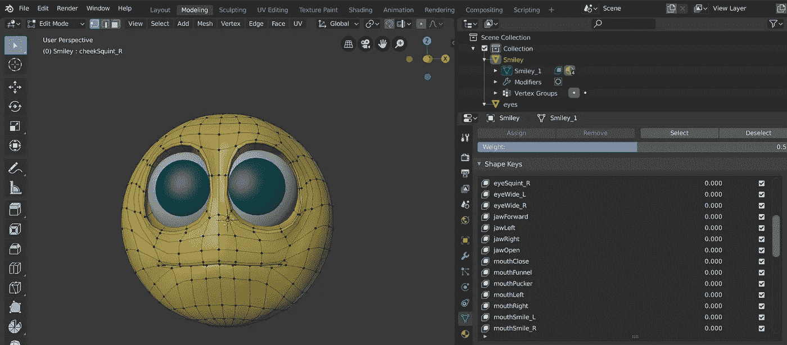

开始之前:请记住，在开始之前做一个备份总是一个好主意，因为你不想丢失或弄乱任何工作！

命名形状关键点时，我发现给它们起一个与相应的混合形状关键点相同的名字是个好主意。出于某种原因，苹果公司决定将一些键的名称与它们的对象名称稍有不同；下面是他们在 ARFaceAnchor 中的键名列表。

接下来，你要确保所有的修改器都被应用，否则，在将导出的`.dae`文件导入到 [Xcode](https://developer.apple.com/xcode/) 时，你肯定会遇到一些问题(就像我一样)。我的角色使用了两种不同的修饰语，`Mirror`和`subdivision`。不应用`Mirror`修改器(用于眼睛)导致在导出的对象上只有一只眼睛可见。这很容易解决。简单地确保你在 Blender 上处于对象模式，点击`Mirror`修改器并选择“应用”

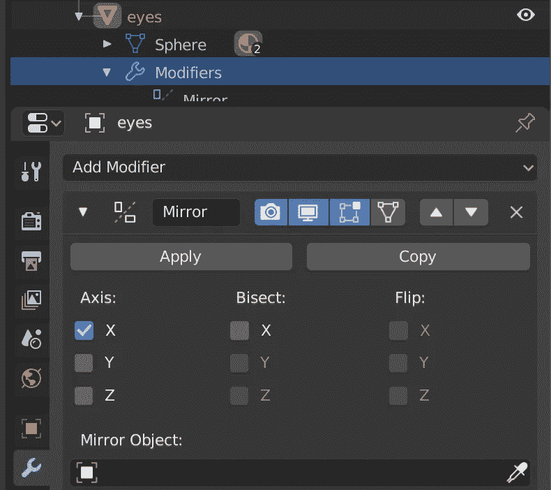

应用镜像修改器

`[subdivision](https://docs.blender.org/manual/en/latest/modeling/modifiers/generate/subdivision_surface.html)`[修饰符](https://docs.blender.org/manual/en/latest/modeling/modifiers/generate/subdivision_surface.html)稍微复杂一些，需要 Python 脚本才能工作。应用这个修饰符很重要。否则，导出角色时将不会保留形状关键点，这意味着任何动画都将不起作用。经过大量的谷歌搜索，我发现了[这个非常有用的线程](https://forums.unrealengine.com/development-discussion/animation/1623830-blender-2-8-beta-morph-targets-and-modifiers)，它包含了我们所需要的脚本(非常感谢 [MorphCider](https://forums.unrealengine.com/member/3323703-morphcider) )。

接下来，打开一个文本编辑器，在适当的位置保存下面的脚本，并将其命名为`apply_with_shape_keys.py`:

```
import bpy

class ApplyWithShapeKeys(bpy.types.Operator):
    """Tooltip"""
    bl_idname = "object.applywithshapekeys"
    bl_label = "Apply Modifiers With Shapekeys"

    def execute(self, context):

        selection = bpy.context.selected_objects

        for obj in selection:
            if obj.type == "MESH":

                # lists store temporary objects created from shapekeys
                shapeInstances = []
                shapeValues = []

                # Deactivate any armature modifiers
                for mod in obj.modifiers:
                    if mod.type == 'ARMATURE':
                        obj.modifiers[mod.name].show_viewport = False

                for shape_key in obj.data.shape_keys.key_blocks:
                    # save old shapekey value to restore later. Will set to 0 temporarily
                    shapeValues.append(shape_key.value)
                    shape_key.value = 0.0

                i = 0
                for shape_key in obj.data.shape_keys.key_blocks:

                    # ignore basis shapekey
                    if i != 0:
                        # make sure only relevant object is selected and active
                        bpy.ops.Object.select_all(action="DESELECT")
                        obj.select_set(state=True)
                        context.view_layer.objects.active = obj

                        # make sure only this shape key is set to 1
                        shape_key.value = 1.0

                        # duplicate object with only one shape key active. Blender does the rest
                        bpy.ops.Object.duplicate(linked=False, mode="TRANSLATION")
                        bpy.ops.Object.convert(target="MESH")
                        shapeInstances.append(bpy.context.active_object)

                        bpy.context.object.name = shape_key.name

                        bpy.ops.Object.select_all(action="DESELECT")
                        obj.select_set(state=True)
                        context.view_layer.objects.active = obj

                        shape_key.value = 0.0

                    i = i + 1

                context.view_layer.objects.active = obj

                # create final object
                bpy.ops.Object.duplicate(linked=False, mode="TRANSLATION")
                newobj = bpy.context.active_object
                newobj.name = obj.name + "_APPLIED"

                # clear all old shapekeys from new object
                newobj.shape_key_clear()

                # apply all modifiers on new object
                for mod in newobj.modifiers:
                    if mod.name != "Armature":
                        bpy.ops.object.modifier_apply(apply_as='DATA', modifier=mod.name)

                # iterate all temporary saved shapekey objects, select only that and the final object and join them
                for shapeInstance in shapeInstances:
                    bpy.ops.object.select_all(action="DESELECT")
                    newobj.select_set(state=True)
                    shapeInstance.select_set(state=True)
                    context.view_layer.objects.active = newobj

                    result = bpy.ops.object.join_shapes()

                # reset old shape key values
                i = 0
                for shape_key in newobj.data.shape_keys.key_blocks:
                    if i != 0:
                        shape_key.value = shapeValues[i]
                    i = i + 1

               # reset old shape key values
                i = 0
                for shape_key in obj.data.shape_keys.key_blocks:
                    if i != 0:
                        shape_key.value = shapeValues[i]
                    i = i + 1

                # delete temporary objects    
                bpy.ops.Object.select_all(action="DESELECT")
                for shapeInstance in shapeInstances:
                    shapeInstance.select_set(state=True)

                bpy.ops.object.delete(use_global=False)

                # redeactivate armature modifiers
                for mod in obj.modifiers:
                    if mod.type == 'ARMATURE':
                        obj.modifiers[mod.name].show_viewport = True

                for mod in newobj.modifiers:
                    if mod.type == 'ARMATURE':
                        newobj.modifiers[mod.name].show_viewport = True

        return {"FINISHED"}

def register():
    bpy.utils.register_class(ApplyWithShapeKeys)

def unregister():
    bpy.utils.unregister_class(ApplyWithShapeKeys)

if __name__ == "__main__":
    register()
```

打开脚本工作区，点击“文本”>“打开”，打开刚刚保存的脚本。现在点击“运行脚本”(位于右上角)，这会将脚本添加到项目中。

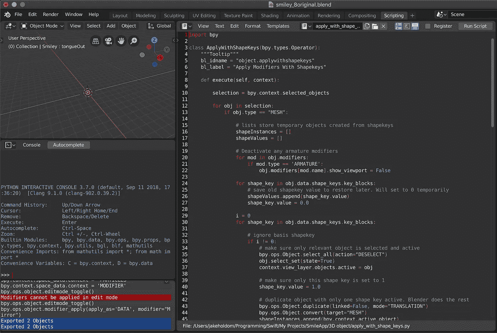

脚本工作区

你现在需要返回到“布局”工作区(确保你仍然处于对象模式)，用`subdivision`修改器选择你的对象。现在按“fn”+“F3”将会弹出一个搜索框。通过键入“使用 Shapekeys 应用修改器”来搜索您刚刚创建的函数，并单击相应的结果。Blender 将在加载时等待几秒钟，然后创建一个名为`(your object name)_APPLIED`的新对象。这个新对象现在应该已经应用了你的`subdivision`修改器，所以你可以隐藏或者移除你的旧对象。

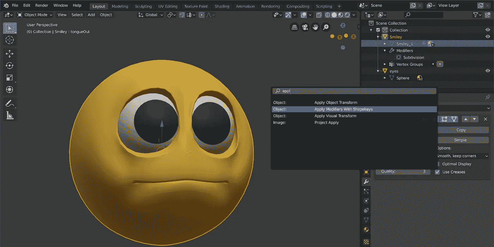

运行应用修改器脚本

我们现在准备将 3D 角色从 Blender 导出到一个`.dae`文件中。首先，我们希望选择并突出显示所有希望导出的对象。在我的例子中，这是`Smiley_APPLIED`和`eyes`物体。现在点击【文件】>【导出】>【coll ada(默认)(。dae)”。在左侧，我们有一些设置，我选择了:

*   "仅选择"
*   “包括儿童”
*   "包括形状关键点"

其他设置没什么大不了的，但可能会根据你的角色而有所不同。现在，确保它被导出到一个适当的位置，并点击“导出”>“COLLADA”

不幸的是，Blender 不能导出带有正确的键和值的文件，而这些键和值是无缝导入 Xcode 所需要的。然而，幸运的是， [JonAllee](https://github.com/JonAllee) 创造了一个[神奇的工具，可以自动为你映射正确的按键](https://github.com/JonAllee/ColladaMorphAdjuster)。如果你用的是 [Swift 5](https://github.com/apple/swift/releases/tag/swift-5.0.3-RELEASE) ，我已经[分叉这个回购，转换成 Swift 5](https://github.com/JakeHoldom/ColladaMorphAdjuster) 工作。

从 GitHub 下载这个工具，并在 Xcode 中打开它。选择“方案”>“编辑方案”

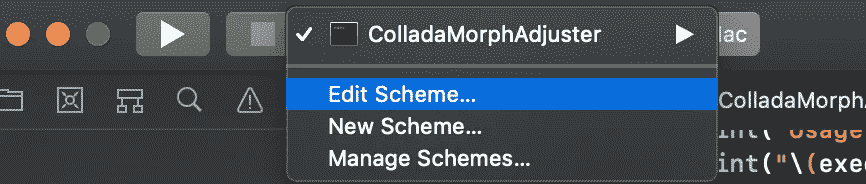

编辑方案

现在转到“运行”>“参数”>“启动时传递的参数”我们要传递三个参数:

*   输入文件的路径
*   "-o "
*   输出文件的路径

你需要确保这些是正确的顺序。下面是我的一个例子:

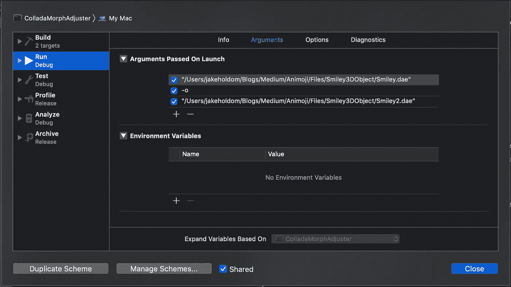

ColladaMorphAdjuster 的参数

关闭对话框，然后运行代码。

如果一切顺利，您应该有一个输出日志，显示所有几何体(混合形状)的数量，如下所示:

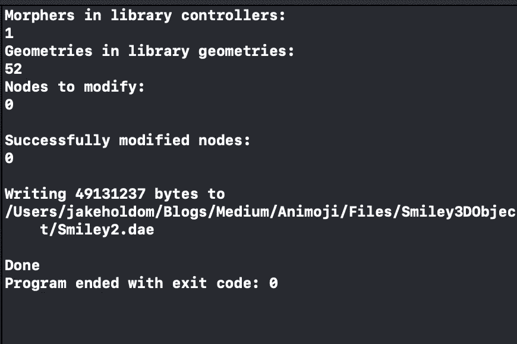

ColladaMorphAdjuster 成功输出

如果脚本没有拾取几何体，您可能希望检查所有对象都已正确导出，并且所有修改器都已应用。您可以通过预览来检查`.dae`文件，以确保没有明显的对象丢失。

如果剧本把他们接走了，太好了！您的 3D 角色即将完成。我们现在继续将字符导入 Xcode。

# 将您的角色导入 Xcode

在 Xcode 中使用单视图应用程序创建新项目。我已经叫我的`EmojiFace`。

右键单击项目目录并选择“新建文件”这里您想向下滚动到参考资料部分，并创建一个名为`Models.scnassets`的新的 SceneKit 目录。

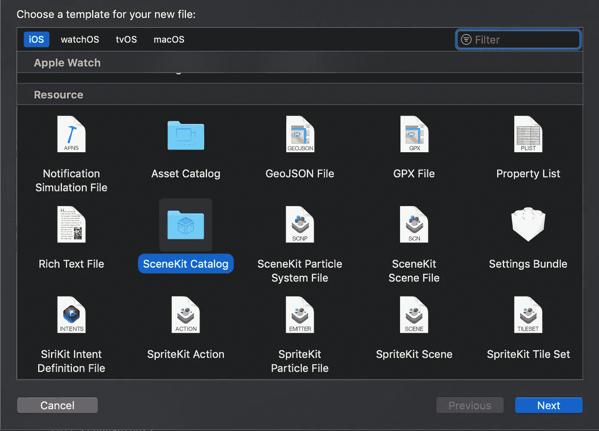

场景目录

现在，将上面的`ColladaMorphAdjuster`生成的输出`.dae`文件拖放到`Models.scnassets`文件夹中。点击`.dae`文件，你会看到你的 3D 角色。如果相机角度有点奇怪，点击左下方的相机图标，选择“正面”单击带有混合形状的对象，您应该会在右侧看到它们的列表，您可以拖动这些值来更改角色的面部:

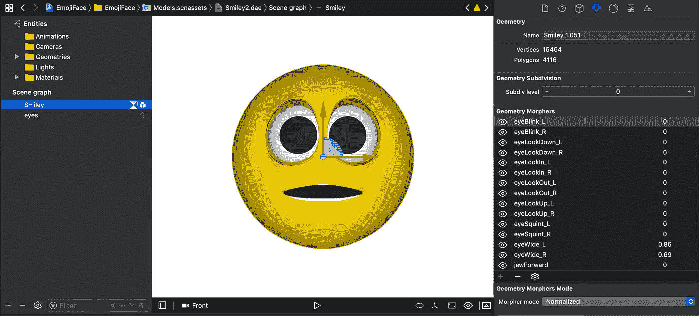

XCode 中的 Smiley `.dae`文件

你可能会注意到法线看起来有点奇怪，这使它在改变几何体变形值时看起来像一个低多边形，但是不要担心。稍后，当我们将对象导入到代码中时，我将向您展示如何以编程方式解决这个问题。

您现在想要将`.dae`导出为一个`.scn`文件。这是通过点击“编辑器”>“转换为 SceneKit 场景文件格式(。scn)。”然后会弹出一个窗口，说明`.scn`文件与某些应用程序不兼容。我通常选择“复制”,因为这将保留`.dae`文件，以防您希望在项目中出于其他原因使用它。

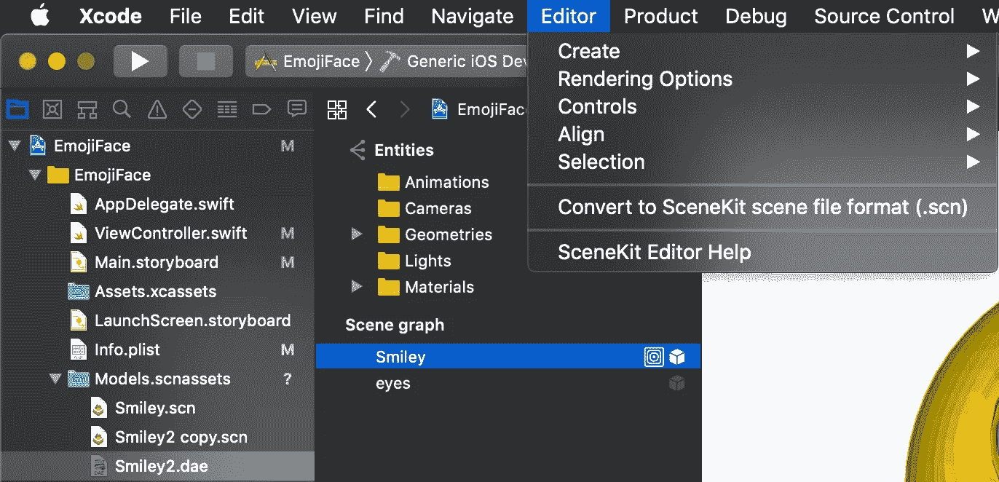

转换为。scn 文件

现在，点击您的`.scn`文件。

我通常将我的角色组织到一个特定的节点结构中，以防我想要添加额外的节点，例如[相机节点](https://developer.apple.com/documentation/scenekit/scncamera)。您可以通过点击`.scn`文件上场景图形底部的“+”来添加一个新的子节点。然后，我将子节点命名为`model`，并在其中添加一个子节点，命名为`puppet`，并将我的角色对象放入其中，如下所示:

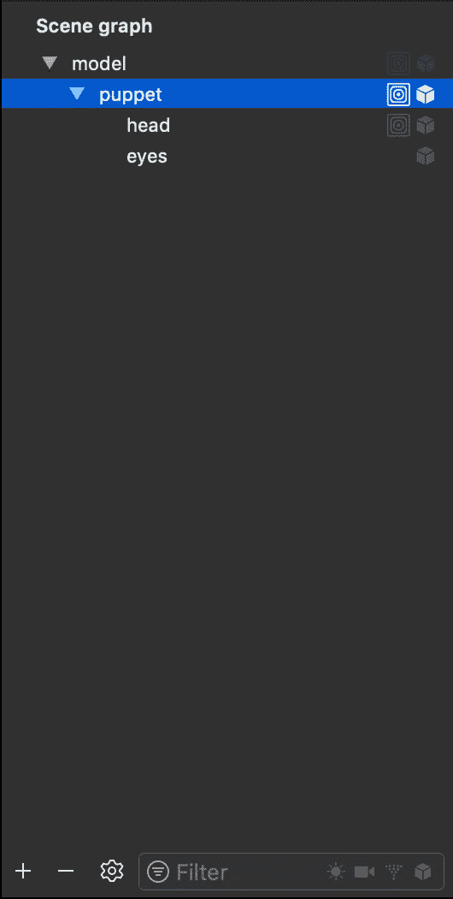

您可能会发现某些颜色与您从 Blender 导出的字符不同。您可以在“材质检查器”中根据需要更改显示的颜色。

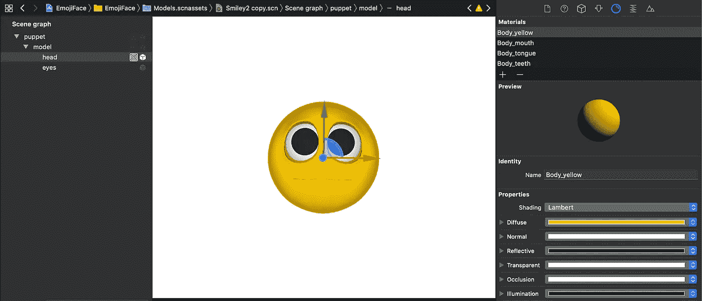

材料检验员

恭喜你！你的 3D 角色应该可以开始了，我们终于可以开始写一些代码了！

# 将您的角色导入 ARKit/SceneKit

打开`Main.Storyboard`，从对象库中拖动一个`SCNView`和一个`ARSCNView`到视图控制器中。`SCNView`是包含你的 3D 角色的视图，`ARSCNView`是跟踪你的脸的视图。`ARSCNView`实际上不会在屏幕上显示任何可见的东西，除非你想将其配置为显示相机的反馈。根据需要设置约束。以下是我的视图控制器的外观:

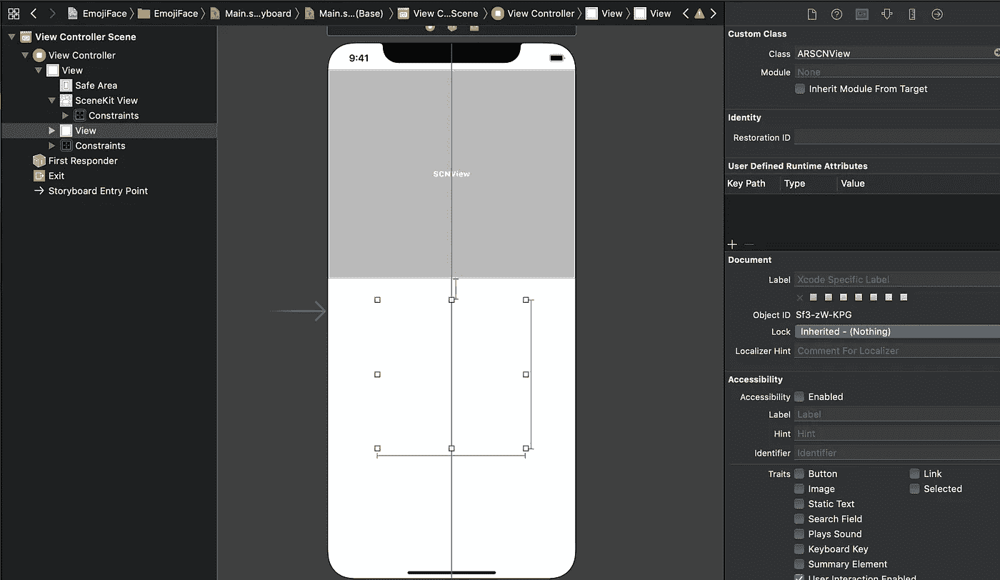

视图控制器设置

将您的视图添加到`ViewController.swift`文件中，并调用`SCNView` `faceView`和`ARSCNView` `trackingView`。我们还想创建这个类需要的以下实例变量:

```
**var** contentNode: SCNReferenceNode? *// Reference to the .scn file***var** cameraPosition = SCNVector3Make(0, 15, 50) *// Camera node to set position that the SceneKit is looking at the character***let** scene = SCNScene()**let** cameraNode = SCNNode()**private** **lazy** **var** model = contentNode!.childNode(withName: “model”, recursively: **true**)! *// Whole model including eyes***private** **lazy** **var** head = contentNode!.childNode(withName: “head”, recursively: **true**)! *// Face that contains blendshapes*
```

模型和头部变量正好对应于上面场景图中显示的节点，重要的是它们完全相同。

现在，我们将需要设置一个`AVCaptureDevice`会话。为了做到这一点，我们首先要在`.plist`文件中设置摄像机权限。因此，请转到`Info.plist`，点击“+”按钮，选择“隐私—相机使用说明”，然后在文本框中键入如下内容:

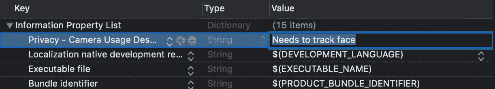

向添加权限。plist

在`viewDidLoad`方法中初始化一个`[AVCaptureDevice](https://developer.apple.com/documentation/avfoundation/avcapturedevice)`请求:

```
**override** **func** viewDidLoad() { **super**.viewDidLoad()
   AVCaptureDevice.requestAccess(for: AVMediaType.video) { granted **in
        if** (granted) {
        } **else** {
            *// If access is not granted, throw error and exit* fatalError("This app needs Camera Access to function. You can grant access in Settings.")
        }
    }
}
```

接下来，我们需要一个函数来初始化面部追踪器(注意:我们还没有将`ViewController`变成`[ARSCNViewDelegate](https://developer.apple.com/documentation/arkit/arscnviewdelegate)`，所以在我们这样做之前，你会得到一个错误)。

```
**func** setupFaceTracker() {
    *// Configure and start face tracking session* **let** configuration = ARFaceTrackingConfiguration()
    configuration.isLightEstimationEnabled = **true** *// Run ARSession and set delegate to self* **self**.trackingView.session.run(configuration)
    **self**.trackingView.delegate = **self
    self**.trackingView.isHidden = **true** *// Remove if you want to see the camera feed*}
```

然后我们要设置 [SCNView](https://developer.apple.com/documentation/scenekit/scnview) :

```
**func** sceneSetup() {
    **if** **let** filePath = Bundle.main.path(forResource: "Smiley", ofType: "scn", inDirectory: "Models.scnassets") {
        **let** referenceURL = URL(fileURLWithPath: filePath)
        **self**.contentNode = SCNReferenceNode(url: referenceURL)
        **self**.contentNode?.load() **self**.head.morpher?.unifiesNormals = **true** *// ensures the normals are not morphed but are recomputed after morphing the vertex instead. Otherwise the node has a low poly look.* **self**.scene.rootNode.addChildNode(**self**.contentNode!)
    }
    **self**.faceView.autoenablesDefaultLighting = **true***// set the scene to the view* **self**.faceView.scene = **self**.scene *// allows the user to manipulate the camera* **self**.faceView.allowsCameraControl = **false** **self**.faceView.backgroundColor = .clear
}
```

这部分:

```
**self**.head.morpher?.unifiesNormals = **true**
```

是代码的[位，它将修复我们之前看到的低聚合问题。](https://developer.apple.com/documentation/scenekit/scnmorpher/2875540-unifiesnormals)[这个答案](https://stackoverflow.com/a/49512592/3599895)很好的描述了为什么会这样。

现在，我们要设置相机节点，它将场景视图放置在前面，并从角色节点稍微抬高一点。

```
**func** createCameraNode () {
   **self**.cameraNode.camera = SCNCamera()
   **self**.cameraNode.position = **self**.cameraPosition 
   **self**.scene.rootNode.addChildNode(**self**.cameraNode)
   **self**.faceView.pointOfView = **self**.cameraNode
}
```

这些都是创建 3D 角色节点所需的函数，所以现在我们想把它们添加到`viewDidLoad`:

```
**override** **func** viewDidLoad() {
    **super**.viewDidLoad() AVCaptureDevice.requestAccess(for: AVMediaType.video) { granted **in
        if** (granted) {
            *// If access is granted, setup the main view* DispatchQueue.main.sync {
                **self**.setupFaceTracker()]
                **self**.sceneSetup()
                **self**.createCameraNode()
            }
        } **else** {
            *// If access is not granted, throw error and exit* fatalError("This app needs Camera Access to function. You can grant access in Settings.")
        }
    }
}
```

如果您在这个阶段运行应用程序，您应该会看到您的 3D 角色正面看着相机，但还没有面部识别动画工作。如果角色太大或太小，可以通过编程方式或在节点检查器中设置缩放变量来更改其大小。

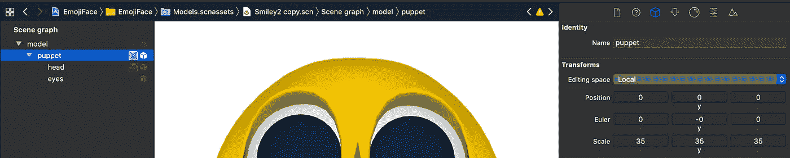

比例变量

现在，我们可以将面部混合形状映射到 3D 角色。

所以我们想创建一个继承了`[ARSCNViewDelegate](https://developer.apple.com/documentation/arkit/arscnviewdelegate)`的`ViewController`的扩展，并覆盖这个函数

```
**func** renderer(**_** renderer: SCNSceneRenderer, didUpdate node: SCNNode, for anchor: ARAnchor)
```

假设您已经将混合变形键/几何变形器命名为与 Apple 定义的[键相同的名称，那么我们需要做的就是一个简单的`for`循环来将它们映射在一起。](https://github.com/JakeHoldom/EmojiFace/blob/master/BlendShapeKeys.txt)

```
**extension** ViewController: ARSCNViewDelegate {
    **func** renderer(**_** renderer: SCNSceneRenderer, didUpdate node: SCNNode, for anchor: ARAnchor) {
        **guard** **let** faceAnchor = anchor **as**? ARFaceAnchor **else** { **return** }
        DispatchQueue.main.async {
            **let** blendShapes = faceAnchor.blendShapes
            *// This will only work correctly if the shape keys are given the exact same name as the blendshape names***for** (key, value) **in** blendShapes {
                **if** **let** fValue = value **as**? Float
                    **self**.head.morpher?.setWeight(CGFloat(fValue), forTargetNamed: key.rawValue)
                }
            }
        }
    }
}
```

如果你现在运行这个应用程序，你应该会看到你的面部运动正在被跟踪并显示在你的 3D 角色上。

但是等等…你还想跟踪你的脸的偏转、俯仰和滚动，并相应地移动 3D 角色的头部。你所需要做的就是使用`ARFaceAnchor`的变换，并将其分配给角色的头部节点。

```
**self**.model.simdTransform = faceAnchor.transform
```

然而，这并不能很好地工作，因为转换会受到相机位置的影响，这会产生奇怪的结果。所以我们将不得不用一些传统的数学方法来计算`[SCNVector3](https://developer.apple.com/documentation/scenekit/scnvector3)` 。

```
**func** calculateEulerAngles(**_** faceAnchor: ARFaceAnchor) -> SCNVector3 { *// Based on StackOverflow answer* https://stackoverflow.com/a/53434356/3599895 **let** projectionMatrix = **self**.trackingView.session.currentFrame?.camera.projectionMatrix(for: .portrait, viewportSize: **self**.faceView.bounds.size, zNear: 0.001, zFar: 1000)
    **let** viewMatrix = **self**.trackingView.session.currentFrame?.camera.viewMatrix(for: .portrait)
    **let** projectionViewMatrix = simd_mul(projectionMatrix!, viewMatrix!)
    **let** modelMatrix = faceAnchor.transform
    **let** mvpMatrix = simd_mul(projectionViewMatrix, modelMatrix) *// This allows me to just get a .x .y .z rotation from the matrix, without having to do crazy calculations* **let** newFaceMatrix = SCNMatrix4.init(mvpMatrix)
    **let** faceNode = SCNNode()
    faceNode.transform = newFaceMatrix **let** rotation = vector_float3(faceNode.worldOrientation.x, faceNode.worldOrientation.y, faceNode.worldOrientation.z) **let** yaw = (rotation.y*3)
    **let** pitch = (rotation.x*3)
    **let** roll = (rotation.z*1.5) **return** SCNVector3(pitch, yaw, roll)
}
```

现在将模型的欧拉角设置为在`renderer`函数中创建的`SCNVector3`:

```
**extension** ViewController: ARSCNViewDelegate {
    **func** renderer(**_** renderer: SCNSceneRenderer, didUpdate node: SCNNode, for anchor: ARAnchor) {
        **guard** **let** faceAnchor = anchor **as**? ARFaceAnchor **else** { **return** }
        DispatchQueue.main.async {
            **let** blendShapes = faceAnchor.blendShapes
            *// This will only work correctly if the shape keys are given the exact same name as the blendshape names***for** (key, value) **in** blendShapes {
                **if** **let** fValue = value **as**? Float
                    **self**.head.morpher?.setWeight(CGFloat(fValue), forTargetNamed: key.rawValue)
                }
            }
            **self**.model.eulerAngles = **self**.calculateEulerAngles(faceAnchor) }
    }
}
```

你现在可以走了；使用 iPhone 的真深度相机，你应该有一个完全动画的 3D 角色！

我希望你喜欢这个教程，并且和你的 3D 人物玩得开心。如果你想要源代码，那么你可以[在我的 GitHub 这里](https://github.com/JakeHoldom/EmojiFace)查看，但是请记住这不包括我在这个项目中使用的 3D 角色。如果你想在自己的设备上尝试这个角色，那么你可以[在这里](https://apps.apple.com/app/id1521828825)下载我的应用程序 Smappy。

感谢阅读！