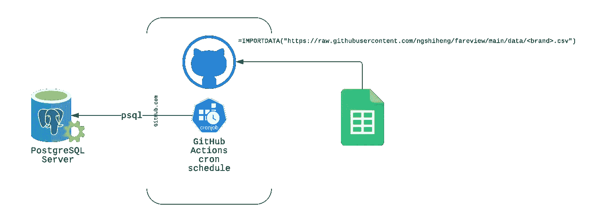
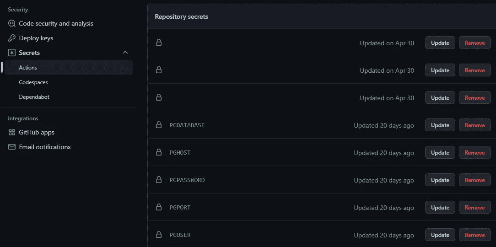
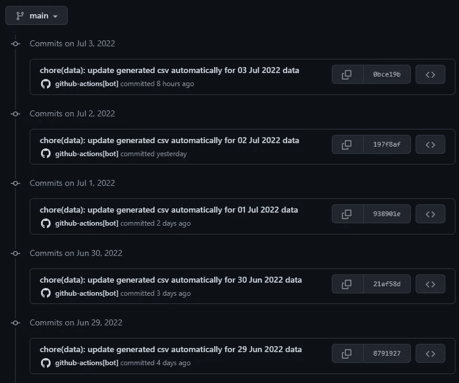

# 将 PostgreSQL 查询导出到 Google Sheets

> 原文：<https://betterprogramming.pub/exporting-postgresql-queries-to-google-sheets-f7cc0c57ebf>

## 如何免费将 PostgreSQL 查询导出到 Google Sheets


由 [Nicolas Solerieu](https://unsplash.com/es/@slrncl?utm_source=medium&utm_medium=referral) 在 [Unsplash](https://unsplash.com?utm_source=medium&utm_medium=referral) 上拍摄

几年前，我不知道将 PostgreSQL 数据库连接到 Google Sheets 会这么贵。尽管是一个小问题，但现有的市场解决方案，如 Zapier、KPIBees 等。要求我们支付额外费用。

*TL；在这篇文章中，我写的是如何通过 GitHub(和一点 Bash 脚本)将 PostgreSQL 查询导出到 Google Sheets。*

# 我为什么需要它

这里有一点背景。

我维护着一个名为 [Fareview](https://github.com/ngshiheng/fareview) 的小型副业项目，这是一个商业啤酒价格监控工具，它从新加坡电子商务网站收集商业啤酒数据，并将其存储在 PostgreSQL 数据库中。

收集到的数据汇总每天都会同步到 [Google Sheets，供用户查看](https://docs.google.com/spreadsheets/d/1ImvPhsWp3mRF5lz7C55Ub2Z5okzitIvU6WG77YWL5PU/)。

我决定使用 GitHub Action 免费帮我完成这项任务，而不是每月支付额外费用。

# 它是这样工作的

这种方法也适用于任何其他带有类似`psql`的 CLI 的 SQL 数据库(如 MySQL)。



我绘制的方法的简单说明

1.  创建一个简单的 Bash 脚本，该脚本使用 Postgres 客户端 CLI ( `psql`)来运行 SQL 查询，并从我们的 PostgreSQL 数据库服务器以 CSV 文件格式输出它们
2.  建立一个 GitHub Actions 工作流，运行步骤 1 中的 Bash 脚本，并按照 Cron 时间表将生成的文件提交到我们的存储库中
3.  在谷歌表单上，使用`=IMPORTDATA("<url-of-csv-file>")`功能将我们的 CSV 数据从我们的存储库导入到我们的谷歌表单

值得注意的是，`IMPORTDATA`功能[每隔 1 小时自动更新数据](https://support.google.com/area120-tables/answer/9904107?hl=en)。如果您需要一个更短的间隔用例，您可能需要[解决它](https://gist.github.com/aGHz/6868a1ea1defbd6b9ed5#sheet-scripts)。

# 下面是做这件事的步骤

## Bash 脚本

根据您的用例，您甚至可能不需要 Bash 脚本。例如，你可以运行`psql`命令作为 GitHub 动作工作流程中的一个步骤。

在这里使用 Bash 脚本提供了更多的灵活性，因为如果需要的话，您也可以在 GitHub 操作之外手动运行它。

这是我正在运行的 Bash 脚本(`generate_csv.sh`):

```
#!/bin/bash
BRANDS=("carlsberg" "tiger" "heineken" "guinness" "asahi")PGDATABASE="${PGDATABASE-fareview}"
PGHOST="${PGHOST-localhost}"
PGPASSWORD="${PGPASSWORD-}"
PGPORT="${PGPORT-5432}"
PGUSER="${PGUSER-postgres}"*mkdir* -p data/
*for* brand *in* "${BRANDS[@]}"; *do*
    PGPASSWORD=$PGPASSWORD psql -v brand="'${brand}'" -h "$PGHOST" -U "$PGUSER" -d "$PGDATABASE" -F ',' -A --pset footer -f alembic/examples/get_all_by_brand.sql >"data/${brand}.csv"
*done*
```

复制

*   一个简单的脚本使用`psql`命令从一个具有 CSV 表输出模式(`-A`标志)的`.sql`文件运行 SQL 查询
*   这个命令的输出保存在 Git 存储库的`data`目录下的一个 CSV 文件中
*   该脚本从环境变量中获取所有必要的数据库设置
*   在我们的 GitHub 操作中，我们将从我们的存储库秘密中设置这些环境变量(注意:我们必须自己将这些环境变量添加到我们的存储库中)

下面是 Bash 脚本的永久链接。

# GitHub 操作工作流程

为什么选择 GitHub Actions？

GitHub Actions 工作流支持在 Cron [时间表](https://docs.github.com/en/actions/using-workflows/events-that-trigger-workflows#schedule)上运行。从本质上讲，这意味着我们可以安排我们的作业(即本例中的脚本)以 5 分钟的间隔运行。

在我们的用例中，我们可以使用它每天将 PostgreSQL 查询导出到 Google Sheets。

让我们首先在项目目录的`.github/workflows`文件夹中创建一个`generate_csv.yml`工作流文件:

```
name: Generate CSV
on:
    workflow_dispatch:
    schedule:
        - cron: "30 23 * * *" *# At 23:30 UTC daily*
```

复制

*   添加了`[workflow_dispatch](https://docs.github.com/en/actions/using-workflows/events-that-trigger-workflows#workflow_dispatch)`以便我们可以从 GitHub API、CLI 或浏览器 UI 手动触发我们的工作流
*   查看 [Crontab Guru](https://crontab.guru/) 的 Cron 调度语法

接下来，要连接到任何数据库，我们需要传递连接设置:

```
name: Generate CSV
on:
    workflow_dispatch:
    schedule:
        - cron: "30 23 * * *" *# <https://crontab.guru/#30_23_*_*_*>*
env:
    PGDATABASE: ${{ secrets.PGDATABASE }}
    PGHOST: ${{ secrets.PGHOST }}
    PGPASSWORD: ${{ secrets.PGPASSWORD }}
    PGPORT: ${{ secrets.PGPORT }}
    PGUSER: ${{ secrets.PGUSER }}
```

复制

在相同的 GitHub 项目存储库机密设置下，在 Actions:



最后，让我们为导出 PostgreSQL 查询创建作业，并将它们提交给我们的存储库

GitHub 操作工作流中的作业可以包含许多步骤。GitHub 动作中的不同步骤也在不同的容器中运行。

1.  第一步是在步骤容器中设置和安装 PostgreSQL
2.  接下来，我们将添加一个步骤来运行我们的 [Bash 脚本](https://github.com/ngshiheng/fareview/blob/0bce19b570408f5f8af2a26ed940fe09b0c0bf6c/scripts/generate_csv.sh)，该脚本从文件运行一个 [SQL 查询](https://github.com/ngshiheng/fareview/blob/0bce19b570408f5f8af2a26ed940fe09b0c0bf6c/alembic/examples/get_all_by_brand.sql)
3.  可选:获取本地日期时间，以便我们可以在步骤 4 中将其用作提交消息的一部分
4.  将步骤 2 中生成的 CSV 文件提交到我们的存储库中。这里，我使用[Add&Commit GitHub Actions](https://github.com/marketplace/actions/add-commit)来提交我的 CSV 文件更改。

为什么使用带有`git pull`的`--autostash`标志？这允许我们在提交和将它们推送到存储库之前，自动隐藏和弹出未决的 CSV 文件变更。这有助于我们解决 Git 提交问题，这样其他开发人员就可以在这项工作运行的同时进行新的代码更改。

就是这样！我们现在有一个 Cron 作业，它每天运行来更新我们的 CSV 文件，以便我们的 Google Sheets 可以导入它们。



Git 提交该作业的历史记录

# 正在接近

拥有 GitHub——一个为我们托管 CSV 文件的高度可用的服务，感觉棒极了。更重要的是，让 GitHub 免费托管这个几乎感觉像是某种欺骗。

我也用这种类似的方法运行[一个刮刀作业，从米其林指南网站上获取米其林指南餐馆](https://github.com/ngshiheng/michelin-my-maps/blob/95d8a05e7c4393af6ed2f8e380c44ac7cc2e92ba/.github/workflows/scrape.yml)。

或者，我也考虑过使用 Google Sheets API 将我的数据直接同步到 Google Sheets。考虑到所需的集成工作，我很高兴我坚持使用这个非常简单的方法。

```
**Want to Connect?**This article was originally published at [jerrynsh.com](https://jerrynsh.com/i-export-postgresql-queries-to-gsheets-for-free-heres-how/)
```