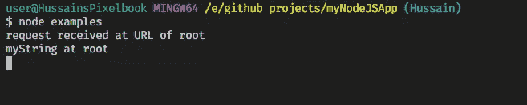
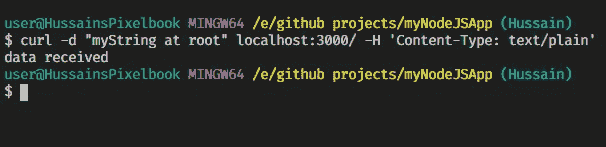
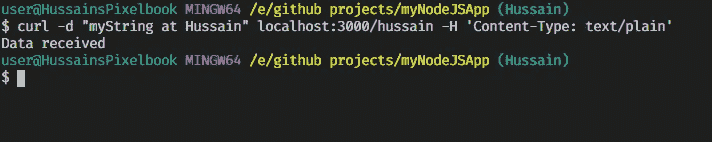
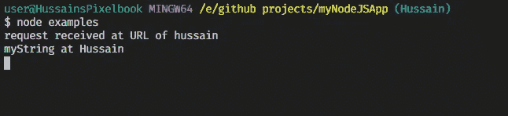
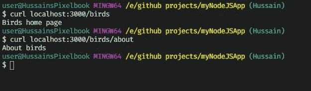
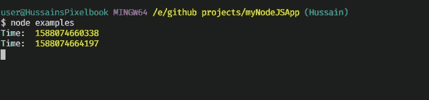

# Express.js 中的路由

> 原文：<https://betterprogramming.pub/express-js-routing-1b48f459d43a>

## 如何使我们的路由更有组织，代码更简单


图片由 [Andreas Schantl](https://unsplash.com/@andjsch?utm_source=medium&utm_medium=referral) 在 [Unsplash](https://unsplash.com?utm_source=medium&utm_medium=referral) 上拍摄。

# 简介:什么是路由？

路由是一种方法，指的是确定应用程序如何响应客户端对特定路径和特定 HTTP 请求方法(GET、POST 等)的请求。

简单来说，routing 控制着每当用户导航到一个特定的 URL 时哪个函数被调用。在这个上下文中，URL 指的是任何路径或路由。

# 定义路由方法

您可以像这样定义路由方法:

```
app.METHOD(PATH,CALLBACK)
```

这个函数告诉服务器，“如果用户导航到`PATH`，那么执行下面的`CALLBACK`函数并执行一个 HTTP `METHOD`请求。”

这里，代替`METHOD`最常用的动词是:

*   `get`:处理 GET 请求(即向指定资源请求/获取数据)。
*   `post`:向服务器发送数据，创建/更新资源。
*   `put`:向服务器发送数据，创建/更新资源。POST 和 PUT 请求的区别在于，后者是等幂的。这意味着，如果多次调用 PUT 请求，它们不会产生额外的效果。相反，如果多次调用 POST 方法，程序会有副作用。因此，请记住，POST 请求不会被调用多次。
*   `delete`:用于删除指定的资源。

还有更多的 HTTP 方法可以使用。维基百科有一个完整的列表，列出了可以使用的内容。

# 基本示例

## 1.基本 Hello World

作为一个基本示例，让我们定义一个 HTTP `GET`方法，如果用户导航到`'/'`路径，则显示单词“Hello World ”:

要运行这段代码，首先进入终端窗口并键入`node express-basic-hello-world`。然后，在另一个终端上，键入`curl localhost:3000`。

这将是客户端窗口上的输出(使用了`cURL`):


客户端终端输出

## 2.发布请求

您可以执行 POST 请求向服务器发送数据。为此:

在这段代码中，我们将 POST 请求发送到不同的路径，以说明不同 URL 中的路由。

我们使用`express.text()`中间件来解析来自请求体的文本数据。要了解更多关于中间件的知识，请参阅我的前一篇文章。

要运行代码，首先在一个终端窗口中使用`node`。

在第二个终端窗口中，我们将使用以下命令:

```
curl -d 'my String at root' localhost:3000/ -H 'Content-Type: text/plain'
curl -d 'myString at Hussain' localhost:3000/hussain -H 'Content-Type: text/plain'
```

输出将如预期的那样。

当第一个`cURL`命令运行时:



第一条命令后的终端服务器端窗口



第一条命令后的终端客户端窗口

运行第二个`cURL`命令时:



第二个命令后的客户端窗口



第二个命令后的终端窗口

# 模块化路由

想象一下这个场景:你拥有一家出售宠物的商店，一位顾客想从你这里买兔子和猫。

如果您使用上面定义的基本路由方法，代码将如下所示:

请注意，我们已经多次编写了相同的路由。

然而，一遍又一遍地写路线增加了冗余和错别字。此外，让我们的代码更加模块化也很有帮助，因为这是一个好的实践。

作为一名程序员，你总是想让你的代码看起来更整洁。为了让上面的代码更容易阅读，我们可以使用两种方法。

## 1.使用 app.route

这就是`app.route`的用武之地。您只需编写一次路径，就可以链接多个路由处理程序。

您可以按如下方式实现`app.route`:

```
app.route(PATH)
   .get(callback)
   .post(callback)
//can add more HTTP requests (.put, .delete, etc)
```

我们现在可以重写代码:

代码看起来更干净，而且您只需为每个 HTTP 请求输入一次路由。

然而，还有一个警告:参数`username`存在于所有的路由中。一遍又一遍地输入`username`仍然会鼓励打字错误和冗余。如果我们能让它更加模块化呢？

## 2.快递。路由器()

我们可以使用`express.Router()`来创建模块化的、可安装的路由处理器。一个`Router`实例是一个完整的中间件和路由系统，这就是为什么它经常被称为“迷你应用程序”

我们只需要指定起点，而`Router`实例会为我们处理剩下的事情。

要使用`app.Router()`，我们必须创建一个单独的模块，实例化`app.Router`的一个实例，然后使用`module.exports`导出该实例。

关于使用`module.exports`的更多细节，参见[我之前的文章](https://medium.com/analytics-vidhya/node-js-modules-exports-80d9b1bc2acf)。

在这个例子中，我们将只处理一个包含`username`和`id`参数的简单路径。

在`routerExample.js`中:

我们用`router.route()`，类似于`app.route`。定义的模块说，“只要路径以`/:username/:id`结束，就按照定义执行下面的代码。”

要使用它，请使用另一个模块，`main.js`:

正如评论所说，我们使用`app.use`来告诉`routeExample.js`执行具有从第一个参数开始的路径的函数。第一个参数可以称为起点。所以路径会是`**starting point** + PATH defined by router`。

例如，根据第 6 行，我们现在将处理以`‘/cats’`开始的 GET 和 POST 请求。他们将拥有路径`cats/:username/:id`。

像往常一样，您可以在`routeExample`模块中使用不同的路线，但您唯一需要指定的是`app.use`中的起点。

要运行代码，在终端窗口中键入`node main`并相应地在另一个窗口中使用`cURL`。

## 快递中的不同路线。带中间件的路由器

在本例中，我们将导航到宠物店的 Birds 主页，并定义一个中间件函数`timeLog`，它将输出请求相应路径的时间。

`birds.js`:

在`main.js`中:

```
var birds = require('./birds')

app.use('/birds', birds) //handle /birds and /birds/about
```

使用`node`命令运行代码，然后像这样使用`cURL`:



客户端窗口的输出



服务器端窗口的输出

因此，在`express.Router`中可以只在特定路径中执行中间件功能。

# 概述

## 基本路由

```
app.METHOD(PATH,CALLBACK)
```

## 使用 app.route()

```
app.route(PATH)
   .METHOD(CALLBACK)
   .METHOD(CALLBACK)
//can chain more HTTP methods by adding '.METHOD(CALLBACK)'
```

## 使用快递。路由器()

`router-example.js`

```
const Router = express.Router()router.METHOD(PATH ,CALLBACK)//more handlers and routes definedmodule.exports = Router
```

`main.js`

```
const routerExample = require('./router-example')
app.use('/',routerExample)//handle route '/' + PATH
app.use('/birds',routerExample) //handle route /birds/PATH'
```

# 外部资源

*   [快递路由](https://expressjs.com/en/guide/routing.html)
*   [快递基本路线](https://expressjs.com/en/starter/basic-routing.html)
*   [快递 JS —路由器和路由— YouTube](https://www.youtube.com/watch?v=iM_S4RczozU)
*   [学习使用 Express.4.0 中的新路由器](https://scotch.io/tutorials/learn-to-use-the-new-router-in-expressjs-4)

# 结论

在[的下一篇文章](https://medium.com/javascript-in-plain-english/use-mongodb-with-node-js-14781ec11c0a)中，我们将使用 MongoDB 通过数据库添加持久性。

今天到此为止。非常感谢你坚持到最后。祝您愉快！

呆在家里，注意安全。