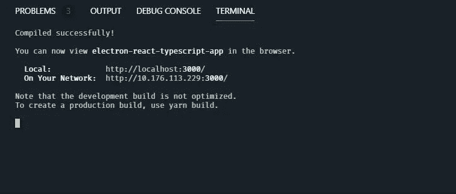
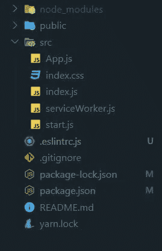
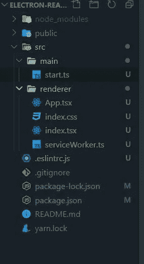
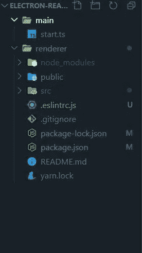
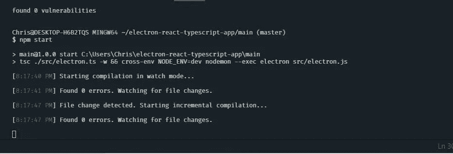
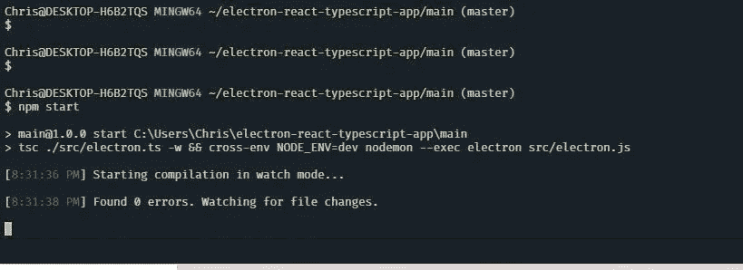

# 使用 TypeScript 扩展您的 React 电子桌面应用程序

> 原文：<https://betterprogramming.pub/extend-your-react-electron-desktop-app-with-typescript-e71af04fe2f>

## 借助类型脚本支持加速您的开发流程


照片由[伊戈尔·米斯克](https://unsplash.com/@igormiske?utm_source=unsplash&utm_medium=referral&utm_content=creditCopyText)在 [Unsplash](https://unsplash.com/@igormiske?utm_source=unsplash&utm_medium=referral&utm_content=creditCopyText) 上拍摄

在之前的一篇文章中，我讲述了使用 [Electron](https://electronjs.org/docs) 创建桌面应用软件的步骤。这篇文章将从克隆 repo 并扩展它以支持 TypeScript 开始，以便我们在开发桌面应用程序时获得类型检查功能。

TypeScript 可以通过通知您代码中的类型错误来帮助提高您的应用程序质量，因此如果您还没有开始将它集成到您的开发流程中，这是一个好主意。

也就是说，这不是一个延续教程，但我们将使用 repo 来扩展它，以便像你我这样的用户可以在开发桌面应用程序时开始利用 TypeScript 特性。

事不宜迟，让我们开始吧！(注:如果您想要一份我们将要构建的最终回购的副本，请访问[此链接](https://github.com/jsmanifest/electron-react-typescript-app))

我们要做的第一件事是[克隆回购](https://github.com/jsmanifest/electron-react-app)。

完成后，进入目录并使用 CLI 安装依赖项:

```
npm install
```

一旦完成应用程序的安装，让我们通过在开发模式下启动它来确保我们有一个工作项目:

```
npm start
```

如果成功，您应该会看到以下窗口:



这启动了我们 React 应用程序的实时热可再加载 web 服务器。

现在继续运行电子:

```
npm run electron
```

如果成功，您应该会看到以下窗口:


太好了！现在我们知道我们有一个工作的应用程序，让我们继续将 TypeScript 安装到项目中:

```
npm i -D typescript
```

(注:`-D`只是`--save-dev`的别名)

接下来我们要安装 ESLint。你可能会奇怪，既然 ESLint 主要关注林挺 JavaScript，我为什么还要为它费心。

TSLint [背后的团队在今年早些时候发布了一个公告](https://eslint.org/blog/2019/01/future-typescript-eslint)，宣布他们的下一步计划，并决定 TSLint 将被弃用，转而支持 ESLint。结果，工具最终向前发展，允许开发者一起使用 ESLint 和 TypeScript。

`[@typescript-eslint/parser](https://github.com/typescript-eslint/typescript-eslint)`是一个解析器，它将我们的源代码转换成抽象语法树(AST ),通过利用 TypeScript 编译器使 ESLint 能够与 TypeScript 一起使用。你可以在 GitHub 上了解更多信息。

我们还需要安装`@typescript-eslint/eslint-plugin`。

我将列出我在 React 项目中经常使用的包。你不需要安装所有的软件，但是`eslint` 和下面五个是你最想在你的项目中使用的:

*   埃斯林特
*   eslint-config-airbnb
*   eslint-config-appeller
*   eslint-插件-导入
*   eslint-plugin-jsx-a11y
*   eslint-插件-更漂亮
*   eslint-plugin-react
*   eslint-plugin-react-hooks
*   @typescript-eslint/parser
*   @ typescript-eslint/eslint-plugin

所以让我们继续安装`eslint`和所有其他的:

```
npm install -D eslint eslint-config-airbnb eslint-config-prettier eslint-plugin-import eslint-plugin-jsx-a11y eslint-plugin-prettier eslint-plugin-react eslint-plugin-react-hooks @typescript-eslint/parser @typescript-eslint/eslint-plugin
```

让我们也不要忘记`typescript`本身:

```
npm install -D typescript
```

接下来，我们将在根目录下创建一个`.eslintrc.js`文件。这是我的`.eslintrc.js`:

现在，当我们在一个电子项目中实现 TypeScript 时，事情变得有点棘手。 [TypeScript](https://www.typescriptlang.org/index.html) 是 JavaScript 的类型化超集，将代码编译成普通的 JavaScript，这就是我们想要的。但实际上，在用电子方式构建应用程序时，可能会有一个问题，我们乍一看可能没有意识到，特别是如果我们刚刚开始使用电子方式。

问题是，在电子中实际上有两种类型的过程。一个被称为主进程，另一个是渲染器进程。当 Electron 创建网页时，它们被创建为呈现器进程(本质上是生活在浏览器环境中)。Electron 可以同时创建和运行多个渲染器进程，但最终只能有一个主进程。

因为渲染器进程是网页，所以它们被阻止调用本地 GUI APIs，因为允许它们管理 GUI 资源将是一个巨大的安全问题。电子通过利用 [ipcMain](https://electronjs.org/docs/api/ipc-main) 、 [ipcRenderer](https://electronjs.org/docs/api/ipc-renderer) 或 [remote](https://electronjs.org/docs/api/remote) 在渲染器和主进程之间启用单向通信隧道。

由于这种限制，我们必须以这样一种方式分割目录，即我们独立于渲染器进程为主进程开发代码，以便我们让 TypeScript 单独编译它们。这样我们就不会在编译他们的代码时在软件中产生问题。

让我们看看我们的目录结构，看看我们有什么:



看起来我们有`start.js`，它是主进程，和渲染器进程的代码(`App.js`、`index.js`、`index.css`等)生活在同一个目录下。所以我们必须把它们分成这样的东西:

注意:我重命名了截图中的文件，使它们成为类型脚本文件。



这是一个好的开始。然而，当我们配置 typescript 配置文件时，我们必须指定一个 glob，TypeScript 将使用它来包含在编译中匹配的所有文件中，包括将它们输出到哪里。我们仍然停留在以前的问题上，所以我们要做的是将当前根目录作为父目录，它将保存主和渲染器进程代码。

我们还将使它们都成为独立的回购协议，这样我们就可以获得只需要暴露于特定流程的`npm install` ing 包的好处，反之亦然。这将有助于我们在将来更容易地调试，因为我们的目录更加抽象和有组织。

我们要做的是将除主目录之外的所有内容移动到渲染器目录。我们这样做的原因是因为这个项目是由 [create-react-app](https://github.com/facebook/create-react-app) 引导的，它本质上已经是渲染器进程中的一个环境:



既然我们已经解决了 renderer repo 的问题，让我们将主流程变成它自己的 repo:

```
# step into the main directory
cd main# initialize npm
npm init
```

只要按下回车键就可以了。现在打开`package.json`，你应该会看到一个几乎空的`package.json`文件:

```
{
  "name": "main",
  "version": "1.0.0",
  "description": "",
  "main": "index.js",
  "scripts": {
    "test": "echo \"Error: no test specified\" && exit 1"
  },
  "author": "",
  "license": "ISC"
}
```

这里我们需要改变的是`"main"`部分，不是因为它不是一个类型脚本文件，而是因为这是一个电子文件，当我们稍后运行 build 命令时，我们将把它放入我们的输出目录中。当我们构建应用程序时，我们将在渲染器目录中启动它，因此我们需要一个更清晰的名称:

```
{
  "name": "main",
  "version": "1.0.0",
  "description": "",
  "main": "./src/electron.js",
  "scripts": {
    "test": "echo \"Error: no test specified\" && exit 1"
  },
  "author": "",
  "license": "ISC"
}
```

您可能会感到困惑，为什么我们没有以类似于`.ts`的 TypeScript 扩展名结尾。这是因为我们将创建一个`electron.ts`文件，我们将让 TypeScript 将它传输到同一个目录中的`.js`。当我们稍后在渲染器目录中运行 build 命令时，我们将以编程方式复制该文件，并将其发送到渲染器的输出目录，该目录将是`build`。

为了让 TypeScript 编译这个文件，我们将在主 repo 中安装 TypeScript:

```
npm install -D typescript
```

然后我们将在它的根目录下创建一个`tsconfig.json`:

```
{
  "compilerOptions": {
    "target": "es5",
    "lib": ["dom", "dom.iterable", "esnext"],
    "allowJs": true,
    "skipLibCheck": true,
    "esModuleInterop": true,
    "allowSyntheticDefaultImports": true,
    "strict": true,
    "forceConsistentCasingInFileNames": true,
    "module": "esnext",
    "moduleResolution": "node",
    "resolveJsonModule": true,
    "isolatedModules": true,
    "noEmit": true,
    "jsx": "preserve"
  },
  "include": ["src"]
}
```

我们将把这作为一个典型的开发回购，因为我们不希望在两者之间来回切换造成任何不必要的混乱，所以我们将创建一个`src`目录并将`start.ts`文件直接移入其中。

这个`start.ts`文件就是将被编译成`electron.js`的`electron.ts`文件。

另外，不要忘记安装`electron`:

```
npm install electron && npm install -D @types/electron electron-is-dev
```

此外，我们将安装`nodemon`包，这样当我们将它与`electron-reload`结合时，我们就获得了`auto restart`功能(当我们对它进行更改时，电子重新加载用于重新启动主进程):

```
npm install --save-dev nodemon electron-reload
```

接下来，我们将把`start`命令添加到脚本部分:

```
{
  "name": "main",
  "version": "1.0.0",
  "description": "",
  "main": "./src/electron.js",
  "scripts": {
    "start": "cross-env NODE_ENV=dev nodemon --exec \"electron src/electron.js\" && tsc ./src/electron.ts -w"
  },
  "author": "",
  "license": "ISC",
  "dependencies": {
    "electron": "^6.0.12"
  },
  "devDependencies": {
    "@types/electron": "^1.6.10",
    "concurrently": "^5.0.0",
    "cross-env": "^6.0.3",
    "electron-is-dev": "^1.1.0",
    "electron-reload": "^1.5.0",
    "nodemon": "^1.19.3",
    "typescript": "^3.6.4"
  }
}
```

这是我们的`electron.ts`文件:

```
import { app, BrowserWindow } from 'electron'
import * as path from 'path'
import * as isDev from 'electron-is-dev'
import 'electron-reload'let mainWindowfunction createWindow() {
  mainWindow = new BrowserWindow({
    width: 800,
    height: 600,
    webPreferences: {
      nodeIntegration: true,
    },
  }) mainWindow.loadURL(
    isDev
      ? 'http://localhost:3000'
      : `file://${path.join(__dirname, '../build/index.html')}`,
  ) mainWindow.on('closed', () => {
    mainWindow = null
  })
}app.on('ready', createWindow)app.on('window-all-closed', () => {
  if (process.platform !== 'darwin') {
    app.quit()
  }
})app.on('activate', () => {
  if (mainWindow === null) {
    createWindow()
  }
})
```

太好了！现在，当我们运行`npm start`时，我们的主进程应该成功运行，此外还会根据更改自动将`electron.ts`重新编译为`electron.js`:



让我们回到渲染器目录，因为我们还有几件事要做。

```
# move back out to the parent directory
cd ..# move into the renderer directory
cd renderer
```

注意:如果您缺少一个`tsconfig.json`文件，请创建它:

```
{
  "compilerOptions": {
    "allowJs": true,
    "allowSyntheticDefaultImports": true,
    "esModuleInterop": true,
    "forceConsistentCasingInFileNames": true,
    "isolatedModules": true,
    "jsx": "preserve",
    "lib": ["dom", "dom.iterable", "esnext"],
    "module": "esnext",
    "moduleResolution": "node",
    "noEmit": true,
    "skipLibCheck": true,
    "strict": false,
    "target": "es5",
    "resolveJsonModule": true
  },
  "include": ["src"]
}
```

如果一切顺利，我们现在应该有两个工作流程！

进入你的渲染器进程目录并运行`npm start`,你会看到一个正常运行的服务器:


最后，打开另一个终端，进入主进程目录并运行`npm start`。它应该也能工作:



万岁！我们终于做到了！我们现在几乎可以开始开发了！等等，什么？

是的，没错。我们还没有完全完成。你有没有注意到当你修改主程序代码时，电子程序没有重新加载？我们将需要[等待](https://github.com/jeffbski/wait-on)包来决定何时执行`electron.js`文件。这完美地解决了我们的问题，因为它会等到 HTTP 请求返回一个`200`代码，然后当应用程序准备好继续运行时，它会继续执行脚本。

我们还将同时使用[和](https://github.com/kimmobrunfeldt/concurrently)，这样我们就可以同时运行我们的命令，因为它们可以单独运行:

```
{
  "name": "main",
  "version": "1.0.0",
  "description": "",
  "main": "./src/electron.js",
  "scripts": {
    "start": "concurrently \"tsc ./src/electron.ts -w\" \"cross-env NODE_ENV=dev nodemon --exec \"\"wait-on http://localhost:3000 && electron src/electron.js\"\""
  },
  "author": "",
  "license": "ISC",
  "dependencies": {
    "electron": "^6.0.12"
  },
  "devDependencies": {
    "@types/electron": "^1.6.10",
    "concurrently": "^5.0.0",
    "cross-env": "^6.0.3",
    "electron-is-dev": "^1.1.0",
    "electron-reload": "^1.5.0",
    "nodemon": "^1.19.3",
    "typescript": "^3.6.4",
    "wait-on": "^3.3.0"
  }
}
```

一旦你达到这一点，你就可以开始开发你喜欢的应用程序代码了。记住，你可以独立于你的渲染进程开发主进程，但是当你用[electronic-builder](https://github.com/electron-userland/electron-builder)打包它们时，它们会被打包在一起。

# 结论

这部分就结束了。我希望您发现这是有价值的，并且它帮助您对如何将 TypeScript 集成到其他项目中有了更多的了解。以后多找找！