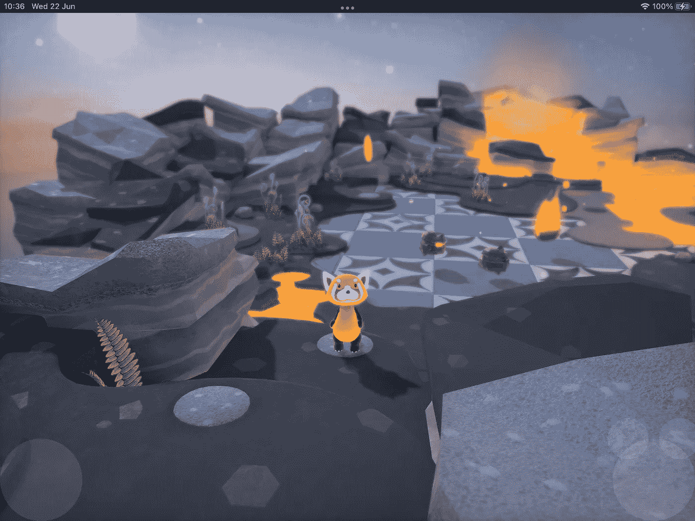

# 用 SceneKit 和 SwiftUI 扩展苹果的 WWDC 2017 演示应用

> 原文：<https://betterprogramming.pub/extending-apples-wwdc-2017-demo-app-with-scenekit-and-swiftui-e90168c07f25>

## 更新苹果 SceneKit 演示的第二次尝试

WWDC 2017 演示所基于的 foxy2 角色的快照

上周我发表了一篇关于使用 SwiftUI 重建苹果 WWDC 2017 SceneKit 演示的文章。你可以在这里找到[的论文](/rebuilding-apples-wwdc-2017-demo-app-with-scenekit-and-swiftui-77374c230e28)。

在那篇文章中，我使用 SwiftUI 重新构建了游戏的控件，这是一个半成功的重建，但我犯了一个致命的错误。我将`SCNSceneRendererDelegate`代码拆分成它自己的类。第二天我意识到了我的方法的错误，并且仍然希望它与主代码分开，我把它移到了它的扩展中。这就是答案。

> 注意代码不会在模拟器上运行。你需要使用一个真实的设备，最好是 iPad。

整个演示在很大程度上与苹果在 WWDC2017 上展示时一样，尽管我跳过了 SpriteKit 代码。此外，它现在使用基于 SwiftUI 的控件。今天和我一起完成更多更新和一些升级。

## 这个计划

随着我的深入挖掘，我发现 foxy2 最初被称为小熊猫，至少这是该模型的名字——嗯，他们在 2015 年也用小熊猫做了一个很棒的演示。我计划借用一个敌人和你需要从所说的演示中收集魔法珍珠的想法。
我还想修复我在 foxy2 中得到的一些警告——并把我使用的委托模式从组合中去掉，因为我怀疑我不需要它。

## 愿望清单

邦。这里有一个更明确的列表，请记住，如果可能的话，我不想重新发明轮子。如果你对我还能做什么有任何想法，请在最后的评论中添加。

*   我希望有更多的敌人守卫监狱。我将使用现有的模型和 foxy1 演示中使用的模型。
*   我也想加入狐狸 1 的魔法珍珠，收集珍珠会给你更多的生命力。
*   我想加一个生命指标；此刻，你可以在熔岩地里奔跑而不会有任何后果；我想要一个指标，这样做太多会导致你无法完成游戏，一个生命的力量。
*   同样的，我想要一个生命指示器被敌人影响，所以他们靠得太近，你会失去生命力。
*   我需要一个游戏结束的信息，当你释放你的同事并用尽心脏时触发。
*   我想引入一个计时器，这样你做工作越快，你得到的分数就越好。
*   谈话，分数，一个独立的最佳成绩显示会很好！我将使用 SwiftUI 来管理一个演示，因为我确信它将比`GamePlayKit`框架更容易。

## 新的敌人和珍珠

我首先介绍一些新的敌人，他们使用现有的模型来建立第三个敌人。经过一些尝试和错误，我设法这样做了，正如你在这个截图中看到的。

背景中多了一个敌人的快照，以前是两个，现在是三个

它工作得相当好，但事实上，如果狐狸越来越近，两个敌人合并。因为我对第三个敌人的行为使用了和第二个一样的游戏组件，如果你杀死他们中的任何一个，他们都会爆炸。这两种行为都需要纠正。

为了避免这种行为/结果，我通过复制第一个组件创建了第二个追逐组件。一个解决我的问题的方法是，如果我攻击其中一个，两个敌人都会被消灭。
然而——由于代码仍然是相同的，如果我逗留太久，两个敌人最终会相互重叠。
我想我会试着和追逐者一起使用逃跑行为，但是把它做好开始看起来像第三个项目，所以我求助于改变第三个敌人的追逐变量，这在很大程度上解决了这个问题。

## Foxy1 资源

我下载了 foxy1 演示代码，修复了几个简单的胜利，并运行了它——它看起来也不错。然后我检查了资源，借了敌人和珍珠。我复制了*。scn 文件和纹理，使用 Xcode 编辑器重新匹配这两个文件。

我用这段代码添加了新的资源。

并将这段代码添加到`GameController`中的 collect 方法中。

好了，说够了，也许是预演的时候了。这是一段前所未见的 2017 年 WWDC 风景展视频。

在视频中，我从捡起一颗珍珠开始。我在比赛开始时向左向右，然后爬下到场地。摄像机处于调试模式，这就是为什么它不跟着我。在竞技场中，旋转燃烧的状态是我从 WWDC 2015 展示中得到的第二个元素。除此之外，我穿过熔岩，释放了三只狐狸。

## SwiftUI HUD 变化

当然，SF 符号提供了我需要的生命力的完美形象，我决定用这个代码给玩家 16 一个心脏。

我将通过一个简单的布尔值数组来管理图像，真值是一颗红心，假值是一颗失落的心的灰色轮廓。

然后，我设置了一个基于 Combine 框架的订阅，使用一个简单的`PassthroughSubject`来管理它们，当你收集到一颗珍珠时，它会发送“true ”,当你跑过熔岩或没有与守卫战斗时，它会发送 false。价值观给你或多或少的心。

我对 dpad 也不满意，你可以从第一个视频中看到。我正在努力工作，将按钮移动到顶部边缘-我尝试了几个想法，但最终确定了向前跳转按钮，而不是简单的垂直跳转。我也把攻击/旋转放在同一个按钮下。

我的下一个愿望是一个计时器；这很容易用 SwiftUI 中的一个简单定时器实现。

看起来不错；当然，它有一些微调要做，但现在就去是好的。这是一个展示最终构建的视频。当然，在你的愿望清单上还是有一些事情，也许在你的愿望清单上也有一些。

最终视频

在视频里，你看到我捡起四颗珍珠，杀死两个机器人，把我的三个同事从监狱里救出来；在经历了太多的岩浆跳跃后失去了一两颗心脏。

# 结论

不幸的是，代码中有一个声音问题；据我所知，它看起来是正确的？但是不管用。除此之外，它看起来很好；我希望你同意。

我将以此结束这篇论文。如果你认为我应该回到 foxy1，用 foxy2 的资源更新它，并把它变成一个简单的游戏，请在评论中告诉我。

同时，在这里下载本文的完整代码。