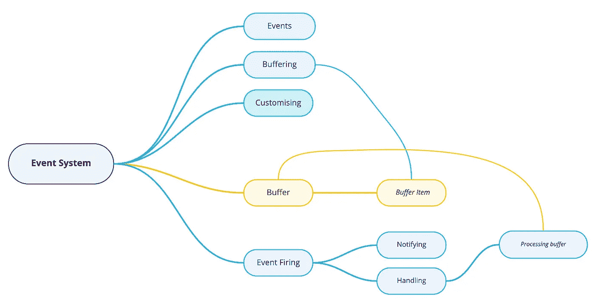

# 用类型脚本泛型扩展全局事件系统

> 原文：<https://betterprogramming.pub/extending-global-event-system-with-typescript-generics-16c2c626fa25>

## 添加自定义事件类型和事件缓冲



[在第一部分](https://medium.com/@nicksettler/build-a-global-event-system-using-custom-observers-and-subscribers-d3a409eb7d6e)中，我们已经完成了初始事件系统的创建。它允许跟踪代码中任何地方发生的事件，并为这些事件触发处理程序。

无论如何，事件当前必须在事件系统的源代码中预定义。此外，没有事件缓冲，这意味着一些必须处理旧事件的代码将无法检索它们。

# 撤消单例模式

由于无法将类型传递和存储到使用 Singleton 模式创建的事件系统中，因此有必要移除该模式。所以这篇文章希望使用没有私有构造函数、`getInstance`方法和事件系统类的`instance`字段的代码。

实现这一部分后，事件系统应该总是被初始化，并作为一个单独的模块存储在代码中。

# 自定义事件类型

当前的实现允许设置可通过事件系统跟踪的预定义事件列表。使用这样的实现作为库将不会允许第三方开发人员根据自己的需要扩展这个列表。此外，这种缺失使得代码难以重构。

要解决这个问题，我们可以将 TypeScript 的强大功能用于泛型，这将使第三方定制更加容易。

## 类型和接口重构

首先，需要更新包括事件系统类类型在内的类型定义。

事件系统应该使用类似对象的类型，其中键是事件的名称，值是事件发生时触发的函数。所以我们可以使用 TypeScript 泛型重构我们的类型来接受这种变量。

使用这种重构可以传递包含事件名称及其处理程序的键值对的类型。在向事件系统类方法添加泛型时，这种重构将非常有用。

## 类方法重构

为了使事件系统类方法能够处理通过构造函数传递的事件类型，有必要传递一个包含要处理的事件名称的类型。

此次更新后，在调用函数时，可以通过泛型显示事件名称。无论如何，通过泛型传递事件名称是不必要的，因为它也作为函数参数传递，所以它将被绑定到泛型键，这将确保在传递处理函数或其参数时的类型安全。

# 事件缓冲

当一些订阅者在事件已经被触发的情况下太晚附加到事件时，事件缓冲会很有用。这个错过的事件触发器对于订阅者来说可能是重要的，但是在当前的实现中，它不能在以后得到它。

事件缓冲实现将存储最后几个事件。如果订户稍后连接，他将接收最后几个事件，并有可能处理它们。

要实现这个特性，需要安装第三方库 [Mnemonist](https://www.npmjs.com/package/mnemonist) ，它具有固定长度缓冲区的功能。当在这种类型的缓冲器中有新的项目时，最后一个项目被删除。这有助于防止存储所有事件，即使不再需要这些事件，也可能会占用大量内存。

## 缓冲打字

事件系统应该能够配置缓冲区行为。出于这个目的，多介绍几个类型也是合理的。当前的缓冲区实现假设从以下方面设置缓冲区方向(先进先出或后进先出)和缓冲区大小。

## 事件系统类缓冲区介绍

要设置缓冲区配置，需要通过事件系统构造函数参数传递缓冲区设置选项。这些参数也应该是可选的，这样事件系统可以更容易地被第三方开发者用作库。

名为`CircularBuffer`的 Mneonist 数据结构将用于存储特定数量的最后事件。它将确保存储在数组中的事件数量总是恒定的。

## 缓冲处理逻辑

为了存储过去的事件并从新的订阅者触发它们的处理程序，有必要更新事件系统方法。

方法应该检查缓冲区中是否有新订户感兴趣的事件。

`notify`方法应该将它接收到的所有事件存储在缓冲区中，以便 subscribe 方法可以处理这些事件。

# 使用

当前实现的逻辑使得在单独的模块中初始化事件系统并在代码中的任何地方使用它成为可能。具有泛型的 TypeScript 提供了设置自定义事件类型的可用性，并确保事件处理程序和参数以所需的数据类型传递。事件缓冲提供要缓冲的事件，并可供后期订阅者使用。

```
Github Repository: [https://github.com/NickSettler/events-system](https://github.com/NickSettler/event-system)
```