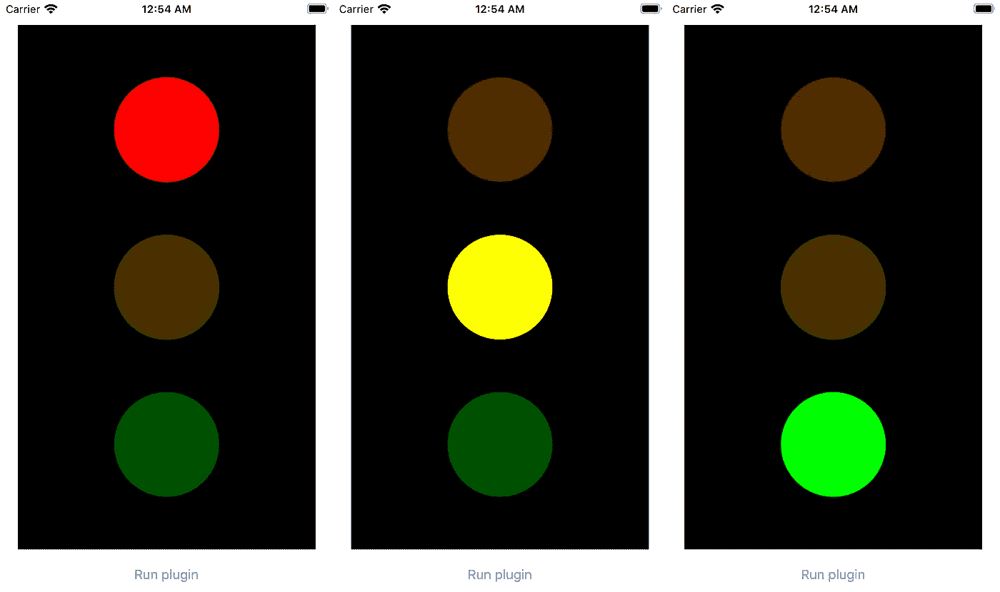
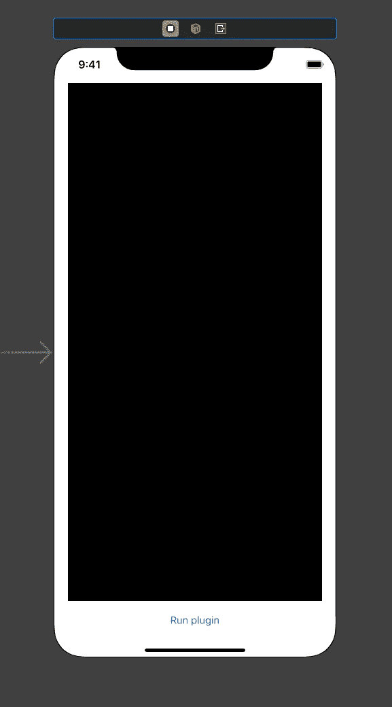
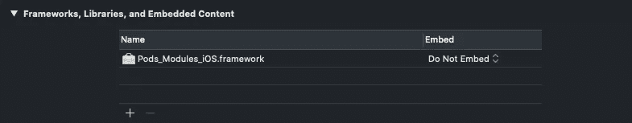
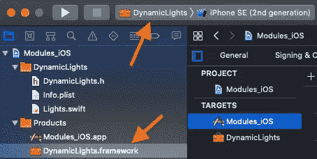

# 使用插件扩展 iOS 应用程序

> 原文：<https://betterprogramming.pub/extending-ios-apps-with-plug-ins-e4119d064f2d>

## 创建一个应用程序，加载一个插件并显示该插件的一些 UI


格伦·卡丽在 [Unsplash](https://unsplash.com?utm_source=medium&utm_medium=referral) 上拍摄的照片。

对于桌面应用程序来说，应用程序扩展或插件非常常见。Web 浏览器提供了大量的插件选择，而许多开发环境，如 Visual Studio Code 或 Android Studio，在其插件市场中提供的功能远远多于其原始应用程序。图形设计软件也有插件，允许你扩展应用程序的功能。

另一方面，iOS 应用程序没有很多扩展。通常，你会得到一个具有固定功能的产品。总的来说，苹果似乎不喜欢插件。Xcode 是少数几个不能用插件扩展的开发环境之一。你得到你所得到的，如果有新的东西出现，你需要更新整个应用程序。

我不知道为什么苹果不喜欢插件，但是对于 iOS 应用，有一个解释。在 App Store 中发布一个应用程序之前，这是 iOS 应用程序的主要分发方式，苹果会对其进行审查。他们有一长串的规则，如果他们发现你的应用程序没有满足他们的至少一个要求，他们就会拒绝它。

> “2.5.2 应用程序应独立于其捆绑包，不得在指定的容器区域之外读取或写入数据，也不得下载、安装或执行引入或更改应用程序(包括其他应用程序)的特性或功能的代码。旨在教授、开发或允许学生测试可执行代码的教育应用程序可以在有限的情况下下载代码，前提是此类代码不用于其他目的。这类应用程序必须使应用程序提供的源代码完全可供用户查看和编辑。”— [苹果开发者](https://developer.apple.com/app-store/review/guidelines/)

你可能会问，“网络浏览器呢？”iOS 设备上的网页浏览器在功能上也非常有限。他们可以显示网页内容，但不能超出这个范围。此外，显示 web 内容也受到相同准则的限制:

> “2.5.6 浏览网页的应用程序必须使用适当的 WebKit 框架和 WebKit Javascript。”— [苹果开发者](https://developer.apple.com/app-store/review/guidelines/)

好吧，但是如果我们想添加不改变应用程序功能的插件呢？或者我们不想要一个企业分发的 app 怎么办？有可能动态扩展应用程序的功能吗？简短的回答是“是的”有几种不同的方法。

# 我们的目标

出于演示目的，让我们制作一个有一个空屏幕、一个容器和一个按钮的应用程序。该按钮将加载我们的插件，运行它，并在容器中显示结果。

所有的插件都会做同样的事情:画一个红绿灯，在红、绿、蓝之间循环切换。



一个红绿灯的三个阶段(截图来自 app)。

我们需要一个与插件通信的协议。该协议应包括以下特征:

1.  从 Swift 代码运行插件
2.  定时器功能
3.  从脚本创建和更改 iOS 视图

所以，我们需要双向互动。让我们看看如何能做到这一点。

# 准备

在我们开始添加插件之前，让我们创建一个基础应用程序。创建一个只有一个视图控制器的新项目。这个视图控制器应该只有两个视图:

1.  插件容器
2.  开始按钮

在更复杂的版本中，你可以从网上加载插件，从二维码扫描，从蓝牙接收，甚至从声波解码。这不会改变任何事情，这就是为什么我将使用最简单的选项——向应用捆绑包添加脚本。



App 故事板。

对于每种类型的插件，Swift 代码都是不同的。我会把它附在每一节的末尾。

# Java Script 语言

扩展任何应用程序最简单的方法就是使用 JavaScript。首先，JavaScript 是一种流行的语言。第二，还有其他语言(例如 TypeScript)将它们的代码编译成 JavaScript。第三，iOS 有一个集成的 JavaScript 解释器。

要运行 JavaScript 代码，请使用 [JavaScriptCore](https://developer.apple.com/documentation/javascriptcore) 框架:

```
*import* JavaScriptCore
```

JavaScript 需要上下文:

```
*let* jsContext = JSContext()
```

这给出了一个可选的上下文。检查上下文是否被创建是一个好习惯，如果没有，显示一个警告。但是为了缩短未来的代码，我将假设上下文将总是被创建:

```
*let* jsContext = JSContext()!
```

让我们将 JavaScript 文件包含到我们的项目中。我们将一个文本字符串传递给`JSContext`。文本可以来自任何来源。它可以是硬编码的、来自应用捆绑包的文件或 web。

将`jsPluginCode.js`添加到您的项目中。下面是我为我们的插件编写的 JavaScript 代码:

为了避免与 UIKit 函数的冲突，我将视图称为“小部件”

Swift 将调用两个功能:

1.  `start(width, height)`创建部件并设置初始值。它获得两个参数:插件容器的宽度和高度。
2.  `tick(delta)`告诉我们的脚本一些`delta`时间过去了，并允许它采取一些行动。在浏览器内 JavaScript 中，这是不必要的。我们可以使用异步函数，但是当脚本结束时`JavaScriptCore`停止执行，而不等待所有的异步函数完成(这将是一个永恒的循环，所以我们无论如何也不想去那里)。

我们的脚本可以调用两个函数:

1.  `addWidget(name, args)`创建一个具有给定名称(小部件类型)和参数(小部件属性)的小部件。
2.  `updateProperty(widgetTag, property, newValue)`用给定的标签更新现有小部件的属性。

对于这个演示，只有一个小部件(`Circle`)和一个可变属性(`backgroundColor`)。当然，您可以添加任意数量的小部件和属性。

我们的`Circle`小部件具有以下属性:

1.  `x` —中心的 x 坐标(数字)
2.  `y` —中心的 y 坐标(数字)
3.  `radius` —圆的半径(数字)
4.  `color` —圆的十六进制颜色(十六进制字符串)
5.  `tag` —小部件/视图的标签，以便以后引用(`int`号)

提供的 JavaScript 代码创建了三个圆圈:红色、黄色和绿色。其中一个完全不透明，而另外两个大约有 1/3 的不透明。

`tick`函数以毫秒为单位计数。当它到达一秒钟时，它运行`loopStep`，这将改变我们交通灯的状态，将完全不透明赋予另一种颜色(另一种光)。

如果你懂 JavaScript，这段代码不会引发很多问题。如果没有，就认真看完。你会发现它和 Swift 没什么不同。

iOS 的代码更复杂。我们需要添加四个项目:

*   当用户点击按钮时运行代码。
*   添加一个计时器，该计时器将以已知的时间间隔调用`tick`功能。
*   可从 JavaScript 的`addWidget`函数中调用。
*   可从 JavaScript 的`updateProperty`函数中调用。

另外，我们需要添加一个 JavaScript 异常处理程序来将我们的错误记录到控制台。这将使调试过程更加容易。

下面是使用 JavaScript 的视图控制器的完整源代码:

# 左上臂

另一种扩展应用程序的方法是使用 Lua。Lua 是一种简单的编程语言，最初是为了扩展应用程序而创建的。

> " Lua 是一种强大、高效、轻量级、可嵌入的脚本语言."— [卢阿](https://www.lua.org/about.html)

Lua 在游戏开发中非常流行。一些游戏引擎使用 Lua 作为他们的主要语言(例如[*love*](https://love2d.org/))。其他框架允许你用 Lua 编写游戏的一部分，比如游戏逻辑或者游戏扩展(例如 [Polycode](http://polycode.org/) )。

Lua 是真正的跨平台语言。它的[官方框架](https://www.lua.org/ftp/)是用纯 C 写的，基本上可以在任何地方集成。Lua 是免费的，在麻省理工学院许可下发布。

> " Lua 可以用于任何目的，包括商业目的，完全免费."— [卢阿](https://www.lua.org/license.html)

最初的 Lua 框架可以很容易地集成到 Objective-C 中，但在 Swift 中会更复杂。幸运的是，有图书馆可以让它变得更容易。例如，我[发现了一个](https://github.com/weyhan/lua4swift)，我将在本节的示例中使用它。

*注意:如果您喜欢使用原始的 Lua 框架，您可以下载它，并使用桥接头将其连接到您的项目。*

我不会解释 Lua 的语法。这方面有很多教程、手册和视频课程。该脚本的逻辑与上一节中的 JavaScript 代码完全相同:

几个细节:

*   在 JavaScript 中，对象非常类似于 Swift 字典，但是 Lua 有表。它们的内部结构不同，所以我们不能把它们作为参数传递。传递自定义结构的方法是有的，但我们不会深入到这么深。相反，我修改了`addWidget`函数来接受一组简单的参数——数字和字符串。它去除了一些灵活性，但使界面相当简单。
*   该脚本返回两个值:`start`和`tick`。它们是我们从上一节中知道的函数。当我们读取一个文件时，我们在 Swift 中得到一个 Lua 函数。我们调用它，得到两个函数作为结果，保存在变量中，需要的时候调用。

当 Lua 脚本被编写并包含到一个 app bundle(名为`luaPluginCode.lua`)中时，我们集成一个库来解析和执行它。这可以用椰子来完成:

```
platform :ios, '13.0'
use_frameworks!target 'Modules_iOS' **do** pod 'lua4swift', :git => 'https://github.com/weyhan/lua4swift'
**end**
```

别忘了安装吊舱。如果你不知道 pods 是如何工作的，你需要安装 cocoapods:

```
sudo gem install cocoapods
```

然后，将文件`Podfile`添加到项目文件夹并运行:

```
pod install
```

太好了！现在，让我们切换到 Swift 代码。

导入 Lua 库:

```
**import** Lua
```

创建虚拟机:

```
**let** vm = Lua.VirtualMachine()
```

为了简单起见，我们将所有函数添加到一个全局名称空间中。有两个函数，就像我们前面的例子一样:

这个函数可以访问视图控制器，所以所有的逻辑都可以在内部完成。我们在一个`args`变量中得到所有的参数，我们将它分解成六个具有可理解名称的变量。

剩下的就很简单了。我们使用这个参数来设置一个视图并将其添加到我们的容器中。

由于 Lua 可以获得返回值，我们需要直接指定它。在这种情况下，我们返回`.nothing`，但是如果需要返回值，可以使用`.value`。

更新小部件属性的第二个函数:

现在，当这些函数完成后，让我们读取我们的文件并将`start`和`tick`函数保存在视图控制器属性`startFunc`和`tickFunc`中。两者都有类型`Function`——准确地说是`Lua.Function`:

所有错误都将打印在控制台中。这包括 Lua 脚本内部的错误。由于`lua4swift`库会自动将所有错误输出到控制台，所以我们可以在不需要的时候忽略调用值。

我们的函数调用将如下所示:

```
**_** = startFunc?.call([Double(vPluginContainer.bounds.width), Double(vPluginContainer.bounds.height)])
```

并且:

```
**_** = tickFunc?.call([10.0])
```

第一个函数只调用一次，第二个函数每 0.01 秒调用一次。从视觉上看，这个应用程序与用 JavaScript 编写的一模一样。

下面是使用 Lua 的视图控制器的完整源代码:

# 动态库

最后，我们到了有趣的部分。

我之前展示的内容在许多应用程序中被积极使用。App Store 里的一些应用其实是用 JavaScript 写的。我说的是 React Native 之类的框架。其他 app 积极使用 Lua。但是如果我们想给应用程序添加一个二进制库呢？

假设我们下载了一个为 armv7 和 arm64 构建的“胖”库。我们知道这个库有两个功能:`start`和`tick`。第一个接受两个`Double`参数，而另一个接受一个`Double`参数。我们能叫它吗？这可能吗？

我想指出，我说的不是苹果的要求。他们很可能会拒绝这样的应用程序。我说的是在现有的 iOS 应用中“注入”二进制代码的技术可能性。

让我们把它分成两步:

1.  构建一个 iOS 框架，并将其包含在应用捆绑包中。
2.  分离这个框架，动态加载。

## iOS 框架

自古以来，有两种类型的库:静态库和动态库。静态库在编译期间与主二进制文件链接。因此，它们成为输出二进制的一部分。显然，这一个不是我们的选择。

动态库位于单独的文件中。它们在应用程序启动后加载(通常在开始时)，但不包含在可执行二进制文件中。如果从应用程序文件夹或应用程序捆绑包中删除动态库，应用程序通常会崩溃或显示错误信息。

在苹果 iOS 平台中，动态库以框架的形式呈现。

我将使用下面这个现有的项目，并添加第三个视图控制器。所有 UI 元素都将位于主部件内部(与前面的示例相同):


创建框架目标。

我称我的框架为“动态之光”这两部分的代码都很短。它不需要任何额外的知识。这是一个简单的 iOS 应用程序:

如你所见，在动态模块中，我只使用了[基础](https://get.foundation/)框架。这是为了避免对 UI 的任何引用。实际上，它是前几节中 JavaScript 和 Lua 代码的精确复制。

`FrameworkViewController.swift`也很简单:

## 让我们动态加载它

首先，让我们从项目依赖项中移除动态灯光:



不依赖于 DynamicLights。

清理“build”文件夹并再次构建项目。您将得到一条错误消息:

```
No such module 'DynamicLights'
```

有道理。我们的主应用程序不再了解我们的动态框架。

选择 DynamicLights 作为构建目标并构建它。在项目导航器中，你会在`Products`文件夹中看到`DynamicLights.framework`:



动态照明框架。

在 Finder 中打开此框架。在`DynamicLights.framework`文件夹中，您将找到`DynamicLights`文件(如果您为您的框架选择了另一个名称，文件名会有所不同)。这个文件是我们的动态库。

Xcode 是智能的，所以如果你把它拷贝到一个应用捆绑包，它会自动链接它——即使你没有明确选择这个选项。`DymanicLights.framework`并且它的任何部分都不应该在项目捆绑包中。

我在 iOS 模拟器上测试过，它可以访问你 Mac 的文件系统，所以我只是从文件中读取库。如果你想在真实设备上测试它，你必须下载文件，在运行时将它保存到应用程序沙箱中，并从那里加载它。

正如我之前提到的，苹果反对插件，你很难在 App Store 中找到可扩展的 iOS 应用程序，所以苹果没有一个官方的，记录在案的方法来动态地与框架交互。如果您考虑不同的架构、Swift 版本、签名和其他环境条件，事情会变得更加复杂。这也是我有点同意苹果的原因。这种方式真的不好。

对我们来说幸运的是，Swift 与 C 兼容，你不能在同一个文件中混合它们，就像 Objective-C 与 C 一样，但是你可以在 Swift 代码中使用 C 函数。现在说的是`dlopen`、`dlsym`、`dlclose`等函数。要从框架中导出函数，需要添加关键字`@_cdecl`。

为了不处理不断变化的全局变量(甚至不确定是否可能)，我添加了设置回调的函数。以下是完整的代码:

重新构建您的框架并将`DynamicLights`文件复制到某个已知的位置。理论上，你可以使用 Xcode 的`Derived Data`文件夹中的现有路径，但是为了避免混淆，我不推荐这样做。我的道路是`/Volumes/Extra/Work/DynamicLights`。

回到我们的视图控制器，用`import Darwin`替换`import DynamicLights`。达尔文是苹果操作系统的核心元素。作为一个框架，它提供了对核心 C 函数的访问，包括`dlopen`、`dlsym`和`dlclose`。

我们有四个功能。其中两个设置回调，而另外两个给出命令:

和两个集体成员:

```
**var** handle: UnsafeMutableRawPointer?**var** tickFunc: tickFuncPrototype?
```

`handle`有一个指向动态加载库的指针。`tickFunc`是一个我们每秒调用 100 次的函数(这就是为什么值得保留指针而不是每次都获取它)。

我们是这样加载动态库的:

```
handle = dlopen("/Volumes/Extra/Work/DynamicLights", RTLD_LAZY)
```

考虑到`updateProperty`和`addWidget`常量包含我们回调的代码，这是我们的初始化代码:

这是计时器回调:

```
**if** **let** tickFunc = tickFunc {
    tickFunc(0.01)
}
```

如你所见，我们在这里使用了一些不安全的造型。如果函数原型在主代码和库代码中不匹配，应用程序就会崩溃。这使得这种方法比使用我们的 JavaScript 或 Lua 代码更不安全。

这是最终版本:

# 其他方式

JavaScript、Lua 和原生库并不是扩展 iOS 应用的唯一方式。还有许多其他的脚本语言。

例如，有一种快速简单的 [Gravity](https://github.com/marcobambini/gravity) 语言，看起来像 Swift。它提供了一个 C 库，可以集成到 Objective-C 和 Swift 应用程序中。

更复杂的语言如 Python、Perl 或 Ruby 也可以用来扩展现有的应用程序，但通常不值得。

如果需要动态布局，可以考虑使用 XML 或其他标记语言。你可以自己写一个简单的引擎或者使用[现有的解决方案](https://github.com/nicklockwood/layout)。

# 结论

即使苹果不鼓励使用应用程序扩展，但从技术上来说，使用它们是可能的。

扩展应用程序最安全的方式是使用 JavaScript。苹果有一种原生的方式来运行 JavaScript 代码，你可以使用不同的 JavaScript 风格，你可以很容易地将代码转移到另一个平台。

如果出于某种原因，您对 JavaScript 不太适应，可以使用许多其他脚本语言，比如 Lua 或更奇特的 Gravity。

也可以从外部文件中读取布局。使用外部布局引擎，您可以从 XML 或其他标记文件导入布局。HTML 也可以在 iOS 应用中解析和渲染。

下次见。编码快乐！