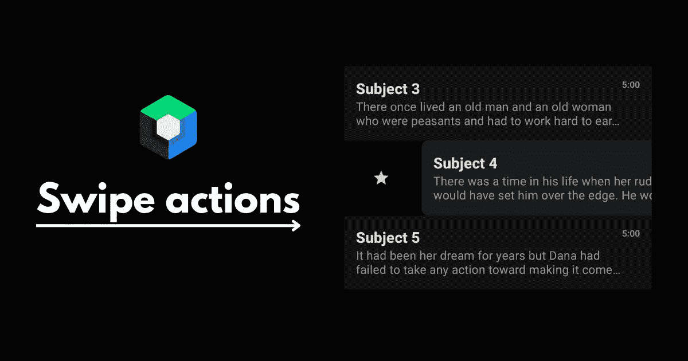
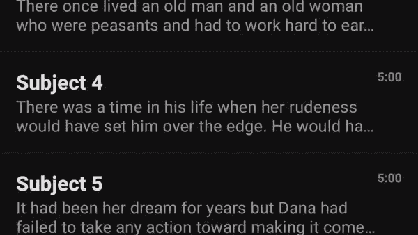
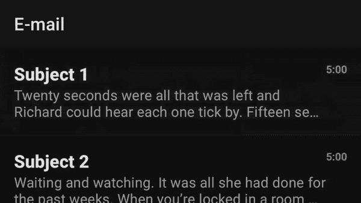

# 在 Jetpack Compose 中扩展“SwipeToDismiss”

> 原文：<https://betterprogramming.pub/extending-swipetodismiss-in-jetpack-compose-7ed356df073a>

## 可定制、有表现力、可发现



这是在项目列表上执行快速操作的常见 UI 模式。在本文中，我们将讨论如何构建一个丰富的、富有表现力的滑动来消除一个例子。

Jetpack compose 有一个默认的 composable 来提供这个功能，称为`SwipeToDismiss`。这个可组合组件提供了一些定制，但是我们可以改进它，为用户创造更好的体验。

请注意:本文不是一篇介绍性文章，假设您对`SwipeToDismiss` composable 和 jetpack compose 有一定的了解。关于`SwipeToDismiss`组件的快速介绍，请参考 Pankaj Rai 的教程。

以下是可组合组件成品的外观:



在本文中，我们将改进三个方面:

1.  可定制性
2.  表示
3.  可发现性

# 1.可定制性

首先，我们需要扩展默认 SwipeDismiss composable 的功能，这样我们就可以构建更好的、更加定制化的体验。为此，我们将创建一个 config 对象来为我们的可组合组件定义不同的选项。

```
data class SwipeActionsConfig(  
    val threshold: Float,  
    val icon: ImageVector,  
    val iconTint: Color,  
    val background: Color,  
    val stayDismissed: Boolean,  
    val onDismiss: () -> Unit,  
)
```

可组合组件将接受最多两个配置对象，它们定义了从起点和终点滑动的行为。这些可定制的选项包括:

## 阈值

这是一个介于 0 和 1 之间的浮点数，定义了滑动手势在触发动作之前必须移动的距离。默认的可组合组件已经提供了这种功能，但是创建自定义解决方案的原因是为了在状态中公开它。默认的`SwipeToDismiss` composable 已经允许这个选项，但是我们将手动处理它，以便将其作为一个状态在我们的 UI 中使用。但是首先，为了避免由于与默认可组合组件不一致而导致的任何错误，我们需要将这个阈值传递给默认可组合组件。

```
SwipeToDismiss(  
    ... 
    dismissThresholds = {  
        if (it == DismissDirection.StartToEnd)  
            FractionalThreshold(startDismissConfig.threshold)  
        else FractionalThreshold(endDismissConfig.threshold)  
    },
    ...
}
```

解决了这个问题，我们现在将创建一个`willDismissDirection`状态，我们可以用它来知道用户当前的滑动是否会导致一个动作。

```
var willDismissDirection: DismissDirection? by remember {  
    mutableStateOf(null)  
}
```

这将包含用户将要触发的动作的方向，或者如果用户没有达到阈值，则为`null`。

```
LaunchedEffect(key1 = Unit, block = {  
    snapshotFlow { state.offset.value }  
        .collect {  
            willDismissDirection = when {  
                it > width * startActionsConfig.threshold -> DismissDirection.StartToEnd  
                it < -width * endActionsConfig.threshold -> DismissDirection.EndToStart  
                else -> null  
            }  
        }  
})
```

这将允许我们稍后基于滑动的当前位置和状态来改变 UI。

## 颜色和图标

这个很简单，我们只需要定义每一面的颜色和图标。对于颜色，我们将定义背景色和图标色调。注意:为了简单起见，我选择传入一个矢量图标。但是，通过为图标传入一个 composable，可以做得更好。这允许你做更酷的设计，比如动画图标。

## 滞留时间

在不同的场景中，一旦触发了滑动动作，我们会希望列表项一直保持动画效果(例如从当前列表中删除项目)或弹回到其默认状态(例如将项目添加到不同的策划列表)。通过这个选项，我们可以为每个动作定义我们想要的两种行为。为了实现这一点，我们只需要在 dismissState 中实现`confirmStateChange`函数。

```
val state = rememberDismissState(  
    confirmStateChange = {  
        // return true for the item to stay dismissed
        // return false for the item to bounce back to its default state
    }  
)
```

## 翁迪米什

一旦用户刷卡超过阈值，就会调用这个函数。这也是在`confirmStateChange`函数中实现的。我们应该首先检查我们的`willDismissDirection`状态是否对应于传递给函数的方向。如果是这样，我们调用`onDismiss`函数，然后返回`stayDissmised`布尔值。

```
val state = rememberDismissState(  
    confirmStateChange = {  
        if (willDismissDirection == DismissDirection.StartToEnd  
            && it == DismissValue.DismissedToEnd  
        ) {  
            startActionsConfig.onDismiss()  
            startActionsConfig.stayDismissed  
        } else if (willDismissDirection == DismissDirection.EndToStart &&  
            it == DismissValue.DismissedToStart  
        ) {  
            endActionsConfig.onDismiss()  
            endActionsConfig.stayDismissed  
        } else {  
            false  
        }  
    }  
)
```

# 2.表示

我们需要传达的最重要的信息是用户的动作是否会触发一个动作，以及这个动作会是什么。我们可以利用这个机会，创造性地传递这一信息。由于我们之前已经将阈值公开为一种状态，所以我们可以在这里使用`willDismissDirection`来显示和提供关于何时触发动作的反馈。

## 显示动画

为了增加一些视觉效果，我用一个圆形动画反转了图标及其背景的颜色。我使用`AnimatedContent` composable 并传递动作的方向以及它是否会触发一个动作作为目标状态。

```
AnimatedContent(  
    targetState = Pair(state.dismissDirection, willDismissDirection != null),  
    transitionSpec = {...}  
) { (direction, willDismiss) ->
 // SwipeToDismiss composable implementation
}
```

## 图标动画

在 reveal 动画之上，我还为图标添加了一个弹跳动画。为此，我还监听了`AnimatedContent` composable 中的`willDismiss`布尔值，如果为真，我就激活它。

```
LaunchedEffect(key1 = Unit, block = {  
    if (willDismiss) {  
        revealSize.snapTo(0f)  
        launch {  
            revealSize.animateTo(1f, animationSpec = tween(400))  
        }  
        iconSize.snapTo(.8f)  
        iconSize.animateTo(  
            1.45f,  
            spring(  
                dampingRatio = Spring.DampingRatioHighBouncy,  
            )  
        )  
        iconSize.animateTo(  
            1f,  
            spring(  
                dampingRatio = Spring.DampingRatioLowBouncy,  
            )  
        )  
    }  
})
```

## 触觉反馈

这是最容易实现的，但是它为用户提供了很多有用的反馈。我们可以监听`willDismissDirection`状态，并在触发动作时振动设备。

```
val haptic = LocalHapticFeedback.current  
LaunchedEffect(key1 = willDismissDirection, block = {  
    if (willDismissDirection != null) {  
        haptic.performHapticFeedback(HapticFeedbackType.LongPress)  
    }  
})
```

# 3.可发现性

在精心制作了这个漂亮的交互之后，如果用户从来不知道它的存在，那将是一个遗憾。大多数应用程序都向用户暗示，这种交互是可能的，方法是将列表项动画化一点，并显示下面指示动作的图标。但是我们如何在我们的可组合中做到这一点呢？我们可以在 composable 中添加另一个参数来确定列表项是否应该作为用户的“教程”。这可以是我们注入到列表中的第一个项目或虚拟项目。如果这是真的，我们定义一个无限运行的动画来提示用户这个列表项可以被滑动。

```
var showingTutorial by remember {  
    mutableStateOf(showTutorial)  
}  

if (showingTutorial) {  
    val infiniteTransition = rememberInfiniteTransition()  
    val x by infiniteTransition.animateFloat(  
        initialValue = 0f,  
        targetValue = width * (startActionsConfig.threshold) / 2f,  
        animationSpec = infiniteRepeatable(  
            animation = tween(500, easing = FastOutSlowInEasing, delayMillis = 1000),  
            repeatMode = RepeatMode.Reverse  
        )  
    )  

    LaunchedEffect(key1 = x, block = {  
        state.performDrag(x - state.offset.value)  
    })  
}
```

一旦用户尝试这个动作，我们就取消动画，这样在用户尝试滑动时就不会出现奇怪的动画行为。我们可以通过将`showingTutorial`变量设置为 false 来做到这一点。

```
SwipeToDismiss(  
    state = state,  
    modifier = Modifier  
        .pointerInteropFilter {  
            if (it.action == MotionEvent.ACTION_DOWN) {  
                showingTutorial = false  
            }  
            false  
        },
        ...
)
```

这是最终教程动画的样子:



完整的示例项目可以在 Github 的[这里](https://github.com/sinasamaki/SwipeDismiss)获得。

感谢阅读。

*最初发表于*[](https://sinasamaki.com/post/2022-09-04-swipe-dismiss/)**。**