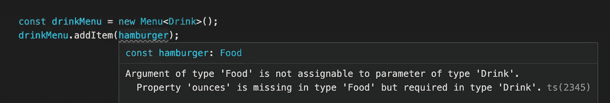
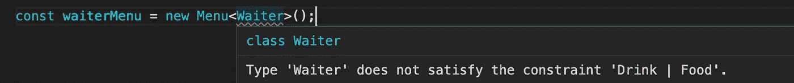
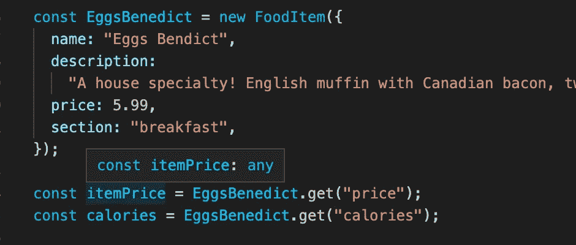
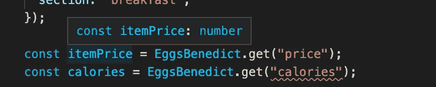

# 扩展 TypeScript 泛型以实现额外的类型安全

> 原文：<https://betterprogramming.pub/extending-typescript-generics-for-additional-type-safety-313f35aca5b3>

## 让您的类型脚本多态性更上一层楼


泛型是 TypeScript 更复杂的方面之一，所以循序渐进很重要。在本文中，我将做一些快速的例子来说明如何通过扩展泛型类型来进行更高级的操作。

如果你还不熟悉泛型的概念，我建议你先阅读我的[TypeScript 泛型简介](https://jasonbyrne.medium.com/brief-intro-to-typescript-generics-538228098b5f)文章，然后继续阅读。

欢迎回来！

假设我们有一个类型为`Menu`的类，如下所示:

假设我们有以下类型的项目:

从上面我们可以实例化一个食物或饮料菜单，如下所示:

```
const drinkMenu = new Menu<Drink>();
const foodMenu = new Menu<Food>();
```

这里的泛型确保每个菜单只能包含它们应该包含的项目类型。如果我试图在饮料菜单上添加一个汉堡，TypeScript 就会对我大喊大叫。



所以这很好！问题是我也有可能创建一个`Waiter`菜单，那会很奇怪。

```
const waiterMenu = new Menu<Waiter>();   // WTF?!?!?
```

那么如何才能防止这种情况呢？轻松点。我们将回到最初的菜单定义，并在我们的泛型周围添加一些约束。

通过在我们的泛型`T`后添加`extends Food | Drink`，我们在那里添加了一个额外的规则。只有属性与这两个类重叠的类型才会被接受。

现在，如果我试图实例化一个`Waiter`菜单，我的 IDE 会告诉我，要求服务员菜单是一件令人毛骨悚然的事情，在这家餐厅不受欢迎。



好家伙！我一定饿了。我们再来做一个食物的例子。我们将创建一个类型来定义菜单上某个食物项目的所有属性。然后我们将创建一个用这些属性实例化的类。

我们添加了一个`get`方法，它接受一个属性参数，将返回该属性的适当值。

现在我们有两个主要问题。首先，当我调用`get`方法来找出本尼迪克特鸡蛋的价格时，我的 VS 代码不知道数据类型`price`应该是什么，所以它只会认为它是可怕的`any`。我们知道在代码库中允许使用`any`是 TypeScript 开发人员的六大罪过之一！

其次，我们可以自由地请求任何字符串作为属性名。例如，我们可以要求使用`calories`，TypeScript 完全没有问题。但是，众所周知，你从来不会问本尼迪克特鸡蛋里有多少卡路里。尽情享受美味吧！相信我，你不会想知道卡路里数的！！

但是，我离题了，我们的`EggsBenedict`对象没有`calories`属性，所以我们希望我们的 IDE 能够阻止我们请求它。



我们可以做得更好，伙计们！让我们在泛型的帮助下再试一次。

不要不知所措。让我们走一遍。首先，让我们放大一下`keyof`这个关键词。这为我们动态地创建了一个类型，它包含了`FoodProperties`的所有属性。然后我们之前学过的`extends`关键字告诉 TypeScript 将`T`的可能值约束到属性列表中。

对于我们的返回值，我们使用`FoodProperties[T]`，这表示基于`property`参数，我们的返回类型将匹配`FoodProperties`中为该属性定义的类型。

现在，当我们再次尝试访问`price`和`calories`时，它将知道`price`是一个数字，并且知道`calories`不是一个有效的属性。



正如您可能已经猜到的，您可以使用相同的概念来创建 setter 方法，该方法只接受正确类型的值。

我们的 IDE 现在很高兴，并适当地进行了验证！


我希望这有助于将您的 TypeScript 多态性提高一个档次。比这更深入，但你已经上路了！