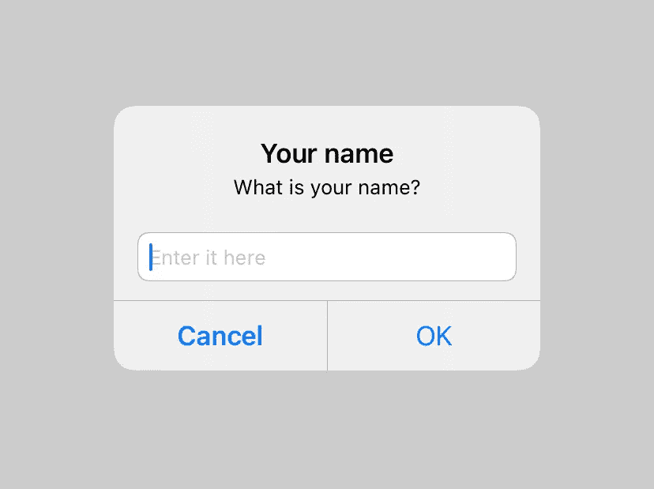
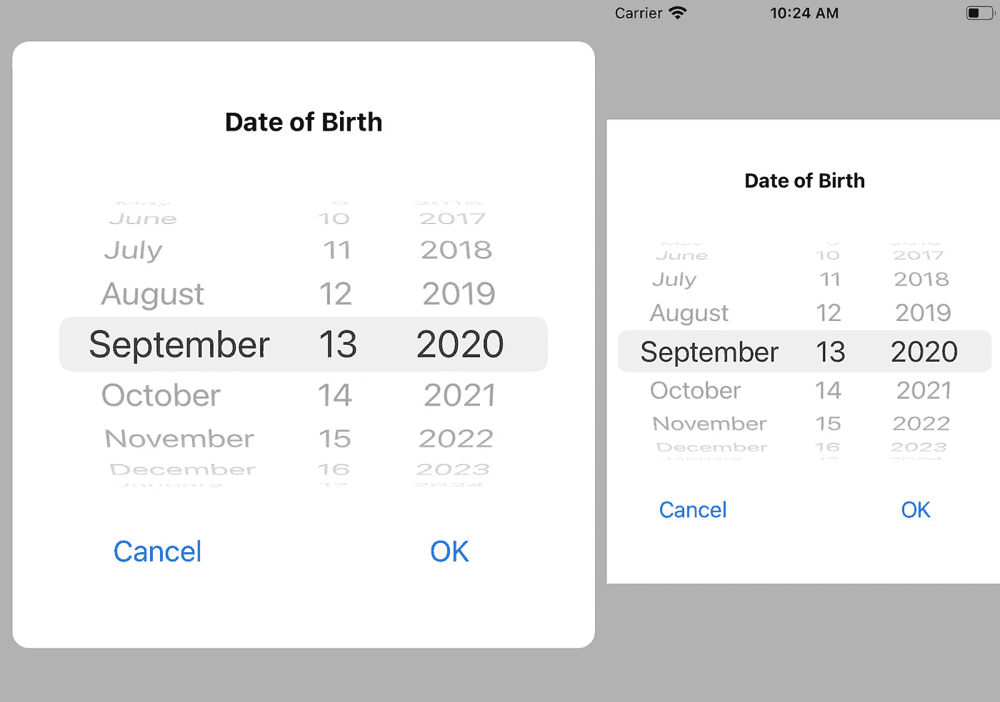

# 用弹出窗口扩展 UIViewController

> 原文：<https://betterprogramming.pub/extending-uiviewcontroller-with-popups-c39a08592784>

## 语法糖，使警报，文本字段，更容易工作


照片由 [Samson Vowles](https://unsplash.com/@delightfulartefacts?utm_source=medium&utm_medium=referral) 在 [Unsplash](https://unsplash.com?utm_source=medium&utm_medium=referral) 上拍摄

在 Swift 中，即使显示简单的弹出对话框也需要几行代码。当您进行数据验证或适当的错误处理时，您有数十甚至数百个地方可以显示弹出窗口。让我们写几个为我们工作的扩展。

```
**self**.show(message: "Let's start!")
```

# 显示错误和警告

前两个扩展将显示只有一个按钮的简单弹出窗口。区别只会在标题上。你可以添加一些样式，但是苹果通常不鼓励开发者定制弹出窗口，所以我在这里使用基本的`UIAlertController`:

如您所见，标题是预定义的，不能更改，但是可以根据系统的地区进行翻译。如果您有本地化的文件，您可以这样做:

用法(来自`UIViewController`子类):

```
**self**.show(error: error.localizedDescription)
**self**.show(warning: "Please accept our Terms to continue")
```

# 问简单的问题

好吧，也许问题没那么简单，但答案应该是。比如一行文字。或者一个数字。但是它应该在一行中。

用法(来自`UIViewController`子类):

```
**self**.ask(title: "Your name", question: "What is your name?", placeholder: "Enter it here") { (name) **in** print(name)
}
```

这是它的样子:



简单的弹出问题

根据我们的应用程序的需求，我们可以进一步改进它。例如，假设我们需要用户的年龄。这通常不是一个好的做法，但我们还是要这样做:

用法(来自`UIViewController`子类):

```
**self**.askNumber(title: "Your age", question: "What is your age?", placeholder: "Enter it here") { (age) **in** print(age)
}
```

对于不同的输入类型可以有更多的扩展，但是让我们把它留在这里，因为我认为这个想法是清楚的。

# 日期和时间

以数字形式询问年龄对于年龄验证非常有用，例如，在有成人内容的应用程序中。但是如果用户的个人资料需要的话，还是问一下他们的出生日期比较好。毕竟年龄年年变，出生日期一成不变。

显示日期选择器有两种方式:

*   带有日历或日期选择器的弹出窗口
*   带有底部工作表而不是键盘的文本字段

## 带有日期选择器的弹出窗口

不能把`UIDatePicker`加到`UIAlertView` 上——或者不如说你*不该*。这就是为什么我们需要自己的`UIView`子类来显示标题的`UILabel`，选择日期的`UIDatePicker`，以及确定和取消按钮的`UIButton`。

为了在不使用故事板的情况下进行布局，我使用了`SnapKit`库:

[](https://github.com/SnapKit/SnapKit) [## 卡扣套件/卡扣套件

### SnapKit 是一个 DSL，使自动布局在 iOS 和 OS X 上都很容易。⚠️与 Swift 4.x 一起使用，请确保您使用> =…

github.com](https://github.com/SnapKit/SnapKit) 

源代码:

通过一个非常短的扩展，我们可以直接从`UIViewController`子类中呈现它:

用法(来自`UIViewController`子类):

```
**self**.askDate(title: "Date of Birth") { (date) **in** print(date)
}
```

结果将是在屏幕中心具有圆角的面板或者屏幕的中心部分。这取决于你的 iPhone 的屏幕大小。



日期选择器对话框

您可以添加额外的属性，如最小和最大日期以及初始日期。另外，你可以改变`UIDatePicker`的类型，把它变成一个时间选择器。

如果你支持深色主题，你应该调整颜色。这超出了我们的讨论范围。

## 带底部工作表的文本字段

如果您有一系列`UITextField`组件，并且其中一个请求日期，那么这个方法非常方便。iOS 允许我们用一个`UIDatePicker`(以及`UIPicker`)组件替换标准键盘。

为此，您必须创建并设置自己的`UIPicker`。这只能通过代码来实现。

# 是/否问题

最后一种流行的弹出窗口是显示一般问题的弹出窗口。这类问题的答案不是`yes`就是`no`。这种弹出窗口有四个元素:

*   标题
*   消息
*   正极按钮(`yes`)
*   否定或取消按钮(`no`或`cancel`)

作为额外的调整，我们可以为正按钮添加`dangerous`(或`destructive`属性。该属性将以红色显示阳性按钮。

用法(来自`UIViewController`子类):

```
**self**.ask(title: "Register a new user", question: "Would you like to continue?") { (agreed) **in
    if** agreed {
        // Do something
    }
}
```

或者一个更复杂的例子:

```
**self**.ask(title: "Are you sure?", question: "The photo will be permanently deleted and can't be restored", positiveButtonTitle: "Delete", negativeButtonTitle: "Cancel", isDangerousAction: **true**) { (agreed) **in
    if** agreed {
        // Delete
    }
}
```

# 外部库

这包括了最常见的情况。但是如果你需要一些更有异国情调的东西，你可以从众多可用的图书馆中选择一个。以下是一些例子:

## 皮克科

Pikko 是一个颜色选择器。它是`UIView`的子类，所以可以添加到任何屏幕。您可以从您的代码或故事板添加它。

[](https://github.com/melloskitten/pikko) [## mellosquiten/pikko

### Pikko 是一个简单而漂亮的 iOS 颜色选择器。它的灵感来自流行图形中的传统颜色选择器…

github.com](https://github.com/melloskitten/pikko) 

## 日期时间选择器

这是另一个选择日期和时间的 UI。您可以将它用作日期、时间或日期和时间选择器。

[](https://github.com/itsmeichigo/DateTimePicker) [## itsmeichigo/DateTimePicker

### 一个更好的用于选择日期和时间的 iOS UI 组件。日期和时间选择器/仅日期选择器/仅时间选择器-您的…

github.com](https://github.com/itsmeichigo/DateTimePicker) 

## 材料成分

如果你喜欢 Google Material Design 或者你需要让你的 iOS 应用看起来尽可能的接近 Android，可以考虑使用 Material Components 库。是 iOS 抄袭安卓素材组件的一套组件。它还包括对话框，可以显示警告或询问问题。

[](https://github.com/material-components/material-components-ios) [## 材料-组件/材料-组件-ios

### iOS 的材料组件(MDC-iOS)帮助开发人员执行材料设计。由核心工程师团队开发…

github.com](https://github.com/material-components/material-components-ios) 

## CZPicker

下一个库是 CZPicker。它在弹出窗口中显示一个选择器，它不是日期和时间，而是从列表中选择。这个库没有被维护，但是它是用 Objective-C 编写的，所以它可以用于任何版本的 Swift。

[](https://github.com/chenzeyu/CZPicker) [## 陈泽宇/CZPicker

### 3 此处列出了最近的更改。已添加完整的更改日志-(void)czpickerviewlldisplay:(CZPickerView…

github.com](https://github.com/chenzeyu/CZPicker) 

# 结论

我希望这有助于您找到完美的弹出窗口，使您的代码更短、更整洁。不要害怕修改代码:编程是一门艺术。

如果让您的代码更整洁的想法与您相近，我的另一篇文章可能会让您感兴趣:

[](https://medium.com/better-programming/24-swift-extensions-for-cleaner-code-41e250c9c4c3) [## 24 个 Swift 扩展，代码更简洁

### 更高效地构建您的移动应用

medium.com](https://medium.com/better-programming/24-swift-extensions-for-cleaner-code-41e250c9c4c3) 

编码快乐，下次见！