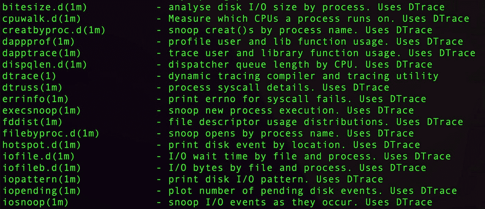
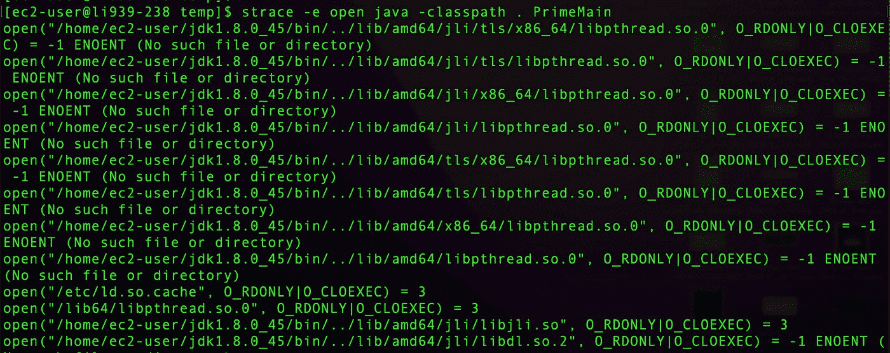

# 外部调试工具 1: DTrace 和 strace

> 原文：<https://betterprogramming.pub/external-debugging-tools-1-dtrace-and-strace-7e4cf58280f4>

## 更轻松地解决项目问题的指南


通常在调试时，我们需要跳出 ide 舒适的怀抱来重现或跟踪问题。在这个系列中，我将介绍一些对这些案例有用的工具。我会尽量限制自己使用 100%调试工具，而不是那些对开发测试有用的工具。

例如，像 [curl](https://curl.se/) 或 [jq](https://stedolan.github.io/jq/) 这样的工具非常有用。您可以并且应该在调试时使用它们。但是您可能在构建和测试特性时使用过它们，所以您应该已经熟悉它们，并且应该对它们的功能有所了解。我想把重点放在您在调试时最常使用的工具上。从这个意义上说，像 [SDKMan](https://sdkman.io/) 等工具。在这里也没有意义。

我还想避免使用像数据库工具这样的工具。它们在调试时非常有用，但是同样，您也可能在开发过程中使用它们。它们也是非常特定于供应商的，所以这是一个非常广泛的主题，在这里无法涵盖。

我将在本系列中介绍的工具包括以下几类:

*   系统监控工具——如我们今天将要讨论的 strace 和 DTrace
*   网络显示器——也属于上述类别，但有其自身的类别
*   VM/运行时监控——例如，让我们检查 JVM 的工具等。
*   分析器和内存监视器

在这第一篇文章中，我想讨论两个重量级冠军:DTrace 和 strace。如果您是 Java 开发人员或 Windows 用户，您很可能从未听说过这些工具。您可能无意中使用了其中的一个，因为许多工具都是基于它们构建的，但事实可能并非如此。

这两个工具都可以让你在没有源代码的情况下调试任何东西。你可以发现问题，并获得你从未想象过的理解。

# DTrace

早在 2004 年，我在 Sun Microsystems 工作时第一次听说了 DTrace。它在走廊里风靡一时，因为这是太阳微系统公司正在推广的一项创新。DTrace 后来被移植到 MacOS X 中(它起源于 Solaris)。今天，Windows 和 Linux 上也有端口。

DTrace 是一个强大的低级动态跟踪框架。但这只是另一个最高级，如果您从未使用过这样的工具，也没有系统编程背景，您可能会感到有点困惑:它到底是干什么的？

它让你“看到”一切。想知道一个进程打开了哪些文件？

好的。

想知道是谁调用了一个内核 API 并获得了对调用者的堆栈跟踪吗？

好的。

想知道一个进程为什么会死？

好的。

想知道一个操作要花多少 CPU 时间？

好的。

您可能认为 DTrace 是那些会完全摧毁您的 CPU 的工具之一…但是它有一个致命的特性:它足够快，可以在生产中运行，对性能的影响很小甚至没有影响！

它在近二十年前推出时是革命性的，直到今天仍然如此！

# 运行 DTrace

在我们开始之前，有一个警告。保存您的数据！

这个工具很容易让你的机器崩溃，启用它需要禁用 MacOS 上的重要安全设施。这是一种有风险的“低级”系统服务，应该如此对待。

在 Mac 上，DTrace 与“系统完整性保护”相冲突，系统完整性保护是一种阻止进程间某些交互的安全功能。正常情况下，这就太好了。但是，如果您想运行 DTrace，这将是一个问题。

解决方案是在英特尔 MAC 上引导至恢复模式；这意味着开机时按住`Command-R`键。在 ARM mac 上，只需长按电源按钮。

然后，在恢复模式终端中，发出命令:`csrutil disable`。

然后在重新启动时，DTrace 应该按预期工作。

# 基本用法

如前所述，DTrace 是一个非常强大的工具。有很多关于它的书。它有自己的基于 C 语法的编程语言，可以用来构建复杂的逻辑。例如，以下命令将记录来自给定回调的一些信息:

```
sudo dtrace -qn 'syscall::write:entry, syscall::sendto:entry /pid == $target/ { printf("(%d) %s %s", pid, probefunc, copyinstr(arg1)); }' -p [PID]
```

传递给 DTrace 命令的代码段侦听目标进程 ID 上的 sendto 回调。然后将信息打印到控制台，例如:`(pid) text`

如果这看起来有点太多太难开始…你是 100%正确的。当你需要它的时候，它是一个强大的工具。但是对于我们大多数的日常使用来说，它实在是太强大了。我们想要的是知道一点基本的东西，这太多了！

# 简单用法

幸运的是，我们有一个简单的解决方案:

```
man -k dtrace
```

这打印出了一个值得一读的工具列表，只是为了了解这个东西有多广泛。下面是该命令的几行有趣的输出:

```
bitesize.d(1m)           - analyse disk I/O size by process. Uses DTrace
dapptrace(1m)            - trace user and library function usage. Uses DTrace
errinfo(1m)              - print errno for syscall fails. Uses DTrace
iotop(1m)                - display top disk I/O events by process. Uses DTrace
plockstat(1)             - front-end to DTrace to print statistics about POSIX mutexes and read/write locks
```

这份清单值得你花时间去了解你在这里真正能做什么。



# 例子

您正面临着导致应用程序性能下降的磁盘写入问题，但这是您的应用程序还是其他应用程序的问题呢？

只需运行:

```
sudo rwbypid.d
```

它将打印出对磁盘的读/写操作:

```
PID CMD                       DIR    COUNT
  2957 wordexp-helper              W        1
  2959 wc                          W        1
  2961 grep                        W        1... snipped for clarity ... 637 firefox                     R     6937
   637 firefox                     W    15325
   343 sentineld                   W   100287
```

安全软件确实降低了性能…

您还可以使用`bitesize.d`来获得关于写入/分布的字节数的更具体的结果。

不过，这已经是很高的水平了。如果您想知道细节:文件名、进程名等，该怎么办？

```
sudo iosnoop -a
```

打印出几乎包含您需要的所有内容的输出:

```
STRTIME              DEVICE  MAJ MIN   UID   PID D      BLOCK     SIZE                     PATHNAME ARGS
2022 Jun 30 12:16:56 ??        1  17   501  1111 W  150777072     4096 ??/idb/3166453069wcaw.sqlite-wal firefox\0
2022 Jun 30 12:16:56 ??        1  17   501   661 W  150777175   487424  ??/index-dir/the-real-index Slack Helper\0
2022 Jun 30 12:16:57 ??        1  17   499   342 W  150777294     4096 ??/persistent/.dat.nosync0156.ztvXap sentineld\0
```

我可以看到进程 id 以及它向特定文件写入了多少字节！

假设你的程序跨越了多个进程，你想看看发生了什么。例如，我在自己构建的服务器上运行源代码构建:

```
sudo errinfo
```

让我检测从系统调用返回的错误以及最初触发该错误的命令:

```
EXEC          SYSCALL  ERR  DESC
    WindowServer workq_kernreturn   -2 
    WindowServer workq_kernreturn   -2 
   SentinelAgent workq_kernreturn   -2 
   SentinelAgent workq_kernreturn   -2 
          Signal           Helper    0 
          Google           Chrome    0 
           Brave          Browser    0 
          Google           Chrome    0
```

这些只是冰山一角。我建议看看甲骨文的这个旧的 [DTrace 教程](https://www.oracle.com/solaris/technologies/dtrace-tutorial.html)或者[书](https://www.bookdepository.com/DTrace-Brendan-Gregg/9780132091510?ref=grid-view&qid=1656581174175&sr=1-1)。声明:我没有读过这本书。

# 斯特拉斯

有趣的是，strace 工具也起源于 90 年代的 Sun Microsystems。这并不奇怪，因为来自 Sun Microsystems 的技术清单绝对令人麻木。

Strace 在用法和功能上都比 DTrace 简单得多。不管是好是坏。由于 DTrace 需要深入的操作系统支持，它从未成为普通 Linux 发行版的正式特性，因此在 Linux 上人们使用 strace 而不是 DTrace。不过，它们并不完全可以互换。

Strace 的启用要感谢名为 ptrace 的内核特性。由于 ptrace 已经在 Linux 中，我们不需要添加额外的内核代码或模块。通常，DTrace 需要更深层次的内核支持，为了解决 Linux 上的许可问题，它在一个单独的可加载模块中，但这仍然存在一些挑战。

使用 strace 类似于每次我们进行内核调用时打印一个日志条目。这将为您执行的每个命令创建非常详细的日志记录。因此，您可以了解正在运行的进程的真实情况。

# 跑步跑道

现在，strace 在 Linux 中被广泛使用，它是我在这个平台上最喜欢的系统诊断工具。使用它非常方便，因为我们可以在没有特权的情况下运行它。注意，与 DTrace 不同，您应该让 strace 远离生产环境(除非代码被隔离)。它会带来巨大的性能开销，并会导致生产系统停机。

strace 最基本的用法是将命令行传递给它:

```
strace java -classpath. PrimeMain
```

为此，strace 的输出相当长。让我们来看几行:

```
execve("/home/ec2-user/jdk1.8.0_45/bin/java", ["java", "-classpath.", "PrimeMain"], 0x7fffd689ec20 /* 23 vars */) = 0
brk(NULL)                               = 0xb85000
mmap(NULL, 4096, PROT_READ|PROT_WRITE, MAP_PRIVATE|MAP_ANONYMOUS, -1, 0) = 0x7f0294272000
readlink("/proc/self/exe", "/home/ec2-user/jdk1.8.0_45/bin/j"..., 4096) = 35
access("/etc/ld.so.preload", R_OK)      = -1 ENOENT (No such file or directory)
open("/home/ec2-user/jdk1.8.0_45/bin/../lib/amd64/jli/tls/x86_64/libpthread.so.0", O_RDONLY|O_CLOEXEC) = -1 ENOENT (No such file or directory)
stat("/home/ec2-user/jdk1.8.0_45/bin/../lib/amd64/jli/tls/x86_64", 0x7fff37af09a0) = -1 ENOENT (No such file or directory)
open("/home/ec2-user/jdk1.8.0_45/bin/../lib/amd64/jli/tls/libpthread.so.0", O_RDONLY|O_CLOEXEC) = -1 ENOENT (No such file or directory)
stat("/home/ec2-user/jdk1.8.0_45/bin/../lib/amd64/jli/tls", 0x7fff37af09a0) = -1 ENOENT (No such file or directory)
```

每一行都是一个 Linux 系统调用。我们可以在谷歌上搜索他们每一个人，了解一下发生了什么。这里有一个简单的例子:

```
open("/home/ec2-user/jdk1.8.0_45/bin/../lib/amd64/jli/tls/x86_64/libpthread.so.0", O_RDONLY|O_CLOEXEC) = -1 ENOENT (No such file or directory)
```

Java 试图使用系统 open 调用从`tls`目录加载`pthread`库来加载文件。系统调用的退出代码是`-1`，这意味着文件不在那里。在正常情况下，我们应该从这个 API 获得一个文件描述符值。

看目录，好像是`tls`目录不见了。我猜这是因为一个失踪的 JCE 装置。这可能没问题，但在某些情况下可能会很有趣。

很明显，有时候输出的数量是压倒性的。我们通常只想看到诸如“哪个文件被打开了”和“我们的网络调用发生了什么”之类的东西。我们可以通过使用`-e`参数只查看特定的系统调用来轻松实现这一点。

```
strace -e open java -classpath . PrimeMain
```

将只显示开放系统调用:

```
open("/home/ec2-user/jdk1.8.0_45/bin/../lib/amd64/jli/tls/x86_64/libpthread.so.0", O_RDONLY|O_CLOEXEC) = -1 ENOENT (No such file or directory)
open("/home/ec2-user/jdk1.8.0_45/bin/../lib/amd64/jli/tls/libpthread.so.0", O_RDONLY|O_CLOEXEC) = -1 ENOENT (No such file or directory)
open("/home/ec2-user/jdk1.8.0_45/bin/../lib/amd64/jli/x86_64/libpthread.so.0", O_RDONLY|O_CLOEXEC) = -1 ENOENT (No such file or directory)
open("/home/ec2-user/jdk1.8.0_45/bin/../lib/amd64/jli/libpthread.so.0", O_RDONLY|O_CLOEXEC) = -1 ENOENT (No such file or directory)
open("/home/ec2-user/jdk1.8.0_45/bin/../lib/amd64/tls/x86_64/libpthread.so.0", O_RDONLY|O_CLOEXEC) = -1 ENOENT (No such file or directory)
open("/home/ec2-user/jdk1.8.0_45/bin/../lib/amd64/tls/libpthread.so.0", O_RDONLY|O_CLOEXEC) = -1 ENOENT (No such file or directory)
open("/home/ec2-user/jdk1.8.0_45/bin/../lib/amd64/x86_64/libpthread.so.0", O_RDONLY|O_CLOEXEC) = -1 ENOENT (No such file or directory)
open("/home/ec2-user/jdk1.8.0_45/bin/../lib/amd64/libpthread.so.0", O_RDONLY|O_CLOEXEC) = -1 ENOENT (No such file or directory)
open("/etc/ld.so.cache", O_RDONLY|O_CLOEXEC) = 3
open("/lib64/libpthread.so.0", O_RDONLY|O_CLOEXEC) = 3
open("/home/ec2-user/jdk1.8.0_45/bin/../lib/amd64/jli/libjli.so", O_RDONLY|O_CLOEXEC) = 3
open("/home/ec2-user/jdk1.8.0_45/bin/../lib/amd64/jli/libdl.so.2", O_RDONLY|O_CLOEXEC) = -1 ENOENT (No such file or directory)
```

您可以学习许多系统调用，并使用它们来跟踪许多行为，如连接、写入等。这只是使用 strace 可以做的事情的冰山一角。Julia Evans 在 strace 上写了一些最详尽和有趣的帖子。如果你想了解更多，可能没有更好的地方了(也可以看看她的其他东西。惊人的资源！).



# Strace 和 Java

正如您之前看到的，strace 与 JVM 配合得很好。因为 strace 先于 Java，并且是一个非常低级的工具，所以它不知道 JVM。JVM 像大多数其他平台一样工作，并调用系统调用来调试它的行为。然而，由于它对某些问题的独特处理方式，有些方面可能无法用 strace 来体现。

分配就是一个很好的例子。系统工具使用 malloc，它映射到内核分配逻辑，但是 Java 走的是不同的路线。它管理自己的内存以提高效率并简化垃圾收集逻辑。因此，内存分配的某些方面将从 strace 输出中隐藏。这可能是塞翁失马焉知非福，因为输出有时会令人难以承受。

在撰写本文时，线程技术在 strace 上运行良好。但是随着[项目的出现](https://cr.openjdk.java.net/~rpressler/loom/Loom-Proposal.html)可能会改变 Java 线程和系统线程之间的一对一映射，情况可能会有所不同。这可能会使重线程应用程序中的 strace 输出更难精确定位。

# 最后

有各种形式的“*trace”实用程序的字母汤，它们不断地互相借鉴。跟上所有这些噪音是一个巨大的挑战。有太多很棒的工具需要介绍，不过我想在以后的文章中讨论 btrace。它非常类似于 DTrace，但也非常特定于 JVM，因此可能值得另发一篇文章。

我今天讨论的工具采用不同的方法来解决类似的问题:我们如何理解二进制应用程序“真正”做什么？安全研究人员和黑客使用这些工具来理解你的程序。他们不需要代码，也不需要反汇编来查看你实际在做什么。

你也可以使用这些工具来了解你的行为的影响。我们经常调用一个 API，让事情就此结束。但是魔鬼在细节中，这些细节会带来沉重的代价。作为一名 Java 开发人员，我很少考虑信号传递、流程管理或这类低级的东西。但是我确实花时间研究这些东西，因为它们最终会影响我的应用程序的稳定性和性能。