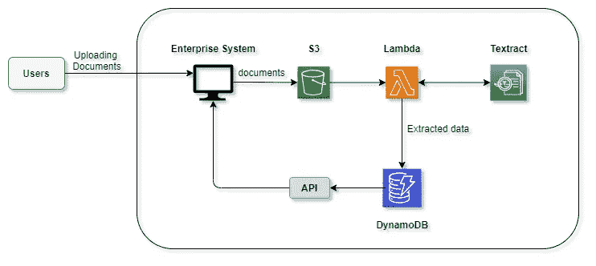

# 如何通过 Python 使用 AWS Textract 从 pdf 中提取数据

> 原文：<https://betterprogramming.pub/extract-data-from-pdf-files-using-aws-textract-with-python-12ba62fde1b0>

## 从任何 PDF 获取您需要的数据

图片来自 [Pixabay](https://pixabay.com/?utm_source=link-attribution&utm_medium=referral&utm_campaign=image&utm_content=2831949)

无论您尝试到什么程度，总有一些业务流程难以自动化。自动化有助于在速度、准确性、可靠性和一致性等许多方面改善业务管道。例如，在当今的全球市场中，几乎每家公司都感受到了压力，要快速有效地将商品和服务推向市场，并尽可能在市场上独占鳌头。

技术充当业务流程自动化(BPA)的使能器，BPA 在不同领域的大多数业务中提供全自动工作流或半自动流程。任何必须将纸质表单或电子文档(如 PDF 文件)中的数据输入到数据库中的组织都可以通过自动化数据输入获得非常高的投资回报，这可以显著减少花费的时间。

这一切都是为了减少您花在处理纸张、管理纸张和输入数据上的时间，以便您可以与客户进行有意义的对话。

这些 PDF 文件可以是发票、财务报表或任何其他形式的文档。这些文档中的数据需要进行处理。但是在工作流程中，手动将这些数据输入到自动化流程中会产生瓶颈。如果你真的发现了，你会惊讶于把这些数据输入计算机系统所花费的时间。

如果您要自动化此过程，在自动化过程中需要执行一些任务:

*   OCR 可识别扫描的图像/ PDF 文件。
*   匹配算法定位文本中的数据元素。
*   未通过验证检查的字段将呈现给操作员进行手动检查和更正。
*   纠正所有错误后，数据将被导出到最终目的地，以便进一步处理或存储。

幸运的是，为了让你的生活更轻松，AWS 已经提供了 [AWS Textract](https://aws.amazon.com/textract/) ，一个文档文本提取服务。如[文档](https://docs.aws.amazon.com/it_it/textract/latest/dg/what-is.html)中所述:

> “Amazon Textract 基于同样经过验证、高度可扩展的深度学习技术，该技术由亚马逊的计算机视觉科学家开发，用于每天分析数十亿张图像和视频。你不需要任何机器学习专业知识来使用它。”

所以可用性处于一个更高的水平。它将降低日常业务中 OCR 技术的准入门槛。

AWS 文本摘要

AWS Textract 包含比普通光学字符识别(OCR)系统更高的功能。从存储在亚马逊 S3 桶中的文件中，它能够提取字段和表格的内容以及这些信息呈现的上下文，比如税单中的姓名和社会保险号，或者照片收据中的总额。Textract 支持扫描、pdf 和照片等图像格式，并吸收了一系列文档格式，包括那些特定于金融服务、保险和医疗保健的格式。

通过连接许多其他 Amazon Web 服务，您可以自动化提取、处理和存储相关数据的工作流，或者将这些数据输入另一个管道。下图是您可以在中使用 Textract 来自动化该过程的方法之一。

AWS Textract 的可能应用(图片来源:作者)

除了使用 Amazon DynamoDB，您还可以使用 MongoDB 实例甚至 S3 存储桶本身来存储结果数据。这里，一个批处理作业将在 AWS Lambda 上运行。根据您的需要和限制(例如，如果作业运行超过 15 分钟)，您可以很容易地用 AWS Fargate 实例替换它。相反，您可以在 Lambda 函数和 Textract 服务之间使用 AWS SNS，Textract 服务是一种完全托管的发布/订阅消息服务，使您能够分离服务。

谈到 AWS Textract，我们可以获得三种主要类型的结果。第一个是获取原始文本形式的结果提取。第二种方法是获取恰好在相应文档中的键值对。第三种方法是提取表数据。输出将是一个逗号分隔值(CSV)文件。

# **1。提取原始文本**

以下是 Python 中的示例代码，可用于使用 AWS Textract 从 PDF 文档中提取文本。这也支持多页 PDF 文件。这将适合作为提取自由格式报告、票据和发票的方法。

如果您想从图像文件中提取原始文本数据，可以使用下面的代码。当涉及到需要以更易分析和组织的方式存储信息的扫描文档时，使用这种实现会很方便。

# **2。提取键值对**

在通过从数字填充表单的 PDF 文件中提取键值对的自动化表单处理中，Textract 非常有用。抛开人工检查、输入相关数据和处理 Textract 帮助我们实现了整个流水线的自动化，无需任何人工干预。但是在关键应用程序中，作为一种实践，我们可以提示提取的表单信息，以便用户在必要时进行任何更正，并在继续之前进行验证。

**注意:**如果您想将 pdf 文件转换成图像以运行上面的代码片段，您可以使用 [pdf2image](https://pypi.org/project/pdf2image/) 或任何 Python 包。(您可能还需要安装[枕头](https://python-pillow.org/)。这可能只适用于 Linux。)

# **3。提取表格数据**

如果您的文档包含更多的表格数据，这就更合适了。OCR Textract 以有序的方式检测文档中的表格及其内容。这有助于识别带有格式的相关内容，以便以 CSV 文件的形式返回提取的信息。这在处理基于 PDF 的财务报告和发票时非常有用。这将为自动化过程铺平道路，从而大大减少整个管道中的人工干预。

**注意:**如果您想将 pdf 文件转换成图像以运行上述代码片段，您可以使用 [pdf2image](https://pypi.org/project/pdf2image/) 或任何 Python 包。(您可能还需要安装[枕头](https://python-pillow.org/)。这可能只适用于 Linux。)

# 结论

如上所述，使用 AWS Textract 将是减少您业务中日常流程延迟的一个好方法。根据您的需要，您可以使用三种提取方法中的一种或多种。例如，在极少数情况下，Textract 无法提取某些表格数据或某个键的值，您可以使用原始文本提取和一些使用 Python regex 的手动文本挖掘来提取这些数据。

除了单纯的提取，Textract 还支持一些 NLP 任务，当组织需要为理解各种语言的用户本地化他们的电子文档、内容和网站时。作为一种解决方案，Textract 提供集成了提取功能的文档翻译，这为原始服务增加了价值。

另一篇有趣的文章再见！

# 参考

[https://AWS . Amazon . com/blogs/machine-learning/automatically-extract-text-and-structured-data-from-documents-with-Amazon-text ract/](https://aws.amazon.com/blogs/machine-learning/automatically-extract-text-and-structured-data-from-documents-with-amazon-textract/)