# Python 中的 Web 抓取:像老板一样提取嵌入的视频

> 原文：<https://betterprogramming.pub/extracting-embedded-videos-8fc391906530>

## 了解我如何从雅虎中提取一个嵌入的视频，并将其放入代码中。我们挖吧！

[https://news.yahoo.co.jp](https://news.yahoo.co.jp)

我的任务似乎很简单:增加对雅虎的支持。日本新闻文章到流行的嵌入式视频下载器， [youtube-dl](https://ytdl-org.github.io/youtube-dl/index.html) 。我会找到视频源(网址)，编辑一些样板代码，制作一个公关，然后就搞定了。

但是没有。雅虎不打算让它变得简单。

下面，我将向您展示我是如何提取嵌入式视频源的，以及一个用 [Python](https://www.python.org) 编写的代码示例。好吧，选一篇雅虎文章，让我们来挖掘一下！

# 超文本标记语言

正如许多嵌入式视频提取教程[指出的那样，通过浏览器的网页检查器找到嵌入式视频源相对容易。然而，为了建立一个有效的提取器，涵盖所有雅虎！日本新闻的文章，我们需要一个清晰的，可复制的路径从原来的网址到视频源。](https://www.hanselman.com/blog/HowToDownloadEmbeddedVideosWithF12ToolsInYourBrowser.aspx)

首先，显而易见的是:我访问一篇文章，在源代码中搜索与视频相关的扩展名，如“`mp4`”和“`m3u8`”。

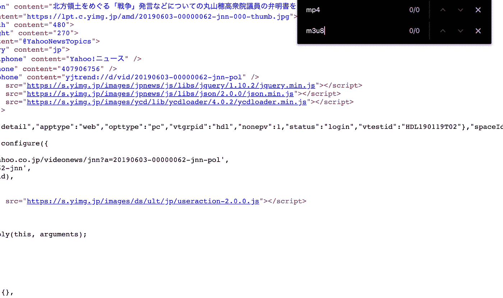

文章源代码

没有。“玩家”这个词经常与视频联系在一起，所以让我们看看这是否可行。

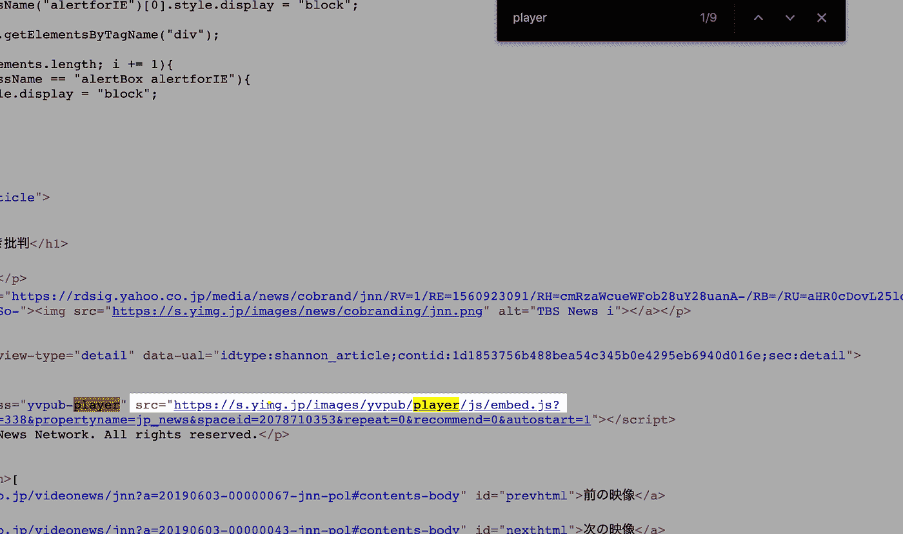

文章源代码

啊哈！一个外部 Javascript 脚本，`*embed.js*`。注意发送到`*embed.js*`的参数中的`*contentid*`和`*spaceid*` 值。它们看起来很有用。现在，让我们看看里面有什么。

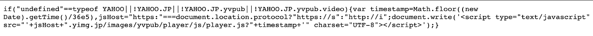

embed.js

该代码似乎引用了另一个脚本，`player.js` ,并包含一个参数，即当前的 UNIX 时间戳转换为小时。

# 网络检查

让我们用[谷歌 Chrome DevTools](https://developers.google.com/web/tools/chrome-devtools/javascript/) 来看看`player.js`内部。

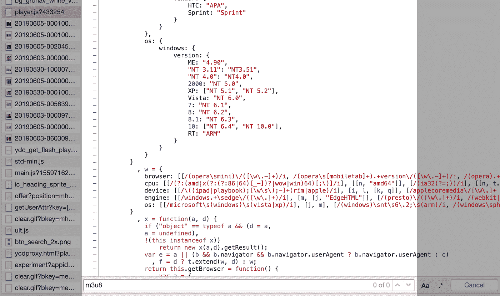

player.js

`player.js`很大，看起来很吓人，也不包含任何有用的`mp4`或`[m3u8](https://www.lifewire.com/m3u8-file-2621956)` 网址。

好的，让我们反向工作，在加载页面时发出的请求中搜索`mp4`(您可能想要重新加载页面)。

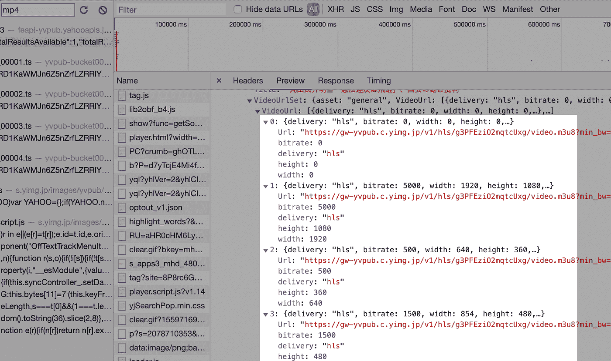

*JSON 回应来自*[*https://feapi-yvpub.yahooapis.jp/v1/content/*](https://feapi-yvpub.yahooapis.jp/v1/content/)

答对了。我们的`m3u8` 和`mp4` 消息来源的`JSON` 回应。这个响应是由我们向[*https://feapi-yvpub.yahooapis.jp/v1/content/*](https://feapi-yvpub.yahooapis.jp/v1/content/)发出的请求生成的，带有以下参数:

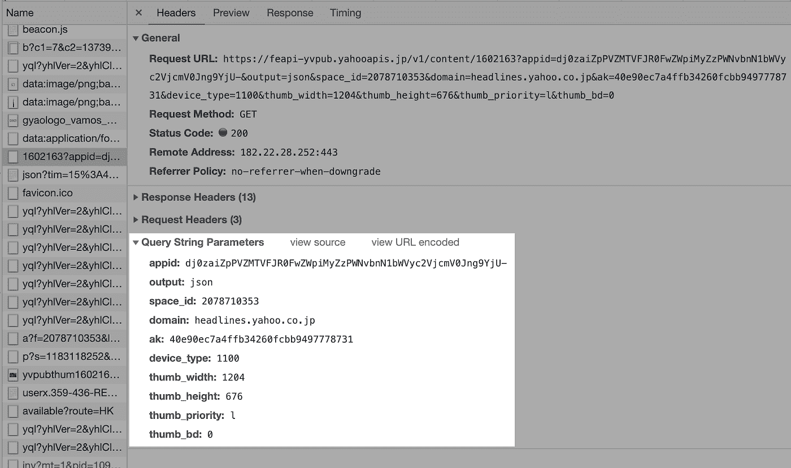

什么是`1602163 in …/v1/content/1602163`？这就是我们之前提到的`contentid`的值。而这里的`space_id` 与我们的`spaceid`相匹配。很好。那`appid`呢？让我们看看它的价值是否在任何其他回应中被提及。

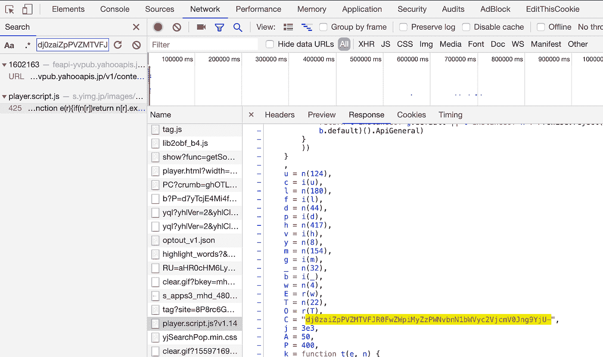

*播放器. script.js*

就是它，硬编码在`player.script.js`里！快速浏览一下其他新闻文章，可以确认这个值用于所有嵌入式视频请求。向下三个值。现在，让我们搜索`ak`的值。

*JSON 回应来自*[*https://feapi-yvpub.yahooapis.jp/v1/content/*](https://feapi-yvpub.yahooapis.jp/v1/content/)

不幸的是，`ak`值除了在这个`JSON`查询中找不到。`ak`从哪里来？

# 断点

我有预感`ak`可能是一个 Javascript 对象名。我们来搜索一下“`ak:`”。

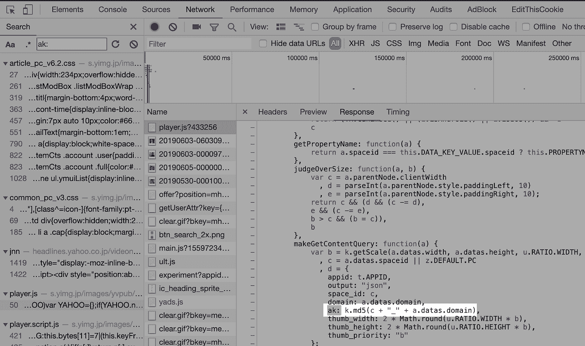

`*player.js*`

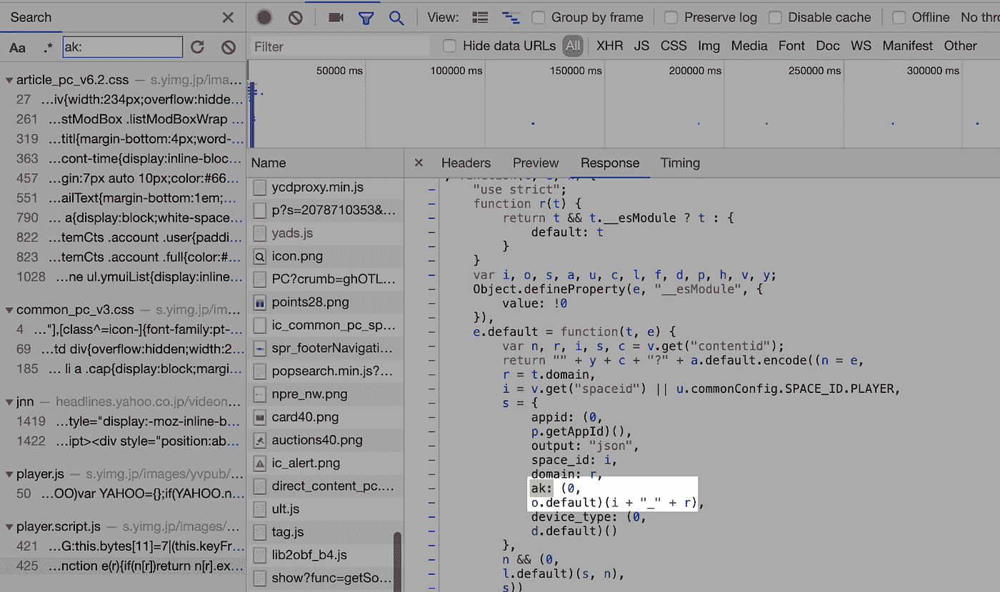

*播放器. script.js*

啊哈！看起来`ak`是由“_”和两个字符串在`player.js`和`player.script.js`中串联而成。我们也在传递给函数`k.md5()`的`player.js`中看到它。

我猜这个连接起来的字符串值被转换成一个 [md5 哈希值](https://www.lifewire.com/what-is-md5-2625937)。但是首先我们必须弄清楚连接到“_”的值。

让我们在 Sources 选项卡中打开`player.js`(在响应体中右键单击并在 Sources 面板中选择 open)并在定义了`ak`之后添加一个断点。

*player.js*

接下来，让我们关闭 *Sources* 下打开的文件标签并重新加载页面。

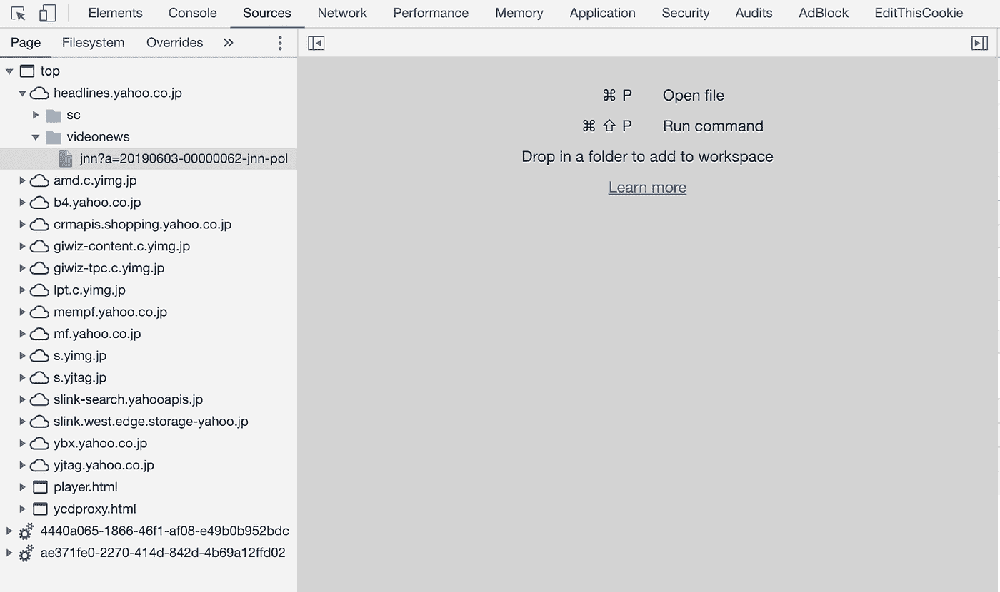

奇怪。似乎没有达到那条线。让我们在`player.script.js.`尝试同样的事情

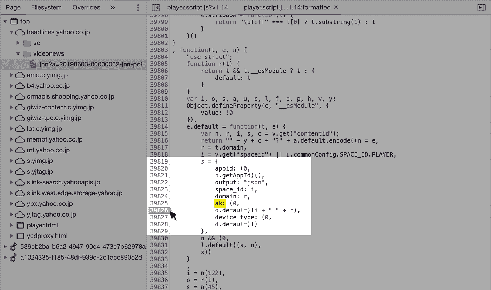

*播放器. script.js*

(重新加载页面后，请务必点击左下方的*漂亮打印*括号。)

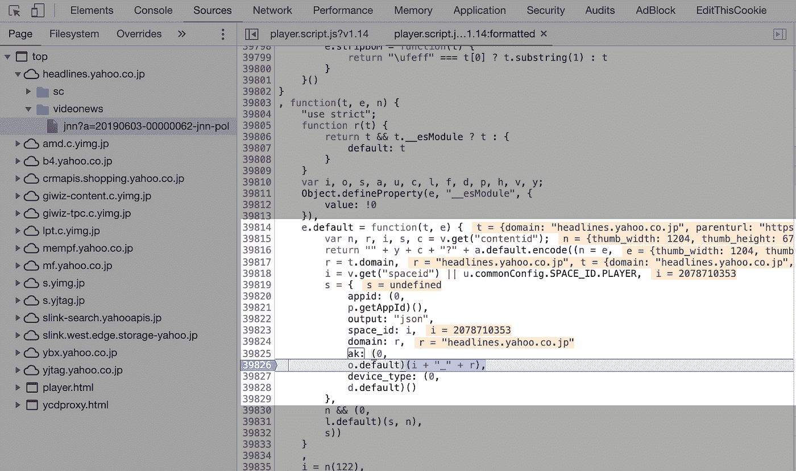

*播放器. script.js*

答对了。`i` 似乎与我们之前提到的`spaceid`的值相同，而`r`是我们的主机名“`headlines.yahoo.co.jp`，因此我们现在有了字符串值“`2078710353_headlines.yahoo.co.jp`”。

它看起来一点也不像请求查询中的长而神秘的`ak`值，但是还记得`player.js`中的`k.md5`函数调用吗？让我们检查一下它的`md5`哈希值。

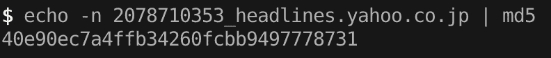

你看看那个！它与`JSON`请求查询中的`ak`值相同。搞定了。

# 概述

回想一下`JSON`请求包括以下参数，减去 *thumb* 值。

> `***appid:*** *dj0zaiZpPVZMTV…jcmV0Jng9YjU*`—
> 
> `***output:*** *json*`
> 
> `***space_id:*** *2078710353*`
> 
> `***domain:*** *headlines.yahoo.co.jp*`
> 
> `***ak:*** *40e90ec7a4ffb34260fcbb9497778731*`
> 
> `***device_type:*** *1100*`

我们现在有了所有的唯一值——更重要的是，它们的来源——在我们的代码中以编程方式为任何文章发出一个`JSON`请求所需要的。关于参数最后一件事:`device_type` 有必要吗？让我们提出一个没有它的请求。

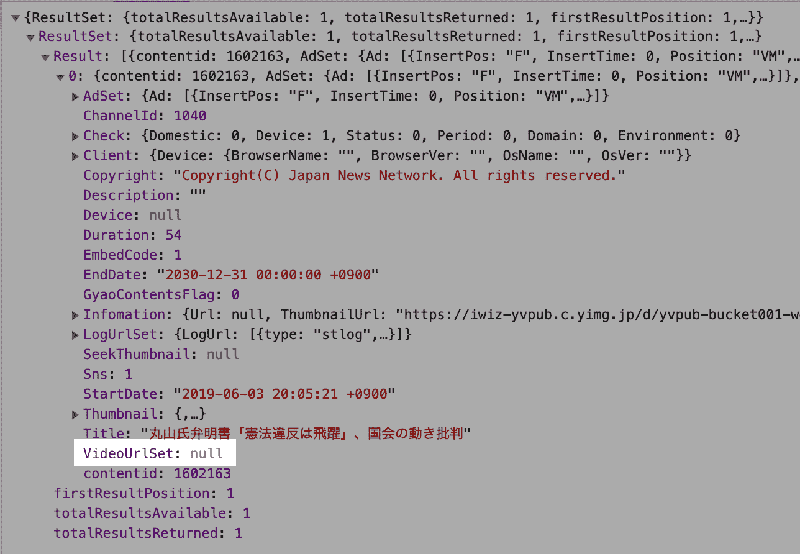

没有视频数据。显然是，所以我们会保留它。

快速回顾一下我们是如何获得视频数据的。

*   文章网址*(提取的主机名)*
*   文章 HTML 源代码*(摘录* `contentid`和`spaceid`)
*   `md5`哈希生成器(在`spaceid` + "_" +主机上运行以获取`pk`的值)
*   `player.script.js`(提取的 appid)
*   用我们的`contentid`、`appid`、`spaceid`和`pk`值请求[https://feapi-yvpub.yahooapis.jp/v1/content/{contentid}](https://feapi-yvpub.yahooapis.jp/v1/content/{contentid})。

# 密码

这个提取过程在代码中会是什么样子？下面是 Python 中的一个粗略示例:

雅虎的例子！日本新闻文章嵌入视频提取。

请注意，在`yahoojnews_extract()`中，我在请求中包含了与页面请求中的实际值相匹配的头值，以避免被怀疑。一旦我有了`JSON`数据，我就把它传递给`_parse_formats`来提取视频数据(URL、fps 等)。)并连同其他信息(如标题)一起返回。

点击或[下载](https://ytdl-org.github.io/youtube-dl/download.html)查看我为 youtube-dl [编写的提取代码，并观看它的运行:](https://github.com/ytdl-org/youtube-dl/blob/90634acfcf9b106c9f5ac12bae5d92307cd577b0/youtube_dl/extractor/yahoo.py#L565)

`$ pip install youtube-dl && youtube-dl https://news.yahoo.co.jp`

感谢阅读，刮刮快乐！

*鸣谢:感谢* [*糖果日本*](https://www.candyjapan.com/) *的**Bemmu**帮忙提取视频数据。*