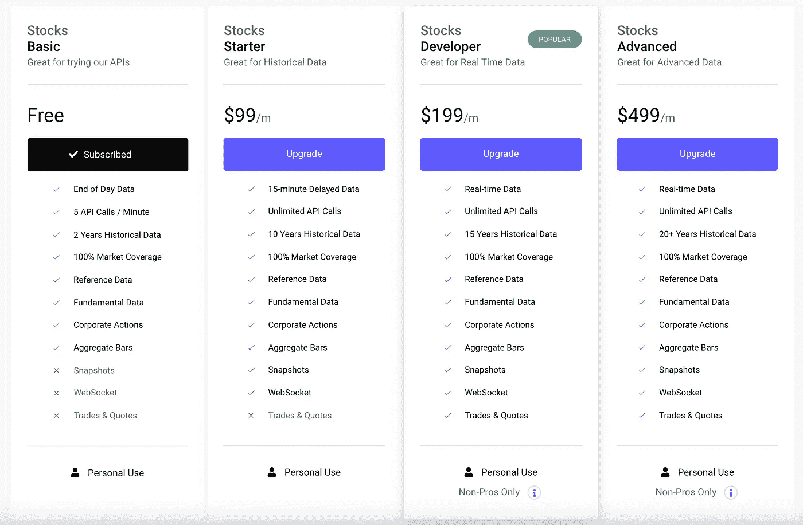
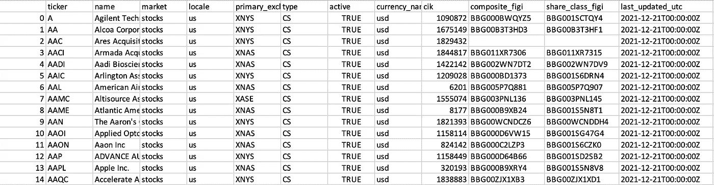
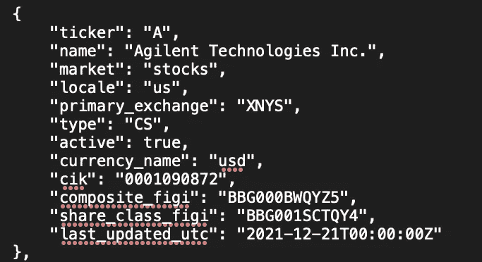

# 使用 Python 提取 REST API 数据

> 原文：<https://betterprogramming.pub/extracting-rest-api-data-using-python-with-an-example-e800b03bb62e>

## 使用 Polygon.io 获取所有可用的股票报价机

图片由[卡洛斯·穆扎](https://unsplash.com/@kmuza)在 [Unsplash](https://unsplash.com/) 上拍摄

与传统观点相反，数据不一定是新数字经济的润滑油，至少原始数据不是。REST APIs 旨在弥合原始信息和结构化数据之间的鸿沟。

在本教程中，我将解释如何使用 Python 的请求库提取数据，并提供一个补充示例。

当我开始我的数据科学之旅时， [Kaggle](https://www.kaggle.com/) 和 [UC Irvine 机器学习库](https://archive.ics.uci.edu/ml/index.php)是我的主要数据来源。然而，API 提供了更多可定制的、精确的和相关的数据。例如，如果你想从雅虎财经的筛选程序中提取财务指标，雅虎财经有自己的 REST API。同样，如果你想收集你最喜欢的艺术家或有影响力的人的推文，不用再找了。Twitter 为开发者提供 API！然而，许多 REST APIs 并不是免费的，并且经常有限制和成本。

# 图书馆

Python3 安装了内置库，这些库将数据提取、处理和结构化简化为几行代码。让我们导入下面的代码块。

# 示例使用案例

## 使用 Polygon.io 提取股票行情

本文的重点不是建议或推广某个特定的 API。为了举例说明 API 提取方法，我认为 Polygon.io 适合本教程。

我们的目标是提取 Polygon.io 上所有可用的普通股票报价机。

# 定价

在我们开始数据提取之前，我们应该始终分析定价页面并探索免费层的局限性。在早期的原型、开发或数据提取阶段，对文档和响应对象有所了解是很重要的。

截图来自 [Polygon.io](https://polygon.io/pricing)

完美！似乎没有每天通话的限制，但我们在免费层每分钟只能打 5 次电话。

# 证明文件

接下来，我们将寻找提供我们需要的数据的端点。在跑马灯提取的情况下，`GET /v3/reference/tickers` 端点似乎适合我们的任务。

10 个查询参数帮助我们过滤响应数据，并返回各种 ticker 属性和元数据。我强烈建议观众探索这个 [**链接**](https://polygon.io/docs/stocks/get_v3_reference_tickers) 来了解更多关于端点的信息。

# API 密钥

如果您还没有使用 Polygon.io 创建帐户，您必须这样做才能发出请求。您将获得一个 API 密钥，不要与公众分享。

通常，您不希望将 API 密钥存储在客户端代码中，但是为了简单起见，它将包含在同一个程序中。要了解如何保护您的密钥，请查看这篇简单而信息丰富的文章！

# 提取功能

请求函数本身相当简单，仅由 URL 和查询参数组成。但是，由于每页 1000 个报价器的限制，我们必须使用`next_url` 响应属性来获取下一页的信息。

此外，时间库允许我们根据 API 请求限制执行请求。在我们的例子中，我们在代码中触发一个“睡眠”来适应每分钟 5 次调用的限制。

# 写出数据

我将展示两种写出数据的流行方法，这样用户就可以在自己的桌面/文件夹上访问数据。

1.  使用`Pandas`库写出一个`.csv` 文件。
2.  利用`JSON`库写出一个`.txt` 文件。

我们必须首先调用提取函数并用返回的数据初始化一个变量。要写出 CSV 文件，必须将响应转换成 Pandas 数据帧，然后利用`.to_csv()`方法。

要写成文本文件，我们必须使用`json.dump()`方法。

结果输出应该如下所示:

## CSV 文件

## 文本文件

# 结论

这总结了使用 Python 提取 REST API 数据的基础。

如果你需要一个适合你特殊兴趣或项目的数据集，公共 API 通常是可用的。

尽管请记住，数据集越是专有和有价值，其成本和局限性就越高。