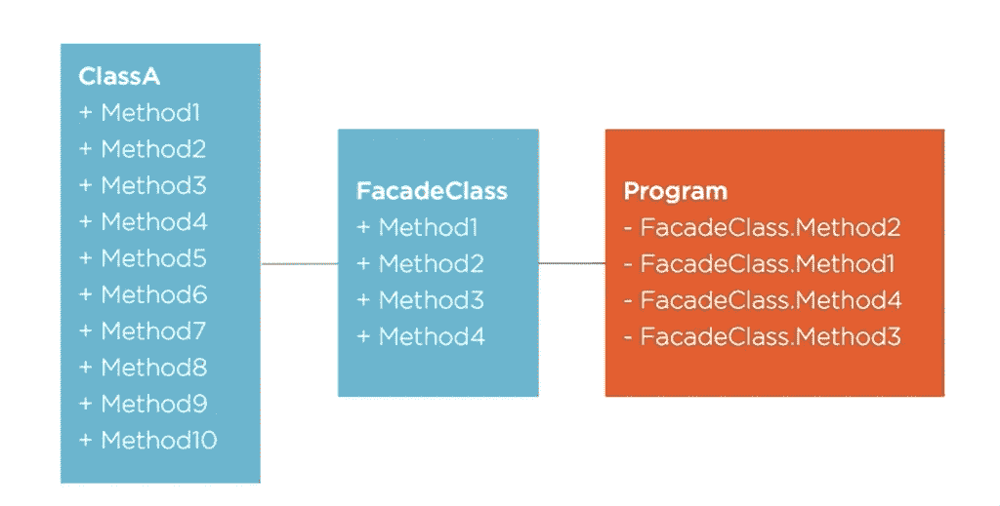
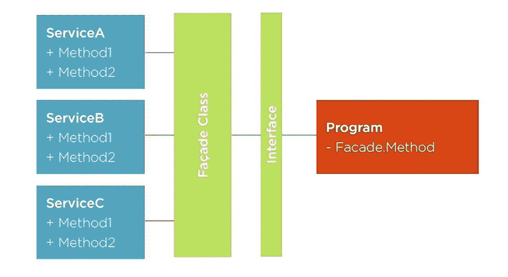

# 在 C#中实现外观设计模式

> 原文：<https://betterprogramming.pub/facade-design-pattern-39a87c4cfa14>

## 流行设计模式的实际实现

照片由[摄影师](https://unsplash.com/@ffstop?utm_source=medium&utm_medium=referral)在 [Unsplash](https://unsplash.com?utm_source=medium&utm_medium=referral) 上拍摄

## 为什么我们需要一个门面设计模式？

偷偷看一下下图。右边的类需要属于最左边的类的 4 个方法。但是为了确定我们需要访问哪四个方法，我们可能需要挖掘最左边的`ClassA`的内部。或者有更好的解决办法！

我可以在我的类之间放置一个 facade，现在这个 facade 有一个对`ClassA`的内部引用，并代表我们的程序类编排调用。我们使用了一个 facade 类，它包含了`classA`，并且只公开了我们程序需要的方法。我们可以使用更有意义的方法名，而且我们的程序只与外观对话，根本不知道`classA`。

这个可扩展的复杂项目显然有数百个类。这种模式通过关注我们所需要的东西来帮助我们的调用类，而不是遍历所有东西，(抽象——哎呀)。

假设我们想要实现一个智能手机类，它有 3 个规格:处理器、内存(RAM、ROM)和显示器。我们的实现可能如下所示:

清单 1:类`Processor`

清单 2:类`Memory` —

清单 3:类`Display`:

清单 4:调用类，类`SmartPhone`:

让我们首先理解，这是一个简单的问题，但由于智能手机需要跟随最新的趋势和创新，你需要为每个功能添加更多的类。

你将不得不经历所有的课程来重新实现`smartPhone`。这里我们只有 3 个类(`Display`、`Memory`、`Processor`)，但是在实际项目中，正如我所说的，会有数百个类，这使得很难找到实现新智能手机所需的类。

我们可以添加一个中间层，作为我们智能手机的门面，它将负责制作智能手机所需的所有功能。为了使我们的模式更高级，我们可以添加一个接口，通过它我们的`smartPhone`类将进行交互。

## ***为什么接口？*** 好问题。

这种抽象允许一个调用程序(在我们的例子中是`smartPhone`)单独处理外观并简化代码。在这里引入一个接口确实为调用者整理了一些东西，并允许在将来的底层服务类(更多的特性，更多的类)变化(将来更高级的智能手机类)中轻松地添加新的外观类。

如果明天，我想为 Android 10 发布一款新的高端规格的智能手机，那可以通过与一个界面进行交互来实现。

说到这里，让我们从门面设计模式开始。

如果我们将处理器、内存和显示器放在门面后面，那么智能手机就不必担心上述复杂性了。

**第一步**

清单 5:让我们添加接口`ISmartPhoneFacade`:

**第二步**

清单 6:现在让我们添加类`SmartPhoneFacade`:

清单 7:现在简单看一下我们的`smartPhone`类:

如果明天，新的`smartPhone`设备来了，我所要做的就是创建一个新的门面，具体到智能手机的功能，并继承界面`ISmartPhoneFacade`。这就是 oops 中抽象的力量。

**注意:**增加一个额外的类可能会让人感到头疼，但是从更大的角度来看这是有帮助的，这是你可以设计松散耦合的类的地方。

我真诚地希望你喜欢这个博客，并希望你受到启发，将你所学到的东西应用到自己的应用中。

在 Linkedin 上找到我！！

 [## Rikam Palkar -软件工程师-小天鹅-威德福| LinkedIn

### 通过编写可伸缩的代码让世界变得更美好。我从来没有在大学里发现我对编码的热情，也没有在…

www.linkedin.com](https://www.linkedin.com/in/rikampalkar/)