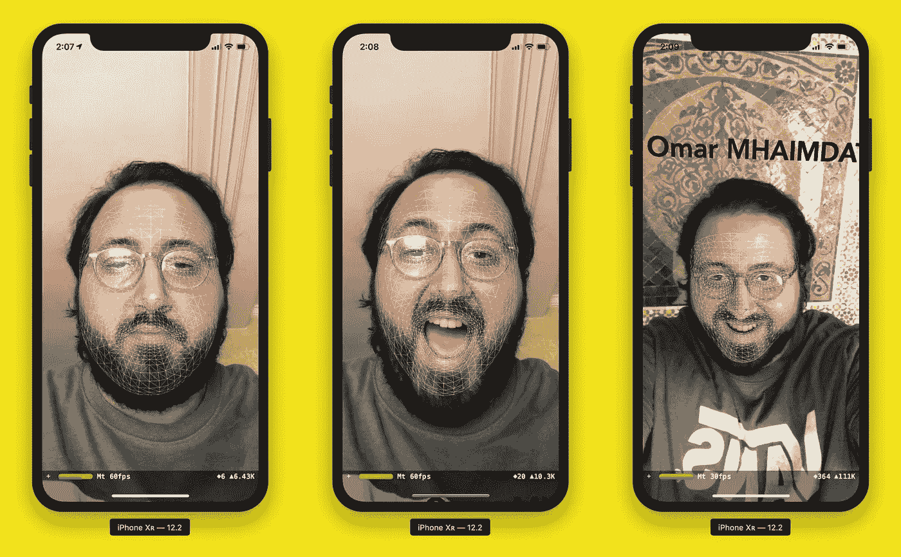
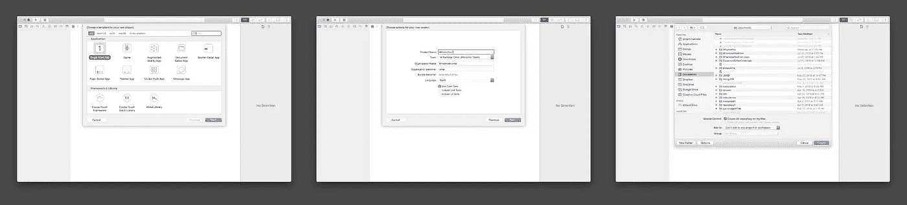
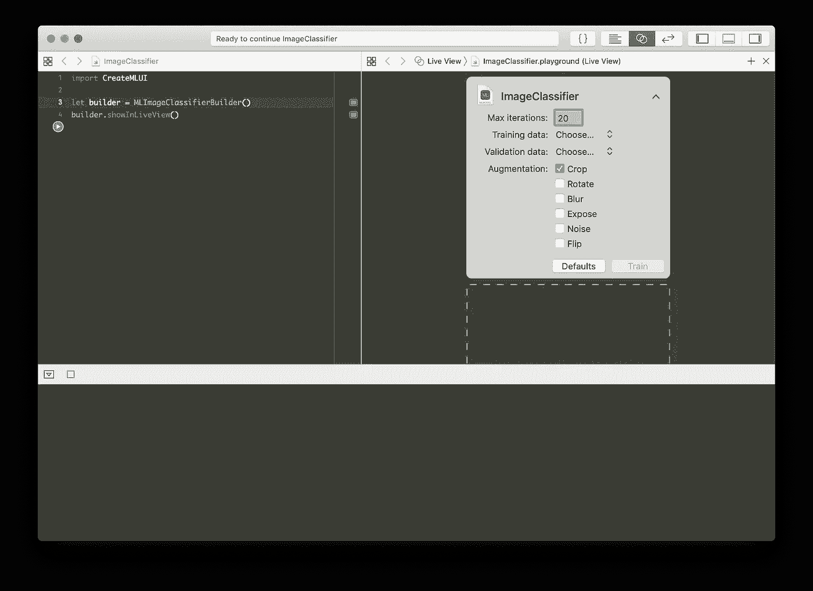
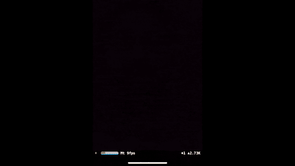

# 基于 CoreML 和 ARKit 的人脸检测和识别

> 原文：<https://betterprogramming.pub/face-detection-and-recognition-with-coreml-and-arkit-8b676b7448be>

## 用 ARKit 实现人脸检测功能，用 CoreML 模型实现人脸识别

> 以下文章提供了更新版本:

 [## 使用本地 Swift 代码、Core ML 和 ARKit 在 iOS 上进行人脸识别和检测

### 利用原生 Swift 库在 iOS 应用中执行人脸识别和检测

heartbeat.fritz.ai](https://heartbeat.fritz.ai/face-recognition-and-detection-on-ios-using-native-swift-code-core-ml-and-arkit-feed10c468da) 

# 创建单一视图应用程序

首先，我们需要创建一个带有单视图应用程序的 iOS 项目:

创建单视图应用程序

现在你已经有了你的项目，而且因为我不喜欢使用故事板，这个应用程序是以编程方式完成的，这意味着没有按钮或开关来切换，只有纯代码🤗。

你必须删除`main.storyboard`并像这样设置你的`AppDelegate.swift`文件:

AppDelegate.swift

确保从部署信息中删除故事板“Main”。

# 创建场景并将其添加到子视图中

我们只有一个 ViewController，这将是我们应用程序的主要入口点。

在这个阶段，我们需要导入 ARKit 并实例化一个`ARSCNView`,它自动渲染来自设备摄像头的实时视频作为场景背景。它还会自动移动其 SceneKit 相机，以匹配设备的真实移动，这意味着我们不需要锚来跟踪我们添加到场景中的对象的位置。

我们需要给它一个屏幕边界，这样摄像机会话就可以占据整个屏幕:

实例化 ARSCNView

在`ViewDidLoad`方法中，我们将设置一些东西，例如委托，我们还需要查看帧统计数据，以便监控帧丢失:

在 ViewDidLoad 方法中设置场景

# 开始一个`ARFaceTrackingConfiguration`会话

现在我们需要用一个`ARFaceTrackingConfiguration`开始一个会话，这个配置让我们可以访问仅适用于 iPhone X、Xs 和 Xr 的前置原深感摄像头。以下是苹果文档中更详细的解释:

> 面部跟踪配置通过设备的前置摄像头检测用户的面部。运行此配置时，AR 会话会检测用户的面部(如果在正面摄像头图像中可见)，并向其锚点列表添加一个代表面部的 ARFaceAnchor 对象。每个脸部锚点提供了关于脸部的位置和方向、其拓扑以及描述脸部表情的特征的信息。
> 
> 来源:[苹果](https://developer.apple.com/documentation/arkit/arfacetrackingconfiguration)

ViewDidLoad 方法应该如下所示:

ViewDidLoad()方法

# 训练人脸识别模型

有多种方法可以创建与 CoreML 兼容的. mlmodel 文件，以下是常用的方法:

1.  [***Turicreate***](https://pypi.org/project/turicreate/?source=post_page---------------------------)***:***正是 python 库简化了定制机器学习模型的开发，更重要的是你可以将你的模型导出为 Xcode 可以解析的. mlmodel 文件。
2.  ***【MLImageClassifierBuilder():***这是 Xcode 的一个内置解决方案，它提供了一个拖放界面来训练一个相对简单的模型。

***MLImageClassifierBuilder***

我已经创建了多个模型来测试这两种解决方案，因为我没有一个大的数据集，所以我决定使用***MLImageClassifierBuilder()***和一组 67 张图片，分别是*‘Omar MHAIMDAT*’(这是我的名字)和一组 261 张我在[***unsplash***](https://unsplash.com/)**上找到的*‘未知’*的脸**

打开 playground 并编写以下代码:

***MLImageClassifierBuilder***

我建议将最大迭代次数设置为 20，并添加一个裁剪增强，这将为每个图像添加 4 个裁剪图像实例。

# 捕捉相机帧并将其注入模型

我们需要用场景委托`ARSCNViewDelegate`来扩展我们的 ViewController。我们需要两个委托方法，一个用于设置人脸检测，另一个用于在检测到人脸时更新场景:

## 面部检测:

人脸检测

不幸的是，当我睁开眼睛或嘴巴时，场景不会更新。在这种情况下，我们需要相应地更新场景。

## 更新场景:

我们获取整个面部的几何图形和贴图，并更新节点。

## 获取相机框架:

这变得很有趣，因为`ARSCNView`从`AVCaptureSession`继承而来，意味着我们可以得到一个`cvPixelFuffer`来填充我们的模型。

下面是从我们的`sceneView`属性获取它的简单方法:

## 将相机帧注入模型:

现在，我们可以检测人脸并拥有每一个相机帧，我们准备为我们的模型提供一些内容:

didUpdate 渲染器

# 在已识别的面孔上方显示姓名

最后，也可能是最令人沮丧的部分是在识别出的人脸上方投射 3D 文本。仔细想想，我们的配置不如`ARWorldTrackingConfiguration`强大，它提供了对大量方法和类的访问。相反，我们使用前置摄像头，可以实现的事情很少。

然而，我们仍然可以在屏幕上投影 3D 文本，尽管它不会跟踪面部运动并相应地改变。

实例化 SCNText

现在我们有了 SCNText 对象，我们需要用相应的 face 更新它，并将其添加到`rootNode`:

使用与面部相关联的名称更新场景

# 最终结果:

这是人脸检测和识别的最终结果。

如果你喜欢这首曲子，请鼓掌并与你的朋友分享。如果你有任何问题，不要犹豫给我发电子邮件到 omarmhaimdat@gmail.com。

这个项目可以从我的 Github 帐户下载

 [## omarmhaimdat/你是谁

### 此时您不能执行该操作。您已使用另一个标签页或窗口登录。您已在另一个选项卡中注销，或者…

github.com](https://github.com/omarmhaimdat/WhoAreYou) 

[**下载项目**](https://github.com/omarmhaimdat/WhoAreYou)