# 在浏览器(移动或桌面)上使用 JavaScript 进行人脸跟踪

> 原文：<https://betterprogramming.pub/face-tracking-with-javascript-on-any-device-with-a-browser-mobile-or-desktop-48aa561fd9d5>

## 想建一个使用人脸追踪的网站？嗯，你来对地方了！


拉格斯技术人员在 [Unsplash](https://unsplash.com?utm_source=medium&utm_medium=referral) 上拍摄的照片

今天我将向大家展示如何在任何浏览器、手机或桌面上建立一个可以进行实时人脸跟踪的网页。我用 HTML 和 JavaScript 做一切事情，以允许跨设备的可移植性。我还将展示一些易于扩展的工作演示，用于面部跟踪、基本的 Snapchat 过滤器和科学应用。

【facemeshmedium.netlify.app/】[**所有试玩都可以在这里找到**](https://facemeshmedium.netlify.app/)

# 关于模型

随着 Google 对 Tensorflow 的快速发展。JS，网络上的机器学习从未如此简单。我们将使用 Google MediaPipe 的**面部网格**模型来满足我们所有的面部追踪需求。

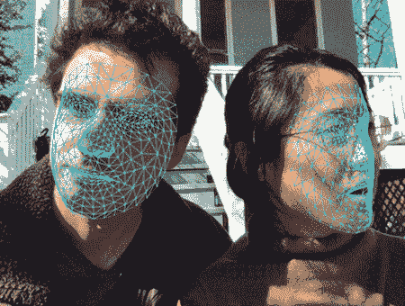

[https://blog . tensor flow . org/2020/03/face-and-hand-tracking-in-browser-with-media pipe-and-tensor flow js . html](https://blog.tensorflow.org/2020/03/face-and-hand-tracking-in-browser-with-mediapipe-and-tensorflowjs.html)

Google Research 有一个名为 MediaPipe 的细分市场，专注于让机器学习模型跨设备运行。这让他们可以预测任何东西，从大而笨重的台式机到没有 GPU 的移动智能手机(这里是主站点)。[人脸网格](https://google.github.io/mediapipe/solutions/face_mesh)是他们的人脸跟踪模型，它接收一个相机帧，并输出 468 个检测到的人脸上的标记标志。它还通过面部区域(“上唇”、“左眼”等)对标志进行聚类。)并在输出中给出面部的边界框。

哦，我有没有提到它给你的地标是 3D 坐标——有脸部的深度？！这有多蠢？

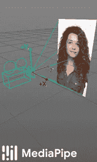

面部网格也输出你面部各个区域的相对深度([链接](https://google.github.io/mediapipe/solutions/face_mesh.html))

如果你向下滚动 Face Mesh 的页面，你可能会奇怪我为什么要写这个指南；MediaPipe 已经提供了使用面网格的 HTML 示例。这有两个原因:

1.  由于移动和桌面 JavaScript 处理视频流的方式不同，他们的例子不能在移动浏览器上运行。
2.  绘图和编辑库是这种

我已经找到了一个修复方法，允许移动浏览器也使用面网格，我将展示几个使用面网格输出的易于扩展的示例，以使编写自己的程序更容易。让我们开始吧！

# 设置摄像机

在我们在摄像机上运行面部跟踪之前，我们必须首先访问摄像机流。我将重用来自[早期帖子](https://kongmunist.medium.com/ml-in-browser-accessing-smartphone-cameras-with-javascript-86c9a9c6a20e) ( [代码](https://gist.github.com/kongmunist/cea925f04feecf8983cb40321f8ae59b#file-cameraandcanvasonly-html))的代码来访问前置摄像头并输出到网站。此外，由于网站不能在大多数现代浏览器上获得摄像头访问，除非它们托管在 HTTP 认证的域上，我们将托管来自这个[网络生活网站](https://facemeshmedium.netlify.app/)的所有演示。

JavaScript 代码假设您有一个 HTML 页面，旁边有一个`<video>`和`<canvas>`元素。我们通过画布把东西画到我们的网站上。代码如下:

相机流的基本 HTML

摄像机流的基本 JavaScript

JavaScript 通过`mediaDevices` API 设置摄像头，然后分配画布和上下文(ctx ),我们需要在上面绘制。最后，视频流循环绘制到画布上。

# 导入面网格和张量流。射流研究…

现在我们需要在视频流上调用 Face Mesh。我们通过将这些标签添加到 HTML 页面的头部，将模型包含到 JavaScript 的导入中。

```
**<script src**="[https://cdn.jsdelivr.net/npm/@tensorflow/tfjs](https://cdn.jsdelivr.net/npm/@tensorflow/tfjs)">**</script>**
**<script** **src**=”https://cdn.jsdelivr.net/npm/@tensorflow-models/facemesh">**</script>**
```

我们还将添加一行代码来初始化我们的`main`函数中的`facemesh`。加载带有允许您定制模型的选项。我们只关心一次可以检测到的最大人脸数量。

```
// In main()
fmesh = **await** facemesh.**load**({detectionConfidence:0.9, maxFaces:3});
```

在我们的 JavaScript 中，我们将添加一个循环，在我们的视频提要上运行人脸网格并输出预测的人脸。你也可以在`facemesh.estimateFaces`中输入一个 HTML 画布，但是因为我们将在画布上进行绘制，所以我更喜欢在未编辑的`video`流中进行面网格预测。这里有一些代码可以帮助你:

太好了！现在，无论何时我们出现在网络摄像头中，Face Mesh 都会检测我们在画面中的位置，并为我们的脸匹配一系列地标作为`curFaces`。将这些预测导出到一个全局变量，让我们的绘图循环(或任何其他函数)处理我们的面部位置。别忘了在你的 main 的某个地方调用`renderPrediction()`；它永远循环，但你必须先启动它。

我们将在面部网格输出的面部标志上画点，但要做到这一点，我们需要理解`curFaces`到底包含什么。

## 面网格输出格式

面部网格的输出是面部预测的`Array`，其中每个预测具有以下格式:

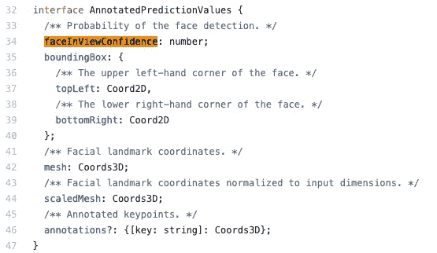

视频流上调用人脸网格的单个输出

我们将详细讨论每一个问题。

*   `faceInViewConfidence`范围从 0.0 到 1.0，当一张脸在帧中时，通常位于 0.99。我们用这个来剔除假阳性人脸检测。
*   `boundingBox`包含两个`Coord2Ds`，它们是可以使用`topLeft.x`和`topLeft.y`访问的对象。这些在输入坐标中给出了脸部的角，所以你可以使用它们直接索引到图像中。
*   `mesh`使用非相机坐标系给出面部标志。这使得它有点难以使用，所以我们将考虑它的兄弟，
*   `scaledMesh`包含格式为(X，Y，Z)的 468 个 3D 面部标志，其中 X 和 Y 是我们输入视频流上的坐标，Z 是深度。每个地标一致地表示脸上的一个点，在他们的 [Github](https://github.com/tensorflow/tfjs-models/blob/master/facemesh/mesh_map.jpg) 上有一个网格地图，你可以用它来选择你想要的点。我们稍后将在 Snapchat 过滤器中使用它。

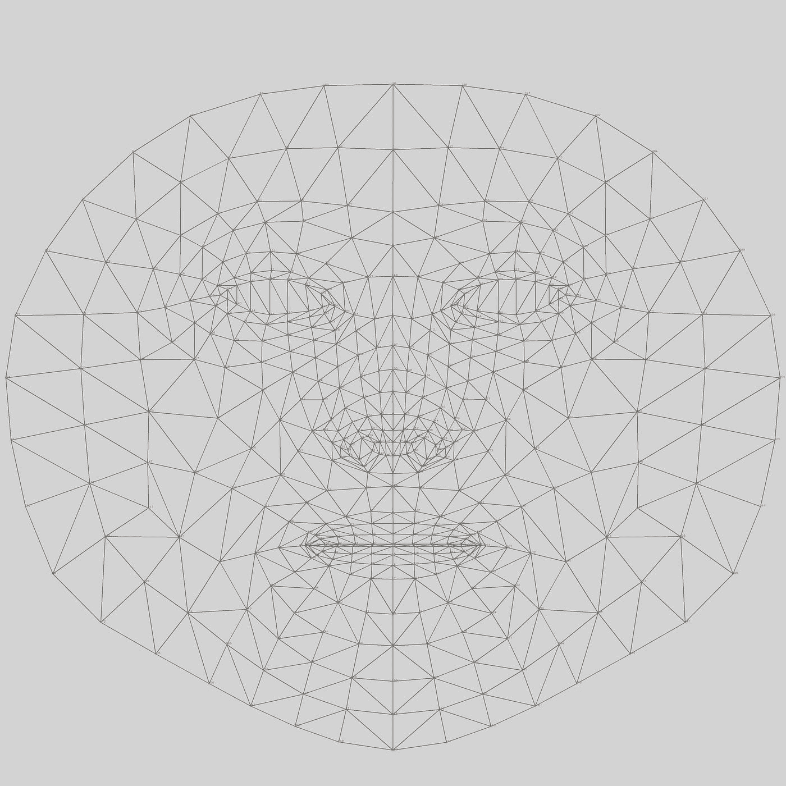

映射到你脸上的网格的可怕远景。点击[此处](https://github.com/tensorflow/tfjs-models/blob/master/facemesh/mesh_map.jpg)查看放大版本。

*   `annotations`是最后一个，非常有用。面部网格开发人员继续为面部的每个区域创建命名的点集。例如，`annotations.lipsLowerOuter`包含下唇外侧的所有点。我们稍后将使用这些来创建脸的特定部分的裁剪。

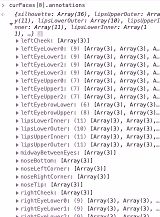

所有你能要求的注释，就在你的指尖！

您可以通过键入`annotations.`在 Inspect Element 控制台中访问注释的完整列表，然后按 tab 键自动完成。

# 为了乐趣和利益在我脸上画地标

现在我们知道网格的点只是三维坐标，我们可以索引它们来显示我们的脸在相机上的位置。作为一个基本的例子，我们将在`scaledMesh`上循环，并在用户的脸上画一些小点，以显示地标从上面那个可怕的网格映射到哪里。

为此，我们将修改我们的`drawVideo`函数来绘制`curFaces`中的每一张脸。`for (face of curFaces){`技巧是用 Python 编写的 JavaScript 版本的`for … in …`，它在 for 循环中从`curFaces`给我们一个预测。代码如下:

我们还需要写`drawFace()`，它包含在底部。在 HTML 画布上绘图是通过其[画布呈现上下文](https://developer.mozilla.org/en-US/docs/Web/API/CanvasRenderingContext2D)进行的，在我们的代码中是`ctx`。我们首先指定点应该是什么颜色，然后循环遍历这些点。由于每个点都是一个[X，Y，Z]的三维向量，我们可以直接索引到它们，以知道在哪里画我们的圆。`beginPath()`开始一个形状，`fill()`结束它。

这就是我们得到的！布满圆点的脸。自己试试[这里](https://facemeshmedium.netlify.app/dotsonly/)。

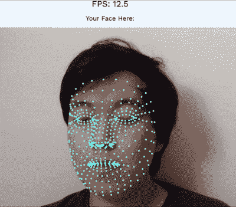

标有圆点的地标。在桌面上，尝试一下[这里](https://facemeshmedium.netlify.app/dotsonly/)

要做更高级的事情，你需要知道每个标志点的索引。我们可以添加一条`fillText`线来绘制每个圆圈旁边的索引号，但在全尺寸的[网格地图](https://github.com/tensorflow/tfjs-models/blob/master/facemesh/mesh_map.jpg)上可能更容易看到索引。试试看！

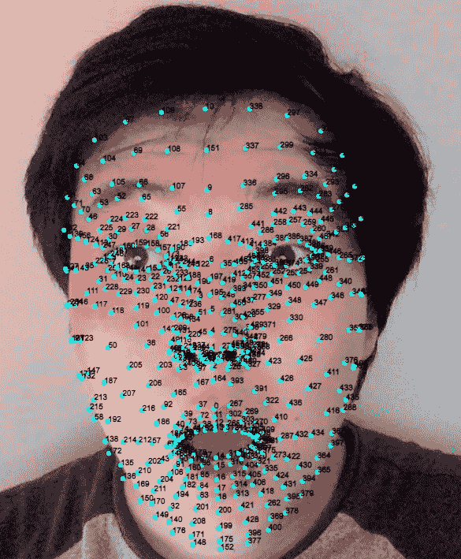

旁边标有索引的地标。在手机上。演示[这里](https://facemeshmedium.netlify.app/labeleddots/)

现在我们知道了界标的位置以及它们的格式，我们可以开始玩了。在下一个例子中，我将向您展示如何使用这些地标来实现一个基本的 Snapchat 过滤器。

# 大眼睛翻嘴(Snapchat 滤镜)

我们将使用面网格重新创建大眼睛和嘴巴过滤器，但我们也将翻转嘴巴上下颠倒。从概念上讲，您可能认为过滤器非常简单。两倍的眼睛尺寸，两倍的嘴巴尺寸，把它们叠放在原来的照片上，对吗？你说得对，这很简单！嗯，执行起来会有点棘手，但这是一般程序。


[大眼大嘴滤镜](https://support.lensstudio.snapchat.com/hc/en-us/community/posts/360016745206-Big-Eyes-and-Mouth-Filter)

每个人都有自己喜欢的图像编辑和计算机视觉编程语言，但我敢打赌没有人会选择 JavaScript 作为他们的最爱！我也不会，但是我可以向您展示足够多的内容，让您开始作为 JavaScript 计算机视觉开发人员的漫长而富有成效的职业生涯。这是我们最终制作的过滤器的图片:

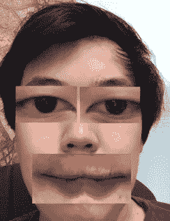

我演绎的大眼大嘴 Snapchat 滤镜

## 使用 HTML 画布

从相机设置页面开始，我们的 HTML 文档中就有了一个`<canvas>`。在 face landmarks 页面中，我们找到了它，因此我们可以设置大小并创建一个名为`ctx`的“上下文”。这个`ctx`允许我们画圆圈和文字。

但即使在那之前，我们已经在使用`ctx`。还记得我们一开始调用的将`video`流复制到画布上的函数吗？

```
ctx.drawImage(**video**, 0, 0, canvas.width, canvas.height);
```

事实证明，这只是从一个图像源绘制到另一个图像源的几个重载 JavaScript 函数之一。我们上面调用的`drawImage`只指定了目的地的左上角坐标以及绘制`video`的宽度或高度。我们可以使用另一个`drawImage`，它也指定了在将帧绘制到画布上之前，如何从`video` *中裁剪帧。*

```
ctx.drawImage(video, 
source_x, source_y, source_Width, source_Height, // Source location
dest_x, dest_y, dest_Width, dest_Height);  // Destination location
```

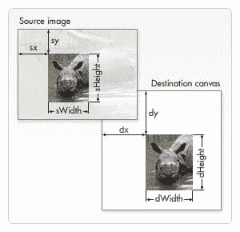

图片来自 [Mozilla](https://developer.mozilla.org/en-US/docs/Web/API/CanvasRenderingContext2D/drawImage) ，里面有一些很棒的 HTML 文档。

由于 Face Mesh 以像素为单位输出用户的眼睛位置，因此我们可以通过索引特定的界标来获得眼睛的边界。我们只需要找到眼睛的边界，然后我们可以从视频帧中裁剪出眼睛，并在画布上绘制时将它们的大小加倍。然后我们的滤镜就做好了！

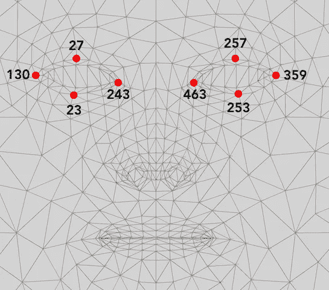

我们选择标志来定义眼睛的边界框，然后索引它们来找到它们在相机帧中的 X 和 Y 值

我已经进入了[网格图](https://github.com/tensorflow/tfjs-models/blob/master/facemesh/mesh_map.jpg)，找到了眼睛周围的这些关键点。在这 8 个位置索引到`face.scaledMesh`，我们可以得到双眼的上、左、右、下四边。我们需要这些坐标来把眼睛画到画布上。代码如下:

画大眼睛的完整代码

`drawImage`调用(第 24 行)偏移了眼睛的位置，因此 2 倍大的眼睛仍然位于原来眼睛的中心。

这给了我们这样的东西:

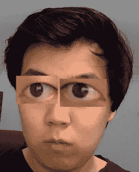

眼珠子瞪得老大的安迪

完美！

现在说说嘴。就像我们之前用眼睛看到的那样，尺寸翻倍非常简单，但是翻转就比较难了。实际上不可能颠倒使用`drawImage`。相反，我们需要从画布中提取出`ImageData`，将其转换成张量流。JS 张量，翻转*那个*，然后在我们的画布上画出来。咻！

我们需要像做眼睛一样开始。这一次，我们将使用`face.annotations`来查找上下嘴唇点，而不是索引。通过迭代这些点，我们将能够找到边界框，并使用`ctx.getImageData`从画布中获得嘴巴。代码如下:

把嘴唇画大的前半段代码。我们完成了边界的查找，并将它们索引到图像中。

我们现在有了`ImageData`。JavaScript ImageData 对象不是很友好，但是可以转换成 Tensorflow。JS 张量。然后我们可以在上面使用所有的 Tensorflow 函数，也就是`.reverse(0)`，逐行翻转图像(从上到下)。

```
**lipsUpsideDown** = **tf.browser.fromPixels**(lips,4).reverse(0);
```

然后，我们将其转换回 ImageData 对象，以将其绘制到画布上。以下是完整的代码:

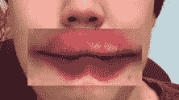

翻转唇

这种方法的另一种方法是使用第二块画布来保存翻转的嘴图像，但我尝试了一下，发现它在精神上不直观而且很慢。

这是最终产品。你可以自己试试[这里](https://facemeshmedium.netlify.app/eyeswap/)！


大眼睛翻转嘴使用面网格

虽然使用 Tensorflow 仅仅翻转一张图片似乎有些矫枉过正。JS 是完全不同的野兽。自从 Tensorflow。JS 用的是 WebGL，很好用，加载也很快(整个库才 1.1 MB)。我见过企业 logos 占了 10 MB，所以 TF。相比之下 JS 真的相当便宜。

## 科学使用面网格！

在浏览器中使用 Tensorflow 打开了一个充满可能性的世界。大量的新受众现在可以访问机器学习，而根本不需要下载任何东西。

对于民用医疗保健、科学和计算机视觉来说，这些应用非常广泛，尤其是在智能手机如此普及的情况下。我将向您展示一个特别有趣的用例:**仅使用摄像头从远处检测用户的心率。**

# 使用照相机检测用户的脉搏(光电容积描记法)

你见过那些能从手电筒和摄像头判断你脉搏的智能手机 app 吗？这种效应被称为**光电容积描记法(PPG)** ，因为它用光(*照片*)来确定你的脉搏(*容积描记法*)。它利用了你的血液在跳动时会改变体积和颜色这一事实。

相当酷！然而，我发现这样做更酷，不需要用户触摸任何东西。

随着智能手机在 21 世纪初的普及，高分辨率相机变得越来越容易获得。一些聪明的研究人员正在研究广泛应用的高分辨率相机，并意识到他们可以通过拍摄视频来检测某人的心率。这被称为 ***远程*** 体积描记法，因为它可以从远处进行。

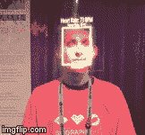

[微软研究院的 CardioLens](https://www.microsoft.com/en-us/research/project/cardiolens/) 在 AR 中使用了这种确切的效果！

如果你想知道这怎么可能，这和你触摸的智能手机闪光灯的机制是一样的。你的心脏大约每秒跳动一次，每次跳动时，你的血液都会通过血管向前涌动。我们的脸会脸红，会动很多小肌肉做出面部表情，所以我们的面部皮肤有很多表层血管。把这个和你的心跳结合起来，你的脸在每次心跳时闪得更红，亮到可以瞥见用相机。

当然，没有一台普通的相机能看到你的脸随着每一拍而发红，因为它们太吵了。但是通过对一大片皮肤进行平均，我们可以从普通相机拍摄的视频中看到用户的心跳。我们将使用面网格来完成。

## 使用面网格构建网络 PPG

我们可以利用之前学到的知识来构建这个心率监测器，并在浏览器中运行。我们需要做的就是找到脸部的边界，然后对该区域像素的亮度值求和。我们跟踪阵列中的强度，然后对阵列进行 FFT 以获得频率分量。瞧啊。取这个 FFT 的峰值应该可以得到心率。

首先，我们需要修改代码，从面部获取一块皮肤。我在网格贴图上选择了一些点(就像我们为眼睛做的一样)，所以我们使用了从眼睛到嘴唇顶部的补丁。

我们取平均像素值，这样盒子大小的变化不会影响我们的测量。

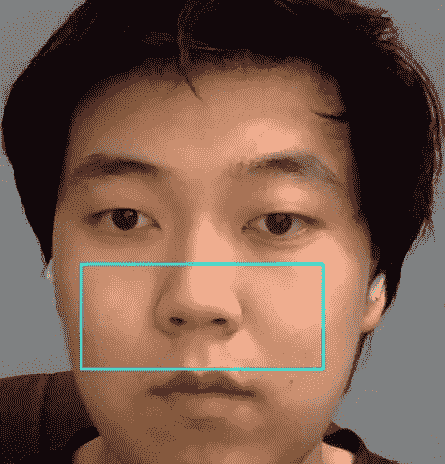

我脸上感兴趣的区域(鼻子和脸颊)。我们将对这个盒子中的像素进行平均。

现在，我们可以使用 getImageData 提取补丁并对其进行平均。这个平均值被添加到运行历史中。我们还跟踪这个循环的 FPS，因为我们需要它将 FFT 从“指数”转换成频率。

我正在使用 [Dygraphs](https://dygraphs.com/) 库来绘图。下面是强度图的截图:

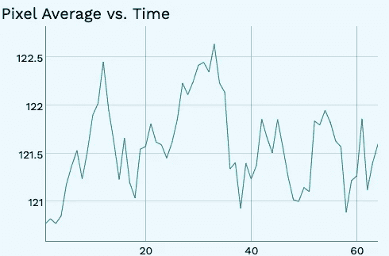

一段时间内盒子的平均像素密度。在 5 秒内可以清楚地看到 4 个节拍，255 个级别中只有 1.5 个像素的变化！

如果你试图在 JavaScript 中找一个 FFT 库(不是 node，而是 browser)，你会遇到很多麻烦。幸运的是，在过去的一个项目中，我使用 Browserify 和 Emscripten 将一个用 C++编写的名为 KISS 的 FFT 库转换为 JavaScript(详情[见](https://andykong.org/projects/heartratemonitor/))。我用它来计算强度阵列的 FFT。一个问题是，将 FFT“箱”转换为频率并不需要采样速率参数，但我们自己可以做到这一点！

## FFT 仓至频率

FFT 将时域信号转换为频域信号，并以频率“仓”中的幅度形式输出必须使用以下公式将其转换为频率:


出于我们的目的，DFT 和 FFT 是一回事。从[堆栈溢出](https://dsp.stackexchange.com/questions/26927/what-is-a-frequency-bin)

该公式给出了每个仓中心的频率。每个面元宽`sampleFreq/numDFTPoints` Hz，横跨两侧。你会注意到，我们历史的长度决定了我们频率测量的精度，因为仓宽除以`numDFTPoints`。那么，我们的频率精度是多少？

我们的数组有 64 个元素长，采样率是可变的(在我的笔记本电脑上大约是 8-10 赫兹)。这样我们得到的最小 bin 宽度为 8/64 = 0.125Hz，由于人的心率通常以每分钟心跳数给出，所以 0.125Hz*60 秒就变成了 **7.5 bpm** 。对于心率来说，这种精度不是很高，但您会看到，对多个 FFT 求平均值可以得到准确的心率。

库使得计算 FFT 变得容易，但是知道如何进行 bin 转换是很重要的，因为它允许灵活地使用哪些库。代码如下:

FFT 代码

为 FFT 添加另一个 Dygraph，我们就完成了！这里可以自己试试:[facemeshmedium.netlify.app/ppg/](https://facemeshmedium.netlify.app/ppg/)

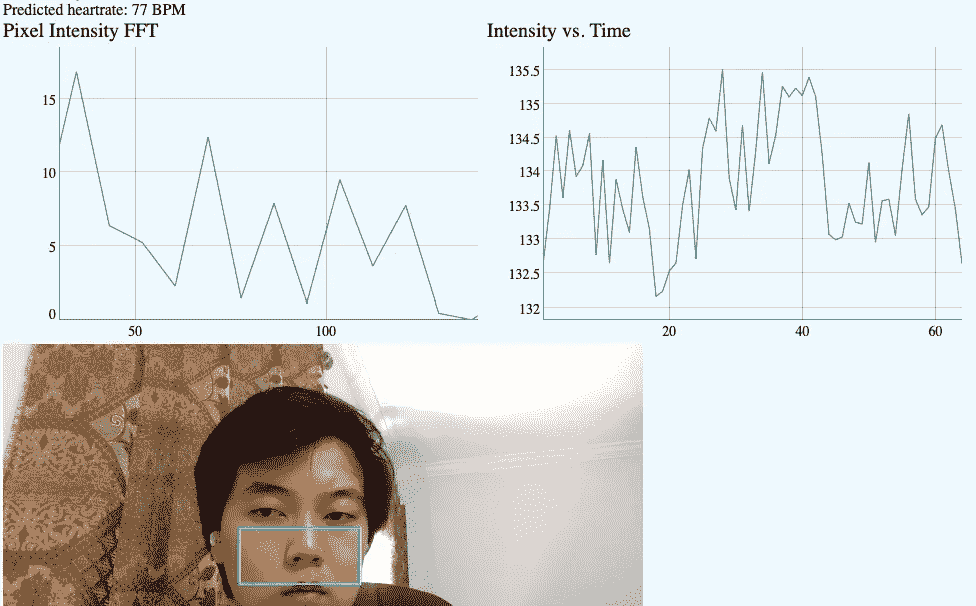

左侧是像素强度的 FFT 图。FFT 噪声很大，但如果进行充分的平均，峰值就会出现。[演示在这里](https://facemeshmedium.netlify.app/ppg/)

坐着不动，我可以让我的心率在 FFT 上显示出来，与我手机上的非远程 PPG 应用程序相比，准确度相当高:

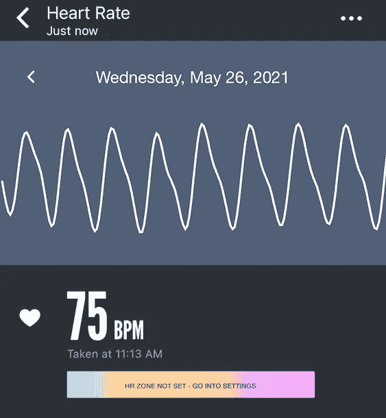

实际心率读数是在那之后获得的(使用智能手机闪光灯，哈！)

多酷啊。你可以坐在你的笔记本电脑前找到你的心率，甚至可以在房间的另一边用一个更好的摄像机。被动生物识别，你甚至不需要穿任何东西！

# 结束语

**你可以在这里找到所有的演示:**[**face mesh medium . net lify . app**](https://facemeshmedium.netlify.app/)

**以及 Github 上的所有代码:**[**github.com/kongmunist/FaceMeshDemos**](https://github.com/kongmunist/FaceMeshDemos)

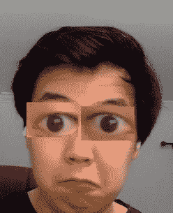

窃听器回来了

我能如此轻松地制作这些演示，这已经是网络进步的一个巨大标志。通过将 Tensorflow 推送到浏览器中，谷歌使得演示机器学习和计算机视觉项目和产品变得容易得多。人们将不再抱怨“它在我的设置上无法工作”，因为现在它只能在谷歌 Chrome、Safari 或任何其他支持现代 JavaScript 的浏览器上工作(但不是 Internet Explorer)。

想做一个能告诉你别人穿什么鞋的应用吗？还是智能手机生命监护仪？不用花几个月的时间来编写一个 Android 和 iPhone 应用程序，你可以使用一个预先制作的网站，并添加几行 JavaScript，立即让任何拥有智能手机的人都能立即访问你的想法。

我希望您在阅读本文时已经了解了一两件关于 JavaScript 的事情，尤其是当您精通基于 web 的编程时所展现的可能性。用 Tensorflow。JS 按照现在的速度发展，我预计基于网络的图像处理和机器学习将在未来几年成为科技领域的重要参与者。技术是为大众服务的，这也是将机器学习带给大众的一个很好的步骤。

我希望你能用你学到的东西做出一些很酷的东西，如果你做了，我很乐意看到它！

给我发电子邮件或者在推特上给我发短信。

Cya soon！