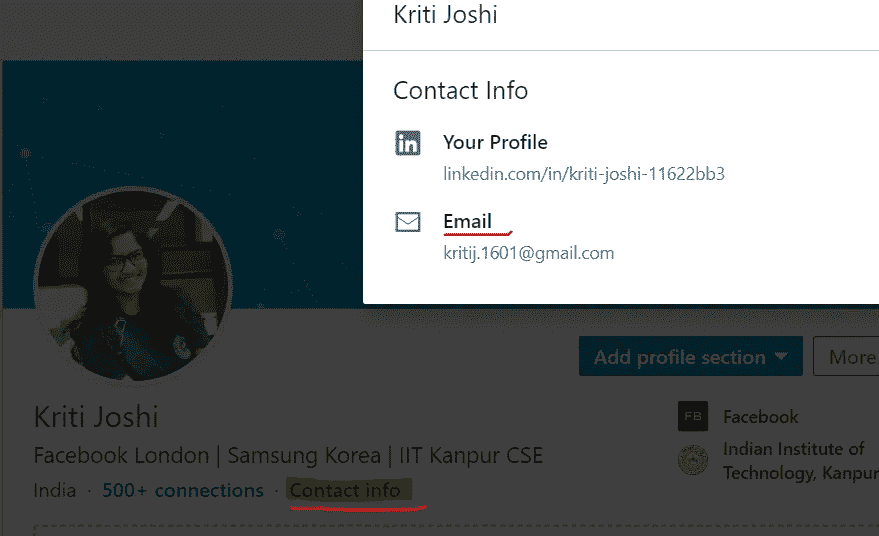
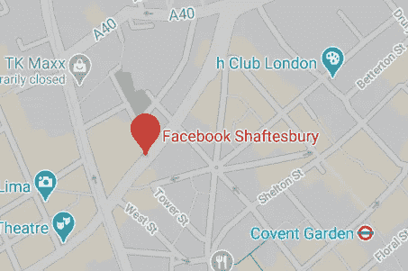

# 从我在脸书的面试中获得的见解和经验

> 原文：<https://betterprogramming.pub/facebook-interview-experience-and-insights-51e383f3c70d>

## 这篇文章是为了鼓励那些梦想过某事并怀疑其可能性的人

脸书办公室——伦敦拉斯伯恩广场(来源:[伦敦脸书](https://www.facebook.com/facebooklondon)

当我决定开始找工作时，我无法说服自己有机会在脸书找到工作。

五个月后，我收到了我的录取通知书。

这是一次充满期待和意外的旅程。在这里，我将与你分享我所有的经验和我在路上获得的见解。

我在三星电子公司做了两年软件工程师，一直打算换工作。7 月份，我开始全面找工作，开始准备申请热门的科技巨头——除了脸书。我想我想先在其他公司的面试中表现出色，让自己足够自信，然后再去脸书碰运气。

# **瞎猜**

在上下班途中或者在准备面试的间隙，我开始在 LinkedIn 上建立联系。很快它变成了一种困扰。我搜索了我想申请的公司的招聘人员，并给他们发了一封电子邮件(如果在 LinkedIn 的联系信息中提到的话)或信息。我并没有期待任何切实的结果，但接触招聘人员的过程给了我某种兴奋和乐观，帮助我度过了准备阶段，相信我，这需要付出巨大的努力。

**提示:** LinkedIn 是一个获得招聘者来电的绝佳平台，但它确实需要坚持。不要犹豫向陌生人伸出援手。我只是发了一条信息，就收到了亚马逊、微软、Snapchat、彭博和苹果等公司招聘人员的回复。

幸运的是，我 8 月份发的一封电子邮件让我接到了一个来自脸书的招聘电话。

提示:接到招聘人员的第一个电话是求职过程中最耗时的部分。尽管感觉毫无准备，还是开始申请空缺职位。在安排第一次面试之前，你可以让招聘人员给你几个月的准备时间。

# 一线希望

抱着最好的期望和最坏的打算，我参加了电话会议。招聘人员来自脸书的 AR/VR 部门。

**Info:** 脸书分为脸书工程、脸书 AR/VR、脸书 AI 三个分部单独招聘。

她问了我一些关于我目前角色和工作经历的问题。在我职业生涯的大部分时间里，我都是一名 C/C++开发人员，对 XR 毫无经验。令我害怕的是，我不适合招聘人员心目中的角色。我被告知，只有当我在电话面试中表现出色时，我才会被考虑，因为我的技能与团队并不完全一致。

**洞察力:**那时，脸书工程公司有一个招聘限制，他们只考虑有七年以上工作经验的候选人。8 月份可能是脸书招聘周期的尾声，届时全年的招聘人数已经完成，空缺职位也更少了。我觉得在 10 月份之后，在招聘周期的新起点，申请会更容易。

# 得搞定它

两周后我安排了技术筛选。面试形式是在 45 分钟内解决两个问题。这些问题是基本的，易于编码(数组和字符串问题)。我现在想谈的一个话题是 ***试运行*** 。

**测试运行:**您的代码没有在面试中编译和执行。因此，为了验证，面试官要求测试输入，并展示它如何运行你的代码。

提示:测试运行是在面试中调试代码的好方法。确保在你的面试准备中包括测试。

对于面试官的第二个问题，我想到了两个解决方案，并向面试官解释了这两个方案。然后，他让我比较这些解决方案，分析其中一个方案的优势。最后留出五分钟时间向面试官提问。我觉得这五分钟对候选人的表现评价没有贡献，没什么好担心的。

**提示:** [Leetcode](https://leetcode.com/discuss/interview-question) 众所周知是一个非常好的准备面试的网站，我支持这一点。Leetcode 上一个鲜为人知的瑰宝是 **Leetcode 讨论**。人们在这个页面上分享他们的面试经历(和问题)，相信我，问题确实会重复。

# **现场面试**

脸书 AR/VR 部门办公室。伦敦还有两个脸书办事处。

脸书的面试过程很快。我在两天内收到了招聘人员的回复，并飞往伦敦进行现场考察。总共安排了四次面试

## 编码面试(x 2)

提出了两个需要在 45-50 分钟内解决的问题。涵盖的领域是二叉树，字符串，堆栈和列表。首先与面试官讨论解决方案，然后在白板上写下你的代码。

**提示:**代码中总有一些边缘情况需要处理，在压力下编码的同时照顾它们并不容易。帮我度过难关的一个技巧是试运行。在编写完解决方案后，我立即告诉面试官，我将在一个通用示例上测试我的解决方案，并首先调试我自己。代码中明显的错误是由第一次试运行本身带来的——自己发现比让面试官指出更好。运行这些测试提供了思考边缘案例的时间，然后可以将这些案例合并到代码中。

## 系统设计面试

对于入门级软件工程师来说，这是一个有趣的消息。目标是从头开始设计一个系统。问题陈述通常是这样的:

1.  设计一个现有的产品，如 WhatsApp，脸书，谷歌搜索等。
2.  设计这些应用程序之一的特定功能；比方说，在脸书应用程序中实现一个时间表。
3.  设计一个完全假设的场景；比方说，创建一个系统来存储三个相距很远的服务器的日志。

这个面试绝对需要一种特殊的准备，最著名的辅助就是[钻研系统设计面试](https://www.educative.io/courses/grokking-the-system-design-interview)。

好的一面是没有正确的答案。您应该能够证明您的设计选择是正确的，并且知道您所做的权衡。

## 行为面试

这是最容易的，但不要掉以轻心，因为在这次面试中出现的任何危险信号都可能让你失去机会。这些问题围绕着非技术经验，如领导技能、团队精神、如何处理分歧等。这组问题几乎是固定的，因此可以准备答案。

**提示:**在面试的前一天，浏览一下流行行为问题的清单，想想你职业生活中支持你回答这个问题的轶事。在一系列技术面试之间，利用这次面试放松一下。这一轮的信心提升有助于提高士气。

# 第一次失望

一周后收到面试反馈。我认为我已经做得很好了，但是结果并不像我预期的那样。我在两次面试中得到了非常积极的评价，在一轮编码中得到了积极的评价，在系统设计中得到了消极的评价。这些是我从经验和反馈中获得的见解。

*   **系统设计回合是决胜局**。以结构化的方式展示你的想法非常重要，不要遗漏设计细节，如数据库模式、协议定义等。(参考[钻研系统设计面试](https://www.educative.io/courses/grokking-the-system-design-interview/m2yDVZnQ8lG)的这几点)。采取主动，以符合逻辑的方式推动讨论，从收集需求到高层次设计，再到讨论利弊。
*   **脸书希望候选人擅长算法**。他们寻找小错误甚至优化，比如说，遍历数组两次而不是一次。尽力做到最好，任何时候都不要自满。进行测试运行，讨论边缘案例，尝试优化，并快速在白板上书写。没什么期望，是吧？从积极的一面来看，我觉得所有的问题都有一个非常简单的解决方案，既不难提出也不难编码。

# 第二次机会

我和招聘人员谈了谈，表达了我的困惑。我几乎可以肯定我会得到一份工作，但反馈出乎意料。我从没想过系统设计会有这么大的价值。幸运的是，我被安排了两次面试，一次是系统设计，一次是编码。我再次飞往伦敦，参加另一家公司的面试，同时安排了脸书的面试。老实说，在过去的五个月里，接受了如此多的采访，我已经精疲力尽了，并且已经得到了一些负面的结果。

这两次面试是我求职阶段的最后一次，我只想这个阶段结束。这一次，我复习了关于系统设计的知识，对过程有了更多的了解。我先参加了编码面试，进行得非常顺利。对于系统设计，问题陈述与一个流行的移动应用程序的特性有关。这次我们更详细地讨论了设计，进行了定量分析，如服务器所需的系统数量、数据库大小等。这次我 100%的付出了，我们讨论的很好。

**提示:**系统设计面试的重要部分包括:收集需求、定义协议、概要设计、数据库模式、数据大小估计、组件设计和权衡。

# **值得！**

两周后反馈来了，这次是正面的。脸书工程公司给了我一个 E4 的职位。(最初的脸书 AR/VR 团队的占用不再是空的了)。我认为系统设计如此重要的原因是 E4 的工程师除了编程之外还应该知道设计。

# **结束注释**

我从没想到换工作会这么难。那些正在为此挣扎的人，我可以理解他们的沮丧。事情并不总是按计划进行，面试过程中有机会或运气的作用。在这种时候让我保持理智的梵语引用自《博伽梵歌》:

> “你只有工作的权利，但没有享受工作成果的权利。不要让行动的成果成为你的动机，也不要让你执着于不行动。”

美好的祝愿！