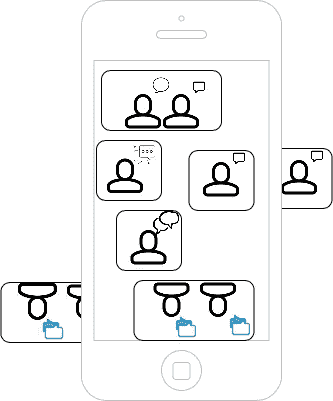
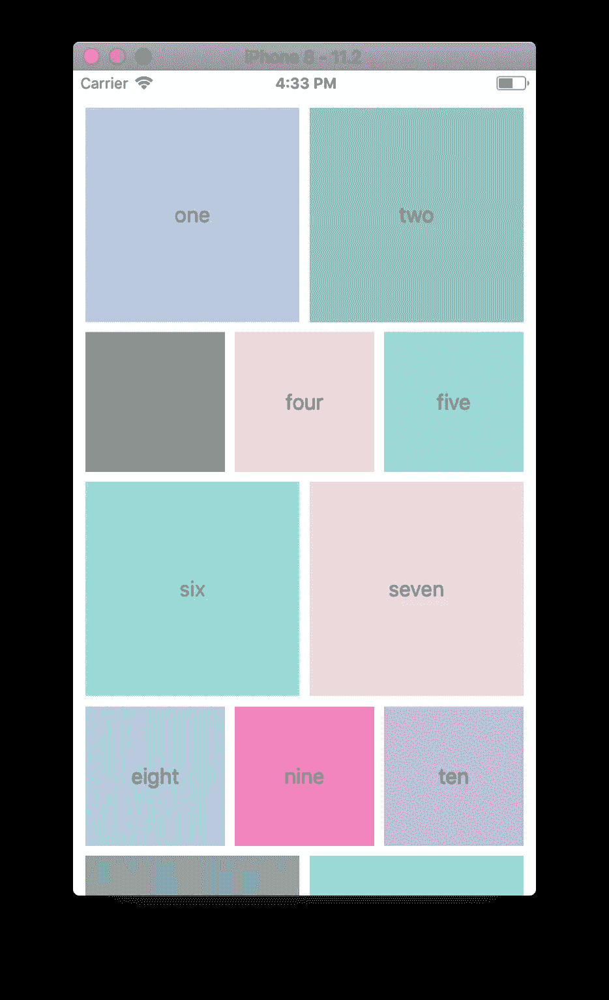

# 如何在 UICollectionView 中使用脸书布局来建立群组视频聊天

> 原文：<https://betterprogramming.pub/facebook-layout-in-uicollectionview-for-group-video-chat-in-ios-12-9ceefd406d7>

## 与来自世界各地的更多人同时通话


玛丽亚·沙妮娜在 [Unsplash](https://unsplash.com/search/photos/people-on-phone?utm_source=unsplash&utm_medium=referral&utm_content=creditCopyText) 上的照片

[Agora](https://www.agora.io/en/videocall/) 正在开发利用软件定义的实时网络的实时多方视频聊天技术。

SD RTN 通过算法优化路由，提供统计上无与伦比的低延迟、弹性、近乎完美的通信，尤其是针对移动设备。

然而，移动电话是“电话”的反映；一个以连接一个呼叫者和另一个呼叫者为中心的设计。

无论何时进行多人通话，都会出现多种问题——手机和平板电脑中的 CPU 能力通常较低，它们的屏幕大小各不相同，它们运行的无线网络连接波动很大。



在一个屏幕上显示多个对话成员

# UICollectionView

虽然 SD RTN 有助于解决无线网络连接问题，但针对一对一呼叫传统的独特解决方案是`UICollectionView`。

`UICollectionView`在带有 [Swift 5](https://swift.org/blog/swift-5-released/) 的 iOS 中，开发者可以在一个屏幕上处理多个调用者，根据 iOS SDKs 自带的设备成员内存管理，根据需要对调用者进行排队或出列。

单元格自动适应它们的数量以及设备屏幕的大小。

# 脸书布局

在这个视频聊天博客中，您将实现一个`UICollectionView`的实例。

在您的实现中，您将使用一个流行的开源项目，称为*集合视图布局*；一个包含一组用于 iOS 的自定义流程布局的库，模仿了用于移动应用程序的通用数据网格方法。

图书馆称此为`FacebookStyleFlowLayout`。



具有用于多成员呼叫的 UICollectionView 的脸书布局

# 设置

要设置您的应用程序，您需要初始化一个 pod，向视图控制器添加代码，并布局视图。

为了加快这个过程，首先下载[查看控制器文件内容](https://pastebin.com/YfHeMdad)。

1.  为方便起见，在`AppDelegate`中增加一个`AppID`常数。
2.  更新前将`collection-view-layout`添加到您的`Podfile`中。
3.  打开`.xcworkspace`文件。
4.  确保麦克风和摄像机的权限已启用。

设置完成后，实现集合视图。

为了简洁起见，创建你自己的故事板，因为它是相当简单的。如果你拒绝摆弄界面构建器，你可以在最后从源代码复制粘贴故事板。

# 视图控制器和 UICollectionView

在名为`ViewController.swift`的文件中，添加一个名为`collectionView`的弱变量`IBOutlet`，如下所示:

```
@IBOutlet weak var collectionView: UICollectionView! {
   didSet {
        }
}
```

在您的`didSet`函数中，创建一个`ContentDynamicLayout`类型的常量，将其值赋给`FacebookStyleFlowLayout`。

```
let contentFlowLayout: ContentDynamicLayout = FacebookStyleFlowLayout
```

将`contentFlowLayout`的代表分配给`self`并配置`contentPadding`、`cellsPadding`、`contentAlign`功能:

最后，确保将`collectionViewLayout`的属性设置为`contentFlowLayout`:

```
collectionView.collectionViewLayout = contentFlowLayout
```

# UICollectionViewDataSource

要实现一个`UICollectionView`，你需要采用`UICollectionViewDataSource`协议。

这是一个契约，如果视图控制器实现了`numberOfItemsInSection`和`cellForItemAt`方法，`UICollectionViewDataSource`保证交付单元格。

在`numberOfItemsInSection`里面，你返回`uIds`数组:

```
print("Returning", uIds.count)
return uIds.count
```

在`cellForItemAt`内部，将`uid`设置为`uIds[indexPath.row]`并将`videoCanvas.view`设置为`cell.contentView`:

最后，您返回单元格，因为您已经将其配置为显示“移除视频画布”:

```
return cell
```

# ContentDynamicLayoutDelegate

最后，为`cellSize`创建一个函数:

```
extension ViewController: ContentDynamicLayoutDelegate
   func cellSize(indexPath: IndexPath) -> CGSize {
       return cellsSizes[indexPath.row]
   }
}
```

# 性能

将名为`uIds`的属性设置为视图控制器中`UICollectionView`实例下的`Int64`类型的数组。

将名为`cellsSizes`的属性设置为类型为`CGSize`的数组，该数组将被初始化为空:

```
var cellsSizes: [CGSize] = []
```

# 联合频道

在`joinChannel()`中，您想要分派一个更新的`uIds`数组，并在 Agora 的`joinChannel(byToken:, channelId:, info:, did:)`方法闭包中重新加载集合视图:

# 代表

在`firstRemoteVideoDecodedOfUid`中，追加并重新加载:

```
uIds.append(Int64(uid))
collectionView.reloadData()
```

在`didOfflineOfUid`内部，检查索引后追加并重新加载:

```
if let index = uIds.firstIndex(where: { $0 == did }) {
    uIds.remove(at: index)
    collectionView.reloadData()
}
```

对集合视图的方法进行编程后，确保出口和动作正确连接到视图控制器。

# 运行应用程序

如果您正确实现了代码，您的应用程序应该在集合视图的单个实例中构建、运行和布局对话的多个成员。

如果你遇到错误或者想用成品检查你的代码，这里有一个[链接](https://pastebin.com/YfHeMdad)到视图控制器文件的源代码。

整个应用也托管在 [GitHub](https://github.com/ericgiannini/collectionViewLayout-video-calling) 上。

ViewController 的全部源代码。

# 测试

如果您想在浏览器中测试您的应用程序，可以通过添加一行`agoraKit.enableWebSdkInteroperability(**true**)`来启用互操作性。

如果启用，您可以运行您的应用程序，并从这个 [GitHub 库](https://sidsharma27.github.io/)添加一个成员。

# 结论

`UICollectionView`是 iOS SDK 最具扩展性的方面之一。

如果您发现集合视图布局不适用于您为多成员调用创建的接口，请尝试创建一个完全定制的`UICollectionView`实现。