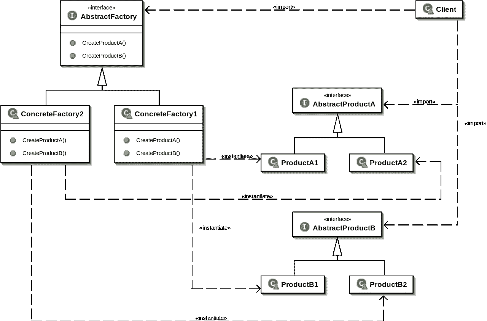
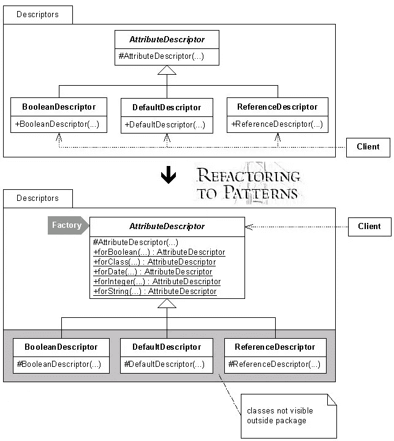
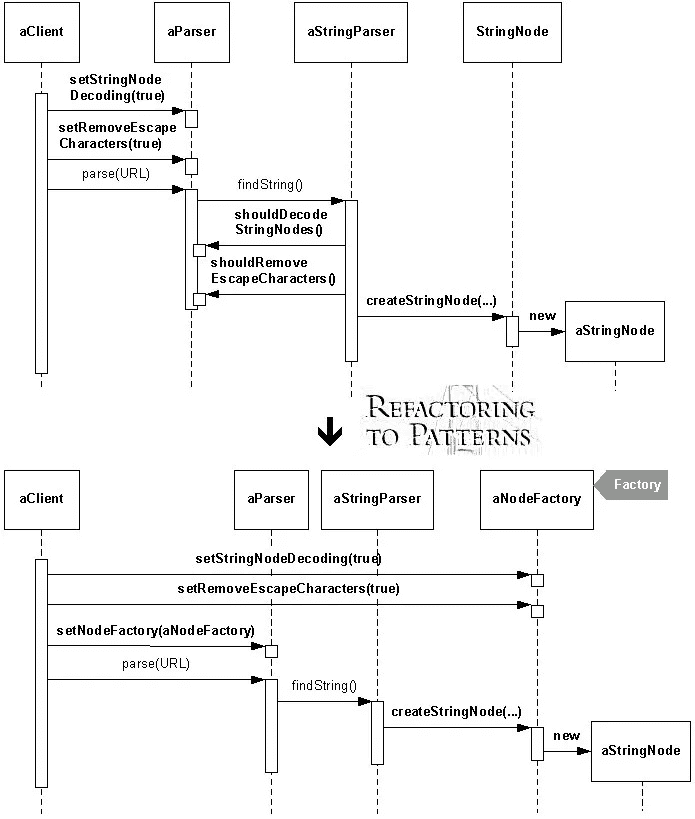
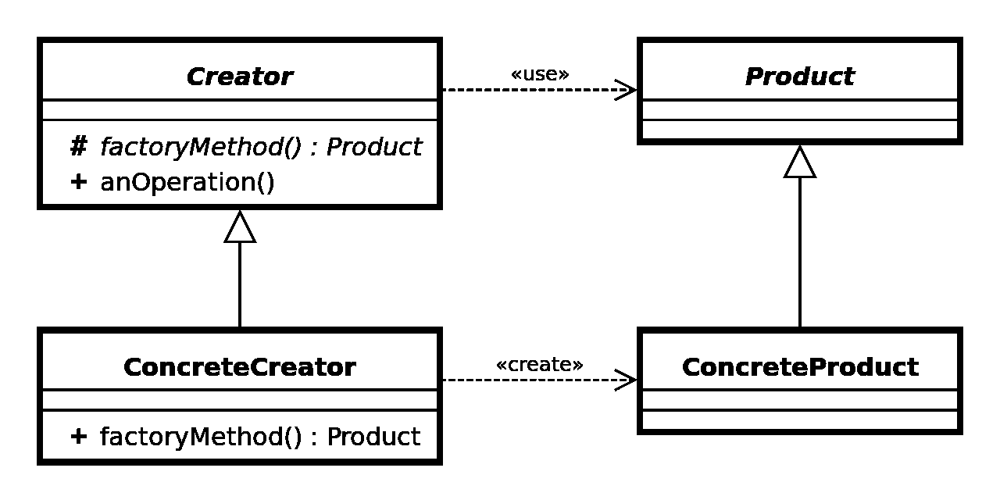
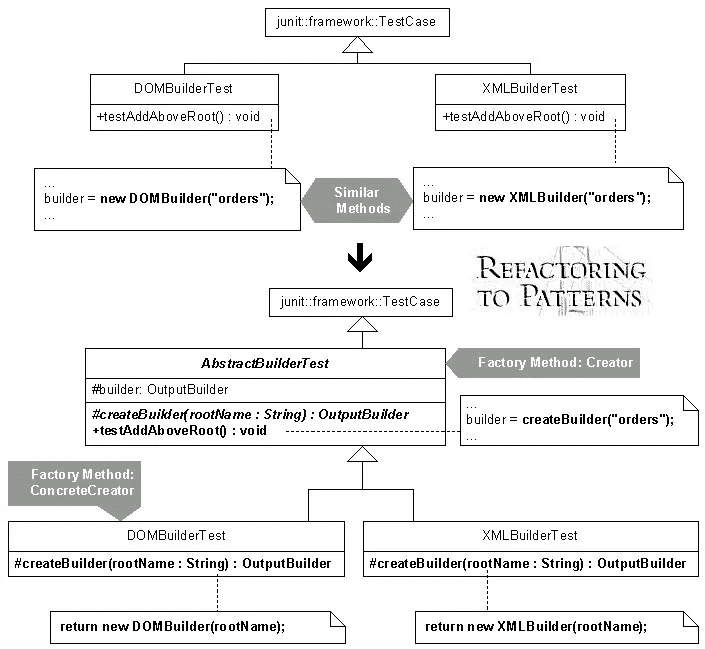

# Swift 和 iOS 领域中的工厂方法和抽象工厂

> 原文：<https://betterprogramming.pub/factory-method-and-abstract-factory-in-swift-and-ios-universe-47c716667287>

## 探索创造性的设计模式


法比安·格罗斯在 [Unsplash](https://unsplash.com/search/photos/programming?utm_source=unsplash&utm_medium=referral&utm_content=creditCopyText) 上拍摄的照片

在讨论他们或其他人的程序时，*工厂*这个词无疑是程序员最常用的词之一。同时，它们的确切含义是不同的。它可能是一个生成对象类(多态或非多态)，一个返回对象方法(静态或非静态)，甚至是一个常规的[构造函数](https://en.wikipedia.org/wiki/Constructor_(object-oriented_programming))。

但是，并不是所有生成对象的东西都可以称为工厂。此外，这个词可以描述“四人帮”武器库中两种不同的创造性设计模式——[工厂方法](https://en.wikipedia.org/wiki/Factory_method_pattern)和[抽象工厂](https://en.wikipedia.org/wiki/Abstract_factory_pattern)。

我想深入研究它们的细节，特别关注它们的经典实现和理解。

这篇文章的灵感来自于[Joshua Kerievsky](https://twitter.com/joshuakerievsky)([工业逻辑](https://industriallogic.com/)的负责人)，或者更确切地说，是他的书《重构模式》。这本书是在世纪之交马丁·福勒签名系列中发行的。福勒是现代编程经典著作《重构:改进现有软件的设计》的著名作者

如果你没有读过克里耶夫斯基的书，或者没有听说过这本书，请毫不犹豫地把它加入你的阅读清单。这是“重构”和更经典的“设计模式:可重用面向对象软件的元素”的有价值的续篇除此之外，这本书还包含了几十种通过使用[设计模式](https://en.wikipedia.org/wiki/Software_design_pattern)来消除不同[代码气味](https://en.wikipedia.org/wiki/Code_smell)的方法。

# 抽象工厂



抽象工厂 UML

在他的书中，Kerievsky 给出了两个例子来说明这种模式何时变得有用。

1.  [通过公共接口绑定的具体类型的封装](https://en.wikipedia.org/wiki/Encapsulation_(computer_programming))。在这种情况下，这样的知识将属于一种类型，即工厂。工厂的公共 [API](https://en.wikipedia.org/wiki/Application_programming_interface) 由方法集(静态或非静态)组成，该方法集返回公共接口类型的实例，并具有有意义的名称，因此我们知道为了特定的目的必须调用哪一个。
2.  第二个与第一个相似，总的来说，我们使用的所有场景都或多或少相似。这是因为一种类型或一组类型的实例的创建发生在程序的不同部分。同样，工厂封装了创造性的代码，但它的动机不同。如果代码很复杂，并且不受初始化器调用的限制，这一点尤其重要。

为了跟上 [iOS](https://apple.com/ru/ios/ios-12) 开发世界，使用`[UIViewController](https://developer.apple.com/documentation/uikit/uiviewcontroller)`子类相当方便。事实上，它是 iOS 软件开发中最流行的类型之一，几乎总是在使用前被子类化。具体的类对于客户端代码来说通常并不重要。

*尽管现实世界中的代码可以以某种方式简化，但我会尽量让代码示例尽可能接近四人帮书中的经典模式实现。只有深刻理解基础中的原理，才能更自由地使用它。*

## 详细示例

假设我们的应用程序销售车辆，视图/演示依赖于它的类型。我们将为不同的车辆类型使用不同的`UIViewController`子类。除此之外，所有车辆的状态都不一样——新车和二手车。

因此，我们有一个相同组的类型家族，它的实例根据条件在相似的地方被创建。例如，用户点击列表中的一个项目——根据点击的车辆类型，它会以不同的方式创建。视图控制器的初始化器有参数值，每次都必须传递。难道这些争论没有揭示创建工厂的优势吗？工厂是唯一知道所需的控制器创建细节的类型。

显然，这个例子相当简单。在现实世界中，引入这个工厂将是[过度工程](https://en.wikipedia.org/wiki/Overengineering)。然而，人们可以想象更多的车辆类型在它们的初始化器中有不止一个参数，抽象工厂的优势变得更加明显。

现在，让我们介绍一下我们的抽象工厂[接口](https://en.wikipedia.org/wiki/Interface_(computing)):

```
**protocol** VehicleViewControllerFactory {
    **func** makeBicycleViewController() -> UIViewController
    **func** makeScooterViewController() -> UIViewController
}
```

*简介* [*Swift API 编程指南*](https://swift.org/documentation/api-design-guidelines) *建议以“make”为前缀命名工厂方法*

四人帮的例子是用 [C++](https://en.wikipedia.org/wiki/C%2B%2B) 编写的，基于[继承](https://en.wikipedia.org/wiki/Inheritance_(object-oriented_programming))和[虚函数](https://en.wikipedia.org/wiki/Virtual_function)。在 Swift 中，我们更接近面向协议的编程技术。

Factory interface 只包含两个方法，为自行车和踏板车创建视图控制器。这些方法返回公共父类的实例。因此，意识的区域传播受到真正需要它的地区的限制。

让我们添加两个实现抽象工厂接口的具体工厂:

因此，在我们的情况下，混凝土工厂负责不同状况的车辆，新的和旧的。

今后，必要的视图控制器是这样创建的:

```
**let** factory: VehicleViewControllerFactory 
    = NewVehicleViewControllerFactory()
**let** vc = factory.makeBicycleViewController()
```

## 用工厂封装类



用工厂封装类

现在，让我们简短地考虑一下克里耶夫斯基的书中给出的例子。

第一个是关于[具体类型](https://industriallogic.com/xp/refactoring/classesWithFactory.html)的封装。记住显示车辆数据的相同视图控制器子类:

```
**final** **class** BicycleViewController: UIViewController { }
**final** **class** ScooterViewController: UIViewController { }
```

假设我们正在处理一个单独的模块，例如一个库。在这种情况下，上面的视图控制器类保持`[internal](https://docs.swift.org/swift-book/LanguageGuide/AccessControl.html)`(默认情况下)，工厂充当公共 API。工厂的方法返回众所周知的视图控制器的父类实例。因此，关于具体类型的知识受到模块的限制:

```
**public** **struct** VehicleViewControllerFactory {
    **func** makeBicycleViewController() -> UIViewController {
        **return** BicycleViewController()
    }
    **func** makeScooterViewController() -> UIViewController {
        **return** ScooterViewController()
    }
}
```

## 将创造知识转移到工厂



将创造知识转移到工厂

第二个案例描述了[对象](https://industriallogic.com/xp/refactoring/creationWithFactory.html)的复杂初始化，为了简化代码和封装，Kerievsky 提出用工厂类限制来约束进程的知识。

假设我们也卖汽车。毫无疑问，这是一辆更复杂的车，有更多的参数和选择。让我们用燃料类型、传输类型和车轮直径的附加参数实现相应的视图控制器:

视图控制器的初始化方式如下:

或者我们可以实现一个专门的工厂来处理初始化:

…并像这样使用它:

```
**let** factory = UsedCarViewControllerFactory(
    engineType: .gas, transmissionType: .manual, wheelDiameter: 17
)
**let** vc = factory.makeCarViewController()
```

# 工厂方法



工厂方法 UML

另一种单根模式也封装了关于具体类型的知识。它通过多态来实现这一点，而不是将实现细节隐藏在专门的类中。Kerievsky 在他的书中提供了用 [Java](https://java.com/) 编写的例子，并提议使用[抽象类](https://docs.oracle.com/javase/tutorial/java/IandI/abstract.html)，但是敏捷用户不知道它是什么。我们独立自主，我们有协议。

四人帮的书上说这种模式也被称为虚拟构造函数，这是有道理的。在 C++中，如果函数被派生类重写，我们称之为虚函数。然而，人们不能将构造函数声明为虚拟的，并且可以推测，模式发明是由模拟所需行为的尝试引起的。

## 多态创建



介绍 Joshua Kerievsky 用工厂方法创建多态

作为使用模式的经典例子，让我们考虑这样一种情况:除了在方法内部创建的对象实现之外，同一层次结构中的[不同类型具有相似的方法实现。让我们尝试通过将对象创建移到外部来改善这种情况，并通过将它在层次结构中向上移动一步来使类似的方法变得常见。](https://industriallogic.com/xp/refactoring/polymorphicCreationFactory.html)

让我们回到我们的车辆视图控制器:

```
**final** **class** BicycleViewController: UIViewController { }
**final** **class** ScooterViewController: UIViewController { }
```

现在，让我们考虑一下这个视图控制器演示，并声明一个[协调器](https://habr.com/ru/post/444038/):

```
**protocol** Coordinator {
    **var** presentingViewController: UIViewController? { **get** **set** }
    **func** start()
}
```

考虑这些协调器实现:

方法`start()`有类似的实现，除了在内部创建的视图控制器。让我们将创作移至室外:

```
**protocol** Coordinator { **var** presentingViewController: UIViewController? { **get** **set** } **func** start()
    **func** makeViewController() -> UIViewController}
```

…并使用`start()`方法的默认实现扩展协议:

```
**extension** Coordinator {
    **func** start() {
        **let** vc = makeViewController()
        presentingViewController?.present(vc, animated: true)
    }
}
```

那么实现将是:

# 结论

我试图通过结合三种方法来强调这个相当简单的主题:

*   经典的宣言方法的存在受到了四人帮的书的鼓励。
*   使用由基里耶夫斯基的书赤裸裸地启发的动机。
*   应用使用我所熟悉的软件工程分支。

在这样做的时候，我试图尽可能接近模式的教科书结构，不违反当代的 iOS 编程原则，并使用 Swift 语言的可能性(而不是更广泛的 C++和 Java)。

显然，很难找到一个好的应用实例。与经典实现相比，大多数现有文章和指南仅包含肤浅的评论和减少的示例。

希望，我达到了我的目标，你喜欢更新或刷新你的相关知识！

**更多关于设计模式的精选**

[](https://medium.com/devexperts/real-world-example-of-using-coordinator-pattern-in-an-ios-app-d13df10496a5) [## 在 iOS 应用程序中使用协调模式的真实例子

### 当代编程世界充满了趋势，谈论 iOS 应用更是一个真理。希望…

medium.com](https://medium.com/devexperts/real-world-example-of-using-coordinator-pattern-in-an-ios-app-d13df10496a5) [](https://lazarevzubov.medium.com/composite-data-source-object-and-elements-of-functional-approach-b93356fdb49e) [## 复合数据源和功能方法的要素

lazarevzubov.medium.com](https://lazarevzubov.medium.com/composite-data-source-object-and-elements-of-functional-approach-b93356fdb49e) [](https://lazarevzubov.medium.com/compatible-with-objective-c-swift-code-e7c3239d949) [## 与 Objective-C Swift 代码兼容

### 尽管苹果已经向我们提供了关于如何在 Objective-C 中使用 Swift 代码的详细文档…

lazarevzubov.medium.com](https://lazarevzubov.medium.com/compatible-with-objective-c-swift-code-e7c3239d949) 

如果你喜欢阅读我(和其他作者)在 Medium 上的博客，你可以**成为正式的 Medium 成员**(如果还没有) [**这里**](https://lazarevzubov.medium.com/membership) 。这样做，你就支持了所有的媒体作者。🙏

…或者你可以给我买一杯咖啡！☕