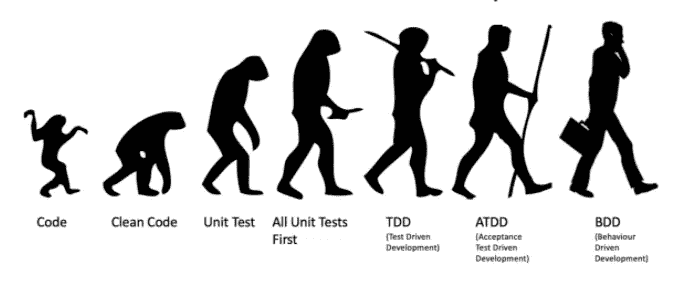
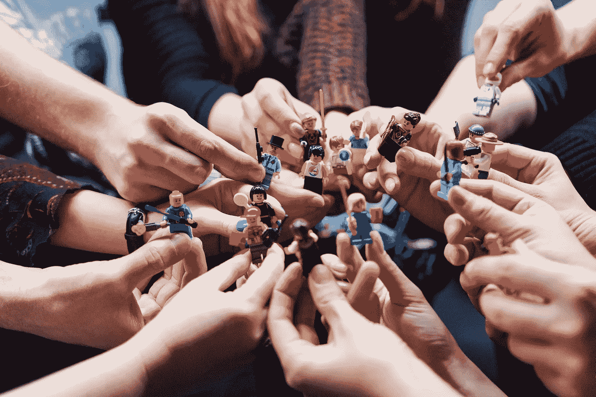

# 经过两年的编程，我学到了 6 个惊人的事实

> 原文：<https://betterprogramming.pub/facts-that-i-learned-after-2-years-of-programming-77f4d956396>

## 2.干净的代码是一个梦想

Matteo Vistocco 在 [Unsplash](https://unsplash.com/s/photos/team-work?utm_source=unsplash&utm_medium=referral&utm_content=creditCopyText) 上拍摄的照片。

大约七年前，我开始在大学学习软件开发。我已经专业开发软件两年了。当我回头看时，现在和我的过去之间有一条鸿沟。两年后，我可能也会比现在更好。

但是，有些事实，我相信只要我继续做这份工作，就会是真的。如果你还不了解他们，你可以肯定他们会对你的职业生涯产生积极的影响。在这篇文章中，我将讨论这些事实。让我们从结对编程开始。

# 1.结对编程和 Mob 编程帮助你提高的比你想象的多

在我职业生涯的早期，我不知道这些方法。我只是在书上读到过，并有所保留。

“两个程序员怎么可能一起写代码？以团队为单位写代码岂不是效率很低？”

我过去也有类似的问题。然而，在我开始应用这些方法后，我意识到每个软件开发人员都应该应用它们。在进行结对编程时，我们从合作伙伴那里学到了很多东西。因为我们成对地一起发展，我们可以更容易地将业务扩展到团队。对大家来说都是双赢。

当然，和所有事情一样，正确应用结对编程是很重要的。我建议阅读马丁·福勒写的这篇关于结对编程的[伟大文章](https://martinfowler.com/articles/on-pair-programming.html)。

# 2.干净的代码是一个梦想

这一部分的标题可能有点误导。让我解释一下。在开发软件时，我们都(希望)确保代码是可靠的、可管理的和干净的。但我学到的一件事是，总有更好的东西。你可能认为你写的代码是完美的，但是历史表明一个新的范例或新的方法总是会到来的。看看 Java 8 之前的 Java 代码。你会明白我的意思。这并不能说明旧代码不好。我们不得不承认干净的代码太主观了，我们应用最佳实践使它尽可能客观。

这里我们必须采用的关键思想是应用持续重构，并将技术债务保持在最低水平。我建议阅读 Robert C. Martin 的 [*Clean Code*](https://www.oreilly.com/library/view/clean-code-a/9780136083238/) 来更好地理解干净代码。

# 3.不要通过代码评审

我想我们都同意这一点。在代码审查中，我们可以从队友那里得到反馈，并看到我们的错误。此外，代码审查对于了解我们不知道的主题/方法非常有用。我也将代码评审视为开发人员社交的机会。

我不仅会小心地指出我看到的错误，还会指出我认为好的和鼓舞人心的方面。

当团队中没有自我，每个人都相互理解时，代码评审无疑会提高我们工作的质量。

# 4.测试和你的代码一样重要

不幸的是，在大学期间，我不理解写作测试的重要性。我更专注于编写代码和开发算法。在开始我的职业生涯后，我发现没有测试的代码是没有意义的。为了确保质量，我知道你写的每一个代码都应该有单元测试——即使这样，也应该有自动化测试的支持。

当您编写测试并用一个好的 CI/CD 管道支持它们时，您可以交付更好的代码。

来源: [LinkedIn](https://www.linkedin.com/pulse/evolution-software-development-balaji-kalyansundaram/)

# 5.不要把理解业务逻辑留到以后

这是我在刚起步的人身上观察到的情况。我以前有时也这么做。我们如此关注技术、框架和语言，以至于有时会忘记我们工作的成果。其实后台用什么样的技术，对客户来说并不重要。对他们来说，重要的是项目正确地完成了它的工作。

软件开发人员有时会忘记业务需求的重要性。我觉得了解业务逻辑对了解项目和客户很重要，绝对不能耽误。

# 6.作为一个团队思考

软件开发中最重要的主题之一是能够作为一个团队来思考。所有的责任应该在团队中平均分配，团队中的每个人都应该有团队意识。在这方面，我也非常幸运。我明白了我们不应该在团队中单独思考。作为一个团队，我们必须拥抱成功和失败。这是成功的唯一关键。

由[弗拉德·希利塔努](https://unsplash.com/@vladhilitanu?utm_source=unsplash&utm_medium=referral&utm_content=creditCopyText)在 [Unsplash](https://unsplash.com/s/photos/team-work?utm_source=unsplash&utm_medium=referral&utm_content=creditCopyText) 上拍摄的照片。

感谢阅读。欢迎发表评论。