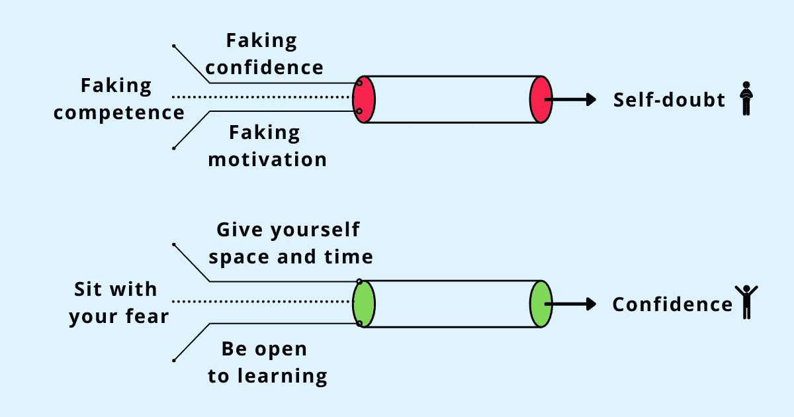

# “假装直到你成功”:一个好的建议还是失败的陷阱？

> 原文：<https://betterprogramming.pub/fake-it-till-you-make-it-a-good-advice-or-a-setup-for-failure-faf46720d8d5>

## 目标越高，恐惧越高，勇气越大

鸣谢:作者

当你刚刚开始或第一次做一些新的事情时——从你现在的角色、一份新工作或一项你以前从未做过的任务中走出来——你会对自己的技能和能力完全有信心吗？你不会有任何自我怀疑或害怕你会搞砸这个好机会吗？

最有可能的是，你会怀疑自己的每一步。你会觉得自己的技能和能力不足。你会担心达不到别人的期望，被发现不适合这个职位。

这些恐惧是真实的，不是你独有的。任何曾经处于这些位置的人都有同样的感觉。他们没有自信地扮演这个角色。在接受新的机会之前，他们并不具备所有的技能和能力。自信和能力不是天生的，而是在成长的过程中获得的。

当你在与不充分的感觉作斗争时，或者感觉你不属于这里时，最常见的建议是“假装直到你成功”

*假装你的自信。*

*伪造你的能力。*

伪造你的动机。

这个建议的支持者会告诉你，一开始假装会让你坚持下去。一旦你开始扮演这个角色，你的大脑会自动适应这个新的行为。

这是真的，除了你没有建立真正的自信，你的大脑会认为你确实是假的。通过装模作样，假装自信，忽视那些令人烦恼的怀疑可以暂时缓解自我怀疑的感觉，但是一旦你完成了表演，对自己不真实会对你对自己的看法产生负面影响。模仿自信和能力有着长远的影响。

创始人兼教练艾伦·伊博森(Alan Ibbotson)说，我们应该彻底埋葬这个短语—

> “字面意思是你做不到或者做不到，你在假装。对一些人来说，他们是一个骗子，一个说谎者，一个骗子，一个不在乎别人怎么想，甚至不在乎自己成功与否的人——他们只想侥幸逃脱，抱着最终成功的希望。”

在试图应对你的不充分感时，有意识地选择以一种虚假的方式来表现会强化你确实是一个虚假者的信念。“*假装直到你成功*”也混合了[冒名顶替综合症](https://www.techtello.com/what-type-of-imposter-are-you/)的感觉，因为说你只是假装会让你内化那些对自己的负面信念。

一旦伪装成为你处理恐惧和自我怀疑情绪的实际策略，你就开始否认自己真正的技能和能力。不承认自己的成就不仅会加剧负面情绪，导致自我价值感降低，假装足够多会变成自我实现的预言。

你自己考虑吧。

假设你刚刚完成了一个大项目，你的团队祝贺你做了一件了不起的工作。如果你相信你只是假装通过它，你会有什么反应？你会怀疑自己为实现目标所付出的努力，否认自己的成就，感觉自己完全是个骗子。在“假装直到你成功”的建议中，你把自己定位为一个骗子，你不经意间称自己为骗子——一个实际上没有能力，只是在作秀的人。

假装而不是保持脆弱和真实从长远来看肯定会损害你的信心。

在现实生活中，不要假装不舒服，要鼓起勇气建立自信和能力。

> “目标越高，恐惧越高，勇气越高。⁣人喜欢说，“你必须假装直到你成功。“这意味着假的你是比你本来的样子更好的人，这根本不是事实。没有勇气，真实的你永远不会出现。”—里奇·诺顿

勇往直前——真实一点——不要假装你想去的地方。

# 与其说“假装直到你成功”，不如这样做

## 给自己空间和时间

看到别人对自己的角色充满信心，轻松地完成任务，会让你怀疑自己。你可能会想“我是唯一一个不知道自己在做什么的人，而其他人似乎都已经想好了。”

[融入这种情况](https://www.techtello.com/pluralistic-ignorance/)通过假装自己不舒服的方式似乎是一条安全的道路。你不想被排除在外。你担心如果你不假装，别人会看穿你，你会被排斥。

试图适应你最脆弱的时刻限制了你的成长——你假装知道你不知道的，拒绝提问，向别人学习。

不要隐藏你的焦虑，而是要鼓起勇气表现出脆弱并脱颖而出。找出你在知识和技能上的差距，承认你不知道的，并[向他人寻求帮助](https://www.techtello.com/how-to-ask-for-help/)。问问他们处于你的位置时是如何应对挑战的；他们如何处理自我怀疑的情绪。

你会惊讶地发现，在自信的外表背后，是一个内心恐惧的孩子，他偶尔还会与同样的自我怀疑情绪做斗争。

当你保持真实时，不需要伪装——给自己空间承认你的差距，给自己时间用真正的知识和技能来填补它们。

> “尽力而为和假装尽力而为有天壤之别。”—塞布丽娜·霍恩

## 带着你的恐惧坐下

自信和恐惧并不相互排斥。认为当自信出现时就没有恐惧的地方是错误的。

恐惧和信心并存。自信并不意味着消除恐惧。真正的自信是通过带着恐惧坐着——接受你的真实情绪——然后不管怎样都要出去做这件事。

伊万·约瑟夫博士是一位屡获殊荣的表演教练，他曾执教过国家和世界冠军及奥运会选手。他将信心定义为“相信自己能够完成任何任务的能力或信念，无论机会、困难或逆境如何。你能完成它的信念。”

这的确是描述自信最常见的方式之一。在这个定义中，自信是一种感觉:一种你能做好或成功的感觉。

但是，自信还有另一个我们经常忽略的定义。源自拉丁语' *fidere* '，意为“信任”，信心也被定义为相信所选择的行动是最好或最有效的。这么说吧，自信是一种行动。这并不是一种绝对肯定你会取得成功的感觉，也不是对可能的失败没有恐惧，或者对可能会出错的事情缺乏自我怀疑。

更确切地说，是不顾感受采取行动的勇气；相信自己无论结果如何都会采取行动。换句话说，自信不是在第一次失败、第一次挑战或第一次遭遇逆境时退缩。信心也是[坚持](https://www.techtello.com/failing-to-succeed/):走出去，做好工作，不管有多大困难都坚持下去的能力。

当你只把自信当成一种感觉时，它会带你走上一条黑暗的道路，让你产生消极的想法，想出你不能做某事的所有理由。将自信视为一种行动，你的思维就会转向有效解决问题，而不是停滞不前。它帮助你想出克服障碍的策略，建议你如何提高和建立新技能，以及你可以做些什么来学习、成长和发展。

失败和错误不再是灾难。对自己行动能力的信心有助于你以建设性的方式接近他们，当他们出现时，你能更好地准备应对。

这就是作家兼压力管理权威 Russ Harris 所说的“信心差距”他说，当人们坚持这样的信念时，他们就会陷入困境:“在我能够实现我的目标、发挥我的最佳水平、做我想做的事情或表现得像我想成为的人之前，我必须感到自信。”

当你已经在处理不值得和自我怀疑的感觉时，如果你在做重要的事情之前等待自信，你可能要等很长时间。真正的自信不是来自于没有恐惧。它是通过改变你与恐惧的关系来建立的，或者像拉斯·哈里斯所说的那样—

> “信心的行动是第一位的；自信的感觉随后而来。”

每一个[小步骤](https://www.techtello.com/small-wins/)都会增强你的能力。你建立真正的技能。曾经困难的事情变得容易了。但是你的旅程并没有就此结束。你会有新的目标——更大更好的责任。就在你以为你成功了的时候，恐惧会再次出现。把它当作你在做有价值的工作，你在进步，你在变得更好的标志。

## 虚心学习

无论你想取得什么样的成功，都不是完美的战略和完美的执行。这是关于当你失败时，把你的资源集中起来，设计一个新的策略，然后重新开始。这需要在过程中即兴发挥、学习和适应。

通过伪装来伪装成另一个人会减少学习。你追求限制暴露的东西，拒绝任何看起来不安全的东西。你把精力放在隐藏错误和避免失败上，而不是冒险和抓住机会。玩安全保护了你，但也限制了你的成长。掩盖错误在短期内减轻了你的痛苦，但从长远来看，它也加剧了你对失败的恐惧。

当你[虚心学习](https://www.techtello.com/fixed-mindset-vs-growth-mindset/)时:

*   你开始接受错误是成长的一个自然部分，而不是因为犯错而责备自己。
*   你不再拘泥于某个方向，而是开始在思维和行动上表现出灵活性。
*   你不再试图一个人完成所有的事情，而是开始接受这样一个想法，即在这个过程中你需要帮助。

你仍在学习的态度将注意力从证明你的价值转移到建立真正的能力，从感觉自己不够好转移到实现你的真正价值。

学习让你变得有耐心、有恒心、有韧性——这是建立真正自信的三个基本要素，而不是假装成功。

# 摘要

1.  当第一次做某事或接受新的挑战时，害怕和怀疑自己是很自然的。
2.  假装你成功了，这是克服那些不值得、不充分或自我怀疑的感觉的最常见的建议。
3.  通过假装不是自己的人来伪装会产生消极的后果。经常重复，你的大脑开始认为你是假的，即使你拥有真正的技能和能力。
4.  通过认为自己确实是个骗子来否定自己的成就会导致自我价值感降低，并进一步加剧你的自我怀疑。
5.  不要假装去实现你需要实现的任何目标，而是练习勇气去建立真正的自信。
6.  不要匆忙完成你面前的任务。给自己一些空间来找出知识上的差距，给自己一些时间用真正的技能和能力来填补这些差距。
7.  不要让你的恐惧阻碍你采取行动。行动第一。自信的感觉随后而来。
8.  投资学习——找出你哪里错了，什么改变了你。

在 Twitter 上关注我，了解更多故事。

*这个故事最初发表于*[*【https://www.techtello.com】*](https://www.techtello.com/fake-it-till-you-make-it/)*。*